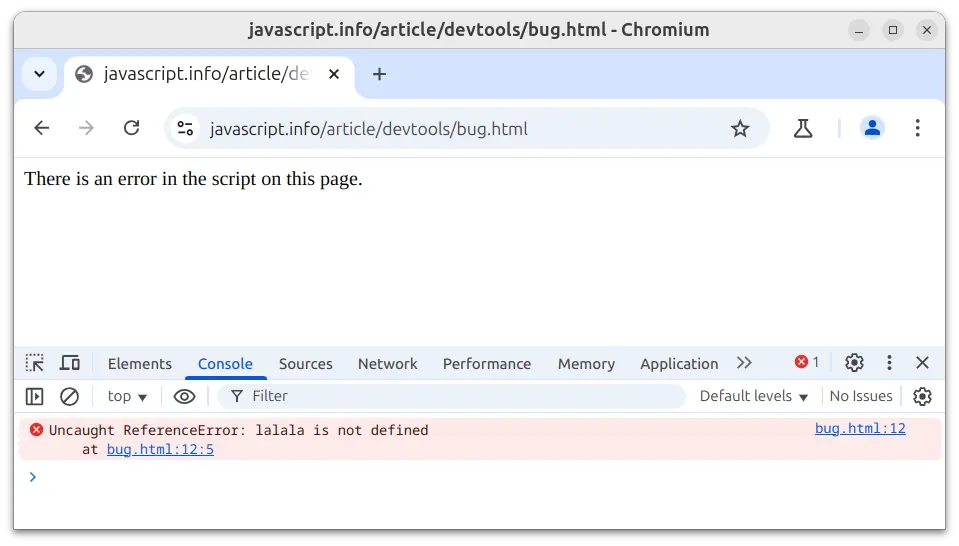
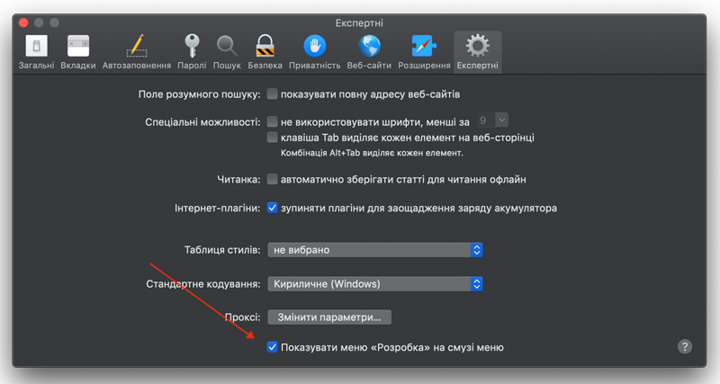

# Інструменти розробника

Будь-який код схильний до помилок. Швидше за все, ви будете робити помилки... Хоча, про що я говорю? Ви *точно* будете робити помилки принаймні якщо ви людина, а не [робот](https://uk.wikipedia.org/wiki/Бендер_(Футурама)).

Зазвичай, користувачі не бачать помилок у браузері. Тому, якщо в скрипті трапиться щось хибне, ми не побачимо помилки та не зможемо її виправити.

Щоб побачити помилки та отримати додаткову інформацію про виконання скриптів, було створено і вбудовано в браузери "інструменти розробника".

Більшість розробників надають перевагу Chrome чи Firefox, тому що ці браузери мають найкращі інструменти розробника. Інші браузери теж мають інструменти розробника, деколи навіть зі спеціальними функціями, проте вони не такі популярні, як Chrome чи Firefox. Тому більшість розробників мають "улюблений" браузер і перемикаються на інші, якщо проблема специфічна для браузера.

Інструменти розробника потужні та мають багато функцій. Для початку, ми вивчимо, як їх відкрити, як переглядати помилки і як виконувати команди JavaScript.

## Google Chrome

Для прикладів ми використовуватимемо браузер [Google Chrome](https://www.google.com/intl/uk_ua/chrome/). Інтерфейс інструментів розробника в ньому може відображатися різними мовами, зокрема українською (мову можна змінити в налаштуваннях інструментів розробника).

Відкрийте сторінку [bug.html](bug.html). На ній є помилка в коді JavaScript. Вона прихована для звичайних користувачів, тому потрібно відкрити інструменти розробника, щоб її побачити.

Натисніть клавішу `key:F12` або, якщо у вас комп'ютер Mac, комбінацію клавіш `key:Cmd+Opt+J`.

Інструменти розробника типово відкриваються на вкладці "Консоль" ("Console").

Ось так відображається помилка в консолі:



Точний вигляд інструментів розробника може відрізнятися в залежності від вашої версії Chrome, а також налаштування мови.

- Тут ми можемо побачити червоне повідомлення про помилку. У нашому випадку, скрипт має невизначену команду "lalala".
- З правого боку є посилання на джерело `bug.html:12` з номером рядка, де ця помилка виникла. При натисканні на це посилання, вас перенаправить на вкладку "Джерела" ("Sources"), в якій відкриється файл на тому рядку, де виникла помилка.

Нижче повідомлення про помилку є синій символ `>`. Цей символ позначає "командний рядок", де ми можемо вводити команди JavaScript. Натисніть `key:Enter`, щоб їх виконати.

Тепер ми бачимо помилки, цього достатньо, щоб почати. Ми пізніше повернемося до інструментів розробника, щоб розглянути налагодження коду у розділі <info:debugging-chrome>.

```smart header="Введення декількох рядків"
Зазвичай, коли ми вводимо один рядок коду в консоль і натискаємо `key:Enter`, він виконується.

Щоб ввести декілька рядків коду, натисніть `key:Shift+Enter`. Таким чином можна вводити і виконувати довгі фрагменти JavaScript коду.
```

## Firefox, Edge та інші

Більшість браузерів використовують клавішу `key:F12`, щоб відкрити консоль розробника.

Їх вигляд зазвичай схожий. Якщо ви навчитеся використовувати один з них (можете почати з Chrome), ви зможете легко перемикнутися на інший браузер.

## Safari

Safari (стандартний браузер у macOS, не підтримується Windows/Linux) має свої нюанси. Спочатку нам потрібно увімкнути меню "Розробка".

<<<<<<< HEAD
Відкрийте Параметри та перейдіть на панель "Експертні". Знизу буде галочка, яку необхідно вибрати:
=======
Open Settings and go to the "Advanced" pane. There's a checkbox at the bottom:
>>>>>>> 5e893cffce8e2346d4e50926d5148c70af172533



Тепер комбінація клавіш `key:Cmd+Opt+C` може перемикати консоль. Також зауважте, що з’явився новий пункт "Розробка" у верхньому меню. Це меню має багато команд та опцій.

## Підсумки

- Інструменти розробника дозволяють нам переглядати помилки, виконувати команди, досліджувати змінні та багато іншого.
- Їх можна відкрити клавішею `key:F12` для більшості браузерів у Windows. В Chrome для Mac потрібно натиснути комбінацію клавіш `key:Cmd+Opt+J`, в Safari: `key:Cmd+Opt+C` (але спочатку інструменти потрібно увімкнути).

Тепер у нас є готове середовище. В наступному розділі ми нарешті поговоримо про саму мову JavaScript.
