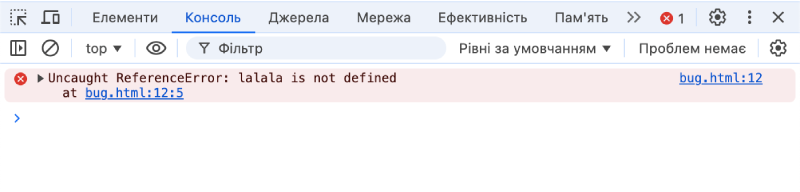

# Інструменти розробника

Будь-який код так і тяжіє до помилок. Швидше за все, ви будете робити помилки... Хоча, про що я говорю? Ви *точно* будете робити помилки, принаймні, якщо ви людина, а не робот [robot](https://uk.wikipedia.org/wiki/Бендер_(Футурама)).

Зазвичай, користувачі не бачать помилок в браузері. Тому, якщо в скрипті щось трапиться на так, ми не побачимо помилки, і не зможемо її виправити.

Щоб побачити помилки і отримати багато інформації про скрипти, було розроблено і вбудовано в браузери "інструменти розробника".

Більшість розробників для розробки надають перевагу Chrome чи Firefox, тому що ці браузери мають найкращі інструменти розробника. Інші браузери теж мають інструменти розробника, деколи навіть зі спеціальними функціями, проте, вони не настільки функціональні і зручні, як в Chrome чи Firefox. Тому більшість розробників мають "улюблений" браузер і переключаються на інші браузери, якщо проблема специфічна для браузера.

Інструменти розробника потужні; вони мають багато функцій. Для початку, ми вивчемо, як їх відкрити, як дивитися на помилки і як виконувати JavaScript команди.

## Google Chrome

Відкрийте сторінку [bug.html](bug.html).

На цій сторінці є помилка в JavaScript коді. Вона прихована для звичайних користувачів, тому потрібно відкрити інструменти розробника, щоб її побачити.

Натисніть клавішу `key:F12` або, якщо у вас Mac, комбінацію клавіш `key:Cmd+Opt+J`.

Інструменти розробника усталено відкриваються на вкладі "Console" (консоль).

Ось так відображається помилка в консолі:



Точний вигляд інструментів розробника може відрізнятися в залежності від вашої версії Chrome. Вони міняються час від часу, але в основному це вікно пивинно бути схожим. Ці інструменти показуються лише англійською мовою, незалежно від мови браузера.

- Тут ми можемо побачити червоне повідомлення. У нашому випадку, скрипт має невизначену команду "lalala".
- З правого боку є посилання на джерело `bug.html:12` з номером рядка, де ця помилка виникла. При натисканні на це посилання, інструмент перейде на вкладку "Source", де відкриє файл і перейде на рядок, в якому трапилася помилка.

Нижче повідомлення про помилку є синій символ `>`. Цей символ позначає "командний рядок", де ми можемо вводити JavaScript команди. Натисніть `key:Enter`, щоб їх виконати.

Тепер ми бачимо помилки, цього достатньо, щоб почати. Ми пізніше повернемося до інструментів розробника, щоб розглянути відлагодження в розділі <info:debugging-chrome>.

```smart header="Введення декількох рядків"
Зазвичай, коли ми вводимо один рядок коду в консоль і натискаємо `key:Enter`, він виконується.

Щоб ввести декілька рядків коду, натисніть `key:Shift+Enter`. Таким чином можна вводити і виконувати довгі фрагменти JavaScript коду.
```

## Firefox, Edge, та інші

Більшість браузерів використовують клавішу `key:F12`, щоб відкрити консоль розробника.

Їх вигляд зазвичай схожий. Якщо ви навчитеся використовувати однин з них (можете почати з Chrome), ви зможете легко переключитися на інший інструмент.

## Safari

Safari (браузер в Mac, не підтримується Windows/Linux) дещо особливий. Спочатку нам потрібно увімкнути меню "Розробка".

Відкрийте Параметри і перейдіть на панель "Експертні". Знизу буде галочка, яку необхідно вибрати:


Тепер комбінація клавіш `key:Cmd+Opt+C` може переключати консоль. Також, зауважте, що з'явився новий пункт "Розробка" в верхньому меню. Це меню має багато команд та опцій.

## Підсумки

- Інструменти розробника дозволяють нам переглядати помилки, виконувати команди, досліджувати змінні та багато іншого.
- Їх можна відкрити клавішою `key:F12` для більшості браузерів в Windows. В Chrome для Mac потрібно натиснути комбінацію клавіш `key:Cmd+Opt+J`, в Safari: `key:Cmd+Opt+C` (але спочатку потрібно увімкнути).

Тепер в нас є готове середовище. В наступному розділі ми приступимо до самого JavaScript.
