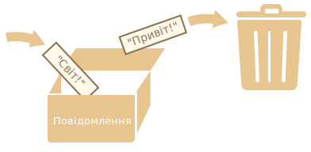

# Змінні

Найчастіше застосункам на JavaScript потрібно працювати з інформацією. Ось два приклади:
1. Онлайн-магазин -- інформацією можуть бути товари, які продаються, і вміст кошика.
2. Застосунок для чату -- інформація може включати користувачів, повідомлення та багато іншого.

Змінні використовуються для зберігання цієї інформації.

## Змінна

[Змінна](https://uk.wikipedia.org/wiki/Змінна_(програмування)) це "іменована частинка сховища", в якій зберігаються дані. Ми можемо використовувати змінні, щоб зберігати товари, відвідувачів та інші дані.

Щоб створити змінну, використовуйте ключове слово `let`.

Цей рядок нижче створить (інакше кажучи, *оголосить*) змінну з ім’ям "message":

```js
let message;
```

Тепер ми можемо покласти деякі дані в цю змінну, використовуючи оператор присвоєння `=`:

```js
let message;

*!*
message = 'Привіт'; // збереження рядка 'Привіт' у змінній `message`
*/!*
```

Тепер рядок збережено в частину пам’яті, яка зв’язана з цією змінною. Ми можемо отримати доступ до даних, використовуючи ім’я змінної:

```js run
let message;
message = 'Привіт!';

*!*
alert(message); // показує вміст змінної
*/!*
```

Щоб писати менше коду, ми можемо суміщати оголошення змінної та її присвоєння в одному рядку:

```js run
let message = 'Привіт!'; // оголошення змінної і присвоєння значення

alert(message); // Привіт!
```

Ми також можемо оголосити декілька змінних в одному рядку:

```js no-beautify
let user = 'Іван', age = 25, message = 'Привіт';
```

Таке оголошення може виглядати коротшим, проте ми не рекомендуємо так писати. Заради кращої читабельності, будь ласка, оголошуйте змінні з нового рядка.

Багаторядковий спосіб трохи довший, проте його легше читати:

```js
let user = 'Іван';
let age = 25;
let message = 'Привіт';
```

Деякі люди також оголошують змінні в такому багаторядковому стилі:

```js no-beautify
let user = 'Іван',
  age = 25,
  message = 'Привіт';
```

...або навіть у стилі "кома спочатку":

```js no-beautify
let user = 'Іван'
  , age = 25
  , message = 'Привіт';
```

Технічно, всі ці способи роблять одне й те ж. Тому це питання особистого смаку та естетики.

````smart header="`var` замість `let`"
У старих скриптах ви можете знайти інше ключове слово: `var` замість `let`:

```js
*!*var*/!* message = 'Привіт';
```

<<<<<<< HEAD
Ключове слово `var` *майже* таке, як `let`. Воно теж оголошує змінну, але дещо іншим, "застарілим" способом.

Є деякі відмінності між `let` і `var`, але вони поки що не мають для нас значення. Ми дізнаємося більше про ці відмінності в розділі <info:var>.
=======
The `var` keyword is *almost* the same as `let`. It also declares a variable but in a slightly different, "old-school" way.

There are subtle differences between `let` and `var`, but they do not matter to us yet. We'll cover them in detail in the chapter <info:var>.
>>>>>>> 51bc6d3cdc16b6eb79cb88820a58c4f037f3bf19
````

## Аналогія з життя

Ми легко зрозуміємо концепцію "змінної", якщо уявимо її у вигляді "коробки" для даних з унікальною назвою на наклейці.

<<<<<<< HEAD
Наприклад, змінну `message` можна уявити як коробку з написом `"Повідомлення"` зі значенням `"Привіт!"` всередині:
=======
For instance, the variable `message` can be imagined as a box labelled `"message"` with the value `"Hello!"` in it:
>>>>>>> 51bc6d3cdc16b6eb79cb88820a58c4f037f3bf19


Ми можемо покласти будь-яке значення в цю коробку.

Ми також можемо змінювати його стільки разів, скільки захочемо:

```js run
let message;

message = 'Привіт!';

message = 'Світ!'; // значення змінено

alert(message);
```

Коли значення змінюється, старі дані видаляються зі змінної:



Ми також можемо оголосити дві змінні та скопіювати дані з однієї в іншу.

```js run
let hello = 'Привіт світ!';

let message;

*!*
// копіюємо 'Привіт світ' з hello в message
message = hello;
*/!*

// тепер дві змінні мають однакові дані
alert(hello); // Привіт світ!
alert(message); // Привіт світ!
```

````warn header="Оголошення змінної вдруге призведе до помилки"
Оголошувати змінну можна лише один раз.

Повторне оголошення тієї ж змінної спричинить помилку:

```js run
let message = "Це";

// повторне 'let' призведе до синтаксичної помилки
let message = "Той"; // SyntaxError: 'message' has already been declared
```
Тому ми маємо оголосити змінну лише раз, а потім просто посилатися на неї, без `let`.
````

```smart header="Функційне програмування"
Цікаво зазначити, що існують [функційні](https://uk.wikipedia.org/wiki/Функційне_програмування) мови програмування, такі як [Haskell](https://uk.wikipedia.org/wiki/Haskell), в яких заборонено змінювати значення змінних.

У таких мовах збережені в "коробку" значення залишаються там назавжди. Якщо нам потрібно зберегти щось інше, мова змусить нас створити нову коробку (оголосити нову змінну). Ми не можемо використати стару змінну.

Хоча на перший погляд це може здатися дивним, проте ці мови цілком підходять для серйозної розробки. Ба більше, є такі галузі, як от паралельні обчислення, де це обмеження дає певні переваги.
```

## Іменування змінних [#variable-naming]

В JavaScript є два обмеження, які стосуються імен змінних:

1. Ім’я має містити лише букви, цифри або символи `$` і `_`.
2. Перший символ не має бути числом.

Ось приклади допустимих імен:

```js
let userName;
let test123;
```

Для написання імені, яке містить декілька слів, зазвичай використовують "[верблюжий регістр](https://uk.wikipedia.org/wiki/Верблюжий_регістр)" (camelCase). Тобто слова йдуть одне за одним, і кожне слово пишуть із великої букви й без пробілів: `myVeryLongName`. Зауважте, що перше слово пишеться з маленької букви.

Що цікаво -- знак долара `'$'` і знак підкреслення `'_'` також можна використовувати в іменах. Це звичайні символи, такі ж, як і букви, без будь-якого особливого значення.

Ці імена також допустимі:

```js run untrusted
let $ = 1; // оголошено змінну з ім’ям "$"
let _ = 2; // а тепер змінна з ім’ям "_"

alert($ + _); // 3
```

Приклади недопустимих імен змінних:

```js no-beautify
let 1a; // не може починатися з цифри

let my-name; // дефіс '-' недопустимий в імені
```

```smart header="Регістр має значення"
Змінні з іменами `apple` і `APPLE` -- це дві різні змінні.
```

<<<<<<< HEAD
````smart header="Нелатинські букви дозволені, але не рекомендуються"
Можна використовувати будь-яку мову, включно з кирилицею або навіть ієрогліфами, наприклад:
=======
````smart header="Non-Latin letters are allowed, but not recommended"
It is possible to use any language, including Cyrillic letters, Chinese logograms and so on, like this:
>>>>>>> 51bc6d3cdc16b6eb79cb88820a58c4f037f3bf19

```js
let назва = '...';
let 我 = '...';
```

<<<<<<< HEAD
Технічно тут немає помилки. Такі імена дозволені, проте є міжнародна традиція використовувати англійську мову в іменах змінних (наприклад, `yaLyublyuUkrainu` => `iLoveUkraine`). Навіть якщо ми пишемо маленький скрипт, у нього може бути тривале життя попереду. Можливо, людям з інших країн колись доведеться прочитати його.
=======
Technically, there is no error here. Such names are allowed, but there is an international convention to use English in variable names. Even if we're writing a small script, it may have a long life ahead. People from other countries may need to read it sometime.
>>>>>>> 51bc6d3cdc16b6eb79cb88820a58c4f037f3bf19
````

````warn header="Зарезервовані слова"
Є [список зарезервованих слів](https://developer.mozilla.org/uk/docs/Web/JavaScript/Reference/Lexical_grammar#Ключові_слова), які не можна використовувати як імена змінних, тому що ці слова використовує сама мова.

Наприклад: `let`, `class`, `return` і `function` зарезервовані.

Такий код видаватиме синтаксичну помилку:

```js run no-beautify
let let = 5; // не можна назвати змінну "let", помилка!
let return = 5; // також не можна називати змінну "return", помилка!
```
````

````warn header="Створення змінної без використання `use strict`"

Зазвичай нам потрібно оголосити змінну перед її використанням. Але в старі часи було технічно можливим створити змінну простим присвоєнням значення, без використання `let`. Це все ще працює, якщо не вмикати `суворий режим` у наших скриптах для підтримання сумісності зі старими сценаріями.

```js run no-strict
// "use strict" в цьому прикладі не використовується

num = 5; // якщо змінна "num" не існувала, її буде створено

alert(num); // 5
```

Це погана практика, яка призведе до помилки в суворому режимі:

```js
"use strict";

*!*
num = 5; // помилка: num не оголошено
*/!*
```
````

## Константи

Щоб оголосити константу (незмінювану) змінну, використовуйте ключове слово `const` замість `let`:

```js
const myBirthday = '18.04.1982';
```

Змінні, оголошені за допомогою `const`, називаються "константами". Їхні значення не можна перепризначити. Спроба це зробити призведе до помилки:

```js run
const myBirthday = '18.04.1982';

myBirthday = '01.01.2001'; // помилка, не можна перевизначати константу!
```

<<<<<<< HEAD
Коли програміст впевнений, що змінна ніколи не буде змінюватися, він може оголосити її через `const`, що гарантує постійність і буде зрозумілим для кожного.
=======
When a programmer is sure that a variable will never change, they can declare it with `const` to guarantee and communicate that fact to everyone.
>>>>>>> 51bc6d3cdc16b6eb79cb88820a58c4f037f3bf19

### Константи в верхньому регістрі

<<<<<<< HEAD
Широко поширена практика використання констант як псевдонімів для значень, які важко запам’ятати і які відомі до початку виконання скрипту.
=======
There is a widespread practice to use constants as aliases for difficult-to-remember values that are known before execution.
>>>>>>> 51bc6d3cdc16b6eb79cb88820a58c4f037f3bf19

Такі константи пишуться в верхньому регістрі з використанням підкреслень.

Наприклад, створімо константи, в які запишемо значення кольорів у так званому "вебформаті" (в шістнадцятковій системі):

```js run
const COLOR_RED = "#F00";
const COLOR_GREEN = "#0F0";
const COLOR_BLUE = "#00F";
const COLOR_ORANGE = "#FF7F00";

// ...коли потрібно вибрати колір
let color = COLOR_ORANGE;
alert(color); // #FF7F00
```

Переваги:

- `COLOR_ORANGE` набагато легше запам’ятати, ніж `"#FF7F00"`.
- Набагато легше припуститися помилки в `"#FF7F00"`, ніж під час введення `COLOR_ORANGE`.
- Під час читання коду `COLOR_ORANGE` набагато зрозуміліше, ніж `#FF7F00`.

Коли ми маємо використовувати для констант великі букви, а коли звичайні? Давайте це з’ясуємо.

<<<<<<< HEAD
Назва "константа" лише означає, що змінна ніколи не зміниться. Але є константи, які відомі нам до виконання скрипту (наприклад, шістнадцяткове значення для червоного кольору), а є константи, які *вираховуються* в процесі виконання скрипту, але не змінюються після їхнього початкового присвоєння.
=======
Being a "constant" just means that a variable's value never changes. But some constants are known before execution (like a hexadecimal value for red) and some constants are *calculated* in run-time, during the execution, but do not change after their initial assignment.
>>>>>>> 51bc6d3cdc16b6eb79cb88820a58c4f037f3bf19

Наприклад:

```js
const pageLoadTime = /* час, потрачений на завантаження вебсторінки */;
```

<<<<<<< HEAD
Значення `pageLoadTime` невідоме до завантаження сторінки, тому її ім’я записано звичайними, а не великими буквами. Але це все ще константа, тому що вона не змінює значення після присвоєння.
=======
The value of `pageLoadTime` is not known before the page load, so it's named normally. But it's still a constant because it doesn't change after the assignment.
>>>>>>> 51bc6d3cdc16b6eb79cb88820a58c4f037f3bf19

Інакше кажучи, константи з великими буквами використовуються як псевдоніми для "жорстко закодованих" значень.

## Придумуйте правильні імена

У розмові про змінні необхідно згадати ще одну дуже важливу річ -- правильні імена змінних.

Такі імена повинні мати чіткий і зрозумілий сенс, який описує дані, що в них зберігаються.

<<<<<<< HEAD
Іменування змінних -- одна з найважливіших і найскладніших навичок у програмуванні. Швидкий погляд на імена змінних може показати, який код був написаний початківцем, а який досвідченим розробником.

У реальному проєкті більшість часу тратиться на змінення і розширення наявної кодової бази, а не на написання чогось цілком нового. Коли ми повертаємося до якогось коду після виконання чогось іншого впродовж тривалого часу, набагато легше знайти інформацію, яку добре позначено. Або, інакше кажучи, коли змінні мають хороші імена.
=======
Variable naming is one of the most important and complex skills in programming. A glance at variable names can reveal which code was written by a beginner versus an experienced developer.

In a real project, most of the time is spent modifying and extending an existing code base rather than writing something completely separate from scratch. When we return to some code after doing something else for a while, it's much easier to find information that is well-labelled. Or, in other words, when the variables have good names.
>>>>>>> 51bc6d3cdc16b6eb79cb88820a58c4f037f3bf19

Будь ласка, приділяйте час на обдумування правильного імені для змінної перед її оголошенням. Робіть так, і будете винагороджені.

Декілька хороших правил:

<<<<<<< HEAD
- Використовуйте імена, які легко прочитати, як-от `userName` або `shoppingCart`.
- Уникайте використання абревіатур або коротких імен, таких як `a`, `b` та `c`, окрім тих випадків, коли ви точно знаєте, що так потрібно.
- Робіть імена максимально описовими і лаконічними. Наприклад, такі імена погані: `data` і `value`. Такі імена нічого не говорять. Їх можна використовувати лише тоді, коли з контексту очевидно, на які дані або значення посилається змінна.
- Погоджуйте з вашою командою (та з самим собою), які терміни будуть використовуватися у проєкті. Якщо відвідувач сайту називається "user", тоді ми маємо давати відповідні імена іншим пов’язаним змінним: `currentUser` або `newUser`, замість `currentVisitor` або `newManInTown`.
=======
- Use human-readable names like `userName` or `shoppingCart`.
- Stay away from abbreviations or short names like `a`, `b`, and `c`, unless you know what you're doing.
- Make names maximally descriptive and concise. Examples of bad names are `data` and `value`. Such names say nothing. It's only okay to use them if the context of the code makes it exceptionally obvious which data or value the variable is referencing.
- Agree on terms within your team and in your mind. If a site visitor is called a "user" then we should name related variables `currentUser` or `newUser` instead of `currentVisitor` or `newManInTown`.
>>>>>>> 51bc6d3cdc16b6eb79cb88820a58c4f037f3bf19

Звучить легко? Це дійсно так, проте на практиці створення зрозумілих і коротких імен -- рідкість. Дійте.

```smart header="Повторно використовувати чи створювати нові?"
І остання примітка. Є ліниві програмісти, які замість оголошення нових змінних повторно використовують наявні.

У результаті їхні змінні схожі на коробки, в які люди кидають різні речі, не змінюючи на них наклейки. Що зараз міститься всередині коробки? Хто знає? Нам необхідно підійти поближче і перевірити.

Такі програмісти економлять трішки часу на оголошенні змінних, але втрачають вдесятеро більше під час налагодження.

Додаткова змінна -- це добро, а не зло.

Сучасні JavaScript-мініфікатори і браузери оптимізують код досить добре, тому додаткові змінні не погіршують продуктивність. Використання різних змінних для різних значень може навіть допомогти рушію оптимізувати ваш код.
```

## Підсумки

Ми можемо оголосити змінні для збереження даних за допомогою ключових слів `var`, `let` чи `const`.

- `let` -- це сучасний спосіб оголошення.
- `var` -- це застарілий спосіб оголошення змінної. Зазвичай ми не використовуємо його взагалі, але ми розглянемо тонкі відмінності від `let` в розділі <info:var>, на випадок, якщо це все-таки знадобиться.
- `const` -- це як `let`, але значення змінної не може змінюватися.

Змінні мають називатися так, щоб ми могли легко зрозуміти, що в середині них.
