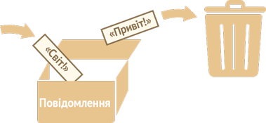

# Змінні

Найчастіше, застосункам на JavaScript потрібно працювати з інформацією. Ось два приклади:
1. Онлайн магазин -- інформацією можуть бути товари, які продаються і вміст кошика.
2. Застосунок для чату -- інформація може включати користувачів, повідомлення та багато іншого.

Змінні використовуються для зберігання цієї інформації.

## Змінна

[Змінна](https://uk.wikipedia.org/wiki/Змінна_(програмування)) це "іменована частинка сховища", в якій зберігаються дані. Ми можемо використовувати змінні, щоб зберігати товари, відвідувачів та інші дані.

Щоб створити змінну, використовуйте ключове слово `let`.

Цей рядок нижче створить (іншими словами *оголосить* чи *визначить*) змінну з ім'ям "message":

```js
let message;
```

Тепер, ми можемо покласти деякі дані в цю змінну, використовуючи оператор присвоєння `=`:

```js
let message;

*!*
message = 'Привіт'; // збереження рядка
*/!*
```

Тепер рядок збережено в частину пам'яті, яка зв'язана з цією змінною. Ми можемо отримати доступ до даних, використовуючи ім'я змінної:

```js run
let message;
message = 'Привіт!';

*!*
alert(message); // показує вміст змінної
*/!*
```

Щоб писати менше коду, ми можемо суміщати оголошення змінної та її присвоєння в одному рядку:

```js run
let message = 'Привіт!'; // оголошення і присвоєння значення

alert(message); // Привіт!
```

Ми також можемо оголосити декілька змінних в одному рядку:

```js no-beautify
let user = 'Іван', age = 25, message = 'Привіт';
```

Таке оголошення може виглядати коротшим, проте ми не рекомендуємо так писати. Заради кращої читабельності, будь ласка, оголошуйте змінні з нового рядка.

Багаторядковий спосіб трохи довший, проте його легше читати:

```js
let user = 'Іван';
let age = 25;
let message = 'Привіт';
```

Деякі люди також оголошують змінні в такому багаторядковому стилі:
```js no-beautify
let user = 'Іван',
  age = 25,
  message = 'Привіт';
```

...або навіть в стилі "кома спочатку":

```js no-beautify
let user = 'Іван'
  , age = 25
  , message = 'Привіт';
```

Технічно, всі ці способи роблять одне і теж. Тому, це питання особистого смаку та естетики.


````smart header="`var` замість `let`"
В старих скриптах, ви можете знайти інше ключове слово: `var` замість `let`:

```js
*!*var*/!* message = 'Привіт';
```

Ключове слово `var` *майже* таке як `let`. Воно теж оголошує змінну, але дещо іншим, "застарілим" способом.

Існують деякі відмінності між `let` і `var`, але вони поки що не мають для нас значення. Ми дізнаємося більше про їхню різницю в розділі <info:var>.
````

## Аналогія з життя

Ми легко зрозуміємо концепцію "змінної", якщо уявимо її у вигляді "коробки" для даних з унікальною наклейкою з назвою на ній.

Наприклад, змінну `message` можна уявити як коробку з підписом `"Повідомлення"` із значенням `"Привіт!"` всередині:


Ми можемо покласти будь-яке значення в цю коробку.

Ми також можемо змінювати її скільки разів, скільки захочемо:
```js run
let message;

message = 'Привіт!';

message = 'Світ!'; // значення змінено

alert(message);
```

Коли значення змінюється, старі дані видаляються зі змінної:



ми також можемо оголосити дві змінні і скопіювати дані з однієї в іншу.

```js run
let hello = 'Привіт світ!';

let message;

*!*
// копіюємо 'Привіт світ' з hello в message
message = hello;
*/!*

// тепер дві змінні мають одинакові дані
alert(hello); // Привіт світ!
alert(message); // Привіт світ!
```

```smart header="Функціональне програмування"
Цікаво відзначити, що [функціональні](https://uk.wikipedia.org/wiki/Функційне_програмування) мови програмування, такі як [Scala](http://www.scala-lang.org/) або [Erlang](http://www.erlang.org/), забороняють змінювати значення змінних.

В таких мовах, збережені в "коробку" значення залишаються там назавджи. Якщо нам потрібно зберегти щось інше, мова змусить нас створити нову коробку (оголосити нову змінну). Ми не можемо використати стару змінну.

Хоча на перший погляд це може здатися дивним, проте ці мови цілком підходять для серйозної розробки. Більше того, є така область, як паралельні обчислення, де це обмеження дає певні переваги. Вивчення такої мови (навіть якщо ви не плануєте користуватися нею найближчим часом) рекомендується для розширення кругозору.
```

## Іменування змінних [#variable-naming]

В JavaScript є два обмеження, які стосуються імен змінних:

1. Ім'я повинне містити лише букви, цифри або символи `$` і `_`.
2. Перша буква не повинна бути числом.

Ось приклади допустимих імен:

```js
let userName;
let test123;
```

Для написання ім'я, яке містить декілька слів, зазвичай використовують "[верблюжий регістр](https://uk.wikipedia.org/wiki/Верблюжий_регістр)" (camelCase). Тобто, слова йдуть одне за одним, де кожне слово пишуть з великої букви і без пробілів: `myVeryLongName`. Зауважте, що перше слово пишеться з маленької букви.

Що цікаво -- знак долара `'$'` і знак підкреслення `'_'`, також можна використовувати в іменах. Це звичайні символи, такі ж як і букви, без будь-якого особливого значення.

Ці імена також допустимі:

```js run untrusted
let $ = 1; // оголошено змінну з ім'ям "$"
let _ = 2; // а тепер змінна з ім'ям "_"

alert($ + _); // 3
```

Приклади недопустимих імен змінних:

```js no-beautify
let 1a; // не може починатися з цифри

let my-name; // дефіс '-' недопустимий в імені
```

```smart header="Регістр має значення"
Змінні з іменами `apple` і `AppLE` -- це дві різні змінні.
```

````smart header="Не-латинські букви дозволені, але не рекомендуються"
Можна використовувати будь-яку мову, включно з кирилицею або навіть ієрогліфи, наприклад:

```js
let імя = '...';
let 我 = '...';
```

Технічно тут немає помилки, такі імена дозволені, проте існує міжнародна традиція використовувати англійську мову в іменах змінних. Слова теж бажано писати англійські (`yaLyublyuUkrainu` => `iLoveUkraine`). Навіть якщо ми пишемо маленький скрипт, в нього може бути тривале життя попереду. Людям з інших країн, можливо, доведеться прочитати його не один раз.
````

````warn header="Зарезервовані слова"
Існує [список зарезервованих слів](https://developer.mozilla.org/en-US/docs/Web/JavaScript/Reference/Lexical_grammar#Keywords), які не можна використовувати в якості імен змінних, тому що ці слова використовує сама мова.

Наприклад: `let`, `class`, `return`, і `function` зарезервовані.

Такий код видатиме синтаксичну помилку:

```js run no-beautify
let let = 5; // неможна назвати змінну "let", помилка!
let return = 5; // також неможна називати змінну "return", помилка!
```
````

````warn header="Створення змінної без використання `use strict`"

Зазвичай нам потрібно оголосити змінну перед її використанням. Але в старі часи можна було технічно створити змінну простим присвоєнням значення, без використання `let`. Це все ще працює, якщо не вмикати `строгий режим` в наших скриптах для підтримки сумісності зі старими сценаріями.

```js run no-strict
// "use strict" в цьому прикладі не використовується

num = 5; // якщо змінна "num" не існувала, її буде створено

alert(num); // 5
```

Це погана практика, яка призведе до помилки в строгому режимі:

```js
"use strict";

*!*
num = 5; // помилка: num не оголошено
*/!*
```
````

## Константи

Щоб оголосити константу (незмінювану) змінну, використовуйте ключове слово `const` замість `let`:

```js
const myBirthday = '18.04.1982';
```

Змінні, оголошені за допомогою `const`, називаються "константами". Їх неможна змінити. Спроба це зробити призведе до помилки:

```js run
const myBirthday = '18.04.1982';

myBirthday = '01.01.2001'; // помилка, не можна перевизначати константу!
```

Коли програміст впевнений, що змінна ніколи не буде змінюватися, він може оголосити її через `const`, що буде гарантовано зрозуміло для кожного.


### Константи в верхньому регістрі

Широко поширена практика використання констант в якості псевдонімів для значень, які важко запам'ятати і які відомі до початку виконання скрипта.

Такі константи пишуться в верхньому регістрі з використанням підкреслень.

Ось так:

```js run
const COLOR_RED = "#F00";
const COLOR_GREEN = "#0F0";
const COLOR_BLUE = "#00F";
const COLOR_ORANGE = "#FF7F00";

// ...коли потрібно вибрати колір
let color = COLOR_ORANGE;
alert(color); // #FF7F00
```

Переваги:

- `COLOR_ORANGE` набагато легше запам'ятати, ніж `"#FF7F00"`.
- Набагато легше допустити помилку в `"#FF7F00"`, ніж при введені `COLOR_ORANGE`.
- Під час читання коду, `COLOR_ORANGE` набагато зрозуміліше, ніж `#FF7F00`.

Коли ми повинні використовувати для констант великі букви, а коли звичайні? Давайте це вияснимо.

Назва "константа" лише означає, що змінна ніколи не зміниться. Але є константи, які відомі нам до виконання скрипта (наприклад, шістнадцяткове значення для червоного кольору), а є константи, які *вираховуються* в процесі виконання скрипта, але не змінюються після їхнього початкового присвоєння.

Наприклад:
```js
const pageLoadTime = /* час, потрачений на завантаження веб-сторінки */;
```

Значення `pageLoadTime` невідоме до завантаження сторінки, тому її ім'я записано звичайними, а не великими буквами. Але це все ще константа, тому що вона не змінює значення після призначення.

Іншими словами, константи з великими буквами, використовуються як псевдоніми для "жорстко закодованих" значень.

## Name things right

Talking about variables, there's one more extremely important thing.

Please name your variables sensibly. Take time to think about this.

Variable naming is one of the most important and complex skills in programming. A quick glance at variable names can reveal which code was written by a beginner versus an experienced developer.

In a real project, most of the time is spent modifying and extending an existing code base rather than writing something completely separate from scratch. When we return to some code after doing something else for a while, it's much easier to find information that is well-labeled. Or, in other words, when the variables have good names.

Please spend time thinking about the right name for a variable before declaring it. Doing so will repay you handsomely.

Some good-to-follow rules are:

- Use human-readable names like `userName` or `shoppingCart`.
- Stay away from abbreviations or short names like `a`, `b`, `c`, unless you really know what you're doing.
- Make names maximally descriptive and concise. Examples of bad names are `data` and `value`. Such names say nothing. It's only okay to use them if the context of the code makes it exceptionally obvious which data or value the variable is referencing.
- Agree on terms within your team and in your own mind. If a site visitor is called a "user" then we should name related variables `currentUser` or `newUser` instead of `currentVisitor` or `newManInTown`.
- Використовуйте імені лише англійською мовою. Оголошення `let message` і `let повідомлення` будуть працювати, проте перший варіант є хорошим тоном для написання коду.

Sounds simple? Indeed it is, but creating descriptive and concise variable names in practice is not. Go for it.

```smart header="Reuse or create?"
And the last note. There are some lazy programmers who, instead of declaring new variables, tend to reuse existing ones.

As a result, their variables are like boxes into which people throw different things without changing their stickers. What's inside the box now? Who knows? We need to come closer and check.

Such programmers save a little bit on variable declaration but lose ten times more on debugging.

An extra variable is good, not evil.

Modern JavaScript minifiers and browsers optimize code well enough, so it won't create performance issues. Using different variables for different values can even help the engine optimize your code.
```

## Summary

We can declare variables to store data by using the `var`, `let`, or `const` keywords.

- `let` -- is a modern variable declaration. The code must be in strict mode to use `let` in Chrome (V8).
- `var` -- is an old-school variable declaration. Normally we don't use it at all, but we'll cover subtle differences from `let` in the chapter <info:var>, just in case you need them.
- `const` -- is like `let`, but the value of the variable can't be changed.

Variables should be named in a way that allows us to easily understand what's inside them.
