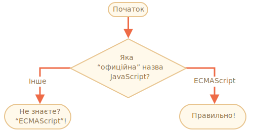

importance: 2

---

# Ім'я JavaScript

Використовуючи конструкцію `if..else`, напишіть код, що запитує: 'Яке "офіційне" ім'я JavaScript?'

Якщо відвідувач вводить "ECMAScript", виведіть "Правильно!", у іншому випадку -- виведіть: "Не знаєте? ECMAScript!"

[demo src="ifelse_task2"]
