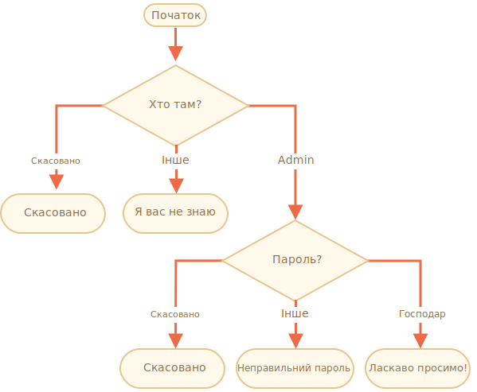

importance: 3

---

# Перевірте логін

Напишіть код, який запитує логін за допомогою `prompt`.

Якщо відвідувач вводить `"Admin"`, тоді запропонуйте за допомогою `prompt` ввести пароль, i якщо вхідні данні є порожнім рядком або `key:Esc` -- показати "Скасовано", якщо це інакший рядок -- тоді покажіть "Я вас не знаю".

Пароль перевіряється наступним чином:

- Якщо він дорівнює "TheMaster", тоді покажіть "Ласкаво просимо!",
- Інший рядок -- покажіть "Неправильний пароль",
- Для порожнього рядка, або якщо введення було скасовано, покажіть "Скасовано"

Схема:

Будь ласка, використовуйте вкладені `if` блоки. Майте на увазі загальну читабельність коду.

Підказка:  передача порожнього вводу до запиту повертає порожній рядок `''`. Натискання `key:ESC` протягом запиту повертає `null`.

[demo]
