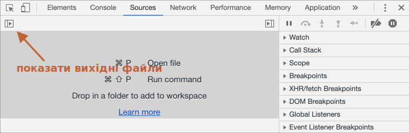
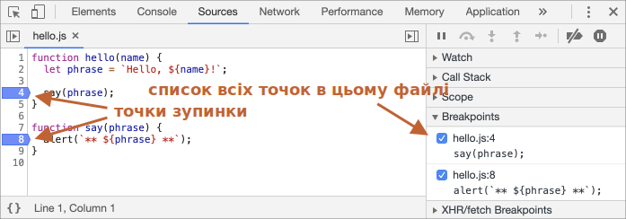
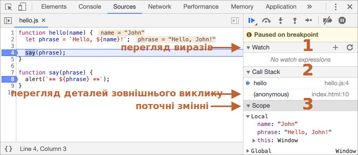
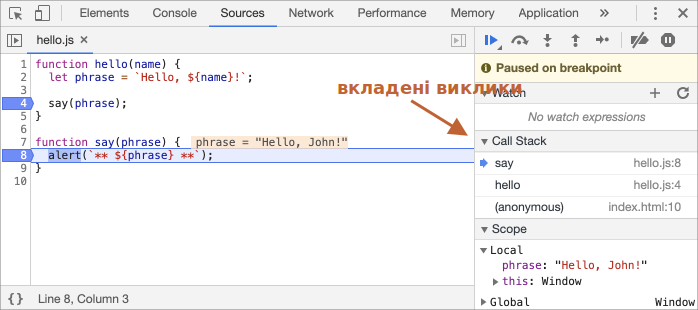

# Налагодження в браузері Chrome

Перед тим, як приступити до написання складнішого коду, давайте поговоримо про його налагодження.

[Налагодження](https://uk.wikipedia.org/wiki/Налагодження_програм) — це процес пошуку і виправлення помилок в скрипті. Усі сучасні браузери і більшість інших середовищ розробки підтримують інструменти налагодження — спеціальний графічний інтерфейс, який значно спрощує налагодження. Він також дозволяє покроково відслідковувати, що саме відбувається в коді.

Ми будемо використовувати браузер Chrome, тому що в нього достатньо можливостей для налагодження. В більшості інших браузерів процес буде схожим.

## Вкладка "Sources" ("вихідний код")

Ваш браузер Chrome може бути іншої версії – він може виглядати інакше, але різниця буде не суттєвою.

- В браузері Chrome, відкрийте [тестову сторінку](debugging/index.html).
- Відкрийте інструменти розробника, натиснувши клавішу `key:F12` (або `key:Cmd+Opt+I` на Mac).
- Виберіть вкладку `Sources`.

У вас буде схоже вікно:



Кнопка-перемикач <span class="devtools" style="background-position:-172px -98px"></span> ліворуч відкриває панель з файлами.

Натисніть на неї і виберіть файл `hello.js`. Ось як буде виглядати вкладка Sources:


Цей інтерфейс складається з трьох частин:

1. На панелі **Навігатор файлів** (File Navigator) показані файли HTML, JavaScript, CSS та інші файли, включно із зображеннями, які використовуються на сторінці. Також тут можуть бути файли від розширень Chrome.
2. Панель **Редагування коду** (Code Editor) показує вихідний код.
3. Панель **Налагодження JavaScript** (JavaScript Debugging) використовується для налагодження, ми повернемося до цього пізніше.

Можете знову натиснути на ту саму кнопку <span class="devtools" style="background-position:-172px -122px"></span>, щоб закрити панель і звільнити місце для коду.

## Консоль

Якщо натиснути клавішу `key:Esc`, в нижній частині екрану відкриється консоль. Туди можна вводити команди і їх виконувати, натиснувши клавішу `key:Enter`.

Нижче показується результат виконання команд.

Наприклад, результатом `1 + 2` буде `3`, а ось інструкція `hello("debugger")` нічого не повертає, тому результат буде `undefined`:


## Точки зупинки (breakpoints)

Давайте розберемося, як працює код на [тестовій сторінці](debugging/index.html). В файлі `hello.js`, натисніть на рядок номер `4`. Так, на саму цифру, не по коді.

Вітаємо! Ви поставили точку зупинки. Поставте також точку зупинки на `8` рядку.

Номери рядків мають стати синього кольору. Ось що в результаті повинно вийти:



*Точка зупинки* — це місце в коді, де налагоджувач автоматично призупинить виконання JavaScript.

Поки виконання призупинене, ми можемо переглядати поточні значення змінних, виконувати команди в консолі тощо. Інакше кажучи, можемо налагоджувати (розробники інколи кажуть «дебажити», від слова «debug»).

В правій частині панелі видно всі точки зупинки. Коли виставлено багато таких точок, та ще й в різних файлах, цей список дозволяє ефективно ними керувати:
- Швидко переміщатися до будь-якої точки зупинки в коді – потрібно клікнути по ній в правій частині панелі.
- Тимчасово вимкнути точку зупинки, знявши виділення.
- Видалити точку – потрібно клікнувши по ній правою кнопкою миші і вибрати «Remove breakpoint» (Видалити точку зупинки).
- ...тощо.

```smart header="Умовні точки зупинки"
Можна задати так звану *умовну* точку зупинки – клікніть правою кнопкою миші по номеру рядка в коді, виберіть пункт «Edit breakpoint...» і пропишіть умову. Коли ця умова буде справджуватися, то виконання коду призупиниться в цій точці зупинки.

Цей метод використовується, коли потрібно призупинити виконання коду під час специфічних значень змінних або параметрів функції.
```

## Команда Debugger

Виконання коду також можна призупиняти командою `debugger` прямо всередині коду, ось так:

```js
function hello(name) {
  let phrase = `Привіт, ${name}!`;

*!*
  debugger;  // <-- тут зупиниться налагоджувач
*/!*

  say(phrase);
}
```

Цей спосіб зручний тим, що коли ми працюємо в редакторі коду, нам не потрібно ще додатково переключатися в браузер, і шукати файл, щоб поставити точку зупинки.


## Зупиніться і озирніться

В нашому прикладі, функція `hello()` викликається під час завантаження сторінки, отже, найшвидшим способом активувати налагоджувач (після того як ми поставили точку зупинки) — це перезавантажити сторінку. Тому просто натисніть `key:F5` (Windows, Linux) чи `key:Cmd+R` (на Mac).

Оскільки ми поставили точку зупинки, виконання коду призупиниться на 4-му рядку:



Щоб зрозуміти, що відбувається в коді, натисніть на стрілки справа. Можна виділити три основні блоки:

1. **`Watch` показує поточні значення виразів.**

    Можете натиснути на `+` і ввести свій вираз, наприклад, `name === 'Іван'`. В процесі виконання, налагоджувач автоматично перераховуватиме і показуватиме його значення.

2. **`Call Stack` показує послідовність викликів функцій.**

    В нашому прикладі налагоджувач призупинив виконання коду всередині функції `hello()`, яка була викликана з файлу `index.html` (там немає функції, тому виклик "anonymous" – анонімний).

    Натиснувши на елемент списку (наприклад, на "anonymous"), налагоджувач перейде до відповідного коду, де було здійснено виклик.
3. **`Scope` показує поточні змінні.**

    В `Local` показуються локальні змінні функції, а їх значення підсвічуються в вихідному коді.

    В `Global` показуються глобальні змінні (тобто ті, які оголошені поза функціями).

    Зверніть увагу, що під час зміни викликів функцій (з блоку "Call Stack"), поточні змінні теж міняються. Тут ще є ключове слово `this`, поки що не звертайте на нього уваги — ми вивчемо його пізніше.

## Відслідковування виконання коду

Настав час *відслідкувати* (trace) скрипт.

Для цього є декілька кнопок, які знаходяться на панелі зверху праворуч. Давайте їх розглянемо.
<!-- https://github.com/ChromeDevTools/devtools-frontend/blob/master/front_end/Images/src/largeIcons.svg -->
<span class="devtools" style="background-position:-146px -168px"></span>&ensp;—&ensp;"Resume": продовжити виконання. Швидка клавіша: `key:F8`.
: Відновлює виконання коду. Якщо більше немає точок зупинок, налагоджувач завершить свою роботу, а код буде виконуватися далі.

    Ось що ми побачимо, коли натиснемо на цю кнопку:

    

    Виконання коду відновилося, дійшло до іншої точки зупинки, всередині `say()` і налагоджувач знову призупинив виконання. Зверніть увагу на вкладку "Call Stack" праворуч: в списку з'явився ще один виклик. Ми тепер всередині функції `say()`.

<span class="devtools" style="background-position:-200px -190px"></span>&ensp;—&ensp;"Step": виконати наступну команду. Швидка клавіша: `key:F9`.
: Якщо ми натиснемо на неї – виконається функція `alert`.

    Натискаючи цю кнопку раз за разом, всі вирази будуть виконуватися покроково.

<span class="devtools" style="background-position:-62px -192px"></span>&ensp;—&ensp;виконати наступну команду, *не заходячи в функцію*. Швидка клавіша: `key:F10`.
: Подібна до попередньої команди "Step", проте працює дещо по-іншому, якщо наступний вираз – виклик функції. Ось наприклад, маємо власноруч написану функцію `say()`, яка показує повідомлення.

    Команда "Step" зайде в неї і зупиниться на її першому рядку, тоді як "Step over" виконає всі вирази, які є в цій функції (включно з викликами вкладених функцій, такі як `alert()`).

    Виконання призупиниться на наступному рядку, коли завершиться функція.

    Це зручно, коли ми не хочемо досліджувати, що відбувається всередині функції.

<span class="devtools" style="background-position:-4px -194px"></span>&ensp;—&ensp;"Step into": зробити крок. Швидка клавіша: `key:F11`.
: Подібна до "Step", але працює інакше у випадку викликів асинхронних функцій. Якщо ви тільки почали вчити JavaScript, тоді можете проігнорувати цю різницю, тому що ми покищо не вчили асинхронних викликів.

    На майбутнє просто майте на увазі, що команда "Step" ігнорує асинхронні дії, такі як `setTimeout` (відкладений виклик функції), які виконуються пізніше. Команда "Step into" заходить в їхній код, і очікує на них якщо потрібно. Можете поглянути в [документацію DevTools](https://developers.google.com/web/updates/2018/01/devtools#async), щоб побачити як це відбувається.

<span class="devtools" style="background-position:-32px -194px"></span>&ensp;—&ensp;"Step out": продовжити виконання до завершення поточної функції. Швидка клавіша: `key:Shift+F11`.
: Виконання коду відновиться і призупиниться на останньому рядку поточної функції. Це зручно, коли ми випадково натиснули кнопку <span class="devtools" style="background-position:-200px -190px"></span>, зайшовши у вкладений виклик, і хочемо якнайшвидше завершити його.

<span class="devtools" style="background-position:-61px -74px"></span>&ensp;—&ensp;активувати/деактивувати всі точки зупинки.
: Ця кнопка не впливає на виконання коду, вона лише дозволяє масово увімкнути/вимкнути точки зупинки.

<span class="devtools" style="background-position:-90px -146px"></span>&ensp;—&ensp;дозволити/заборонити автоматичне призупинення виконання у випадку помилки.
: Коли ця кнопка активна і відкрито інструменти розробника, тоді скрипт автоматично призупинить виконання, якщо трапиться якась помилка. Ми зможемо проаналізувати змінні і дослідити, що пішло не так. Отже, якщо наш скрипт аварійно завершує роботу, ми можемо відкрити інструменти розробника, активувати цю опцію і перезавантажити сторінку, щоб побачити де і за яких умов скрипт "вмирає".

```smart header="Continue to here"
Коли налагоджувач працює, ми можемо натиснути праву кнопку миші по рядку коду і вибрати опцію «Continue to here» («продовжити звідси»).

Цей метод сильно стає у нагоді, коли нам потрібно просунутися на кілька кроків вперед до потрібного рядка, але нам лінь ставити точку зупинки.
```

## Логування

Щоб вивести щось в консоль з нашого коду, існує спеціальна функція `console.log`.

Наприклад, така інструкція виведе в консоль числа від `0` до `4`:

```js run
// відкрийте консоль, щоб побачити
for (let i = 0; i < 5; i++) {
  console.log("число,", i);
}
```

Звичайні користувачі не бачитимуть цієї інформації — вона в консолі. Щоб побачити її, відкрийте інструменти розробника і перейдіть на вкладку «Console», або натисніть клавішу `key:Esc`, якщо ви на іншій вкладці: це відкриє консоль знизу.

Якщо в нас достатньо логів в нашому коді, ми зможемо побачити що відбувається з нашими записами, без допомоги налагоджувача.

## Підсумки

Як бачимо, є три способи призупинити виконання скрипта:
1. Точка зупинки.
2. Інструкція `debugger`.
3. Помилка (якщо активовано кнопку <span class="devtools" style="background-position:-90px -146px"></span> в інструментах розробника).

Коли виконання призупинене, ми можемо налагоджувати (інколи кажуть «дебажити») – досліджувати змінні і відслідковувати виконання коду, щоб побачити, що пішло не так.

В інструментах розробника набагато більше опцій, ніж ми розглянули тут. Всю інформацію про інструменти розробника браузера Chrome можна прочитати в [їхній офіційній документації](https://developers.google.com/web/tools/chrome-devtools) (англійською).

Інформації з цього розділу достатньо, щоб почати налагодження, проте пізніше, особливо якщо ви тісно працюватимете з браузером, не полінуйтеся прочитати про розширені можливості інструментів розробника.

О, і ще ви можете натискати на різні місця в інструментах розробника, і побачити що відбувається. Це, напевно, найшвидший спосіб ознайомитися з функціоналом інструментів розробника. Не забувайте про кліки правою кнопкою миші і контекстні меню!
