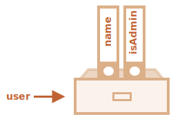

# Об’єкти

Як ми знаємо з глави <info:types>, у JavaScript є вісім типів даних. Сім з них називаються "примітивними", оскільки їх значення містять лише одну річ (чи то рядок, число чи щось інше).

На противагу цьому, об’єкти використовуються для зберігання ключів різних колекцій даних та складніших об’єктів. У JavaScript об’єкти проникають майже в усі аспекти мови. Тому ми повинні їх спочатку зрозуміти, перш ніж заглиблюватися в складніші теми.

Об’єкт можна створити за допомогою фігурних дужок `{…}` з необов’язковим списком *властивостей*. Властивість -- це пара "ключ: значення", де `ключ` -- це рядок (також називається "ім’я властивості"), а `значення` може бути будь-яким.

Ми можемо уявити собі об’єкт як шафу з підписаними файлами. Кожен фрагмент даних зберігається у своєму файлі за допомогою ключа. Легко знайти файл за назвою або додати/видалити файл.


Порожній об’єкт ("порожню шафу") можна створити за допомогою одного з двох синтаксисів:

```js
let user = new Object(); // синтаксис "конструктора об’єктів"
let user = {};  // синтаксис "літералу об’єкта"
```


Зазвичай використовуються фігурні дужки `{...}`. Таке оголошення називається *літералом об’єкта*.

## Літерали та властивості

Ми можемо одразу помістити деякі властивості у `{...}` як пари "ключ: значення":

```js
let user = {     // об’єкт
  name: "Іван",  // за ключем "name" зберігаємо значення "Іван"
  age: 30        // за ключем "age" зберігати значення "30" 
};
```

Властивість має ключ (також відомий як "ім’я" або "ідентифікатор") перед двокрапкою `":"` і значення праворуч від нього.

В об’єкті `user` зараз знаходяться дві властивості:

1. Перша властивість з ім’ям `"name"` і значенням `"Іван"`.
2. Друга властивість з ім’ям `"age"` і значенням `30`.

Отриманий об’єкт `user` можна уявити собі як шафу з двома підписаними файлами з позначками "name" та "age".


Ми можемо в будь-який момент додати в нього нові файли, видалити файли або прочитати вміст будь-якого файлу.

Для звернення до властивостей використовується запис через крапку:

```js
// отримаємо значення властивостей об’єкта:
alert( user.name ); // Іван
alert( user.age ); // 30
```

Значення може бути будь-якого типу. Додамо булеве значення:

```js
user.isAdmin = true;
```


Щоб видалити властивість ми можемо використати оператор `delete`:

```js
delete user.age;
```



Ім’я властивості може складатися з декількох слів, але тоді воно має бути поміщено в лапки:

```js
let user = {
  name: "Іван",
  age: 30,
  "likes birds": true  // Ім’я властивості з декількох слів повинно бути в лапках
};
```


Остання властивість у списку може закінчуватися комою:
```js
let user = {
  name: "Іван",
  age: 30*!*,*/!*
}
```
Це називається "кінцевою" або "висячою" комою. Полегшує додавання/видалення/переміщення по властивостях, оскільки всі рядки стають однаковими.

## Квадратні дужки

Для властивостей, імена яких складаються з декількох слів, доступ до значення «через крапку» не працює:

```js run
// це викличе синтаксичну помилку
user.likes birds = true
```

JavaScript бачить, що ми звертаємося до властивості `user.likes`, а потім йде незрозуміле слово `birds`. В результаті отримаємо синтаксичну помилку.

Крапка вимагає, щоб ключ був правильним ідентифікатором змінної. Це означає: не містить пробілів, не починається з цифри та не містить спеціальних символів (`$` та `_` дозволені).

Для таких випадків існує альтернативний спосіб доступу до властивостей через квадратні дужки. Такий спосіб спрацює з будь-яким ім’ям властивості:

```js run
let user = {};

// присвоювання значення властивості
user["любить птахів"] = true;

// отримання значення властивості
alert(user["любить птахів"]); // true

// видалення властивості
delete user["любить птахів"];
```

Зараз усе гаразд. Зверніть увагу, що рядок у квадратних дужках міститься в лапках (підійде будь-який тип лапок).

Квадратні дужки також дозволяють звернутися до властивості, ім’я якої може бути результатом виразу. Наприклад, ім'я властивості може зберігатися в змінній:

```js
let key = "любить птахів";

// так само, як user["любить птахів"] = true;
user[key] = true;
```

Тут змінна `key` може бути обчислена під час виконання або залежатиме від вводу користувача. І тоді ми використовуємо його для доступу до властивості. Це дає нам велику гнучкість.

Приклад:

```js run
let user = {
  name: "Іван",
  age: 30
};

let key = prompt("Що ви хочете знати про користувача?", "name");

// доступ до властивості через змінну
alert( user[key] ); // Іван (якщо ввести "name")
```

Запис «через крапку» такого не дозволяє:

```js run
let user = {
  name: "Іван",
  age: 30
};

let key = "name";
alert( user.key ) // undefined
```

### Обчислювані властивості

Ми можемо використовувати квадратні дужки в літеральній нотації для створення обчислюваної властивості.

Наприклад:

```js run
let fruit = prompt("Які фрукти купити?", "apple");

let bag = {
*!*
  [fruit]: 5, // назву властивості взято зі змінної fruit
*/!*
};

alert( bag.apple ); // 5 якщо fruit="apple"
```

Значення обчислюваної властивості просте: `[fruit]` означає, що назву властивості слід брати з `fruit`.

І якщо відвідувач введе слово `"apple"`, то в об’єкті `bag` тепер буде лежати властивість `{apple: 5}`.

По суті, це працює так само, як:
```js run
let fruit = prompt("Які фрукти купити?", "apple");
let bag = {};

// назву властивості взято зі змінної fruit
bag[fruit] = 5;
```

... Але виглядає приємніше.

Ми можемо використати більш складні вирази в квадратних дужках:

```js
let fruit = 'apple';
let bag = {
  [fruit + 'Computers']: 5 // bag.appleComputers = 5
};
```

Квадратні дужки набагато потужніші за крапкову нотацію. Вони допускають будь-які назви властивостей та змінні. Але вони також більш громіздкі для написання.

Тому більшість часу, коли назви властивостей відомі та прості, використовується крапка. А якщо нам потрібно щось складніше, то переходимо до квадратних дужок.

## Властивість з змінної

У реальному коді ми часто використовуємо наявні змінні як значення для імен властивостей.

Приклад:

```js run
function makeUser(name, age) {
  return {
    name: name,
    age: age,
    // ...інші властивості
  };
}

let user = makeUser("Іван", 30);
alert(user.name); // Іван
```

В наведеному вище прикладі назва властивостей `name` і `age` збігаються з назвами змінних, які ми підставляємо в якості значень цих властивостей. Такий підхід настільки поширений, що існують спеціальні *короткі властивості* для спрощення цього запису.

Замість `name: name` ми можемо написати просто `name`:

```js
function makeUser(name, age) {
*!*
  return {
    name, // те ж саме, що name: name
    age,  // те ж саме, що age: age
    // ...
  };
*/!*
}
```

Ми можемо використовувати як звичайні властивості, так і скорочення в одному об’єкті:

```js
let user = {
  name,  // те ж саме, що name:name
  age: 30
};
```


## Обмеження для імен властивостей

Як ми вже знаємо, змінна не може мати ім’я, зі списку слів, зарезервованих мовою, як-от "for", "let", "return" тощо.

То для властивості об’єкта немає такого обмеження:

```js run
// ці назви властивостей -- правильні
let obj = {
  for: 1,
  let: 2,
  return: 3
};

alert( obj.for + obj.let + obj.return );  // 6
```

Коротко кажучи, немає ніяких обмежень щодо назв властивостей. Це можуть бути будь-які рядки або символи (спеціальний тип для ідентифікаторів, про які буде сказано пізніше).

Інші типи автоматично перетворюються на рядки.

Наприклад, число `0` стає рядком `"0"`, коли використовується як ключ властивості:

```js run
let obj = {
  0: "тест" // те ж саме, що "0": "тест"
};

// обидва попередження мають доступ до однієї властивості (число 0 перетворюється на рядок "0")
alert( obj["0"] ); // тест
alert( obj[0] ); // тест (таж сама властивість)
```

Є невеликий підводний камінь, пов’язаний зі спеціальною властивістю `__proto__`. Ми можемо встановити в нього значення об’єктного типу:

```js run
let obj = {};
obj.__proto__ = 5; // присвоїмо число
alert(obj.__proto__); // [object Object] - значення -- це об’єкт, тобто не те, що ми очікували
```

Як ми бачимо з коду, присвоєння числа `5` ігнорується.

Ми розглянемо особливий характер `__proto__` у [наступних розділах](info:prototype-inheritance) і запропонуємо [способи виправлення](info:prototype-methods) такої поведінки.

## Перевірка існування властивості, оператор "in"

Помітною особливістю об’єктів у JavaScript, у порівнянні з багатьма іншими мовами, є можливість доступу до будь-якої властивості. Помилки не буде, якщо властивості не існує!

Читання відсутньої властивості просто повертає `undefined`. Тому ми можемо легко перевірити, чи існує властивість:

```js run
let user = {};

alert( user.noSuchProperty === undefined ); // true означає "такої властивості немає"
```

Для цього також є спеціальний оператор `"in"`.

Синтаксис такий:
```js
"key" in object
```

Наприклад:

```js run
let user = { name: "Іван", age: 30 };

alert( "age" in user ); // true, user.age існує
alert( "blabla" in user ); // false, user.blabla не існує
```

Зверніть увагу, що зліва від оператора `in` повинно бути ім’я властивості. Зазвичай це рядок в лапках.

Якщо ми опускаємо лапки, це означає, що ми вказуємо змінну, в якій знаходиться ім’я властивості. Наприклад:

```js run
let user = { age: 30 };

let key = "age";
alert( *!*key*/!* in user ); // true, властивість "age" існує
```

Для чого взагалі потрібен оператор `in`? Хіба недостатньо порівняння з `undefined`?

У більшості випадків прекрасно спрацює порівняння з `undefined`. Але є особливий випадок, коли воно не підходить, і потрібно використовувати `"in"`.

Це коли властивість існує, але містить значення `undefined`:

```js run
let obj = {
  test: undefined
};

alert( obj.test ); // виведеться undefined, значить властивість не існує?

alert( "test" in obj ); // true, властивість існує!
```

У наведеному вище коді властивість `obj.test` технічно існує. Отже, оператор `in` працює правильно.

Такі ситуації трапляються дуже рідко, тому що `undefined` не слід чітко призначати. Ми в основному використовуємо `null` для "невідомих" або "порожніх" значень. Отже, оператор `in` -- екзотичний гість у коді.


## Цикл "for..in"

Для перебору всіх властивостей об’єкта використовується цикл `for..in`. Цей цикл відрізняється від вивченого раніше циклу `for(;;)`.

Синтаксис:

```js
for (key in object) {
  // тіло циклу виконується для кожної властивості об’єкта
}
```

Наприклад, виведемо всі властивості `user`:

```js run
let user = {
  name: "Іван",
  age: 30,
  isAdmin: true
};

for (let key in user) {
  // ключі
  alert( key );  // name, age, isAdmin
  // значення ключів
  alert( user[key] ); // Іван, 30, true
}
```

Зверніть увагу, що всі конструкції "for" дозволяють нам оголошувати змінну всередині циклу, як, наприклад, `let key` тут.

Крім того, ми могли б використовувати інше ім’я змінної. Наприклад, часто використовується варіант `"for (let prop in obj)"`.

### Впорядкування властивостей об’єкта

Чи упорядковані властивості об’єкта? Іншими словами, якщо ми будемо в циклі перебирати всі властивості об’єкта, чи отримаємо ми їх в тому ж порядку, в якому ми їх додавали? Чи можемо ми на це розраховувати?

Коротка відповідь: "властивості впорядковані особливим чином". Властивості з цілочисельними ключами сортуються за зростанням, інші розташовуються в порядку створення. Розберемося докладніше.

Як приклад розглянемо об’єкт з телефонними кодами:

```js run
let codes ={
   "49": "Німеччина",
   "41": "Швейцарія",
   "44": "Великобританія",
   // ..,
   "1": "США"
};

*!*
for (let code in codes) {
  alert(code); // 1, 41, 44, 49
}
*/!*
```

Об’єкт може використовуватися, щоб запропонувати користувачеві список опцій. Якщо ми робимо сайт для німецької аудиторії, то, ймовірно, ми хочемо, щоб код `49` був першим.

Але якщо ми запустимо код, ми побачимо зовсім іншу картину:

- США (1) йде першим
- потім Швейцарія (41) і так далі.

Телефонні коди йдуть в порядку зростання, тому що вони є цілими числами: `1, 41, 44, 49`.

````smart header="Цілочисельні властивості? Що це?"
Термін "цілочисельна властивість" означає рядок, який може бути перетворений в ціле число і назад без змін.

Тобто, рядок `"49"` -- це цілочисельне ім’я властивості, якщо його перетворити на ціле число, а потім назад в рядок, то воно не зміниться. А ось властивості `"+49"` або `"1.2"` такими не є:

```js run
// Number(...) -- явно перетворює на число
// Math.trunc -- вбудована функція, яка видаляє десяткову частину
alert( String( Math.trunc( Number("49"))) ); // "49", те ж саме ⇒ властивість цілочисельна
alert( String( Math.trunc( Number("+49"))) ); // "49", не те ж саме, що "+49" ⇒ властивість не цілочисельна
alert( String( Math.trunc( Number("1.2")))); // "1", не те ж саме, що "1.2" ⇒ властивість не цілочисельна
```
````

...З іншого боку, якщо ключ не цілочисельний, то вони перебираються в порядку створення, наприклад:

```js run
let user = {
  name: "Іван",
  surname: "Smith"
};
user.age = 25; // добавимо ще одну властивість

*!*
// не цілочисельні властивості перераховані в порядку створення
*/!*
for (let prop in user) {
  alert( prop ); // name, surname, age
}
```

Таким чином, щоб вирішити нашу проблему з телефонними кодами, ми можемо схитрувати, зробивши коди не цілочисельними властивостями. Додамо знак `"+"` перед кожним кодом.

Приклад:

```js run
let codes = {
  "+49": "Germany",
  "+41": "Switzerland",
  "+44": "Great Britain",
  // ..,
  "+1": "USA"
};

for (let code in codes) {
  alert( +code ); // 49, 41, 44, 1
}
```

Зараз скрипт працює, як передбачалося.

## Висновок

Об’єкти -- це асоціативні масиви з рядом додаткових можливостей.

Вони зберігають властивості (пари ключ-значення), де:
- Ключі властивостей повинні бути рядками або символами (зазвичай рядками).
- Значення можуть бути будь-якого типу.

Щоб отримати доступ до властивості, ми можемо використовувати:
- Запис через крапку: `obj.property`.
- Квадратні дужки `obj["property"]`. Квадратні дужки дозволяють взяти ключ зі змінної, наприклад, `obj[varWithKey]`.

Додаткові оператори:
- Видалення властивості: `delete obj.prop`.
- Перевірка існування властивості: `"key" in obj`.
- Перебір властивостей об’єкта: цикл `for (let key in obj)`.

Те, що ми вивчали в цьому розділі, називається "простим об’єктом" або просто `Object`.

В JavaScript є багато інших типів об’єктів:

- `Array` для зберігання впорядкованих колекцій даних,
- `Date` для зберігання інформації про дату і час,
- `Error` для зберігання інформації про помилку.
- … і так далі.

У них є свої особливості, які ми вивчимо пізніше. Іноді люди говорять щось на кшталт "тип даних Array" або "тип даних Date", але формально вони не є окремими типами, а належать до типу даних `"Object"`. Вони лише розширюють його різними способами.

Об’єкти в JavaScript дуже потужні. Тут ми тільки трохи заглибилися в дійсно величезну тему. Ми будемо тісно працювати з об’єктами і дізнаємося про них більше в наступних частинах підручника.
