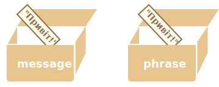

# Копіювання об’єктів та посилання

Однією з принципових відмінностей об’єктів від примітивів є те, що об’єкти зберігаються та копіюються "за посиланням", тоді як примітивні значення: рядки, числа, логічні значення тощо - завжди копіюються "за значенням".

Це легко зрозуміти, якщо заглянути під капот того, що відбувається, коли ми копіюємо значення.

Почнемо з примітиву, наприклад, рядка.

Запишемо копію `message` у `phrase`:

```js
let message = "Привіт!";
let phrase = message;
```

В результаті ми маємо дві незалежні змінні, кожна з яких зберігає рядок `"Привіт!"`.



Цілком очікуванний результат, згодні?

Об’єкти поводяться інакше.

**Змінна зберігає не сам об’єкт, а його "адресу в пам’яті" -- іншими словами "посилання" на нього.**

Проілюструємо це:

```js
let user = {
  name: "Іван"
};
```

І ось як це насправді зберігається в пам’яті:


Об’єкт зберігається десь у пам’яті (справа на зображенні), тоді як у змінній `user` (зліва) є "посилання" на нього.

Ми можемо думати про змінну `user`, як про шухляду з аркушем паперу з адресою об’єкта на ньому.

Коли ми виконуємо дії з об’єктом, напр. зчитуємо властивість `user.name`, рушій JavaScript перевіряє, що знаходиться за цією адресою, і виконує операцію над фактичним об’єктом.

Ось чому це важливо:

**Коли копіюється змінна об’єкта, копіюється посилання, але сам об’єкт не дублюється.**

Наприклад:

```js no-beautify
let user = { name: "Іван" };

let admin = user; // копіювання посилання
```

Тепер у нас є дві змінні, кожна з яких зберігає посилання на той самий об’єкт:


Як бачите, є тільки один об’єкт, але тепер із двома змінними, які посилаються на нього.

Ми можемо використати будь-яку змінну для доступу до об’єкта та модифікації його вмісту:

```js run
let user = { name: 'Іван' };

let admin = user;

*!*
admin.name = 'Петро'; // змінено за посиланням зі змінної "admin"
*/!*

alert(*!*user.name*/!*); // 'Петро', зміни видно з посилання зі змінної "user"
```

Уявіть, що об’єкт -- це шафа з якимись данними (властивостями). А "адреса" цієї шафи зберігається у двох шухлядах. Спочатку ми використовуємо одну з них (`admin`), щоб дістатися цієї шафи та щось змінити. Потім, якщо ми використаємо іншу шухляду (`user`), ми все ще відкриємо ту саму шафу і отримаємо доступ до зміненого вмісту.

## Порівняння за посиланням

Два об’єкти рівні, лише якщо це той самий об’єкт.

Наприклад, тут `a` і` b` посилаються на той самий об’єкт, отже, вони рівні:

```js run
let a = {};
let b = a; // копіювання посилання

alert( a == b ); // true, обидві змінні посилаються на той самий об’єкт
alert( a === b ); // true
```

І тут два незалежні об’єкти не рівні, хоча вони схожі (обидва порожні):

```js run
let a = {};
let b = {}; // два незалежні об’єкти

alert( a == b ); // false
```

Для порівнянь, таких як `obj1 > obj2`, або для порівняння з примітивом `obj == 5`, об’єкти перетворюються на примітиви. Незабаром ми вивчимо, як працюють перетворення об’єктів, але правду кажучи, такі порівняння потрібні вкрай рідко — зазвичай вони з’являються в результаті неправильного програмування.

## Клонування та злиття об’єктів, Object.assign [#cloning-and-merging-object-assign]

Отже, копіювання змінної об’єкта створює ще одне посилання на той самий об’єкт.

Але що, якщо нам потрібно дублювати об’єкт? Створити незалежну копію, клон?

Це теж можливо, але трохи складніше, оскільки в JavaScript немає вбудованого методу для цього. Насправді, це потрібно досить рідко. У більшості випадків нам достатньо копіювання за посиланням.

Але якщо ми насправді цього хочемо, то нам потрібно створити новий об’єкт і відтворити структуру існуючого, перебираючи та копіюючи його властивості.

Наприклад так:

```js run
let user = {
  name: "Іван",
  age: 30
};

*!*
let clone = {}; // новий порожній об’єкт

// давайте скопіюємо в нього всі властивості з user
for (let key in user) {
  clone[key] = user[key];
}
*/!*

// тепер клон - це повністю незалежний об’єкт з однаковим вмістом
clone.name = "Петро"; // змінемо його вміст

alert( user.name ); // як і раніше Іван залишився в оригінальному об’єкті
```

Також ми можемо використати метод [Object.assign](mdn:js/Object/assign) для цього.

Його синтаксис:

```js
Object.assign(dest, [src1, src2, src3...])
```

- Перший аргумент `dest` -- цє цільовий об’єкт, у який ми будемо копіювати.
- Наступні аргументи `src1, ..., srcN` (їх може бути скільки завгодно) - це вихідні об’єкти, з яких ми будемо копіювати.
- Він копіює властивості всіх вихідних об’єктів `src1, ..., srcN` у цільовий` dest`. Іншими словами, властивості всіх аргументів, починаючи з другого, копіюються в перший об’єкт.
- Виклик повертає `dest`.

Наприклад, ми можемо використовувати його для об’єднання кількох об’єктів в один:
```js
let user = { name: "Іван" };

let permissions1 = { canView: true };
let permissions2 = { canEdit: true };

*!*
// копіює всі властивості з permissions1 та permissions2 у user
Object.assign(user, permissions1, permissions2);
*/!*

// тепер user = { name: "Іван", canView: true, canEdit: true }
```

Якщо приймаючий об’єкт(user) вже має властивість з таким ім’ям, її буде перезаписано:

```js run
let user = { name: "Іван" };

Object.assign(user, { name: "Петро" });

alert(user.name); // тепер user = { name: "Петро" }
```

Ми також можемо використовувати `Object.assign` щоб замінити цикл `for..in` для простого клонування:

```js
let user = {
  name: "Іван",
  age: 30
};

*!*
let clone = Object.assign({}, user);
*/!*
```

Він копіює всі властивості `user` у порожній об’єкт і повертає його.

Існують також інші методи клонування об’єкта, напр. за допомогою [оператора розширення](info:rest-parameters-spread) `clone = {...user}`, це висвітлено пізніше у підручнику.

## Вкладене клонування

До цього часу ми вважали, що всі властивості `user` є примітивами. Але властивості можуть бути посиланнями на інші об’єкти. Що з ними робити?

Наприклад:
```js run
let user = {
  name: "Іван",
  sizes: {
    height: 182,
    width: 50
  }
};

alert( user.sizes.height ); // 182
```

Тепер при клонуванні недостатньо просто скопіювати `clone.sizes = user.sizes`, тому що `user.sizes` є об’єктом, і він буде скопійований за посиланням. Тому `clone` і `user` у своїх властивостях `sizes` будуть посилатися на один і той же об’єкт:

Ось так:

```js run
let user = {
  name: "Іван",
  sizes: {
    height: 182,
    width: 50
  }
};

let clone = Object.assign({}, user);

alert( user.sizes === clone.sizes ); // true, один і той же об’єкт

// user і clone мають посилання на єдиний об’єкт у властивості sizes
user.sizes.width++;       // міняємо властивість з одного місця
alert(clone.sizes.width); // 51, бачемо результат в інщому об’єкті
```

Щоб це виправити, слід використовувати цикл клонування, який перевіряє кожне значення `user[key]`, і якщо це об’єкт, то також копіює його структуру. Це називається "глибоким клонуванням".

Для його реалізації ми можемо використати рекурсію. Або, щоб не винаходити колесо, взяти існуючу реалізацію, наприклад [_.cloneDeep(obj)](https://lodash.com/docs#cloneDeep) з бібліотеки JavaScript [lodash](https://lodash.com).

````smart header="об’єкти у const-змінних можна змінювати"
Важливим побічним ефектом зберігання об’єктів як посилань є те, що об’єкт, оголошений як `const`, *може* бути змінений.

Наприклад:

```js run
const user = {
  name: "Іван"
};

*!*
user.name = "Петро"; // (*)
*/!*

alert(user.name); // Петро
```

Може здатися, що рядок `(*)` призведе до помилки, але це не так. Значення у змінній `user` є постійним, воно завжди має посилатися на той самий об’єкт, але властивості цього об’єкта можуть змінюватися.

Інакше кажучи, `const user` видає помилку, лише якщо ми намагаємося присвоїти у саму змінну інше значення: `user = ...`.

Тим не менш, якщо нам дійсно потрібно створювати незмінні властивості об’єкта, це також можливо, але з використанням зовсім інших методів. Про це ми згадаємо у розділі <info:property-descriptors>.
````

## Підсумки

Об’єкти присвоюються та копіюються за посиланням. Інакше кажучи, змінна зберігає не "значення об’єкта", а "посилання" (адресу в пам’яті) на значення. Тож копіювання такої змінної або передача її як аргументу функції копіює це посилання, а не сам об’єкт.

Усі операції за допомогою скопійованих посилань (наприклад, додавання/видалення властивостей) виконуються над одним і тим же об’єктом.

Для створення "справжньої копії" (клону) ми можемо використовувати `Object.assign` для так званої "поверхової копії" (вкладені об’єкти копіюються за посиланням) або функції "глибокого клонування", наприклад [_.cloneDeep(obj)](https://lodash.com/docs#cloneDeep).
