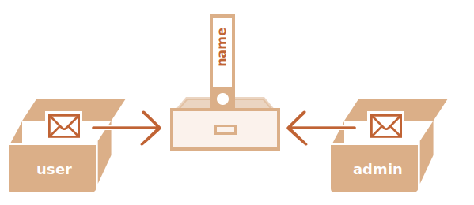

# Копіювання об'єктів та посилання

Однією з принципових відмінностей об'єктів від примітивів є те, що об'єкти зберігаються та копіюються "за посиланням", тоді як примітивні значення: рядки, числа, логічні значення тощо - завжди копіюються "за значенням".

Це легко зрозуміти, якщо заглянути під капот того, що відбувається, коли ми копіюємо значення.

Почнемо з примітиву, наприклад, рядка.

Запишемо копію `message` у `phrase`:

```js
let message = "Привіт!";
let phrase = message;
```

В результаті ми маємо дві незалежні змінні, кожна з яких зберігає рядок `"Привіт!"`.


Цілком очікуванний результат, згодні?

Об'єкти поводяться інакше.

**Змінна зберігає не сам об'єкт, а його "адресу в пам'яті" -- іншими словами "посилання" на нього.**

Проілюструємо це:

```js
let user = {
  name: "Іван"
};
```

І ось як це насправді зберігається в пам'яті:


Об'єкт зберігається десь у пам'яті (справа на зображенні), тоді як у змінній `user` (зліва) є "посилання" на нього.

Ми можемо думати про змінну `user`, як про шухляду з аркушем паперу з адресою об'єкта на ньому.

Коли ми виконуємо дії з об'єктом, напр. зчитуємо властивість `user.name`, рушій JavaScript перевіряє, що знаходиться за цією адресою, і виконує операцію над фактичним об'єктом.

Ось чому це важливо:

**Коли копіюється змінна об'єкта, копіюється посилання, але сам об'єкт не дублюється.**

Наприклад:

```js no-beautify
let user = { name: "Іван" };

let admin = user; // копіювання посилання
```

Тепер у нас є дві змінні, кожна з яких зберігає посилання на той самий об'єкт:



Як бачите, є тільки один об'єкт, але тепер із двома змінними, які посилаються на нього.

Ми можемо використати будь-яку змінну для доступу до об'єкта та модифікації його вмісту:

```js run
let user = { name: 'Іван' };

let admin = user;

*!*
admin.name = 'Петро'; // змінено за посиланням зі змінної "admin"
*/!*

alert(*!*user.name*/!*); // 'Петро', зміни видно з посилання зі змінної "user"
```

Уявіть, що об'єкт -- це шафа з якимись данними (властивостями). А "адреса" цієї шафи зберігається у двох шухлядах. Спочатку ми використовуємо одну з них (`admin`), щоб дістатися цієї шафи та щось змінити. Потім, якщо ми використаємо іншу шухляду (`user`), ми все ще відкриємо ту саму шафу і отримаємо доступ до зміненого вмісту.

## Порівняння за посиланням

Два об'єкти рівні, лише якщо це той самий об'єкт.

Наприклад, тут `a` і` b` посилаються на той самий об'єкт, отже, вони рівні:

```js run
let a = {};
let b = a; // копіювання посилання

alert( a == b ); // true, обидві змінні посилаються на той самий об'єкт
alert( a === b ); // true
```

І тут два незалежні об'єкти не рівні, хоча вони схожі (обидва порожні):

```js run
let a = {};
let b = {}; // два незалежні об'єкти

alert( a == b ); // false
```

Для порівнянь, таких як `obj1 > obj2`, або для порівняння з примітивом `obj == 5`, об'єкти перетворюються на примітиви. Незабаром ми вивчимо, як працюють перетворення об'єктів, але правду кажучи, такі порівняння потрібні вкрай рідко — зазвичай вони з'являються в результаті неправильного програмування.

````smart header="Об'єкти у const-змінних можна змінювати"
Важливим побічним ефектом зберігання об'єктів як посилань є те, що об'єкт, оголошений як `const`, *може* бути змінений.

Наприклад:

```js run
const user = {
  name: "Іван"
};

*!*
user.name = "Петро"; // (*)
*/!*

alert(user.name); // Петро
```

Може здатися, що рядок `(*)` призведе до помилки, але це не так. Значення у змінній `user` є постійним, воно завжди має посилатися на той самий об'єкт, але властивості цього об'єкта можуть змінюватися.

Інакше кажучи, `const user` видає помилку, лише якщо ми намагаємося присвоїти у саму змінну інше значення: `user = ...`.

Тим не менш, якщо нам дійсно потрібно створювати незмінні властивості об'єкта, це також можливо, але з використанням зовсім інших методів. Про це ми згадаємо у розділі <info:property-descriptors>.
````

## Клонування та злиття об'єктів, Object.assign [#cloning-and-merging-object-assign]

Отже, копіювання змінної об'єкта створює ще одне посилання на той самий об'єкт.

Але що, якщо нам потрібно створити копію, клон об'єкта?

Але якщо ми насправді цього хочемо, то нам потрібно створити новий об'єкт і відтворити структуру існуючого, перебираючи та копіюючи його властивості.

Наприклад так:

```js run
let user = {
  name: "Микола",
  age: 30
};

*!*
let clone = {}; // новий порожній об'єкт

// давайте скопіюємо в нього всі властивості з user
for (let key in user) {
  clone[key] = user[key];
}
*/!*

// тепер clone є повністю незалежним об'єктом з тим самим вмістом
clone.name = "Петро"; // змінив дані в ньому

alert( user.name ); // значення "Микола" все ще в оригінальному об'єкті
```

Ми також можемо скористатися методом [Object.assign](https://developer.mozilla.org/en-US/docs/Web/JavaScript/Reference/Global_Objects/Object/assign).

Синтаксис:

```js
Object.assign(dest, ...sources)
```
- Перший аргумент `dest` є цільовим об'єктом.
- Подальші аргументи -- це список вихідних об'єктів.

Він копіює властивості всіх вихідних об'єктів у цільовий `dest`, а потім повертає його як результат.

Наприклад, у нас є об'єкт `user`, давайте додамо до нього пару властивостей з дозволами:

```js run
let user = { name: "Микола" };

let permissions1 = { canView: true };
let permissions2 = { canEdit: true };

*!*
// копіює всі властивості з permissions1 та permissions2 в user
Object.assign(user, permissions1, permissions2);
*/!*

// Тепер user = { name: "Микола", canView: true, canEdit: true }
alert(user.name); // Микола
alert(user.canView); // true
alert(user.canEdit); // true
```

Якщо скопійована назва властивості вже існує, вона буде перезаписана:

```js run
let user = { name: "Микола" };

Object.assign(user, { name: "Петро" });

alert(user.name); // now user = { name: "Петро" }
```

Ми також можемо використовувати `Object.assign` щоб виконати просте клонування об'єкта:

```js run
let user = {
  name: "Микола",
  age: 30
};

*!*
let clone = Object.assign({}, user);
*/!*

alert(clone.name); // Микола
alert(clone.age); // 30
```
Він копіює всі властивості `user` в порожній об'єкт і повертає його.

Існують також інші методи клонування об'єкта, напр. [spread syntax](info:rest-parameters-spread) `clone = {...user}`, розглянуті далі в посібнику.

## Вкладене клонування

Досі ми припускали, що всі властивості `user` є примітивами. Але властивості можуть бути посиланнями на інші об'єкти.

Ось так:
```js run
let user = {
  name: "Микола",
  sizes: {
    height: 182,
    width: 50
  }
};

alert( user.sizes.height ); // 182
```

Тепер недостатньо скопіювати `clone.sizes = user.sizes`, тому що `user.sizes` є об'єктом і буде скопійовано за посиланням, тому `clone` і `user` матимуть однакові `sizes`:

```js run
let user = {
  name: "Микола",
  sizes: {
    height: 182,
    width: 50
  }
};

let clone = Object.assign({}, user);

alert( user.sizes === clone.sizes ); // true, той же об'єкт

// user та clone поділяють sizes
user.sizes.width = 60;    // змінюємо властивість в одному місці
alert(clone.sizes.width); // 60, отримуємо результат в іншому
```

Щоб виправити це та зробити `user` і `clone` справді окремими об'єктами, ми повинні використати цикл клонування, який перевіряє кожне значення `user[key]` і, якщо це об'єкт, то також повторює його структуру. Це називається "глибоке клонування(deep cloning)" або "структурне клонування(structured cloning)". Існує метод [structuredClone](https://developer.mozilla.org/en-US/docs/Web/API/structuredClone), який реалізує таке глибоке клонування.

### structuredClone

Виклик `structuredClone(object)` клонує `object` з усіма вкладеними властивостями.

Ось як ми можемо використовувати це в нашому прикладі:

```js run
let user = {
  name: "Микола",
  sizes: {
    height: 182,
    width: 50
  }
};

*!*
let clone = structuredClone(user);
*/!*

alert( user.sizes === clone.sizes ); // false, різні об'єкти

// user та clone тепер абсолютно не пов'язані між собою
user.sizes.width = 60;    // тепер змінюємо властивість в одному місці
alert(clone.sizes.width); // 50, інше місце не пов'язане з попереднім
```

Метод `structuredClone` може клонувати більшість типів даних, таких як об'єкти, масиви, примітивні значення.

Він також підтримує циклічні посилання, коли властивість об'єкта посилається на сам об'єкт (безпосередньо або через ланцюжок чи посилання).

Наприклад:

```js run
let user = {};
// давайте створимо циклічне посилання:
// user.me посилається на user
user.me = user;

let clone = structuredClone(user);
alert(clone.me === clone); // true
```

Як бачите, `clone.me` посилається на `clone`, а не на `user`! Отже, циклічне посилання також було клоновано правильно.

Хоча бувають випадки, коли `structuredClone` не працює.

Наприклад, коли об'єкт має властивість з функцією:

```js run
// помилка
structuredClone({
  f: function() {}
});
```

Властивості з функціями не підтримуються.

Для обробки таких складних випадків нам може знадобитися використовувати комбінацію методів клонування, написати спеціальний код або, щоб не винаходити колесо, взяти існуючу реалізацію, наприклад [_.cloneDeep(obj)](https://lodash.com /docs#cloneDeep) із бібліотеки JavaScript [lodash](https://lodash.com).

## Підсумки

Об'єкти присвоюються та копіюються за посиланням. Інакше кажучи, змінна зберігає не "значення об'єкта", а "посилання" (адресу в пам'яті) на значення. Тож копіювання такої змінної або передача її як аргументу функції копіює це посилання, а не сам об'єкт.

Усі операції за допомогою скопійованих посилань (наприклад, додавання/видалення властивостей) виконуються над тим самим об'єктом.

Для створення "справжньої копії" (клону) ми можемо використовувати `Object.assign` для так званої "поверхової копії" (вкладені об'єкти копіюються за посиланням) або функції "глибокого клонування", наприклад [_.cloneDeep(obj)](https://lodash.com/docs#cloneDeep).
