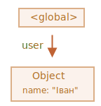
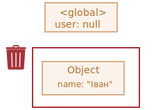
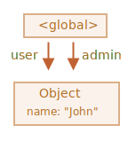
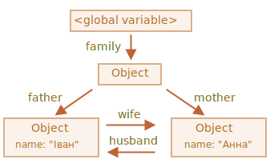
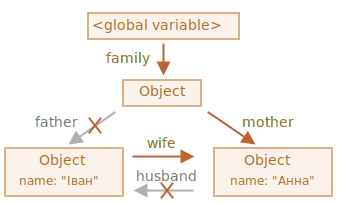
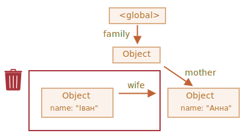
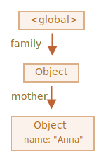
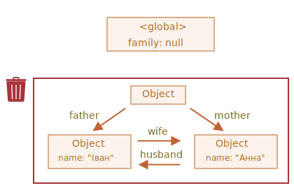

# Збирання сміття

Управління пам’яттю в JavaScript виконується автоматично і непомітно. Ми створюємо примітиви, об’єкти, функції... Все це займає пам’ять.

Але що відбувається, коли змінна або якийсь об’єкт більше не потрібні? Як JavaScript розуміє, коли потрібно звільняти пам’ять?

## Досяжність

Основна концепція управління пам’яттю в JavaScript -- це *досяжність*.

Простіше кажучи, "досяжні" значення -- це ті, які якимось чином доступні або придатні для використання. Вони гарантовано зберігаються в пам’яті.

1. Існує базовий набір досяжних за своєю суттю значень, які неможливо видалити із зрозумілих причин.

    Наприклад:

    - Функція, що виконується зараз, її локальні змінні та параметри.
    - Інші функції поточного ланцюжка вкладених викликів, їх локальні змінні та параметри.
    - Глобальні змінні.
    - (є й деякі інші, внутрішні)

    Ці значення ми будемо називати *корені*.

2. Будь-яке інше значення вважається досяжним, якщо воно доступне з кореня за допомогою посилання або ланцюжка посилань.

    Наприклад, якщо в глобальній змінній є об’єкт, і цей об’єкт має властивість, що посилається на інший об’єкт, *цей* об’єкт вважається досяжним. І ті, на які він посилається, також досяжні. Далі ви познайомитеся з докладними прикладами на цю тему.

У рушію JavaScript є фоновий процес, який називається [збирання сміття](https://uk.wikipedia.org/wiki/Збирання_сміття). Він контролює всі об’єкти та видаляє ті, які стали недосяжними.

## Простий приклад

Ось найпростіший приклад:

```js
// user має посилання на об’єкт
let user = {
  name: "Іван"
};
```



Тут стрілка зображує посилання на об’єкт. Глобальна змінна `"user"` посилається на об’єкт `{name: "Іван"}` (ми будемо називати його Іван для стислості). Властивість `"name"` Івана зберігає примітив, тому він зображений всередині об’єкта.

Якщо значення в змінній `user` переписується, посилання втрачається:

```js
user = null;
```



Тепер Іван стає недосяжним. Немає доступу до нього, немає посилань на нього. Процес збирання сміття видалить дані і звільнить пам’ять.

## Два посилання

Тепер уявімо, що ми скопіювали посилання зі змінної `user` у змінну `admin`:

```js
// user має посилання на об’єкт
let user = {
  name: "Іван"
};

*!*
let admin = user;
*/!*
```



Тепер, якщо ми зробимо те саме:
```js
user = null;
```

...Тепер об’єкт все ще є досяжним через глобальну змінну `admin`, таким чином він залишається у пам’яті. Якщо переписати змінну `admin` також, його можна буде видалити.

## Взаємозв’язані об’єкти

Тепер більш складний приклад. Сім’я:

```js
function marry(man, woman) {
  woman.husband = man;
  man.wife = woman;

  return {
    father: man,
    mother: woman
  }
}

let family = marry({
  name: "Іван"
}, {
  name: "Анна"
});
```

Функція `marry` "одружує" два об’єкти, даючи їм посилання один на одного та повертаючи новий об’єкт, що містить їх обох.

Отримана структура даних:



Наразі всі об’єкти досяжні.

Тепер видалимо два посилання:

```js
delete family.father;
delete family.mother.husband;
```



Недостатньо видалити лише одне з цих двох посилань, оскільки всі об’єкти все одно будуть досяжними.

Але якщо видалити обидва, то можна побачити, що Іван більше не має посилань на себе:



Вихідні посилання не мають значення. Тільки вхідні можуть зробити об’єкт досяжним. Отже, Іван зараз недосяжний і буде видалений з пам’яті з усіма його даними, які також стали недосяжними.

Після збирання сміття:



## Недосяжний "острів"

Можливо, що весь "острів" взаємопов’язаних об’єктів стане недосяжним і видалиться з пам’яті.

Якщо об’єкт такий самий, як і вище, тоді:

```js
family = null;
```

Подання в пам'яті стає таким:



Цей приклад демонструє, наскільки важливою є концепція досяжності.

Очевидно, що Іван і Анна все ще пов’язані, обидва мають вхідні посилання. Але цього недостатньо.

Колишній об’єкт `"family"` було від’єднано від кореня, більше на нього немає посилання, тому весь "острів" стає недосяжним і буде видалений.

## Внутрішні алгоритми

Основний алгоритм збирання сміття називається "позначення і видалення" (англ. "mark-and-sweep").

Зазвичай виконуються такі етапи "збирання сміття":

- Збирання сміття розпочинається з коренів, які позначаються (запам'ятовуються) особливим чином.
- Потім позначаються всі посилання від них.
- Потім він відвідує позначені об’єкти та позначає інші об’єкти на які є посилання від них. Усі відвідані об’єкти запам’ятовуються, щоб у майбутньому не відвідувати один і той же об’єкт двічі.
- ...І так до тих пір, поки не будуть відвідані усі досяжні (з коренів) посилання.
- Усі об’єкти, крім позначених, видаляються.

Наприклад, нехай наша структура об’єктів виглядатиме так:


З правого боку ми чітко бачимо "недосяжний острів". Тепер давайте подивимося, як збирання сміття "позначає і видаляє".

Перший крок позначає корені:


Потім позначаються посилання від них:


...І посилання від них, поки це можливо:


Тепер об’єкти, які не вдалося відвідати в процесі, вважаються недосяжними і будуть видалені:


Ми також можемо уявити собі цей процес, як виливання великого відра фарби починаючи з коренів, фарба протікає через усі посилання і позначає всі об’єкти, до яких можна дістатися. Потім непозначені об’єкти видаляються.

Це концепція того, як працює збирання сміття. Рушій JavaScript застосовує багато оптимізацій, щоб прискорити це та не додати затримок при виконанні коду.

Деякі з оптимізацій:

- **Збірка поколінь (Generational collection)** -- об’єкти поділяються на два набори: "нові" та "старі". Багато об'єктів мають короткий термін служби, вони з’являються, виконують свою роботу і швидко стають непотрібними. Тому має сенс відстежувати нові об’єкти та очищати від них пам’ять, якщо це так. Ті, що використовуються досить довго, стають "старими" і оглядаються рідше.
- **Інкрементний збір (Incremental collection)** -- якщо об’єктів багато, і ми намагаємось пройтися і позначити весь набір об’єктів одночасно, це може зайняти деякий час і ввести видимі затримки у виконанні. Тому рушій намагається розділити збирання сміття на частини. Потім частини виконуються по одній, окремо. Таким чином відбувається багато дрібних зборів сміття замість одного великого. Це вимагає додаткового обліку між ними для відстеження змін, але ми маємо багато маленьких затримок замість однієї великої.
- **Збір під час простою (Idle-time collection)** -- завзвичай збирання сміття працює лише під час простою процесора, щоб зменшити можливий вплив на виконання.

Існують й інші оптимізації та варіанти алгоритмів збирання сміття. Але як би нам не хотілося описати їх тут, ми повинні утриматися від цього, тому що різні інтерпретатори JavaScript застосовують різні прийоми і хитрощі. І, що ще важливіше, все змінюється в міру розвитку інтерпретаторів, тому глибше вивчення "заздалегідь" без реальної потреби, ймовірно, не варто того. Якщо, звичайно, це не питання чистого інтересу, нижче для вас будуть деякі посилання.

## Підсумки

Основне, що потрібно знати:

- Збирання сміття здійснюється автоматично. Ми не можемо примусити або запобігти цьому.
- Об’єкти зберігаються в пам’яті, поки вони досяжні.
- Посилання -- це не те ж саме, що бути досяжним (з кореня): декілька взаємопов’язаних об’єктів можуть стати недосяжними усі разом. Ми розібрали це в прикладі вище.

Сучасні рушії реалізують передові алгоритми збирання сміття.

Деякі з них висвітлені в книзі "The Garbage Collection Handbook: The Art of Automatic Memory Management" (R. Jones et al).

Якщо ви знайомі з низькорівневим програмуванням, більш детальна інформація про збирання сміття у рушії V8 міститься у статті [A tour of V8: Garbage Collection](http://jayconrod.com/posts/55/a-tour-of-v8-garbage-collection).

[V8 blog](https://v8.dev/) також час від часу публікує статті про зміни в управлінні пам’яттю. Зрозуміло, вам необхідно розуміти, як влаштований всередині рущія V8 в цілому. Про це ви можете прочитати у блозі [Вячеслава Єгорова](https://mrale.ph) який працював одним з інженерів V8. Я кажу: "V8", тому що він найкраще висвітлений статтями в Інтернеті. Для інших інтерпретаторів деякі підходи схожі, але збирання сміття відрізняється в багатьох аспектах.

Глибоке розуміння роботи інтерпретаторів необхідно, коли вам потрібні низькорівневі оптимізації. Було б розумно планувати їх вивчення тільки як наступний крок після вивчення мови JavaScript.
