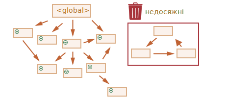

# Збирання сміття

Управління пам’яттю в JavaScript виконується автоматично і непомітно. Ми створюємо примітиви, об’єкти, функції... Все це займає пам’ять.

Але що відбувається, коли щось більше не потрібно? Як JavaScript розуміє, що потрібно звільняти пам’ять?

## Досяжність

Основна концепція управління пам’яттю в JavaScript -- це *досяжність*.

Простіше кажучи, "досяжні" значення -- це ті, які якимось чином доступні або придатні для використання. Вони гарантовано зберігаються в пам’яті.

1. Існує базовий набір досяжних за своєю суттю значень, які неможливо видалити із зрозумілих причин.

    Наприклад:

    - Функція, що виконується зараз, її локальні змінні та параметри.
    - Інші функції поточного ланцюжка вкладених викликів, їх локальні змінні та параметри.
    - Глобальні змінні.
    - (є й деякі інші, внутрішні)

    Ці значення ми будемо називати *корені*.

2. Будь-яке інше значення вважається досяжним, якщо воно доступне з кореня за допомогою посилання або ланцюжка посилань.

    Наприклад, якщо в глобальній змінній є об’єкт, і цей об’єкт має властивість, що посилається на інший об’єкт, *цей* об’єкт вважається досяжним. І ті, на які він посилається, також досяжні. Далі ви познайомитеся з докладними прикладами на цю тему.

У рушію JavaScript є фоновий процес, який називається [збирання сміття](https://uk.wikipedia.org/wiki/%D0%97%D0%B1%D0%B8%D1%80%D0%B0%D0%BD%D0%BD%D1%8F_%D1%81%D0%BC%D1%96%D1%82%D1%82%D1%8F). Він контролює всі об’єкти та видаляє ті, які стали недосяжними.

## Простий приклад

Ось найпростіший приклад:

```js
// user має посилання на об’єкт
let user = {
  name: "Іван"
};
```


Тут стрілка зображує посилання на об’єкт. Глобальна змінна `"user"` посилається на об’єкт `{name: "Іван"}` (ми будемо називати його Іван для стислості). Властивість `"name"` Івана зберігає примітив, тому він зображений всередині об’єкта.

Якщо значення в змінній `user` переписується, посилання втрачається:

```js
user = null;
```


Тепер Іван стає недосяжним. Немає доступу до нього, немає посилань на нього. Процес збирання сміття видалить дані і звільнить пам’ять.

## Два посилання

Тепер уявімо, що ми скопіювали посилання зі змінної `user` у змінну `admin`:

```js
// user має посилання на об’єкт
let user = {
  name: "Іван"
};

*!*
let admin = user;
*/!*
```


Тепер, якщо ми зробимо те саме:
```js
user = null;
```

...Тепер об’єкт все ще є досяжним через глобальну змінну `admin`, таким чином він залишається у пам’яті. Якщо переписати змінну `admin` також, його можна буде видалити.

## Взаємозв’язані об’єкти

Тепер більш складний приклад. Сім’я:

```js
function marry(man, woman) {
  woman.husband = man;
  man.wife = woman;

  return {
    father: man,
    mother: woman
  }
}

let family = marry({
  name: "Іван"
}, {
  name: "Анна"
});
```

Функція `marry` "одружує" два об’єкти, даючи їм посилання один на одного та повертаючи новий об’єкт, що містить їх обох.

Отримана структура даних:


Наразі всі об’єкти досяжні.

Тепер видалимо два посилання:

```js
delete family.father;
delete family.mother.husband;
```


Недостатньо видалити лише одне з цих двох посилань, оскільки всі об’єкти все одно будуть досяжними.

Але якщо видалити обидва, то можна побачити, що Іван більше не має посилань на себе:


Вихідні посилання не мають значення. Тільки вхідні можуть зробити об’єкт досяжним. Отже, Іван зараз недосяжний і буде видалений з пам’яті з усіма його даними, які також стали недосяжними.

Після збирання сміття:


## Недосяжний "острів"

Можливо, що весь "острів" взаємопов’язаних об’єктів стане недосяжним і видалиться з пам’яті.

Якщо об’єкт такий самий, як і вище, тоді:

```js
family = null;
```

Подання в пам'яті стає таким:


Цей приклад демонструє, наскільки важливою є концепція досяжності.

Очевидно, що Іван і Анна все ще пов’язані, обидва мають вхідні посилання. Але цього недостатньо.

Колишній об’єкт `"family"` було від’єднано від кореня, більше на нього немає посилання, тому весь "острів" стає недосяжним і буде видалений.

## Внутрішні алгоритми

Основний алгоритм збирання сміття називається "позначення і видалення" (англ. "mark-and-sweep").

Зазвичай виконуються такі етапи "збирання сміття":

- Збирання сміття розпочинається з коренів, які позначаються (запам'ятовуються) особливим чином.
- Потім позначаються всі посилання від них.
- Потім він відвідує позначені об’єкти та позначає інші об’єкти на які є посилання від них. Усі відвідані об’єкти запам’ятовуються, щоб у майбутньому не відвідувати один і той же об’єкт двічі.
- ...І так до тих пір, поки не будуть відвідані усі досяжні (з коренів) посилання.
- Усі об’єкти, крім позначених, видаляються.

Наприклад, нехай наша структура об’єктів виглядатиме так:


З правого боку ми чітко бачимо "недосяжний острів". Тепер давайте подивимося, як збирання сміття "позначає і видаляє".

Перший крок позначає корені:


Потім позначаються посилання від них:


...І посилання від них, поки це можливо:


Тепер об’єкти, які не вдалося відвідати в процесі, вважаються недосяжними і будуть видалені:



Ми також можемо уявити собі цей процес, як виливання великого відра фарби починаючи з коренів, фарба протікає через усі посилання і позначає всі об’єкти, до яких можна дістатися. Потім непозначені об’єкти видаляються.

Це концепція того, як працює збирання сміття. Рушій JavaScript застосовує багато оптимізацій, щоб прискорити це та не вплинути на виконання.

Some of the optimizations:

- **Generational collection** -- objects are split into two sets: "new ones" and "old ones". Many  objects appear, do their job and die fast, they can be cleaned up aggressively. Those that survive for long enough, become "old" and are examined less often.
- **Incremental collection** -- if there are many objects, and we try to walk and mark the whole object set at once, it may take some time and introduce visible delays in the execution. So the engine tries to split the garbage collection into pieces. Then the pieces are executed one by one, separately. That requires some extra bookkeeping between them to track changes, but we have many tiny delays instead of a big one.
- **Idle-time collection** -- the garbage collector tries to run only while the CPU is idle, to reduce the possible effect on the execution.

There exist other optimizations and flavours of garbage collection algorithms. As much as I'd like to describe them here, I have to hold off, because different engines implement different tweaks and techniques. And, what's even more important, things change as engines develop, so studying deeper "in advance", without a real need is probably not worth that. Unless, of course, it is a matter of pure interest, then there will be some links for you below.

## Summary

The main things to know:

- Garbage collection is performed automatically. We cannot force or prevent it.
- Objects are retained in memory while they are reachable.
- Being referenced is not the same as being reachable (from a root): a pack of interlinked objects can become unreachable as a whole.

Modern engines implement advanced algorithms of garbage collection.

A general book "The Garbage Collection Handbook: The Art of Automatic Memory Management" (R. Jones et al) covers some of them.

If you are familiar with low-level programming, the more detailed information about V8 garbage collector is in the article [A tour of V8: Garbage Collection](http://jayconrod.com/posts/55/a-tour-of-v8-garbage-collection).

[V8 blog](https://v8.dev/) also publishes articles about changes in memory management from time to time. Naturally, to learn the garbage collection, you'd better prepare by learning about V8 internals in general and read the blog of [Vyacheslav Egorov](http://mrale.ph) who worked as one of V8 engineers. I'm saying: "V8", because it is best covered with articles in the internet. For other engines, many approaches are similar, but garbage collection differs in many aspects.

In-depth knowledge of engines is good when you need low-level optimizations. It would be wise to plan that as the next step after you're familiar with the language.  
