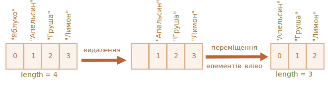

# Масиви

Об’єкти дозволяють зберігати набори значень з ключами. Це чудово.

Але досить часто ми розуміємо, що нам необхідна впорядкована колекція даних, яка складається з 1-го, 2-го, 3-го і т.д. елементів. Наприклад, така колеція може знадобитись для зберігання списку користувачів, товарів, HTML елементів та ін.

Використовувати об’єкти в такому випадку не зручно, тому що вони не надають методів управління порядком елементів. Ми не можемо вставити нову властивість "між" існуючих. Об’єкти просто не призначені для цього.

Для зберігання впорядкованих колекцій існує інший тип даних, який має назву масив, `Array`.

## Оголошення

Існує два типи синтаксу для створення порожнього масиву:

```js
let arr = new Array();
let arr = [];
```

Майже завжди використовують другий тип синтаксису. Ми можемо вказати початкові елементи масиву у квадратних дужках:

```js
let fruits = ["Apple", "Orange", "Plum"];
```

Елементи масиву нумеруються починаючи з нуля.

Ми можемо отримати елемент масиву, вказавши його номер в квадратних дужках:

```js run
let fruits = ["Apple", "Orange", "Plum"];

alert( fruits[0] ); // Apple
alert( fruits[1] ); // Orange
alert( fruits[2] ); // Plum
```

Можемо замінити елемент:

```js
fruits[2] = 'Pear'; // тепер ["Apple", "Orange", "Pear"]
```

...Або додати новий:

```js
fruits[3] = 'Lemon'; // тепер ["Apple", "Orange", "Pear", "Lemon"]
```

Загальна кількість елементів масиву зберігається у його властивості `length`:

```js run
let fruits = ["Apple", "Orange", "Plum"];

alert( fruits.length ); // 3
```

Ми можемо переглянути масив цілком за допомогою `alert`

```js run
let fruits = ["Apple", "Orange", "Plum"];

alert( fruits ); // Apple,Orange,Plum
```

У масивах можуть зберігатись елементи будь-якого типу.

Наприклад:

```js run no-beautify
// різні типи значень
let arr = [ 'Apple', { name: 'John' }, true, function() { alert('hello'); } ];

// отримати елемент з індексом 1 (об’єкт) та вивести його властивість name
alert( arr[1].name ); // John

// отримати елемент з індексом 3 (функція) та виконати її
arr[3](); // hello
```


````smart header="Кома в кінці"
Список елементів масиву, як і список елементів об’єкту може закінчуватись комою:
```js
let fruits = [
  "Apple",
  "Orange",
  "Plum"*!*,*/!*
];
```

Кома в кінці спрощує процес додавання/видалення елементів, тому що всі рядки стають однотипними.
````


## Методи pop/push, shift/unshift

[Черга](https://uk.wikipedia.org/wiki/Черга_(структура_даних)) — один з найбільш популярних варіантів використання об’єкту. У ком’ютерних науках так позначають колекцію елементів, яка підтримує дві операції:

- `push` додає елемент у кінець списку.
- `shift` видаляє елемент на початку, зміщчуючи чергу, таким чином, що 2-й елемент стає 1-м.


Масиви підтримують обидві операції.

На практиці це дуже часто стає у нагоді. Наприклад, черга з повідомлень, які необхідно показувати на екрані.

Існує також інший варіант використання масивів - структура даних, яка називається [стек](https://en.wikipedia.org/wiki/Stack_(abstract_data_type)).

Вона підтримує два типи операцій:

- `push` додає елементи в кінець.
- `pop` видаляє елемент з кінця.

Таким чином нові елементи завжди додаються або видаляються з "кінця".

Хорошим пракладом `стеку` є колода карт: нові карти кладуться на верх і беруться теж зверху:


У стеках  останній доданий елемент повертається першим, цей принцип також називають LIFO (з англ. Last-In-First-Out, "останій прийшов - перший пішов"). Для черг ми використовуємо принцип FIFO (з англ. First-In-First-Out, "перший прийшов - перший пішов").

Масиви в JavaScript можуть працювати як стеки і як черги. Ми можемо додавати/видаляти елементи як на початку так і у кінці масиву.

В комп’ютерних науках структури даних, які дозволяють це робити, мають назву «[двобічна черга](https://uk.wikipedia.org/wiki/Двобічна_черга)».

**Методи, які працюють з кінцем масиву:**

`pop`
: Видаляє останній елемент масиву та повертає його:

    ```js run
    let fruits = ["Apple", "Orange", "Pear"];

    alert( fruits.pop() ); // видаляємо "Pear" та виводимо його

    alert( fruits ); // Apple, Orange
    ```

`push`
: Додає елемент в кінець масиву:

    ```js run
    let fruits = ["Apple", "Orange"];

    fruits.push("Pear");

    alert( fruits ); // Apple, Orange, Pear
    ```

    Виклик `fruits.push(...)` рівнозначний `fruits[fruits.length] = ...`.

**Методи, які працюють з початком масиву:**

`shift`
: Видаляє перший елемент з масиву та повертає його:

    ```js run
    let fruits = ["Apple", "Orange", "Pear"];

    alert( fruits.shift() ); // видаляємо Apple та виводимо його

    alert( fruits ); // Orange, Pear
    ```

`unshift`
: Додає елемент в початок масиву:

    ```js run
    let fruits = ["Orange", "Pear"];

    fruits.unshift('Apple');

    alert( fruits ); // Apple, Orange, Pear
    ```

Методи `push` та `unshift` можуть додавати одразу декілька елементів:

```js run
let fruits = ["Apple"];

fruits.push("Orange", "Peach");
fruits.unshift("Pineapple", "Lemon");

// ["Pineapple", "Lemon", "Apple", "Orange", "Peach"]
alert( fruits );
```

## Внутрішня структура масивів

Масив — це спеціальний вид об’єктів. Квадратні дужки використовують для доступу до властивості `arr[0]`, що в свою чергу прийшло з синтаксису об’єктів. Це теж саме, що доступ до властивості об’єкта `obj[key]`, де `arr` це об’єкт в якому числа використовуються як ключі.

Масиви розширюють функціональність об’єкта тим, що надають можливість працювати з упорядкованими колекціями даних, а також надають доступ до властивості `length`. Але в основі це досі об’єкт.

Запам’ятайте, JavaScript містить лише 8 базових типів даних (більше інформації у розділі [Типи даних](info:types)). Масив — це об’єкт, який поводить себе як об’єкт.

Наприклад, копіюється за посиланням:

```js run
let fruits = ["Banana"]

let arr = fruits; // копіюється за посиланням (дві змінні посилаються на один масив)

alert( arr === fruits ); // true

arr.push("Pear"); // зміна масиву за посиланням

alert( fruits ); // Banana, Pear - наразі два елемента
```

...Але те, що робить масиви дійсно особливими – це їх внутрішнє представлення. Рушій JavaScript намагається зберігати елементи масиву у неперервній області пам’яті, один за одним, як це представлено на ілюстраціях в цьому розділі, а також застосовує інші способи оптимізації, що дозволяють масивам працювати дуже швидко.

Проте масиви втратять всю свою ефективність, якщо ми перестанемо працювати з ними як з "упорядкованою колекцією даних" і почнемо використовувати як звичайний об’єкт.

Наприклад, технічно ми можемо виконати наступне:

```js
let fruits = []; // створюємо масив

fruits[99999] = 5; // створюємо властивість, індекс якої набагато перевищує довжину масиву

fruits.age = 25; // створюємо властивість з довільним ім’ям
```

Це можливо тому, що в основі масивів — об’єкти. Ми можемо додати будь-які властивості до них.

Але рушій зрозуміє, що ми використувуємо масиви, як звичайні об’єкти. Методи оптимізації, які використовуються для масивів в цьому випадку не підходять, тому будуть відключені і не принесуть ніякої користі.

Варіанти неправильного використання масивів:

- Додавання нечислових властивостей, таких як `arr.test = 5`.
- Створення "дірок", наприклад: `arr[0]` а за ним `arr[1000]` (та нічого між цими елементами).
- Заповнення масиву в зворотньому порядку, наприклад: `arr[1000]`, `arr[999]` і т. д.

Будь ласка, думайте про масиви як про особливі структури для роботи з _впорядкованими даними_. Вони надають спеціальні методи для цього. Масиви дуже ретельно налаштовані на роботу з неперервними впорядкованими даними, тому використовуйте їх саме таким чином. Тому, якщо вам необхідні довільні ключі, дуже ймовірно, що вам більше підійдуть звичайні об’єкти `{}`.

## Продуктивність

Методи `push/pop` працюють швидко, на відміну від методів `shift/unshift`, які працюють повільно.


Чому працювати з кінцем масиву швидше, ніж з початком? Давайте переглянемо, що відбувається під час виконання:

```js
fruits.shift(); // видалити один елемент з початку
```

Але недостатньо просто взяти та видалити елемент з номером `0`. Всі інші елементи також необхідно пронумерувати ще раз.

Операція `shift` має виконати 3 дії:

1. Видалити елемент з індексом `0`.
2. Пересунути всі елементи вліво змінивши в них нумерацію - індекс `1` на `0`, `2` на `1` і так далі.
3. Оновити властивість `length`.



**Чим більше елементів у масиві, тим більше часу необхідно для того, щоб пересунути їх, більше операцій з пам’яттю.**

Теж саме відбувається з методом `unshift`: для того, щоб додати елемент в початок масиву, необхідно спочатку перемістити всі елементи масиву вправо збільшуючи їх індекси.

А як щодо методів `push/pop`? Вони нічого не переміщують. Для видалення елементу з кінця масиву метод `pop` очищає індекс та скорочує властивість `length`.

Дії при операції `pop`:

```js
fruits.pop(); // видаляємо один елемент з кінця масиву
```


**Метод `pop` не переміщує нічого, адже кожен елемент зберігає свій індекс. Саме тому цей метод так швидко працює.**

Метод `push` працює аналогічно.

## Цикли

Один з найстаріших методів перебору елементів масиву - це цикл `for` по індексах:

```js run
let arr = ["Apple", "Orange", "Pear"];

*!*
for (let i = 0; i < arr.length; i++) {
*/!*
  alert( arr[i] );
}
```

Але для масивів можливий інший варіант циклу, `for..of`:

```js run
let fruits = ["Apple", "Orange", "Plum"];

// ітерується по елементам масиву
for (let fruit of fruits) {
  alert( fruit );
}
```

Цикл `for..of` не надає доступу до індексу поточного елементу, тільки до його значення, але у більшості випадків цього достатньо. До того ж, це коротше.

Технічно, так як масив це об’єкт, ми можемо використовувати цикл `for..in`:

```js run
let arr = ["Apple", "Orange", "Pear"];

*!*
for (let key in arr) {
*/!*
  alert( arr[key] ); // Apple, Orange, Pear
}
```

Але насправді це погана ідея. Існують потеційні проблеми:

1. Цикл `for..in` ітерується по *всіх властивостях*, не тільки по числових.

    У браузерах та різних програмних середовищах існують масивоподібні об’єкти, *які виглядають як масив*. Тобто вони мають властивість `length` та індекси, проте вони також містять інші нечислові властивості і методи, які нам часто не потрібні. Цикл `for..in` відобразить і їх. Тому, коли нам необхідно працювати з масивами, ці "екстра" властивості можуть стати проблемою.

2. Цикл `for..in` оптимізований для довільних об’єктів, не для масивів, і тому в 10-100 разів повільніше. Звісно, це все одно дуже швидко. Збільшення швидкості виконання має значення лише у *вузьких місцях*. Але ми все одно повинні бути обережні з відмінностями.

Словом, не варто використовувати цикл `for..in` для масивів.


## Декілька слів про "length"

Властивість `length` оновлюється автоматично, коли масив змінився. Якщо бути точнішим, то `length` відображає не кількість елементів в масиві, а індекс останнього елементу плюс один.

Наприклад, один елемент з великим індексом дасть велику довжину:

```js run
let fruits = [];
fruits[123] = "Apple";

alert( fruits.length ); // 124
```

Зверніть увагу, що зазвичай ми не використовуємо масив подібним чином.

Інший цікавий момент стосовно властивості `length` - її можна перезаписати.

Якщо ми вручну збільшимо `length`, нічого цікавого не відбудеться. Але якщо зменшимо, масив стане коротшим. Цей процес незворотній, наприклад:

```js run
let arr = [1, 2, 3, 4, 5];

arr.length = 2; // скорочуємо до двох елементів
alert( arr ); // [1, 2]

arr.length = 5; // повертаємо попередню довжину ...
alert( arr[3] ); // undefined: ..., а видалені значення не повертаються
```

Отож, найпростіший метод очистки масиву це: `arr.length = 0;`.


## new Array() [#new-array]

Існує ще один варіант створення масиву:

```js
let arr = *!*new Array*/!*("Apple", "Pear", "etc");
```

Він використовується рідше, адже квадратні дужки коротші `[]`. А також має певну особливість.

Якщо `new Array` викликається з одним аргументом, а саме числом, він створить порожній масив з довжиною, яка дорівнює *цьому числу*.

Подивімось, як можна завдати собі ведмежої послуги:

```js run
let arr = new Array(2); // чи створиться масив [2] ?

alert( arr[0] ); // undefined! елементи відсутні.

alert( arr.length ); // довжина 2
```

Для того, щоб позбутись таких сюрпризів, як правило, ми використовуємо квадратні дужки `[]`, якщо тільки ми дійсно не маємо причини для використання методу `new Array`.

## Багатовимірні масиви 

Масиви можуть містити елементи, які своєю чергою теж є масивами. Ми можемо використовувати це для створення багатовимірних масивів, наприклад, для зберігання матриць:

```js run
let matrix = [
  [1, 2, 3],
  [4, 5, 6],
  [7, 8, 9]
];

alert( matrix[1][1] ); // 5, центральний елемент
```

## toString

Масиви по-своєму реалізують метод `toString`, який повертає список елементів розділених комою.

Наприклад:


```js run
let arr = [1, 2, 3];

alert( arr ); // 1,2,3
alert( String(arr) === '1,2,3' ); // true
```

Спробуймо це:

```js run
alert( [] + 1 ); // "1"
alert( [1] + 1 ); // "11"
alert( [1,2] + 1 ); // "1,21"
```

Масиви не мають `Symbol.toPrimitive`, або функціонуючого `valueOf`, вони реалізують лише метод `toString` таким чином, що `[]` стає порожнім рядком, `[1]` стає `"1"` або `[1,2]` стає `"1,2"`.

Коли бінарний оператор `"+"` додає щось до рядка, це конвертується в рядок та виглядає наступним чином:

```js run
alert( "" + 1 ); // "1"
alert( "1" + 1 ); // "11"
alert( "1,2" + 1 ); // "1,21"
```

## Не порівнюйте масиви за допомогою `==`

На відміну від інших мов програмування, масиви в JavaScript не варто порівнювати за допомогою оператора `==`.

Цей оператор не має спеціальних методів для опрацювання масивів, тому він працює з ними, як з об’єктами.

Давайте згадаємо правила:

- Два об’єкти рівні `==` лише коли вони посилаються на один об’єкт.
- Якщо один з аргументів оператора `==` об’єкт, а інший — примітив, тоді об’єкт конвертується в примітив. Це пояснюється в розділі <info:object-toprimitive>.
- ...Лише два виключення — це `null` та `undefined`, які рівні `==` один одному та нічому більше.

Строге порівняння `===` ще простіше, тому що не конвертує типи. 

Тому, якщо ми порівнюємо масиви оператором `==`, то вони ніколи не будуть однаковими, за виключенням, коли ми порівнюємо дві змінні, які посилаються на один масив.

Наприклад:
```js run
alert( [] == [] ); // false
alert( [0] == [0] ); // false
```

Технічно ці масиви, це різні об’єкти. Тому вони не рівні. Оператор `==` не порівнює елемент за елементом.

Порівняння масиву з примітивами теж може дати досить цікаві результати:

```js run
alert( 0 == [] ); // true

alert('0' == [] ); // false
```

В обох випадках ми порівнювали примітиви з масивом. Під час порівняння, масив `[]` конвертується в примітив і стає порожнім рядком `''`. 

Далі відбувається порівняння примітивів. Логіка такого порівняння описана в розділі <info:type-conversions>:

```js run
// після того, як [] було сконвертовано в ''
alert( 0 == '' ); // true, тому що '' конвертується в число 0

alert('0' == '' ); // false, тут немає конвертації типів; це різні рядки
```

Тож, як порівнювати масиви?

Все просто: не використовуйте оператор `==`. Натомість, порівнюйте їх в циклі, елемент за елементом. Також можна використати методи перебору, про які написано в наступному розділі.

## Підсумки

Масив — це особливий вид об’єкту, створений для зберігання та обробки _впорядкованих елементів_.

- Оголошення:

    ```js
    // квадратні дужки (як правило)
    let arr = [item1, item2...];

    // new Array (набагато рідше)
    let arr = new Array(item1, item2...);
    ```

    Виклик `new Array(number)` створює масив з заданою довжиною, але без елементів.

- Властивість `length` демонструє довжину масиву або, якщо точніше, останній цифровий індекс масиву плюс один. Це виконується автоматично методами масиву.
- Якщо ми вручну скорочуємо `length`, масив зменшується (нагадаємо, що ця операція незворотня).

Ми можемо використовувати масив як двосторонню чергу за допомогою наступних оперцій:

- `push(...items)` додає `items` в кінець масиву.
- `pop()` видаляє елемент з кінця масиву та повертає його.
- `shift()` видаляє елемент з початку масиву та повертає його.
- `unshift(...items)` додає `items` в початок масиву.

Для того, щоб пройтись циклом по елементах масиву:
  - `for (let i=0; i<arr.length; i++)` — працює швидше, сумісний зі старими браузерами.
  - `for (let item of arr)` — новий синтаксис, лише для значень елементів (відсутній доступ до індексів масиву).
  - `for (let i in arr)` — ніколи не використовуйте!

Для порівняння масивів, не використовуйте оператор `==` (так само, як `>`, `<` та інші), тому що в них немає спеціальних методів для порівнювання масивів. Ці оператори працюють з масивами як з об’єктами, а це не те, що нам потрібно.

Натомість, для порівняння масивів використовуйте цикл `for..of`, щоб порівнювати елемент за елементом.

Ми повернемось до масивів та вивчимо методи додавання, видалення, відокремлення елементів та сортування масивів в розділі <info:array-methods>.
