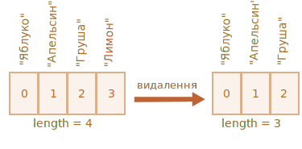

# Масиви

Об'єкти дозволяють зберігати набори значень з ключами. Це чудово.

Але досить часто ми розуміємо, що нам необхідна впорядкована колекція даних, яка складається з 1-го, 2-го, 3-го тощо елементів. Наприклад, така колекція може знадобитись для зберігання списку користувачів, товарів, HTML елементів та ін.

Використовувати об'єкти в такому випадку не зручно, тому що вони не надають методів управління порядком елементів. Ми не можемо вставити нову властивість "між" тих, що вже існують. Об'єкти просто не призначені для цього.

Для зберігання впорядкованих колекцій існує інший тип даних, який має назву масив, `Array`.

## Оголошення

Існує два типи синтаксису для створення порожнього масиву:

```js
let arr = new Array();
let arr = [];
```

Майже завжди використовують другий тип синтаксису. Ми можемо вказати початкові елементи масиву у квадратних дужках:

```js
let fruits = ["Яблуко", "Апельсин", "Слива"];
```

Елементи масиву нумеруються починаючи з нуля.

Ми можемо отримати елемент масиву, вказавши його номер у квадратних дужках:

```js run
let fruits = ["Яблуко", "Апельсин", "Слива"];

alert( fruits[0] ); // Яблуко
alert( fruits[1] ); // Апельсин
alert( fruits[2] ); // Слива
```

Можемо замінити елемент:

```js
fruits[2] = 'Груша'; // тепер ["Яблуко", "Апельсин", "Груша"]
```

...Або додати новий:

```js
fruits[3] = 'Лимон'; // тепер ["Яблуко", "Апельсин", "Груша", "Лимон"]
```

Загальна кількість елементів масиву зберігається у його властивості `length`:

```js run
let fruits = ["Яблуко", "Апельсин", "Слива"];

alert( fruits.length ); // 3
```

Ми можемо переглянути масив цілком за допомогою `alert`

```js run
let fruits = ["Яблуко", "Апельсин", "Слива"];

alert( fruits ); // Яблуко,Апельсин,Слива
```

У масивах можуть зберігатись елементи будь-якого типу.

Наприклад:

```js run no-beautify
// різні типи значень
let arr = [
  'Яблуко',
  { name: 'Микола' },
  true,
  function() { alert('привіт'); }
];

// отримати елемент з індексом 1 (об'єкт) та вивести його властивість name
alert( arr[1].name ); // Микола

// отримати елемент з індексом 3 (функція) та виконати її
arr[3](); // привіт
```


````smart header="Кома в кінці"
Список елементів масиву, як і список елементів об'єкта може закінчуватись комою:
```js
let fruits = [
  "Яблуко",
  "Апельсин",
  "Слива"*!*,*/!*
];
```

Кома в кінці рядка спрощує процес додавання/видалення елементів, тому що всі рядки стають однотипними.
````

## Отримати останні елементи за допомогою "at"

[recent browser="new"]

Скажімо, нам потрібен останній елемент масиву.

Деякі мови програмування дозволяють використовувати від'ємні індекси з цією ж метою, наприклад, `fruits[-1]`.

Проте в JavaScript це не працюватиме. Результат буде `undefined`, оскільки індекс у квадратних дужках трактується буквально.

Ми можемо явно обчислити індекс останнього елемента, а потім отримати до нього доступ: `fruits[fruits.length - 1]`.

```js run
let fruits = ["Яблуко", "Апельсин", "Слива"];

alert( fruits[fruits.length-1] ); // Слива
```

Трохи громіздко, чи не так? Нам потрібно двічі написати ім'я змінної.

На щастя, є коротший синтаксис: `fruits.at(-1)`:

```js run
let fruits = ["Яблуко", "Апельсин", "Слива"];

// те саме, що й fruits[fruits.length-1]
alert( fruits.at(-1) ); // Слива
```

Інакше кажучи, `arr.at(i)`:
- те саме, що й `arr[i]`, якщо `i >= 0`.
- для від'ємних значень `i` він шукає елемент відступаючи від кінця масиву.

## Методи pop/push, shift/unshift

[Черга](https://uk.wikipedia.org/wiki/Черга_(структура_даних)) -- один з найбільш популярних варіантів використання об'єкта. У комп'ютерних науках так позначають колекцію елементів, яка підтримує дві операції:

- `push` додає елемент у кінець списку.
- `shift` видаляє елемент на початку, зміщуючи чергу, таким чином, що 2-й елемент стає 1-м.


Масиви підтримують обидві операції.

На практиці це дуже часто стає у пригоді. Наприклад, черга з повідомлень, які необхідно показувати на екрані.

Існує також інший варіант використання масивів -- структура даних, яка називається [стек](https://en.wikipedia.org/wiki/Stack_(abstract_data_type)).

Вона підтримує два типи операцій:

- `push` додає елементи в кінець.
- `pop` видаляє елемент з кінця.

Таким чином нові елементи завжди додаються або видаляються з "кінця".

Хорошим прикладом `стеку` є колода карт: нові карти кладуться на верх і беруться теж зверху:


У стеках -- останній доданий елемент повертається першим, цей принцип також називають LIFO (з англ. Last-In-First-Out, "останній прийшов -- перший пішов"). Для черг ми використовуємо принцип FIFO (з англ. First-In-First-Out, "перший прийшов -- перший пішов").

Масиви в JavaScript можуть працювати як стеки і як черги. Ми можемо додавати/видаляти елементи як на початку, так і у кінці масиву.

В комп'ютерних науках структури даних, які дозволяють це робити, мають назву [двобічна черга](https://uk.wikipedia.org/wiki/Двобічна_черга).

**Методи, які працюють з кінцем масиву:**

`pop`
: Видаляє останній елемент масиву та повертає його:

    ```js run
    let fruits = ["Яблуко", "Апельсин", "Груша"];

    alert( fruits.pop() ); // видаляємо "Груша" та виводимо його

    alert( fruits ); // Яблуко,Апельсин
    ```

    Що `fruits.pop()`, що `fruits.at(-1)` -- обидва повертають останній елемент масиву, але `fruits.pop()` також змінює масив, видаляючи його.

`push`
: Додає елемент в кінець масиву:

    ```js run
    let fruits = ["Яблуко", "Апельсин"];

    fruits.push("Груша");

    alert( fruits ); // Яблуко,Апельсин,Груша
    ```

    Виклик `fruits.push(...)` рівнозначний `fruits[fruits.length] = ...`.

**Методи, які працюють з початком масиву:**

`shift`
: Видаляє перший елемент з масиву та повертає його:

    ```js run
    let fruits = ["Яблуко", "Апельсин", "Груша"];

    alert( fruits.shift() ); // видаляємо "Яблуко" та виводимо його

    alert( fruits ); // Апельсин,Груша
    ```

`unshift`
: Додає елемент в початок масиву:

    ```js run
    let fruits = ["Апельсин", "Груша"];

    fruits.unshift('Яблуко');

    alert( fruits ); // Яблуко,Апельсин,Груша
    ```

Методи `push` та `unshift` можуть додавати одразу декілька елементів:

```js run
let fruits = ["Яблуко"];

fruits.push("Апельсин", "Персик"); // ["Яблуко", "Апельсин", "Персик"]
fruits.unshift("Ананас", "Лимон");

// ["Ананас", "Лимон", "Яблуко", "Апельсин", "Персик"]
alert( fruits );
```

## Внутрішня структура масивів

Масив -- це спеціальний вид об'єктів. Квадратні дужки використовують для доступу до властивості `arr[0]`, що своєю чергою прийшло з синтаксису об'єктів. Це теж саме, що доступ до властивості об'єкта `obj[key]`, де `arr` це об'єкт в якому числа використовуються як ключі.

Масиви розширюють функціональність об'єкта тим, що надають можливість працювати з упорядкованими колекціями даних, а також надають доступ до властивості `length`. Але в основі це досі об'єкт.

Запам'ятайте, JavaScript містить лише 8 базових типів даних (більше інформації у розділі [Типи даних](info:types)). Масив -- це об'єкт, тому він поводить себе як об'єкт.

Наприклад, копіюється за посиланням:

```js run
let fruits = ["Банан"]

let arr = fruits; // копіюється за посиланням (дві змінні посилаються на один масив)

alert( arr === fruits ); // true

arr.push("Груша"); // зміна масиву за посиланням

alert( fruits ); // "Банан", "Груша" -- наразі два елементи
```

...Але те, що робить масиви дійсно особливими –- це їх внутрішнє представлення. Рушій JavaScript намагається зберігати елементи масиву у неперервній області пам'яті, один за одним, як це представлено на ілюстраціях в цьому розділі, а також застосовує інші способи оптимізації, що дозволяють масивам працювати дуже швидко.

Проте масиви втратять всю свою ефективність, якщо ми перестанемо працювати з ними як з "упорядкованою колекцією даних" і почнемо використовувати як звичайний об'єкт.

Наприклад, технічно ми можемо виконати наступне:

```js
let fruits = []; // створюємо масив

fruits[99999] = 5; // створюємо властивість, індекс якої набагато перевищує довжину масиву

fruits.age = 25; // створюємо властивість з довільним ім'ям
```

Це можливо тому, що в основі масивів -- об'єкти. Ми можемо додати будь-які властивості до них.

Але рушій зрозуміє, що ми використовуємо масиви, як звичайні об'єкти. Методи оптимізації, які використовуються для масивів в цьому випадку не підходять, тому вони будуть відключені та не принесуть ніякої користі.

Варіанти неправильного використання масивів:

- Додавання нечислових властивостей, таких як `arr.test = 5`.
- Створення "дірок", наприклад: `arr[0]`, а за ним `arr[1000]` (та нічого між цими елементами).
- Заповнення масиву у зворотному порядку, наприклад: `arr[1000]`, `arr[999]` тощо.

Будь ласка, думайте про масиви як про особливі структури для роботи з _впорядкованими даними_. Вони надають спеціальні методи для цього. Масиви дуже ретельно налаштовані на роботу з неперервними впорядкованими даними, тому використовуйте їх саме таким чином. Тому, якщо вам необхідні довільні ключі, дуже ймовірно, що вам більше підійдуть звичайні об'єкти `{}`.

## Продуктивність

Методи `push/pop` працюють швидко, на відміну від методів `shift/unshift`, які працюють повільно.


Чому працювати з кінцем масиву швидше, ніж з початком? Перегляньмо, що відбувається під час виконання:

```js
fruits.shift(); // видалити один елемент з початку
```

Але недостатньо просто взяти та видалити елемент з номером `0`. Всі інші елементи також необхідно пронумерувати ще раз.

Операція `shift` має виконати 3 дії:

1. Видалити елемент з індексом `0`.
2. Перемістити всі елементи вліво змінивши в них нумерацію -- індекс `1` на `0`, `2` на `1` і так далі.
3. Оновити властивість `length`.


**Чим більше елементів у масиві, тим більше часу необхідно для того, щоб перемістити їх, більше операцій з пам'яттю.**

Теж саме відбувається з методом `unshift`: для того, щоб додати елемент в початок масиву, необхідно спочатку перемістити всі елементи масиву вправо збільшуючи їх індекси.

А як щодо методів `push/pop`? Вони нічого не переміщують. Для видалення елементу з кінця масиву метод `pop` очищає індекс та скорочує властивість `length`.

Дії при операції `pop`:

```js
fruits.pop(); // видаляємо один елемент з кінця масиву
```



**Метод `pop` не переміщує нічого, адже кожен елемент зберігає свій індекс. Саме тому цей метод так швидко працює.**

Метод `push` працює аналогічно.

## Цикли

Один з найстаріших методів перебору елементів масиву -- це цикл `for` по індексах:

```js run
let arr = ["Яблуко", "Апельсин", "Груша"];

*!*
for (let i = 0; i < arr.length; i++) {
*/!*
  alert( arr[i] );
}
```

Але для масивів можливий інший варіант циклу, `for..of`:

```js run
let fruits = ["Яблуко", "Апельсин", "Слива"];

// ітерується по елементах масиву
for (let fruit of fruits) {
  alert( fruit );
}
```

Цикл `for..of` не надає доступу до індексу поточного елементу, тільки до його значення, але у більшості випадків цього достатньо. До того ж це коротше.

Технічно, оскільки масив це об'єкт, ми можемо використовувати цикл `for..in`:

```js run
let arr = ["Яблуко", "Апельсин", "Груша"];

*!*
for (let key in arr) {
*/!*
  alert( arr[key] ); // Яблуко, Апельсин, Груша
}
```

Але насправді це погана ідея. Існують потенційні проблеми:

1. Цикл `for..in` ітерується по *всіх властивостях*, не тільки по числових.

    У браузерах та різних програмних середовищах існують масивоподібні об'єкти, *які виглядають як масив*. Тобто вони мають властивість `length` та індекси, проте вони також містять інші нечислові властивості та методи, які нам часто не потрібні. Цикл `for..in` відобразить і їх. Тому, коли нам необхідно працювати з масивами, ці "екстра" властивості можуть стати проблемою.

2. Цикл `for..in` оптимізований для довільних об'єктів, не для масивів, і тому працює в 10-100 разів повільніше. Звісно, це все одно дуже швидко. Збільшення швидкості виконання має значення лише у *вузьких місцях*. Але ми все одно повинні бути обережні з відмінностями.

Словом, не варто використовувати цикл `for..in` для масивів.


## Декілька слів про "length"

Властивість `length` оновлюється автоматично, коли масив змінився. Якщо бути точнішим, то `length` відображає не кількість елементів в масиві, а індекс останнього елементу плюс один.

Наприклад, один елемент з великим індексом дасть велику довжину:

```js run
let fruits = [];
fruits[123] = "Яблуко";

alert( fruits.length ); // 124
```

Зверніть увагу, що зазвичай ми не використовуємо масив подібним чином.

Інший цікавий момент стосовно властивості `length` -- її можна перезаписати.

Якщо ми вручну збільшимо `length`, нічого цікавого не відбудеться. Але якщо зменшимо, масив стане коротшим. Цей процес незворотній, наприклад:

```js run
let arr = [1, 2, 3, 4, 5];

arr.length = 2; // скорочуємо до двох елементів
alert( arr ); // [1, 2]

arr.length = 5; // повертаємо попередню довжину ...
alert( arr[3] ); // undefined: ..., а видалені значення не повертаються
```

Отож, найпростіший метод очищення масиву це: `arr.length = 0;`.


## new Array() [#new-array]

Існує ще один варіант створення масиву:

```js
let arr = *!*new Array*/!*("Яблуко", "Груша", "etc");
```

Він використовується рідше, адже використання квадратних дужок `[]` більш зручний спосіб. Крім того, `new Array` має певну особливість.

Якщо `new Array` викликається з одним аргументом, а саме числом, він створить порожній масив з довжиною, яка дорівнює *цьому числу*.

Подивімось, як можна завдати собі ведмежої послуги:

```js run
let arr = new Array(2); // чи створиться масив [2] ?

alert( arr[0] ); // undefined! елементи відсутні

alert( arr.length ); // довжина 2
```

Для того, щоб позбутись таких сюрпризів, ми використовуємо квадратні дужки `[]`, якщо тільки ми дійсно не маємо причини для використання методу `new Array`.

## Багатовимірні масиви 

Масиви можуть містити елементи, які своєю чергою теж є масивами. Ми можемо використовувати це для створення багатовимірних масивів, наприклад, для зберігання матриць:

```js run
let matrix = [
  [1, 2, 3],
  [4, 5, 6],
  [7, 8, 9]
];

<<<<<<< HEAD
alert( matrix[1][1] ); // 5, центральний елемент
=======
alert( matrix[0][1] ); // 2, the second value of the first inner array
>>>>>>> 5e893cffce8e2346d4e50926d5148c70af172533
```

## toString

Масиви по-своєму реалізують метод `toString`, який повертає список елементів розділених комою.

Наприклад:


```js run
let arr = [1, 2, 3];

alert( arr ); // 1,2,3
alert( String(arr) === '1,2,3' ); // true
```

Спробуймо це:

```js run
alert( [] + 1 ); // "1"
alert( [1] + 1 ); // "11"
alert( [1,2] + 1 ); // "1,21"
```

Масиви не мають `Symbol.toPrimitive`, або робочого `valueOf`, вони реалізують лише метод `toString` таким чином, що `[]` стає порожнім рядком, `[1]` стає `"1"` або `[1,2]` стає `"1,2"`.

Коли бінарний оператор `"+"` додає щось до рядка, це конвертується в рядок та виглядає наступним чином:

```js run
alert( "" + 1 ); // "1"
alert( "1" + 1 ); // "11"
alert( "1,2" + 1 ); // "1,21"
```

## Не порівнюйте масиви за допомогою `==`

На відміну від інших мов програмування, масиви в JavaScript не варто порівнювати за допомогою оператора `==`.

Цей оператор не має спеціальних методів для опрацювання масивів, тому він працює з ними, як з об'єктами.

Згадаймо правила:

- Два об'єкти рівні `==` лише коли вони посилаються на один об'єкт.
- Якщо один з аргументів оператора `==` об'єкт, а інший -- примітив, тоді об'єкт конвертується в примітив. Це пояснюється в розділі <info:object-toprimitive>.
- ...Лише два виключення -- це `null` та `undefined`, які рівні `==` один одному та нічому більше.

Строге порівняння `===` ще простіше, тому що не конвертує типи. 

Тому, якщо ми порівнюємо масиви оператором `==`, то вони ніколи не будуть однаковими, за виключенням, коли ми порівнюємо дві змінні, які посилаються на один масив.

Наприклад:
```js run
alert( [] == [] ); // false
alert( [0] == [0] ); // false
```

Технічно ці масиви є різними об'єктами. Тому вони не рівні. Оператор `==` не порівнює елемент за елементом.

Порівняння масиву з примітивами теж може дати досить цікаві результати:

```js run
alert( 0 == [] ); // true

alert('0' == [] ); // false
```

В обох випадках ми порівнювали примітиви з масивом. Масив `[]` задля порівняння конвертується в примітив і стає порожнім рядком `''`. 

Далі відбувається порівняння примітивів. Логіка такого порівняння описана в розділі <info:type-conversions>:

```js run
// після того, як [] було конвертовано в ''
alert( 0 == '' ); // true, тому що '' конвертується в число 0

alert('0' == '' ); // false, тут немає конвертації типів; це різні рядки
```

Тож, як порівнювати масиви?

Все просто: не використовуйте оператор `==`. Натомість порівнюйте їх в циклі, елемент за елементом. Також можна використати методи перебору, про які написано в наступному розділі.

## Підсумки

Масив -- це особливий вид об'єкта, створений для зберігання та обробки _впорядкованих елементів_.

Оголошення масиву:

```js
// квадратні дужки (як правило)
let arr = [item1, item2...];

// new Array (набагато рідше)
let arr = new Array(item1, item2...);
```

Виклик `new Array(number)` створює масив з заданою довжиною, але без елементів.

- Властивість `length` демонструє довжину масиву або, якщо точніше, останній цифровий індекс масиву плюс один. Це виконується автоматично методами масиву.
- Якщо ми вручну скорочуємо `length`, масив зменшується (нагадаємо, що ця операція незворотна).

Отримання елементів:

- ми можемо отримати елемент за його індексом, ось так `arr[0]`
- також ми можемо використати метод `at(i)`, який допускає від'ємні індекси. Для від'ємних значень `i` він відступає від кінця масиву. Якщо `i >= 0`, він працює так само як `arr[i]`.

Ми можемо використовувати масив як двосторонню чергу за допомогою наступних операцій:

- `push(...items)` додає `items` в кінець масиву.
- `pop()` видаляє елемент з кінця масиву та повертає його.
- `shift()` видаляє елемент з початку масиву та повертає його.
- `unshift(...items)` додає `items` в початок масиву.

Для того, щоб пройтись циклом по елементах масиву:
  - `for (let i=0; i<arr.length; i++)` -- працює швидше, сумісний зі старими браузерами.
  - `for (let item of arr)` -- новий синтаксис, лише для значень елементів (відсутній доступ до індексів масиву).
  - `for (let i in arr)` -- ніколи не використовуйте!

Для порівняння масивів, не використовуйте оператор `==` (так само як `>`, `<` та інші), тому що в них немає спеціальних методів для порівнювання масивів. Ці оператори працюють з масивами як з об'єктами, а це не те, що нам потрібно.

Натомість для порівняння масивів використовуйте цикл `for..of`, щоб порівнювати елемент за елементом.

Ми повернемось до масивів та вивчимо методи додавання, видалення, відокремлення елементів та сортування масивів в розділі <info:array-methods>.
