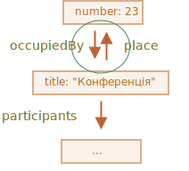

# Методи JSON, toJSON

Скажімо, у нас є складний об’єкт, і ми хотіли б перетворити його в рядок, щоб відправити його через мережу або просто вивести його для цілей логування.

Безумовно, такий рядок повинен включати всі важливі властивості.

Ми могли б реалізувати перетворення, наступним чином:

```js run
let user = {
  name: "Іван",
  age: 30,

*!*
  toString() {
    return `{name: "${this.name}", age: ${this.age}}`;
  }
*/!*
};

alert(user); // {name: "Іван", age: 30}
```

... Але в процесі розробки додаються нові властивості, старі властивості перейменовуються та видаляються. Оновлення такого `toString` кожен раз може стати проблемою. Ми могли б спробувати проходити в циклі над властивостями в об’єкті, але що, якщо об’єкт є складним і має вкладені об’єкти у властивостях? Ми також повинні реалізувати їх перетворення.

На щастя, нема потреби писати код для обробки всього цього. Завдання вже вирішено.

## JSON.stringify

[JSON](https://uk.wikipedia.org/wiki/JSON) (JavaScript Object Notation) -- це загальний формат, який представляє значення та об’єкти. Він описується у [стандарті RFC 4627](https://datatracker.ietf.org/doc/html/rfc4627). Спочатку він був розроблений для JavaScript, але багато інших мов мають бібліотеки, щоб обробляють його також. Тому легко використовувати JSON для обміну даними, коли клієнт використовує JavaScript, а сервер написаний на Ruby/PHP/Java тощо.

JavaScript надає методи:

- `JSON.stringify` для перетворення об’єктів в JSON (у вигляді тексту).
- `JSON.parse` для перетворення JSON-тексту назад в об’єкт.

Наприклад, тут ми викликаємо `JSON.stringify` з об’єктом `student`:
```js run
let student = {
  name: 'Іван',
  age: 30,
  isAdmin: false,
  courses: ['html', 'css', 'js'],
  wife: null
};

*!*
let json = JSON.stringify(student);
*/!*

alert(typeof json); // ми отримали рядок!

alert(json);
*!*
/* JSON-кодований об’єкт:
{
  "name": "Іван",
  "age": 30,
  "isAdmin": false,
  "courses": ["html", "css", "js"],
  "wife": null
}
*/
*/!*
```

Метод `JSON.stringify(student)` бере об’єкт і перетворює його в рядок.

Отриманий `json` рядок називається *JSON-кодованим* або *серіалізованим* об’єктом. Ми готові відправити його по мережі або покласти в просте сховище даних.


Будь ласка, зверніть увагу, що JSON-кодований об’єкт має кілька важливих відмінностей від літерального об’єкта:

- Рядки використовують подвійні лапки. Немає одиничних або зворотніх лапок у JSON. Отже, `'Іван'` стає `'Іван'`.
- Назви властивостей об’єкта також обертаються в подвійні лапки. Це обов’язково. Отже, `age:30` стає `"age":30`.

`JSON.stringify` можна застосувати до примітивів.

JSON підтримує наступні типи даних:

- Об’єкти `{ ... }`
- Масиви `[ ... ]`
- Примітиви:
    - рядки,
    - числа,
    - бульові значення `true/false`,
    - `null`.

Наприклад:

```js run
// число JSON це просто число
alert( JSON.stringify(1) ) // 1

// рядок в JSON -- це ще рядок, але обернутий в подвійні лапки
alert( JSON.stringify('test') ) // "test"

alert( JSON.stringify(true) ); // true

alert( JSON.stringify([1, 2, 3]) ); // [1,2,3]
```

JSON -- це лише незалежна специфікація даних, тому деякі притаманні для JavaScript властивості об’єктів пропускаються в `JSON.stringify`.

А саме:

- Функціональні властивості (методи).
- Символьні ключі та значення.
- Властивості, що зберігають `undefined`.

```js run
let user = {
  sayHi() { // ігнорується
    alert("Hello");
  },
  [Symbol("id")]: 123, // ігнорується
  something: undefined // ігнорується
};

alert( JSON.stringify(user) ); // {} (порожній об’єкт)
```

Зазвичай це добре. Якщо це не те, чого ми хочемо, то скоро ми побачимо, як налаштувати процес.

Чудово, що вкладені об’єкти підтримуються та перетворюються автоматично.

Наприклад:

```js run
let meetup = {
  title: "Конференція",
*!*
  room: {
    number: 23,
    participants: ["Іван", "Анна"]
  }
*/!*
};

alert( JSON.stringify(meetup) );
/* Вся структура серіалізується:
{
  "title":"Конференція",
  "room":{"number":23,"participants":["Іван","Анна"]},
}
*/
```

Важливі обмеження: не повинно бути жодних циклічних посилань.

Наприклад:

```js run
let room = {
  number: 23
};

let meetup = {
  title: "Конференція",
  participants: ["Іван", "Анна"]
};

meetup.place = room;      // meetup посилається на room
room.occupiedBy = meetup; // room посилається на meetup

*!*
JSON.stringify(meetup); // Помилка: Конвертування циклічних структур в JSON
*/!*
```

Тут перетворення не вдається через циклічні посилання: `room.occupiedBy`, яке посилається на `meetup`, і `metup.place`, яке посилається на `room`:




## За винятком та трансформацією: Замінник

Повний синтаксис `JSON.stringify`:

```js
let json = JSON.stringify(value[, replacer, space])
```

value
: Значення для кодування.

replacer
: Масив властивостей для кодування або функція відображення `function(key, value)`.

space
: Кількість пробілів для форматування

Зазвичай, `JSON.stringify` використовується лише з першим аргументом. Але якщо нам потрібно добре налаштувати процес заміни, наприклад, якщо ми хочемо відфільтрувати циклічні посилання, то ми можемо використовувати другий аргумент `JSON.stringify`.

Якщо ми передаємо йому масив властивостей, то будуть закодовані лише ці властивості.

Наприклад:

```js run
let room = {
  number: 23
};

let meetup = {
  title: "Конференція",
  participants: [{name: "Іван"}, {name: "Аліна"}],
  place: room // meetup посилається на room
};

room.occupiedBy = meetup; // room посилається на meetup

alert( JSON.stringify(meetup, *!*['title', 'participants']*/!*) );
// {"title":"Конференція","participants":[{},{}]}
```

Тут ми, мабуть, занадто суворі. Список властивостей застосовується до всієї структури об’єкта. Отже, об’єкти в `participants` будуть порожніми, тому що `name` не в списку.

Включімо в список кожної власності, крім `room.occupiedBy`, що призведе до циклічного посилання:

```js run
let room = {
  number: 23
};

let meetup = {
  title: "Конференція",
  participants: [{name: "Іван"}, {name: "Аліна"}],
  place: room // meetup посилається на room
};

room.occupiedBy = meetup; // room посилається на meetup

alert( JSON.stringify(meetup, *!*['title', 'participants', 'place', 'name', 'number']*/!*) );
/*
{
  "title":"Конференція",
  "participants":[{"name":"Іван"},{"name":"Аліна"}],
  "place":{"number":23}
}
*/
```

Тепер все, крім `occupiedBy`, серіалізується. Але список властивостей досить довгий.

На щастя, ми можемо використовувати функцію замість масиву, в якості `raplacer`.

Функція буде викликана для кожного `(key, value)`, і повинна повернути значення "replaced", яке буде використовуватися замість оригінального. Або `undefined`, якщо значення буде пропущено.

У нашому випадку ми можемо повернути `value` "як є" для всього, крім `occupiedBy`. Щоб ігнорувати `occupiedBy`, код нижче повертає `undefined`:

```js run
let room = {
  number: 23
};

let meetup = {
  title: "Конференція",
  participants: [{name: "Іван"}, {name: "Аліна"}],
  place: room // meetup посилається на room
};

room.occupiedBy = meetup; // room посилається на meetup

alert( JSON.stringify(meetup, function replacer(key, value) {
  alert(`${key}: ${value}`);
  return (key == 'occupiedBy') ? undefined : value;
}));

/* key:value pairs that come to replacer:
:             [object Object]
title:        Конференція
participants: [object Object],[object Object]
0:            [object Object]
name:         Іван
1:            [object Object]
name:         Аліна
place:        [object Object]
number:       23
occupiedBy: [object Object]
*/
```

Будь ласка, зверніть увагу, що функція `replacer` отримує кожну пару ключ/значення, включаючи вкладені об’єкти та елементи масиву. Він застосовується рекурсивно. Значення `this` всередині `raplacer` -- це об’єкт, який містить поточну властивість.

Перший виклик особливий. Він зроблений з використанням спеціального "об’єкта обгортки": `{"": meetup}`. Іншими словами, перша пара `(key, value)` має порожній ключ, а значення є цільовим об’єктом загалом. Ось чому перший рядок -- `":[object Object]"` в прикладі вище.

Ідея полягає в тому, щоб забезпечити якомога більше потужності для функції `replacer`: вона має можливість аналізувати та замінити/пропустити навіть весь об’єкт, якщо це необхідно.


## Форматування: пробіл

Третій аргумент `JSON.stringify(value, replacer, space)` -- це кількість пробілів, що використовуються для гарного форматування.

Раніше всі розтягнуті об’єкти не мали відступу та додаткових пробілів. Це добре, якщо ми хочемо надіслати об’єкт через мережу. Аргумент `space` використовується виключно для виводу в зручному для читання вигляді.

Тут `space = 2` указує JavaScript показати вкладені об’єкти на декількох рядках, з відступом у 2 пробіли всередині об’єкта:

```js run
let user = {
  name: "Іван",
  age: 25,
  roles: {
    isAdmin: false,
    isEditor: true
  }
};

alert(JSON.stringify(user, null, 2));
/* відступ в 2 пробіли:
{
  "name": "Іван",
  "age": 25,
  "roles": {
    "isAdmin": false,
    "isEditor": true
  }
}
*/

/* для JSON.stringify(user, null, 4) результат містить більше пробілів:
{
    "name": "Іван",
    "age": 25,
    "roles": {
        "isAdmin": false,
        "isEditor": true
    }
}
*/
```

Третій аргумент також може бути рядок. У цьому випадку рядок використовується для відступу замість числа пробілів.

Параметр `space` використовується виключно для логування та гарного виводу.

## Спеціальний "toJSON"

Подібно до методу `toString` (для перетворення об’єкта в рядок), об’єкт також має метод `toJSON` для його перетворення в JSON. Функція `Json.stringify` автоматично викликає цей метод.

Наприклад:

```js run
let room = {
  number: 23
};

let meetup = {
  title: "Конференція",
  date: new Date(Date.UTC(2017, 0, 1)),
  room
};

alert( JSON.stringify(meetup) );
/*
  {
    "title":"Конференція",
*!*
    "date":"2017-01-01T00:00:00.000Z",  // (1)
*/!*
    "room": {"number":23}               // (2)
  }
*/
```

Тут ми бачимо, що `date` `(1)` став рядком. Це тому, що всі дати мають вбудований метод `toJSON`, який повертає такий рядок в такому вигляді.

Тепер додаймо спеціальний `toJSON` для нашого об’єкта `room` `(2)`:

```js run
let room = {
  number: 23,
*!*
  toJSON() {
    return this.number;
  }
*/!*
};

let meetup = {
  title: "Конференція",
  room
};

*!*
alert( JSON.stringify(room) ); // 23
*/!*

alert( JSON.stringify(meetup) );
/*
  {
    "title":"Конференція",
*!*
    "room": 23
*/!*
  }
*/
```

Як бачимо, `toJSON` використовується як для прямого виклику `JSON.stringify(room)`, а також коли властивість `room` вкладена в іншому закодованому об’єкті.


## JSON.parse

Щоб декодувати JSON-рядок, нам потрібен інший метод, що називається [JSON.parse](mdn:js/JSON/parse).

Синтаксис:
```js
let value = JSON.parse(str, [reviver]);
```

str
: JSON-рядок для перетворення в об’єкт.

reviver
: Необов’язкова функція, яка буде викликана для кожного `(key, value)` та може перетворювати значення.

Наприклад:

```js run
// масив у вигляді рядка
let numbers = "[0, 1, 2, 3]";

numbers = JSON.parse(numbers);

alert( numbers[1] ); // 1
```

Or for nested objects:

```js run
let userData = '{ "name": "Іван", "age": 35, "isAdmin": false, "friends": [0,1,2,3] }';

let user = JSON.parse(userData);

alert( user.friends[1] ); // 1
```

JSON може бути настільки складним, наскільки це необхідно, об’єкти та масиви можуть включати інші об’єкти та масиви. Але вони повинні дотримуватися того ж формату JSON.

Ось типові помилки в рукописному JSON (іноді ми повинні писати його для знаходження помилок):

```js
let json = `{
  *!*name*/!*: "Іван",                     // помилка: ім'я власності без лапок
  "surname": *!*'Smith'*/!*,               // помилка: одинарні лапки для значень (повинні бути подвійними)
  *!*'isAdmin'*/!*: false                  // помилка: одинарні лапки для ключей (повинні бути подвійними)
  "birthday": *!*new Date(2000, 2, 3)*/!*, // помилка: не дозволяється конструктор "new", тільки значення
  "friends": [0,1,2,3]              // тут все добре
}`;
```

Крім того, JSON не підтримує коментарі. Додавання коментаря до JSON робить його недійсним.

Існує інший формат, який називається [JSON5](http://json5.org/), що підтримує ключі не обернені в лапки, коментарі тощо. Але це окрема бібліотека, а не частина специфікації мови.

Звичайний JSON є настільки строгим не тому, що її розробники ледачі, а тому, що дозволяє легко, надійно та дуже швидко реалізувати алгоритм кодування та читання.

## Використання функції відновлення

Уявіть, що ми отримали серіалізований об’єкт `metchup` з сервера.

Це виглядає так:

```js
// title: (meetup title), date: (meetup date)
let str = '{"title":"Конференція","date":"2017-11-30T12:00:00.000Z"}';
```

...І тепер нам потрібно *десеріалізувати* цей об’єкт, щоб перетворити його в об’єкт JavaScript.

Зробімо це, викликавши `JSON.parse`:

```js run
let str = '{"title":"Конференція","date":"2017-11-30T12:00:00.000Z"}';

let meetup = JSON.parse(str);

*!*
alert( meetup.date.getDate() ); // Помилка!
*/!*
```

Ой! Помилка!

Значення `metaup.date` -- це рядок, а не об’єкт `Date`. Як `JSON.parse` знає, що він повинен перетворити цей рядок на об’єкт `Date`?

Передаймо  до `JSON.parse` функції відновлення як другий аргумент, який повертає всі значення "як є", але `date` стане об’єктом `Date`:

```js run
let str = '{"title":"Конференція","date":"2017-11-30T12:00:00.000Z"}';

*!*
let meetup = JSON.parse(str, function(key, value) {
  if (key == 'date') return new Date(value);
  return value;
});
*/!*

alert( meetup.date.getDate() ); // зараз працює!
```

До речі, це також працює для вкладених об’єктів:

```js run
let schedule = `{
  "meetups": [
    {"title":"Конференція","date":"2017-11-30T12:00:00.000Z"},
    {"title":"День народження","date":"2017-04-18T12:00:00.000Z"}
  ]
}`;

schedule = JSON.parse(schedule, function(key, value) {
  if (key == 'date') return new Date(value);
  return value;
});

*!*
alert( schedule.meetups[1].date.getDate() ); // працює!
*/!*
```


## Підсумки

- JSON -- це формат даних, який має власний незалежний стандарт та бібліотеки для більшості мов програмування.
- JSON підтримує прості об’єкти, масиви, рядки, цифри, булеві значення та `null`.
- JavaScript надає методи [JSON.stringify](mdn:js/JSON/stringify) для серіалізування в JSON і [JSON.parse](mdn:js/JSON/parse), щоб зчитати данні з JSON.
- Обидва методи підтримують функції трансформації для інтелектуального читання/запису.
- Якщо об’єкт має метод `toJSON`, то він викликається при виконанні `JSON.stringify`.
