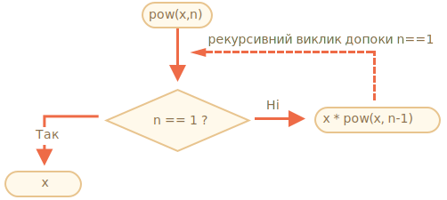
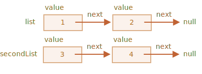

# Рекурсія та стек

Давайте повернемося до функцій і вивчимо їх більш поглиблено.

Нашою першою темою буде *рекурсія*.

Якщо ви не новачок в програмуванні, то, мабуть, знайомі з рекурсією, і можете пропустити цю главу.

Рекурсія -- це паттерн, який є корисним у ситуаціях, коли завдання може бути розділена на кілька завдань того ж роду, але простіших. Або коли завдання може бути спрощене до простої дії плюс простіший варіант того ж завдання. Або, як ми побачимо найближчим часом, щоб праювати з певними структурами даних.

Коли функція вирішує завдання, у процесі вона може викликати багато інших функцій. Частковий випадок цього є те, коли функція викликає *себе*. Це називається *рекурсія*.

## Два способи мислення

Щоб почати з чогось простого -- давайте напишемо функцію `pow(x, n)`, що приводить `x` в натуральну степінь `n`. Іншими словами, множить `x` сам на себе `n` разів.

```js
pow(2, 2) = 4
pow(2, 3) = 8
pow(2, 4) = 16
```

Існує два способи реалізації цього.

1. Ітеративне мислення: цикл `for`:

    ```js run
    function pow(x, n) {
      let result = 1;

      // множимо result на x n разів в циклі
      for (let i = 0; i < n; i++) {
        result *= x;
      }

      return result;
    }

    alert( pow(2, 3) ); // 8
    ```

2. Рекурсивне мислення: спростити завдання та викликати функцією саму себе:

    ```js run
    function pow(x, n) {
      if (n == 1) {
        return x;
      } else {
        return x * pow(x, n - 1);
      }
    }

    alert( pow(2, 3) ); // 8
    ```

Зверніть увагу, як рекурсивний варіант принципово відрізняється.

Коли `pow(x, n)` викликається, виконання розділяється на дві гілки:

```js
              if n==1  = x
             /
pow(x, n) =
             \       
              else     = x * pow(x, n - 1)
```

1. Якщо `n == 1`, то все тривіально. Це називається *база* рекурсії, оскільки вона негайно виробляє очевидний результат: `pow(x, 1)` дорівнює `x`.
2. Інакше ми можемо представляти `pow(x, n)` як `x * pow(x, n)`. У математиці можна написати <code>x<sup>n</sup> = x * x<sup>n-1</sup></code>. Це називається *рекурсивний крок*: ми перетворюємо завдання на простішу дію (множення за допомогою `x`) та на простий виклик того ж завдання (`pow` з меньшим `n`). Наступні кроки спрощують його далі і далі до `n`, що дорівнює `1`.

Ми також можемо сказати, що `pow` *рекурсивно викликаэ себе* до`n == 1`.




Наприклад, для розрахунку `pow(2, 4)` рекурсивний варіант виконує ці кроки:

1. `pow(2, 4) = 2 * pow(2, 3)`
2. `pow(2, 3) = 2 * pow(2, 2)`
3. `pow(2, 2) = 2 * pow(2, 1)`
4. `pow(2, 1) = 2`

Отже, рекурсія робить виклик функції простішим, а потім - ще більш простішим, і так далі, доки результат стане очевидним.

````smart header="Рекурсія зазвичай коротша"
Рекурсивне рішення, як правило, коротше, ніж ітераційне.

Ми можемо переписати те ж саме, використовуючи умовний оператор `?` замість `if`, щоб зробити `pow(x, n)` більш лаконічним і зберегти легкість читання:

```js run
function pow(x, n) {
  return (n == 1) ? x : (x * pow(x, n - 1));
}
```
````

Максимальна кількість вкладених викликів (включаючи перший) називається *глибина рекурсії*. У нашому випадку вона буде точно дорівнювати `n`.

Максимальна глибина рекурсії обмежена рушієм JavaScript. Ми можемо покластися, що вона може дорівнювати 10000, деякі рушії дозволяють отримати більшу глибину, але 100000, ймовірно, не підтримується більшістю з них. Є автоматичні оптимізації, які допомагають пом'якшити це ("оптимізація хвостових викликів"), але вони ще не підтримуються скрізь і працюють лише у простих випадках.

Це обмежує застосування рекурсії, але вона все ще залишається дуже широко поширеною. Є багато завдань, де рекурсивний спосіб мислення дає простіший код, який легше підтримувати.

## Контекст виконання та стек

Тепер давайте розглянемо роботу рекурсивних викликів. Для цього ми подивимося під капот функцій.

Інформація про процес виконання викликаної функції зберігається у *контексті виконання*.

[Контекст виконання](https:///tc39.github.io/ecma262/#sec-excution-contexts) -- це внутрішня структура даних, яка містить деталі про виконання функції: де зараз керуючий потік, поточні змінні, значення `this` (ми не використовуємо його тут) і кілька інших внутрішніх деталей.

Один виклик функції має рівно один контекст виконання, пов'язаний з ним.

Коли функція робить вкладений виклик, відбувається наступне:

- Поточна функція зупиняється.
- Контекст виконання, пов'язаний з нею, запам'ятовується в спеціальній структурі даних, що називається *стек контекстів виконання*.
- Вкладений виклик виконується.
- Після закінчення, старий контекст виконання витягується з стека, і зовнішня функція відновлюється з того місця, де вона зупинилася.

Давайте подивимося, що відбувається під час виклика `pow(2, 3)`.

### pow(2, 3)

На початку виклика `pow(2, 3)` контекст виконання буде зберігати змінні: `x = 2, n = 3`, потік виконання знаходиться на рядку `1` функції.

Ми можемо намалювати його наступним чином:

<ul class="function-execution-context-list">
  <li>
    <span class="function-execution-context">Контекст: {x: 2, n: 3, на рядку 1}</span>
    <span class="function-execution-context-call">pow(2, 3)</span>
  </li>
</ul>

Ось тоді, функція починає виконуватися. Умова `n == 1` -- хибна, тому потік продовжується у другій гілці `if`:

```js run
function pow(x, n) {
  if (n == 1) {
    return x;
  } else {
*!*
    return x * pow(x, n - 1);
*/!*
  }
}

alert( pow(2, 3) );
```


Змінні однакові, але виконання функції перейшло на інший рядок, тому контекст зараз:

<ul class="function-execution-context-list">
  <li>
    <span class="function-execution-context">Контекст: {x: 2, n: 3, на рядку 5}</span>
    <span class="function-execution-context-call">pow(2, 3)</span>
  </li>
</ul>

Для розрахунку `x * pow(x, n - 1)`, ми повинні зробити підвиклик `pow` з новими аргументами `pow(2, 2)`.

### pow(2, 2)

Щоб зробити вкладений виклик, JavaScript пам'ятає контекст поточного виконання в *стеці контексту виконання*.

Тут ми викликаємо ту ж функцію `pow`, але це абсолютно не має значення. Цей процес однаковий для всіх функцій:

1. Поточний контекст "запам'ятовується" на вершині стека.
2. Новий контекст створюється для підвиклику.
3. Коли закінчиться підвиклик -- попередній контекст дістається зі стека, і його виконання продовжується.

Ось контекстний стек, коли ми увійшли до підвиклику `pow(2, 2)`:

<ul class="function-execution-context-list">
  <li>
    <span class="function-execution-context">Контекст: {x: 2, n: 2, на рядку 1}</span>
    <span class="function-execution-context-call">pow(2, 2)</span>
  </li>
  <li>
    <span class="function-execution-context">Контекст: {x: 2, n: 3, на рядку 5}</span>
    <span class="function-execution-context-call">pow(2, 3)</span>
  </li>
</ul>

Новий поточний контекст виконання знаходиться на вершині (виділений жирним шрифтом), а попередні контексти знаходяться в пам'яті нижче.

Коли ми закінчимо підвиклик, легко відновити попередній контекст, оскільки він зберігає як змінні, так і точне місце коду, де він зупинився.

```smart
Тут, на малюнку, ми використовуємо "на рядку", так як у нашому прикладі є лише один підвиклик в рядку, але, як правило, один рядок коду може містити декілька підвикликів, як `pow(…) + pow(…) + somethingElse(…)`.

Тому було б точніше сказати, що виконання продовжується "відразу після підвиклику".
```

### pow(2, 1)

Процес повторюється: новий підвиклик здійснюється на рядку `5`, тепер з аргументами `x=2`, `n=1`.

Створено новий контекст виконання, попередній витиснуто на вершину стека:

<ul class="function-execution-context-list">
  <li>
    <span class="function-execution-context">Контекст: {x: 2, n: 1, на рядку 1}</span>
    <span class="function-execution-context-call">pow(2, 1)</span>
  </li>
  <li>
    <span class="function-execution-context">Контекст: {x: 2, n: 2, на рядку 5}</span>
    <span class="function-execution-context-call">pow(2, 2)</span>
  </li>
  <li>
    <span class="function-execution-context">Контекст: {x: 2, n: 3, на рядку 5}</span>
    <span class="function-execution-context-call">pow(2, 3)</span>
  </li>
</ul>

Зараз існує 2 старі контексти і 1 зараз працює для `pow(2, 1)`.

### Вихід

Під час виконання `pow(2, 1)`, умова `n==1` -- це істинна, на відміну того, що було раніше, тому перша гілка працює `if`:

```js
function pow(x, n) {
  if (n == 1) {
*!*
    return x;
*/!*
  } else {
    return x * pow(x, n - 1);
  }
}
```

Немає більше вкладених викликів, тому функція закінчується, повертаючись `2`.

Оскільки функція завершується, то контекст виконання більше не потрібний, тому він видаляється з пам'яті. Попередній контекст відновлюється з вершини стека:


<ul class="function-execution-context-list">
  <li>
    <span class="function-execution-context">Контекст: {x: 2, n: 2, на рядку 5}</span>
    <span class="function-execution-context-call">pow(2, 2)</span>
  </li>
  <li>
    <span class="function-execution-context">Контекст: {x: 2, n: 3, на рядку 5}</span>
    <span class="function-execution-context-call">pow(2, 3)</span>
  </li>
</ul>

Виконання `pow(2, 2)` відновлено. Воно має результат підвиклику `pow(2, 1)`, тому воно також може закінчити розрахунок `x * pow(x, n - 1)`, повернувши `4`.

Після цього відновлюється попередній контекст:

<ul class="function-execution-context-list">
  <li>
    <span class="function-execution-context">Контекст: {x: 2, n: 3, на рядку 5}</span>
    <span class="function-execution-context-call">pow(2, 3)</span>
  </li>
</ul>

Коли він закінчується, ми маємо результат `pow(2, 3) = 8`.

Глибина рекурсії в цьому випадку була: **3**.

Як ми бачимо з наведених вище ілюстрацій, глибина рекурсії дорівнює максимальній кількості контексту у стеці.

Зверніть увагу на вимоги до пам'яті. Зберігання контекстів потребує пам'яті. У нашому випадку, підведення до степеня `n` фактично вимагає пам'яті для `n` контекстів, для всіх значень, що нижче `n`.

Алгоритм на основі циклу економить більше пам'яті:

```js
function pow(x, n) {
  let result = 1;

  for (let i = 0; i < n; i++) {
    result *= x;
  }

  return result;
}
```

Ітеративний `pow` використовує єдиний контекст змінюючи `i` and `result` у процесі. Його вимоги до пам'яті невеликі, фіксовані та не залежать від `n`.

**Будь-яка рекурсія може бути переписана за допомогою циклу. Варіант з використанням циклу зазвичай може бути більш ефективним.**

... Але іноді переписати рішення на цикл нетривіально, особливо коли функція використовує різні рекурсивні підвиклики залежно від умов та поєднує їх результат або коли розгалуження є більш складним. Тому така оптимізація може бути непотрібна і повністю не варта зусиль.

Рекурсія може дати коротший код, який легше зрозуміти та підтримувати.Оптимізація не потрібна в кожному місці, в основному нам потрібний хороший код, тому використовується рекурсія.

## Рекурсивний обхід

Ще одним чудовим застосування рекурсії є рекурсивний обхід.

Уявіть, у нас є компанія. Структура персоналу може бути представлена як об'єкт:

```js
let company = {
  sales: [{
    name: 'Іван',
    salary: 1000
  }, {
    name: 'Аліса',
    salary: 1600
  }],

  development: {
    sites: [{
      name: 'Петро',
      salary: 2000
    }, {
      name: 'Олександр',
      salary: 1800
    }],

    internals: [{
      name: 'Евген',
      salary: 1300
    }]
  }
};
```

Іншими словами, компанія має відділи.

- Відділи можуть мати масив персоналу. Наприклад, відділ продажу має 2 співробітника: Евген та Аліса.
- Або відділ може бути розділеним на підрозділи, наприклад, `development` має дві гілки: `sites` та `internals`. Кожна з них має свій персонал.
- Можливо також, що коли відділ зростає, він розділяється на субвідділи (або команди).

    Наприклад, відділ `sites` у майбутньому може бути розділений на команди для `siteA` і `siteB`. І вони, потенційно, можуть бути розділити в подальшому. Це не зображено на малюнку, просто слід мати це на увазі.

Тепер припустимо, що ми хочемо, щоб функція отримати суму всіх зарплат. Як ми можемо це зробити?

Ітеративний підхід нелегкий, тому що структура не проста. Перша ідея може полягати в тому, щоб зробити `for` цикл через `company` з вкладеним підциклами через 1-ий рівень відділів. Але тоді нам потрібно більше вкладених циклів, щоб ітеруватися через персонал у 2-му рівні, такому як `sites`... А потім ще один підцикл всередині них для 3-го рівня, який міг би з'явитися в майбутньому? Якщо ми поставимо 3-4 вкладені цикли у коді, щоб пройти один об'єкт, це стає досить потворним.

Давайте спробуємо рекурсію.

Як ми бачимо, коли наша функція отримує відділ для підрахунку суми зарплат, є два можливі випадки:

1. Або це "простий" відділ з *масивом* людей -- тоді ми можемо підсумувати зарплату в простому циклі.
2. Або це *об'єкт* з `n` підвідділами -- тоді ми можемо зробити `n` рекурсивних дзвінки, щоб отримати суму для кожного з підвідділів та поєднати результати.

1-й випадок є базою рекурсії, тривіальном випадком, коли ми отримуємо масив.

2-й випадок, коли ми отримуємо об'єкт, -- це рекурсивний крок. Комплексне завдання розділяється на підзадачі для менших відділів. Вони в свою чергу можуть знову поділятися на підвідділи, але рано чи пізно поділ закінчиться і зведеться до випадку (1).

Алгоритм, мабуть, навіть легше читати у вигляді коду:


```js run
let company = { // той же об'єкт, стиснутий для компактності
  sales: [{name: 'John', salary: 1000}, {name: 'Alice', salary: 1600 }],
  development: {
    sites: [{name: 'Peter', salary: 2000}, {name: 'Alex', salary: 1800 }],
    internals: [{name: 'Jack', salary: 1300}]
  }
};

// Функція для підрахунку суми зарплат
*!*
function sumSalaries(department) {
  if (Array.isArray(department)) { // випадок (1)
    return department.reduce((prev, current) => prev + current.salary, 0); // сума масиву
  } else { // випадок (2)
    let sum = 0;
    for (let subdep of Object.values(department)) {
      sum += sumSalaries(subdep); // рекурсивно викликається для підвідділів, суммуючи результат
    }
    return sum;
  }
}
*/!*

alert(sumSalaries(company)); // 7700
```

Код короткий і його легко зрозуміти (сподіваюся?). Це сила рекурсії. Він також працює для будь-якого рівня вкладеного підвідділу.

Ось діаграма викликів:


We can easily see the principle: for an object `{...}` subcalls are made, while arrays `[...]` are the "leaves" of the recursion tree, they give immediate result.

Note that the code uses smart features that we've covered before:

- Method `arr.reduce` explained in the chapter <info:array-methods> to get the sum of the array.
- Loop `for(val of Object.values(obj))` to iterate over object values: `Object.values` returns an array of them.


## Recursive structures

A recursive (recursively-defined) data structure is a structure that replicates itself in parts.

We've just seen it in the example of a company structure above.

A company *department* is:
- Either an array of people.
- Or an object with *departments*.

For web-developers there are much better-known examples: HTML and XML documents.

In the HTML document, an *HTML-tag* may contain a list of:
- Text pieces.
- HTML-comments.
- Other *HTML-tags* (that in turn may contain text pieces/comments or other tags etc).

That's once again a recursive definition.

For better understanding, we'll cover one more recursive structure named "Linked list" that might be a better alternative for arrays in some cases.

### Linked list

Imagine, we want to store an ordered list of objects.

The natural choice would be an array:

```js
let arr = [obj1, obj2, obj3];
```

...But there's a problem with arrays. The "delete element" and "insert element" operations are expensive. For instance, `arr.unshift(obj)` operation has to renumber all elements to make room for a new `obj`, and if the array is big, it takes time. Same with `arr.shift()`.

The only structural modifications that do not require mass-renumbering are those that operate with the end of array: `arr.push/pop`. So an array can be quite slow for big queues, when we have to work with the beginning.

Alternatively, if we really need fast insertion/deletion, we can choose another data structure called a [linked list](https://en.wikipedia.org/wiki/Linked_list).

The *linked list element* is recursively defined as an object with:
- `value`.
- `next` property referencing the next *linked list element* or `null` if that's the end.

For instance:

```js
let list = {
  value: 1,
  next: {
    value: 2,
    next: {
      value: 3,
      next: {
        value: 4,
        next: null
      }
    }
  }
};
```

Graphical representation of the list:


An alternative code for creation:

```js no-beautify
let list = { value: 1 };
list.next = { value: 2 };
list.next.next = { value: 3 };
list.next.next.next = { value: 4 };
list.next.next.next.next = null;
```

Here we can even more clearly see that there are multiple objects, each one has the `value` and `next` pointing to the neighbour. The `list` variable is the first object in the chain, so following `next` pointers from it we can reach any element.

The list can be easily split into multiple parts and later joined back:

```js
let secondList = list.next.next;
list.next.next = null;
```



To join:

```js
list.next.next = secondList;
```

And surely we can insert or remove items in any place.

For instance, to prepend a new value, we need to update the head of the list:

```js
let list = { value: 1 };
list.next = { value: 2 };
list.next.next = { value: 3 };
list.next.next.next = { value: 4 };

*!*
// prepend the new value to the list
list = { value: "new item", next: list };
*/!*
```


To remove a value from the middle, change `next` of the previous one:

```js
list.next = list.next.next;
```


We made `list.next` jump over `1` to value `2`. The value `1` is now excluded from the chain. If it's not stored anywhere else, it will be automatically removed from the memory.

Unlike arrays, there's no mass-renumbering, we can easily rearrange elements.

Naturally, lists are not always better than arrays. Otherwise everyone would use only lists.

The main drawback is that we can't easily access an element by its number. In an array that's easy: `arr[n]` is a direct reference. But in the list we need to start from the first item and go `next` `N` times to get the Nth element.

...But we don't always need such operations. For instance, when we need a queue or even a [deque](https://en.wikipedia.org/wiki/Double-ended_queue) -- the ordered structure that must allow very fast adding/removing elements from both ends, but access to its middle is not needed.

Lists can be enhanced:
- We can add property `prev` in addition to `next` to reference the previous element, to move back easily.
- We can also add a variable named `tail` referencing the last element of the list (and update it when adding/removing elements from the end).
- ...The data structure may vary according to our needs.

## Summary

Terms:
- *Recursion*  is a programming term that means calling a function from itself. Recursive functions can be used to solve tasks in elegant ways.

    When a function calls itself, that's called a *recursion step*. The *basis* of recursion is function arguments that make the task so simple that the function does not make further calls.

- A [recursively-defined](https://en.wikipedia.org/wiki/Recursive_data_type) data structure is a data structure that can be defined using itself.

    For instance, the linked list can be defined as a data structure consisting of an object referencing a list (or null).

    ```js
    list = { value, next -> list }
    ```

    Trees like HTML elements tree or the department tree from this chapter are also naturally recursive: they branch and every branch can have other branches.

    Recursive functions can be used to walk them as we've seen in the `sumSalary` example.

Any recursive function can be rewritten into an iterative one. And that's sometimes required to optimize stuff. But for many tasks a recursive solution is fast enough and easier to write and support.
