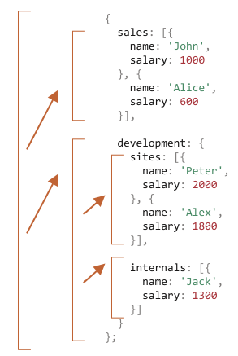
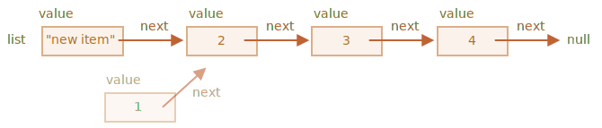

# Рекурсія та стек

Давайте повернемося до функцій і вивчимо їх більш поглиблено.

Нашою першою темою буде *рекурсія*.

Якщо ви не новачок в програмуванні, то, мабуть, знайомі з рекурсією, і можете пропустити цю главу.

Рекурсія -- це паттерн, який є корисним у ситуаціях, коли завдання може бути розділено на кілька завдань того ж роду, але простіших. Або коли завдання може бути спрощене до простої дії плюс простіший варіант того ж завдання. Або, як ми побачимо найближчим часом, щоб працювати з певними структурами даних.

Коли функція вирішує завдання, у процесі вона може викликати багато інших функцій. Є навіть випадки, коли функція викликає *саму себе*. Коли функція викликає саму себе - це називається *рекурсія*.

## Два способи мислення

Щоб почати з чогось простого -- давайте напишемо функцію `pow(x, n)`, що підносить `x` до натурального ступеня `n`. Іншими словами, множить `x` саму на себе `n` разів.

```js
pow(2, 2) = 4
pow(2, 3) = 8
pow(2, 4) = 16
```

Існує два способи реалізації цього.

1. Ітеративне мислення: цикл `for`:

    ```js run
    function pow(x, n) {
      let result = 1;

      // множимо result на x n разів в циклі
      for (let i = 0; i < n; i++) {
        result *= x;
      }

      return result;
    }

    alert( pow(2, 3) ); // 8
    ```

2. Рекурсивне мислення: спростити завдання та викликати функцією саму себе:

    ```js run
    function pow(x, n) {
      if (n == 1) {
        return x;
      } else {
        return x * pow(x, n - 1);
      }
    }

    alert( pow(2, 3) ); // 8
    ```

Зверніть увагу, що рекурсивний варіант відрізняється принципово.

Коли функція `pow(x, n)` викликається, виконання розділяється на дві гілки:

```js
              if n==1  = x
             /
pow(x, n) =
             \
              else     = x * pow(x, n - 1)
```

1. Якщо `n == 1`, то все просто. Ця гілка називається *базою* рекурсії, оскільки вона негайно дає очевидний результат: `pow(x, 1)` дорівнює `x`.
2. Інакше ми можемо представити `pow(x, n)` як `x * pow(x, n)`. Що у математиці можна написати <code>x<sup>n</sup> = x * x<sup>n-1</sup></code>. Ця гілка - *крок рекурсії*: ми зводимо задачу до більш простої дії (множеня на `x`) і до більш простої аналогічної задачі (`pow` з меншим `n`). Наступні кроки спрощують задачу все більше і більше, аж доки `n` почне дорівнювати `1`.

Ми також можемо сказати, що `pow` *рекурсивно викликає себе* до`n == 1`.


Наприклад, для розрахунку `pow(2, 4)` рекурсивний варіант виконує такі кроки:

1. `pow(2, 4) = 2 * pow(2, 3)`
2. `pow(2, 3) = 2 * pow(2, 2)`
3. `pow(2, 2) = 2 * pow(2, 1)`
4. `pow(2, 1) = 2`

Отже, рекурсію використовують, коли обчислення функції можна звести до її ж більш простого виклику, а той - до ще простішого і так далі, аж доки значення не стане максимально простим (очевидним).

````smart header="Рекурсійне рішення зазвичай коротше"
Рекурсивне рішення, як правило, коротше за ітераційне.

Ми можемо переписати те ж саме, використовуючи умовний оператор `?` замість `if`, щоб зробити `pow(x, n)` більш лаконічним і зберегти легкість читання:

```js run
function pow(x, n) {
  return (n == 1) ? x : (x * pow(x, n - 1));
}
```
````

Максимальна кількість вкладених викликів (включаючи перший) називається *глибина рекурсії*. У нашому випадку вона буде точно дорівнювати `n`.

Максимальна глибина рекурсії обмежена рушієм JavaScript. Кількість вкладених викликів, на яку точно можна розраховувати - 10 000. Деякі рушії дозволять працювати з ще більшою глибиною. Але навіть більшість з них можуть осилити не більше 100 000 викликів. Є багато автоматичних оптимізацій, які допомагають уникнути переповнення стеку викликів ("оптимізація хвостових викликів", англ. tail calls optimizations), але вони підтримуються далеко не всюди і працюють тільки в простих випадках.

Це обмежує застосування рекурсії, але вона все ще залишається дуже широко поширеною. Є багато завдань, де рекурсивний спосіб мислення дає простіший код, який легше підтримувати.

## Контекст виконання та стек

Тепер давайте розглянемо роботу рекурсивних викликів. Для цього ми подивимося під капот функцій.

Інформація про процес виконання викликаної функції зберігається у *контексті виконання*.

[Контекст виконання](https:///tc39.github.io/ecma262/#sec-excution-contexts) -- це внутрішня структура даних, яка містить деталі про виконання функції: де зараз керуючий потік, поточні змінні, значення `this` (ми не використовуємо його тут) і кілька інших внутрішніх деталей.

Один виклик функції має рівно один контекст виконання, пов’язаний з ним.

Коли функція робить вкладений виклик, відбувається наступне:

- Поточна функція зупиняється.
- Контекст виконання, пов’язаний з нею, запам’ятовується в спеціальній структурі даних, що називається *стек контекстів виконання*.
- Виконуються вкладені виклики і для кожного з них створюється свій контекст виконання.
- Після закінчення, старий контекст виконання витягується з стека, і зовнішня функція відновлюється з того місця, де вона зупинилася.

Давайте подивимося, що відбувається під час виклику `pow(2, 3)`.

### pow(2, 3)

На початку виклику `pow(2, 3)` контекст виконання буде зберігати змінні: `x = 2, n = 3`, потік виконання знаходиться на рядку `1` функції.

Ми можемо намалювати його наступним чином:

<ul class="function-execution-context-list">
  <li>
    <span class="function-execution-context">Контекст: {x: 2, n: 3, на рядку 1}</span>
    <span class="function-execution-context-call">pow(2, 3)</span>
  </li>
</ul>

Це стан на початку виконання. Так як умова `n == 1` -- хибна, то виконується друга гілка `if`:

```js run
function pow(x, n) {
  if (n == 1) {
    return x;
  } else {
*!*
    return x * pow(x, n - 1);
*/!*
  }
}

alert( pow(2, 3) );
```


Змінні однакові, але виконання функції перейшло на інший рядок, тому контекст зараз:

<ul class="function-execution-context-list">
  <li>
    <span class="function-execution-context">Контекст: {x: 2, n: 3, на рядку 5}</span>
    <span class="function-execution-context-call">pow(2, 3)</span>
  </li>
</ul>

Для розрахунку `x * pow(x, n - 1)` треба зробити підвиклик `pow` з новими аргументами `pow(2, 2)`.

### pow(2, 2)

Щоб зробити вкладений виклик, JavaScript запам'ятовує контекст поточного виконання в *стеці контексту виконання*.

Тут ми викликаємо ту ж функцію `pow`, але це абсолютно не має значення. Цей процес однаковий для всіх функцій:

1. Поточний контекст "запам’ятовується" на вершині стека.
2. Створюється новий контекст для вкладеного виклику.
3. Коли закінчиться виконання вкладеного виклику -- попередній контекст дістається зі стека, і його виконання продовжується.

Ось контекстний стек, коли ми увійшли до підвиклику `pow(2, 2)`:

<ul class="function-execution-context-list">
  <li>
    <span class="function-execution-context">Контекст: {x: 2, n: 2, на рядку 1}</span>
    <span class="function-execution-context-call">pow(2, 2)</span>
  </li>
  <li>
    <span class="function-execution-context">Контекст: {x: 2, n: 3, на рядку 5}</span>
    <span class="function-execution-context-call">pow(2, 3)</span>
  </li>
</ul>

Новий поточний контекст виконання знаходиться на малюнку вище (підпис виділений жирним шрифтом), а попередні контексти, які все ще бережуть в пам'яті, зображені на тому ж малюнку нижче.

Коли виконання підвиклику закінчиться, можна буде легко повернутись назад. Бо контекст зберігає як значення змінних, так і точне місце в коді, де він зупинився. 

```smart
Тут, на малюнку, ми використовуємо "на рядку", так як у нашому прикладі є лише один підвиклик в рядку, але, як правило, один рядок коду може містити декілька підвикликів, як `pow(…) + pow(…) + somethingElse(…)`.

Тому було б точніше сказати, що виконання продовжується "відразу після підвиклику".
```

### pow(2, 1)

Процес повторюється: новий підвиклик здійснюється на рядку `5`, тепер з аргументами `x=2`, `n=1`.

Створено новий контекст виконання, попередній витиснуто вище по стеку:

<ul class="function-execution-context-list">
  <li>
    <span class="function-execution-context">Контекст: {x: 2, n: 1, на рядку 1}</span>
    <span class="function-execution-context-call">pow(2, 1)</span>
  </li>
  <li>
    <span class="function-execution-context">Контекст: {x: 2, n: 2, на рядку 5}</span>
    <span class="function-execution-context-call">pow(2, 2)</span>
  </li>
  <li>
    <span class="function-execution-context">Контекст: {x: 2, n: 3, на рядку 5}</span>
    <span class="function-execution-context-call">pow(2, 3)</span>
  </li>
</ul>

Зараз існує 2 старі контексти і 1 зараз працює для `pow(2, 1)`.

### Вихід

Під час виконання `pow(2, 1)`, умова `n==1` -- істинна, на відміну того, що було раніше, тому перша гілка виконує `if`:

```js
function pow(x, n) {
  if (n == 1) {
*!*
    return x;
*/!*
  } else {
    return x * pow(x, n - 1);
  }
}
```

Немає більше вкладених викликів, тому функція закінчується, повертаючи `2`.

Оскільки цей виклик функції завершується, то контекст виконання для цього виклику більше не потрібний, тому він видаляється з пам’яті. Попередній контекст відновлюється з вершини стека:


<ul class="function-execution-context-list">
  <li>
    <span class="function-execution-context">Контекст: {x: 2, n: 2, на рядку 5}</span>
    <span class="function-execution-context-call">pow(2, 2)</span>
  </li>
  <li>
    <span class="function-execution-context">Контекст: {x: 2, n: 3, на рядку 5}</span>
    <span class="function-execution-context-call">pow(2, 3)</span>
  </li>
</ul>

Виконання `pow(2, 2)` відновлено. Воно має результат підвиклику `pow(2, 1)`, тому воно також може закінчити розрахунок `x * pow(x, n - 1)`, повернувши `4`.

Після цього відновлюється попередній контекст:

<ul class="function-execution-context-list">
  <li>
    <span class="function-execution-context">Контекст: {x: 2, n: 3, на рядку 5}</span>
    <span class="function-execution-context-call">pow(2, 3)</span>
  </li>
</ul>

Коли він закінчується, ми маємо результат `pow(2, 3) = 8`.

Глибина рекурсії в цьому випадку була: **3**.

Як ми бачимо з наведених вище ілюстрацій, глибина рекурсії дорівнює максимальній кількості контекстів у стеку.

Зверніть увагу на вимоги до пам’яті. Зберігання контекстів потребує пам’яті. У нашому випадку, підведення до степеня `n` фактично вимагає пам’яті для `n` контекстів, для всіх значень, що нижче `n`.

Алгоритм на основі циклу економить більше пам’яті:

```js
function pow(x, n) {
  let result = 1;

  for (let i = 0; i < n; i++) {
    result *= x;
  }

  return result;
}
```

Ітеративний `pow` використовує єдиний контекст, змінюючи `i` й `result` у процесі. Його вимоги до пам’яті невеликі, фіксовані та не залежать від `n`.

**Будь-яка рекурсія може бути переписана за допомогою циклу. Варіант з використанням циклу зазвичай може бути більш ефективним.**

...Але іноді переписати рішення на цикл нетривіально, особливо коли функція використовує різні рекурсивні підвиклики залежно від умов та поєднує їх результат або коли розгалуження є більш складним. Тому така оптимізація може бути непотрібна і повністю не варта зусиль.

Рекурсія може дати коротший код, який легше зрозуміти та підтримувати. Оптимізація не потрібна в кожному місці, в основному нам потрібний хороший код, тому використовується рекурсія.

## Рекурсивний обхід

Ще одним чудовим застосування рекурсії є рекурсивний обхід.

Уявіть, у нас є компанія. Структура персоналу може бути представлена як об’єкт:

```js
let company = {
  sales: [{
    name: 'Іван',
    salary: 1000
  }, {
    name: 'Аліса',
    salary: 1600
  }],

  development: {
    sites: [{
      name: 'Петро',
      salary: 2000
    }, {
      name: 'Олександр',
      salary: 1800
    }],

    internals: [{
      name: 'Євген',
      salary: 1300
    }]
  }
};
```

Іншими словами, компанія має відділи.

- Відділи можуть мати масив персоналу. Наприклад, відділ продажу має 2 співробітника: Іван та Аліса.
- Або відділ може бути розділеним на підрозділи, наприклад, `development` має дві гілки: `sites` та `internals`. Кожна з них має свій персонал.
- Можливо також, що коли відділ зростає, він розділяється на субвідділи (або команди).

    Наприклад, відділ `sites` у майбутньому може бути розділений на команди для `siteA` і `siteB`. І І вони, потенційно, можуть бути розділені в подальшому. Це не зображено на малюнку, просто слід мати це на увазі.

Тепер припустімо, що ми хочемо, щоб функція отримала суму всіх зарплат. Як ми можемо це зробити?

Ітеративний підхід нелегкий, бо структура не проста. Перша ідея може полягати в тому, щоб зробити `for` цикл через `company` з вкладеним підциклами через 1-ий рівень відділів. Але тоді нам потрібно більше вкладених циклів, щоб ітеруватися через персонал у 2-му рівні, такому як `sites`... А потім ще один підцикл всередині них для 3-го рівня, який міг би з’явитися в майбутньому? Якщо ми поставимо 3-4 вкладені цикли у коді, щоб пройти один об’єкт, це стає досить потворним.

Давайте спробуємо рекурсію.

Як ми бачимо, коли наша функція отримує відділ для підрахунку суми зарплат, є два можливі випадки:

1. Або це "простий" відділ з *масивом* людей -- тоді ми можемо підсумувати зарплату в простому циклі.
2. Або це *об’єкт* з `n` підвідділів -- тоді ми можемо зробити `n` рекурсивних викликів, щоб отримати суму для кожного з підвідділів та сумувати результати.

1-й випадок є базою рекурсії, тривіальним випадком, коли ми отримуємо масив.

2-й випадок, коли ми отримуємо об’єкт, -- це рекурсивний крок. Комплексне завдання розділяється на підзадачі для менших відділів. Вони в свою чергу можуть знову поділятися на підвідділи, але рано чи пізно поділ закінчиться і зведеться до випадку (1).

Алгоритм, мабуть, навіть легше читати у вигляді коду:


```js run
let company = { // той же об’єкт, стиснутий для компактності
  sales: [{name: 'John', salary: 1000}, {name: 'Alice', salary: 1600 }],
  development: {
    sites: [{name: 'Peter', salary: 2000}, {name: 'Alex', salary: 1800 }],
    internals: [{name: 'Jack', salary: 1300}]
  }
};

// Функція для підрахунку суми зарплат
*!*
function sumSalaries(department) {
  if (Array.isArray(department)) { // випадок (1)
    return department.reduce((prev, current) => prev + current.salary, 0); // сума масиву
  } else { // випадок (2)
    let sum = 0;
    for (let subdep of Object.values(department)) {
      sum += sumSalaries(subdep); // рекурсивно викликається для підвідділів, суммуючи результат
    }
    return sum;
  }
}
*/!*

alert(sumSalaries(company)); // 7700
```

Код короткий і його легко зрозуміти (сподіваюся). Це сила рекурсії. Він також працює для будь-якого рівня вкладеного підвідділу.

Ось діаграма викликів:



Ми можемо легко побачити принцип: для об’єкта `{...}` зроблені підвиклики, а масиви` `[...]` -- "листя" рекурсійного дерева, вони дають негайний результат.

Зауважте, що код використовує пруткі можливості, які ми вже розглядали раніше:

- Метод `arr.reduce` пояснено в розділі <info:array-methods>, щоб отримати суму масиву.
- Цикл `for(val of Object.values(obj))` для ітерування значень об’єкта: `Object.values` повертає їх масив.


## Рекурсивні структури

Рекурсивна (рекурсивно визначена) структура даних є структурою, яка повторює себе в своїх частинах.

Ми тільки що бачили це вище на прикладі структури компанії.

*Відділ* компанії це:
- Або масив людей.
- Або об’єкт з *відділами*.

Для веб-розробників набагато краще відомі приклади: HTML та XML-документи.

У HTML-документі *HTML-тег* може містити список:
- частини тексту.
- HTML-коментарі.
- Інші *HTML-теги* (що, у свою чергу, можуть містити частини тексту/коментарі або інші теги тощо).

Це ще одне рекурсивне визначення.

Для кращого розуміння ми розглянемо ще одну рекурсивну структуру "Зв’язаний список", який може бути кращою альтернативою для масивів у деяких випадках.

### Зв’язаний список

Уявіть, що ми хочемо зберегти впорядкований список об’єктів.

Очевидним вибором буде масив:

```js
let arr = [obj1, obj2, obj3];
```

...Але є проблема з масивами. Операції "видалити елемент" та "вставити елемент" -- дорогі. Наприклад, операція `arr.unshift(obj)` повинна мати справу зі всіма елементами, щоб звільнити місце для нового `obj` і, якщо масив великий, це вимагає часу. Те ж саме з `arr.shift()`.

Єдині структурні модифікації, які не потребують масової перенумерації об’єктів, є ті, які працюють з кінцем масиву: `arr.push/pop`. Таким чином, масив може бути досить повільним для великих черг, коли ми повинні працювати з його початком.

Крім того, якщо нам дійсно потрібні швидкі вставка/видалення, ми можемо вибрати іншу структуру даних, яка називається [зв’язаний список](https://uk.wikipedia.org/wiki/Зв'язаний_список), англ. linked list.

*Елемент зв’язаного списку* рекурсивно визначається як об’єкт з:
- `value`.
- `next` властивість, що посилається на наступний *елемент зв’язаного списку* або `null`, якщо це кінець.

Наприклад:

```js
let list = {
  value: 1,
  next: {
    value: 2,
    next: {
      value: 3,
      next: {
        value: 4,
        next: null
      }
    }
  }
};
```

Графічне представлення списку:


Альтернативний код для створення:

```js no-beautify
let list = { value: 1 };
list.next = { value: 2 };
list.next.next = { value: 3 };
list.next.next.next = { value: 4 };
list.next.next.next.next = null;
```

Тут ми можемо ще більш чітко бачити, що є декілька об’єктів, кожен з яких має `value` та `next`, що вказуює на сусіда. Змінна `list` -- це перший об’єкт у ланцюжку, тому слідуючи вказівникам `next` з неї ми можемо досягти будь-якого елемента.

Список можна легко розділити на декілька частин, а пізніше з’єднати знову:

```js
let secondList = list.next.next;
list.next.next = null;
```


Для об'єднання:

```js
list.next.next = secondList;
```

І, безумовно, ми можемо вставити або видалити елементи в будь-якому місці.

Наприклад, для підготовки нового значення, нам потрібно оновити голову списку:

```js
let list = { value: 1 };
list.next = { value: 2 };
list.next.next = { value: 3 };
list.next.next.next = { value: 4 };

*!*
// додавання нового значення до списку
list = { value: "new item", next: list };
*/!*
```


Щоб видалити значення з середини, міняємо `next` попереднього:

```js
list.next = list.next.next;
```



Ми зробили так, що тепер `list.next` стрибає через `1` на значення `2`. Значення `1` зараз виключається з ланцюга. Якщо воно не зберігається ніде, то воно буде автоматично видалено з пам’яті.

На відміну від масивів, немає массових перенумерацій, ми можемо легко переставляти елементи.

Звичайно, списки не завжди краще, ніж масиви. Інакше кожен використовував би лише списки.

Основний недолік полягає в тому, що ми не можемо легко отримати доступ до елемента за його номером. У масиві це легко: `arr[n]` є прямим посиланням. А в списку ми повинні почати з першого елемента і піти `next` `N` разів, щоб отримати n-ий елемент.

...Але ми не завжди потребуємо таких операцій. Наприклад, коли нам потрібна черга або навіть [двобічна черга](https://uk.wikipedia.org/wiki/Двобічна_черга) -- упорядкована структура, яка повинна дозволити дуже швидко додавати/видаляти елементи з обох кінців, але доступ до середини не потрібний.

Списки можуть бути покращені:
- Ми можемо додати властивість `prev` на доповнення до `next`, для посилання на попередній елемент, щоб легко переміщатися.
- Ми також можемо додати змінну названу `tail`, що посилається на останній елемент списку (і оновлювати його при додаванні/видаленні елементів з кінця).
- ...Структура даних може відрізнятися залежно від наших потреб.

## Підсумки

Терміни:
- *Рекурсія* - це термін програмування, який означає, що функція викликає саму себе. Рекурсивні функції можуть бути використані для вирішення завдань у елегантний спосіб.

    Коли функція викликає себе, це називається *рекурсійний крок*. *База* рекурсії є функціональними аргументами, які роблять завдання таким простим, що функція не робить додаткових викликів.

- [Рекурсивно визначена](https://uk.wikipedia.org/wiki/Рекурсивний_тип_даних) структура даних -- це структура даних, яка може бути визначена, з використанням самої себе.

    Наприклад, зв’язаний список може бути визначений як структура даних, що складається з об’єкта, що посилається на список (або null).

    ```js
    list = { value, next -> list }
    ```

    Дерева, такі як HTML-елементи або дерево відділів з цієї глави, також є рекурсивними: вони розгалужуються та кожна гілка може мати інші гілки.

    Рекурсивні функції можуть бути використані для того, щоб пройти їх, як ми бачили у прикладі `sumSalary`.

Будь-яка рекурсивна функція може бути переписана в ітераційну. І це іноді потрібно для оптимізації. Але для багатьох завдань рекурсивне рішення досить швидке і його легше написати та підтримувати.
