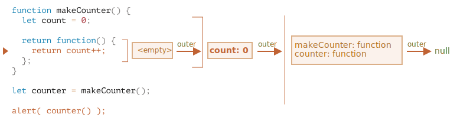

# Замикання 

JavaScript -- це дуже функціонально орієнтована мова. Це дає нам багато свободи. Функцію можна створити в будь-який момент, її можна передати як аргумент іншій функції, а потім викликати з абсолютно іншого місця коду.

Ми вже знаємо, що функція може отримати доступ до змінних з зовнішнього середовища (зовнішні змінні).

Але що станеться, якщо зовнішні змінні змінюються після створення функції? Чи отримає функція нові значення чи старі?

А що буде, коли функція передається як параметр і викликається з іншого місця коду, чи отримає вона доступ до зовнішніх змінних на новому місці?

Давайте розширимо наші знання, щоб зрозуміти ці та більш складні сценарії.

```smart header="Тут ми поговоримо про змінні `let/const`"
У JavaScript існує 3 способи оголошення змінної: `let`,` const` (сучасні) та `var` (залишок минулого).

- У цій статті ми будемо використовувати `let` для змінних у прикладах.
- Змінні, оголошені через `const`, поводяться так само, тому ця стаття також стосується `const`.
- `var` має деякі помітні відмінності, вони будуть розглянуті в статті <info:var>.
```

## Блоки коду

Якщо змінна оголошена всередині блоку коду `{...}`, вона буде доступна лише всередині цього блоку.

Наприклад:

```js run
{
  // тут виконується певна робота з локальними змінними, яку не слід бачити зовні

  let message = "Привіт"; // змінна видима тільки у цьому блоці 
  alert(message); // Привіт
}

alert(message); // Помилка: змінну message не було оголошено
```

Ми можемо використовувати це, щоб виділити фрагмент коду, який працює зі змінними, які доступні лише з нього:

```js run
{
  // показати повідомлення
  let message = "Привіт";
  alert(message);
}

{
  // показати інше повідомлення
  let message = "Бувай";
  alert(message);
}
```

````smart header="Без блоків буде помилка"
Будь-ласка, зверніть увагу, що без окремих блоків буде помилка, якщо ми використовуємо `let` з однаковою назвою змінної:

```js run
// показати повідомлення
let message = "Привіт";
alert(message);

// показати інше повідомлення
*!*
let message = "Бувай"; // Помилка: змінна вже оголошена
*/!*
alert(message);
```
````

Для `if`, `for`, `while` і так далі, змінні, оголошені в `{...}` також видно тільки всередині:

```js run
if (true) {
  let phrase = "Привіт!";

  alert(phrase); // Привіт!
}

alert(phrase); // Помилка, такої змінної немає!
```

Тут, після завершення `if`, `alert` нижче не побачить `phrase`, отже, помилка.

Це чудово, оскільки це дозволяє нам створювати локально-блокові змінні, специфічні для гілки `if`.

Те ж саме справедливо і для циклів `for` та `while`:

```js run
for (let i = 0; i < 3; i++) {
  // змінну i видно тільки всередині цього циклу for
  alert(i); // 0, потім 1, потім 2
}

alert(i); // Помилка, такої змінної немає
```

Візуально, `let i` знаходиться за межами `{...}`. Але конструкція `for` особлива: змінна, оголошена всередині неї, вважається частиною блоку.

## Вкладені функції

Функція називається "вкладеною", коли вона створюється всередині іншої функції.

З JavaScript це зробити дуже легко.

І ми можемо використовувати це для організації нашого коду, наприклад:

```js
function sayHiBye(firstName, lastName) {

  // допоміжна вкладена функція для використання нижче
  function getFullName() {
    return firstName + " " + lastName;
  }

  alert( "Привіт, " + getFullName() );
  alert( "Бувай, " + getFullName() );

}
```

Тут *вкладена* функція `getFullName()` створена для зручності. Вона має доступ до внутрішніх змінних функції і тому може повернути повне ім’я. Вкладені функції досить поширені в JavaScript.

Що ще цікавіше, вкладену функцію можна повернути: як властивість нового об’єкта, або як самостійний результат. Потім її можна використати десь в іншому місці. Незалежно від того, де її викликають, вона завжди буде мати доступ до внутрішніх змінних функцію, в якій її було створено.

Нижче, `makeCounter` створює функцію "counter", яка повертає наступний номер при кожному виклику:

```js run
function makeCounter() {
  let count = 0;

  return function() {
    return count++;
  };
}

let counter = makeCounter();

alert( counter() ); // 0
alert( counter() ); // 1
alert( counter() ); // 2
```

Незважаючи на простоту, трохи змінені варіанти цього коду мають практичне застосування, наприклад, [генератор псевдовипадкових чисел](https://uk.wikipedia.org/wiki/Генератор_псевдовипадкових_чисел) для генерації випадкових значень для автоматизованих тестів.

Як це працює? Якщо ми створимо кілька лічильників, чи будуть вони незалежними? Що відбувається зі змінними тут?

Розуміння таких речей чудово не тільки для загального знання JavaScript, але й корисно для роботи з більш складними сценаріями. Тож давайте трохи поглибимося.

## Лексичне середовище

```warn header="Тут будуть дракони!"
Поглиблене технічне пояснення попереду.

Чесно кажучи, пояснюючи це, я хотів би уникнути низькорівневих деталей, але без них розуміння буде не повним, тому готуйтесь.
```

Для наочності пояснення поділено на кілька етапів.

### 1 Етап. Змінні

У JavaScript кожна запущена функція, блок коду `{...}`, і скрипт в цілому мають внутрішній (прихований) асоційований об’єкт, відомий як *Лексичне Середовище (Lexical Environment)*.

Об’єкт лексичного середовища складається з двох частин:

1. *Запис Середовища (Environment Record)* -- об’єкт, який зберігає всі локальні змінні як властивості (та деяку іншу інформацію, наприклад значення `this`).
2. Посилання на *зовнішнє лексичне середовище*, яке пов’язане із зовнішнім кодом.

**"Змінна" це лише властивість спеціального внутрішнього об’єкта, `Запис Середовища (Environment Record)`. "Отримати або змінити змінну" насправді означає "отримати або змінити властивість цього об’єкта".**

У цьому простому коді без функцій є лише одне лексичне середовище:


Це так зване *глобальне* лексичне середовище, пов’язане з усім скриптом.

На зображенні вище прямокутник означає запис середовища (сховище змінних), а стрілка означає зовнішнє посилання. Глобальне лексичне середовище не має зовнішнього посилання, тому стрілка вказує на `null`.

Коли код виконується, лексичне середовище змінюється.

Ось трохи довший код:


Прямокутники праворуч демонструють, як змінюється глобальне лексичне середовище під час виконання:

1. Коли скрипт запускається, лексичне середовище попередньо заповнюється усіма оголошеними змінними.
    - Спочатку вони перебувають у стані "Неініціалізовані (Uninitialized)". Це особливий внутрішній стан, це означає, що рушій знає про змінну, але на неї не можна посилатися, поки вона не буде оголошена з `let`. Це майже те саме, ніби змінна не існує.
2. Потім з’являється оголошення змінної `let phrase`. Поки що ми тільки оголосили змінну, тому її значення `undefined`. Але з цього моменту ми можемо використовувати її.
3. `phrase` присвоюється значення.
4. `phrase` змінює значення.

Поки що все виглядає просто, правда?

- Змінна -- це властивість спеціального внутрішнього об’єкта, пов’язана з блоком/функцієї/скриптом що зараз виконується.
- Робота зі змінними -- це насправді робота з властивостями цього об’єкта.

```smart header="Лексичне середовище -- це об'єкт специфікації"
"Лексичне середовище" -- це об’єкт специфікації: він існує лише "теоретично" в [специфікації мови](https://tc39.es/ecma262/#sec-lexical-environments) щоб показати, як все працює. Ми не можемо отримати цей об’єкт у нашому коді та керувати ним безпосередньо.

Рушії JavaScript також можуть його оптимізувати, відкидати змінні, які не використовуються для економії пам’яті та виконувати інші внутрішні трюки, доки видима поведінка залишається такою, як описано у специфікації.
```

### 2 Етап. Функції створені як Function Declarations

Функція також є значенням, як і значення у змінних.

**Різниця в тому, що функція створена за допомогою Function Declaration, ініціалізується миттєво і повністю .**

Коли створюється лексичне середовище, така функції відразу стає готовою до використання (на відміну від значення у змінній `let`, що непридатна для викорстиння до оголошення).

Ось чому ми можемо використовувати функцію, оголошену з Function Declaration, ще до рядка з оголошенням.

Наприклад, ось початковий стан глобального лексичного середовища, коли ми додаємо функцію:


Така поведінка стосується лише Function Declarations, а не Function Expressions, де ми призначаємо функцію змінній, наприклад ось так `let say = function(name)...`.

### 3 етап. Внутрішнє та зовнішнє лексичне середовище

Коли функція виконується, на початку виклику автоматично створюється нове лексичне середовище для зберігання локальних змінних та параметрів виклику.

Наприклад, для `say("John")`, це виглядає так (виконання знаходиться у рядку, позначеному стрілкою):

<!--
    ```js
    let phrase = "Hello";

    function say(name) {
     alert( `${phrase}, ${name}` );
    }

    say("John"); // Hello, John
    ```-->


Під час виклику функції у нас є два лексичні середовища: внутрішнє (для виклику функції) і зовнішнє (глобальне):

- Внутрішнє лексичне середовище відповідає поточному виконанню функції `say`. Воно має єдину властивість: `name` -- аргумент функції. Ми викликали `say("John")`, тож значення у `name` буде `"John"`.
- Зовнішнє лексичне середовище -- це глобальне лексичне середовище. У ньому є змінна `phrase` та сама функція.

Внутрішнє лексичне середовище має посилання на `зовнішнє`.

**Коли код хоче отримати доступ до змінної -- спочатку шукає її у внутрішньому лексичному середовищі, потім у зовнішньому, потім у зовнішньому до попереднього і так далі поки не дійде до глобального.**

Якщо змінна ніде не знайдена, то буде помилка для увімкненого суворого режиму (без `use strict`, присвоєння неіснуючої змінної створює нову глобальну змінну для сумісності зі старим кодом).

У цьому прикладі пошук відбувається наступним чином:

- Для змінної `name`, `alert` у функції `say` знаходить її негайно у внутрішньому лексичному середовищі.
- Коли він хоче отримати доступ до `phrase`, він спочатку шукає її серед локальних змінних, де її немає, і врешті решт іде за посиланням на зовнішнє лексичне середовище і знаходить її там.


### 4 Етап. Повернення функції

Повернемося до прикладу з `makeCounter`.

```js
function makeCounter() {
  let count = 0;

  return function() {
    return count++;
  };
}

let counter = makeCounter();
```

На початку кожного виклику `makeCounter()`, створюється новий об’єкт лексичного середовища для зберігання змінних конкретного виклику `makeCounter`.

Отже, у нас є два вкладених лексичних середовища, як і у прикладі вище:


Різниця полягає в тому, що під час виконання `makeCounter()`, крихітна вкладена функція створюється, яка складається лише з одного рядка: `return count++`. Ми не запускаємо її, лише створюємо.

Усі функції пам’ятають лексичне середовище, в якому вони були створені. Технічно тут немає ніякої магії: усі функції мають приховану властивість з назвою `[[Environment]]`, що зберігає посилання на лексичне середовище, де була створена функція:


Тому, `counter.[[Environment]]` має посилання на лексичне середовище, яке має вигляд `{count: 0}`. Так функція запам’ятовує, де вона була створена, незалежно від того, де вона викликається. Посилання у `[[Environment]]` встановлюється раз і назавжди під час створення функції.

Пізніше коли `counter()` викликається, для виклику створюється нове лексичне середовище, а посилання на зовнішнє лексичне середовище для нього береться з `counter.[[Environment]]`:



Тепер, коли код всередині `counter()` шукає змінну `count`, він спочатку шукає у власному лексичному середовищі (воно порожнє, оскільки там немає локальних змінних), потім у зовнішньому лексичному середовищі виклику `makeCounter()`, де він її знаходить і змінює.

**Змінна оновлюється в лексичному середовищі, де вона існує.**

Ось стан після виконання:


Якщо ми викликаємо `counter()` кілька разів, змінна `count` буде збільшена до `2`, `3` і так далі, в одному місці.

```smart header="Closure"
There is a general programming term "closure", that developers generally should know.

A [closure](https://en.wikipedia.org/wiki/Closure_(computer_programming)) is a function that remembers its outer variables and can access them. In some languages, that's not possible, or a function should be written in a special way to make it happen. But as explained above, in JavaScript, all functions are naturally closures (there is only one exception, to be covered in <info:new-function>).

That is: they automatically remember where they were created using a hidden `[[Environment]]` property, and then their code can access outer variables.

When on an interview, a frontend developer gets a question about "what's a closure?", a valid answer would be a definition of the closure and an explanation that all functions in JavaScript are closures, and maybe a few more words about technical details: the `[[Environment]]` property and how Lexical Environments work.
```

## Garbage collection

Usually, a Lexical Environment is removed from memory with all the variables after the function call finishes. That's because there are no references to it. As any JavaScript object, it's only kept in memory while it's reachable.

However, if there's a nested function that is still reachable after the end of a function, then it has `[[Environment]]` property that references the lexical environment.

In that case the Lexical Environment is still reachable even after the completion of the function, so it stays alive.

For example:

```js
function f() {
  let value = 123;

  return function() {
    alert(value);
  }
}

let g = f(); // g.[[Environment]] stores a reference to the Lexical Environment
// of the corresponding f() call
```

Please note that if `f()` is called many times, and resulting functions are saved, then all corresponding Lexical Environment objects will also be retained in memory. In the code below, all 3 of them:

```js
function f() {
  let value = Math.random();

  return function() { alert(value); };
}

// 3 functions in array, every one of them links to Lexical Environment
// from the corresponding f() run
let arr = [f(), f(), f()];
```

A Lexical Environment object dies when it becomes unreachable (just like any other object). In other words, it exists only while there's at least one nested function referencing it.

In the code below, after the nested function is removed, its enclosing Lexical Environment (and hence the `value`) is cleaned from memory:

```js
function f() {
  let value = 123;

  return function() {
    alert(value);
  }
}

let g = f(); // while g function exists, the value stays in memory

g = null; // ...and now the memory is cleaned up
```

### Real-life optimizations

As we've seen, in theory while a function is alive, all outer variables are also retained.

But in practice, JavaScript engines try to optimize that. They analyze variable usage and if it's obvious from the code that an outer variable is not used -- it is removed.

**An important side effect in V8 (Chrome, Edge, Opera) is that such variable will become unavailable in debugging.**

Try running the example below in Chrome with the Developer Tools open.

When it pauses, in the console type `alert(value)`.

```js run
function f() {
  let value = Math.random();

  function g() {
    debugger; // in console: type alert(value); No such variable!
  }

  return g;
}

let g = f();
g();
```

As you could see -- there is no such variable! In theory, it should be accessible, but the engine optimized it out.

That may lead to funny (if not such time-consuming) debugging issues. One of them -- we can see a same-named outer variable instead of the expected one:

```js run global
let value = "Surprise!";

function f() {
  let value = "the closest value";

  function g() {
    debugger; // in console: type alert(value); Surprise!
  }

  return g;
}

let g = f();
g();
```

This feature of V8 is good to know. If you are debugging with Chrome/Edge/Opera, sooner or later you will meet it.

That is not a bug in the debugger, but rather a special feature of V8. Perhaps it will be changed sometime. You can always check for it by running the examples on this page.
