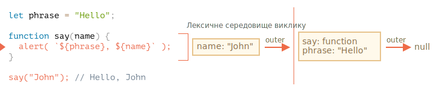

# Область видимості змінної, замикання

JavaScript -- це дуже функціонально орієнтована мова. Це дає нам багато свободи. Функцію можна створити в будь-який момент, її можна передати як аргумент іншій функції, а потім викликати з абсолютно іншого місця коду.

Ми вже знаємо, що функція може отримати доступ до змінних з зовнішнього середовища (зовнішні змінні).

Але що станеться, якщо зовнішні змінні зміняться після створення функції? Функція отримає нові значення чи старі?

А що буде, коли функція передається як параметр і викликається з іншого місця коду, чи отримає вона доступ до зовнішніх змінних на новому місці?

Давайте розширимо наші знання, щоб зрозуміти ці та більш складні сценарії.

```smart header="Тут ми поговоримо про змінні `let/const`"
У JavaScript існує 3 способи оголошення змінної: `let`, `const` (сучасні способи) та `var` (застарілий).

- У цій статті ми будемо використовувати `let` для змінних у прикладах.
- Змінні, оголошені через `const`, в цих аспектах поводяться так само, тому ця стаття також стосується `const`.
- `var` має деякі помітні відмінності, вони будуть розглянуті в статті <info:var>.
```

## Блоки коду

Якщо змінна оголошена всередині блоку коду `{...}`, вона буде доступна лише всередині цього блоку.

Наприклад:

```js run
{
  // тут виконується певна робота з локальними змінними, яку не слід бачити зовні

  let message = "Привіт"; // змінна, яка буде видима тільки у цьому блоці

  alert(message); // Привіт
}

alert(message); // ReferenceError: message is not defined
```

Ми можемо використовувати це, щоб ізолювати фрагмент коду разом із змінними, які стосуються лише його:

```js run
{
  // показати повідомлення
  let message = "Привіт";
  alert(message);
}

{
  // показати інше повідомлення
  let message = "Бувай";
  alert(message);
}
```

````smart header="Без блоків буде помилка"
Будь-ласка, зверніть увагу, що без окремих блоків буде помилка, якщо ми використовуємо `let` з однаковою назвою змінної:

```js run
// показати повідомлення
let message = "Привіт";
alert(message);

// показати інше повідомлення
*!*
let message = "Бувай"; // Помилка: змінна вже оголошена
*/!*
alert(message);
```
````

Для `if`, `for`, `while` і так далі, змінні, оголошені в `{...}` також видно тільки всередині:

```js run
if (true) {
  let phrase = "Привіт!";

  alert(phrase); // Привіт!
}

alert(phrase); // Помилка, за межами if такої змінної немає!
```

Тут, після завершення `if`, `alert` нижче не побачить `phrase`, отже, помилка.

Це чудово, оскільки це дозволяє нам створювати локально-блокові змінні, специфічні для гілки `if`.

Те ж саме справедливо і для циклів `for` та `while`:

```js run
for (let i = 0; i < 3; i++) {
  // змінну `i` видно тільки всередині цього циклу for
  alert(i); // 0, потім 1, потім 2
}

alert(i); // Помилка, такої змінної немає
```

Візуально, `let i` знаходиться за межами `{...}`. Але конструкція `for` особлива: змінна, оголошена всередині неї, вважається частиною блоку.

## Вкладені функції

Функція називається "вкладеною" (з англ. nested), коли вона створюється всередині іншої функції.

З JavaScript це зробити дуже легко.

І ми можемо використовувати це для організації нашого коду, наприклад:

```js
function sayHiBye(firstName, lastName) {

  // допоміжна вкладена функція для використання нижче
  function getFullName() {
    return firstName + " " + lastName;
  }

  alert( "Привіт, " + getFullName() );
  alert( "Бувай, " + getFullName() );

}
```

Тут *вкладена* функція `getFullName()` створена для зручності. Вона має доступ до внутрішніх змінних функції і тому може повернути повне ім’я. Вкладені функції досить поширені в JavaScript.

Що ще цікавіше, вкладену функцію можна повернути: як властивість нового об’єкта, або як самостійний результат. Потім її можна використати десь в іншому місці. Незалежно від того, де її викликають, вона завжди буде мати доступ до внутрішніх змінних функції, в якій її було створено.

Нижче, `makeCounter` створює функцію "counter", яка повертає наступний номер при кожному виклику:

```js run
function makeCounter() {
  let count = 0;

  return function() {
    return count++;
  };
}

let counter = makeCounter();

alert( counter() ); // 0
alert( counter() ); // 1
alert( counter() ); // 2
```

Незважаючи на простоту, трохи змінені варіанти цього коду мають практичне застосування, наприклад, [генератор псевдовипадкових чисел](https://uk.wikipedia.org/wiki/Генератор_псевдовипадкових_чисел) для генерації випадкових значень для автоматизованих тестів.

Як це працює? Якщо ми створимо кілька лічильників, чи будуть вони незалежними? Що відбувається зі змінними тут?

Розуміння таких речей чудово не тільки для загального знання JavaScript, але й корисно для роботи з більш складними сценаріями. Тож давайте трохи поглибимося.

## Лексичне середовище

```warn header="Тут будуть дракони!"
Поглиблене технічне пояснення попереду.

Чесно кажучи, пояснюючи це, я хотів би уникнути низькорівневих деталей, але без них розуміння буде не повним, тому готуйтесь.
```

Для наочності пояснення поділено на кілька етапів.

### 1 етап. Змінні

У JavaScript кожна запущена функція, блок коду `{...}`, і скрипт в цілому мають внутрішній (прихований) асоційований об’єкт, відомий як *Лексичне середовище (Lexical Environment)*.

Об’єкт лексичного середовища складається з двох частин:

1. *Запис середовища (Environment Record)* -- об’єкт, який зберігає всі локальні змінні в якості своїх властивостей (та деяку іншу інформацію, наприклад значення `this`).
2. Посилання на *зовнішнє лексичне середовище*, яке пов’язане із зовнішнім кодом.

**"Змінна" це лише властивість спеціального внутрішнього об’єкта, `Запис середовища (Environment Record)`. "Отримати або змінити змінну" означає "отримати або змінити властивість цього об’єкта".**

У цьому простому коді без функцій є лише одне лексичне середовище:


Це так зване *глобальне* лексичне середовище, пов’язане з усім скриптом.

На зображенні вище прямокутник означає запис середовища (сховище змінних), а стрілка означає зовнішнє посилання. Глобальне лексичне середовище не має зовнішнього посилання, тому стрілка вказує на `null`.

Коли код виконується, лексичне середовище змінюється.

Ось трохи довший код:


Прямокутники праворуч демонструють, як змінюється глобальне лексичне середовище під час виконання:

1. Коли скрипт запускається, лексичне середовище попередньо заповнюється усіма оголошеними змінними.
    - Спочатку вони перебувають у стані "Неініціалізовано" (Uninitialized). Це особливий внутрішній стан, який означає, що рушій знає про змінну, але на неї не можна посилатися, поки вона не буде оголошена з `let`. Це майже те саме, ніби змінна не існує.
2. Потім з’являється оголошення змінної `let phrase`. Поки що ми тільки оголосили змінну, тому її значення `undefined`. Але з цього моменту ми можемо використовувати її.
3. `phrase` присвоюється значення.
4. `phrase` змінює значення.

Поки що все виглядає просто, правда?

- Змінна -- це властивість спеціального внутрішнього об’єкта, пов’язана з блоком/функцієї/скриптом що зараз виконується.
- Робота зі змінними -- це насправді робота з властивостями цього об’єкта.

```smart header="Лексичне середовище -- це об'єкт специфікації"
"Лексичне середовище" -- це об’єкт специфікації: він існує лише "теоретично" в [специфікації мови](https://tc39.es/ecma262/#sec-lexical-environments) щоб показати, як все працює. Ми не можемо отримати цей об’єкт у нашому коді та керувати ним безпосередньо.

Також рушії JavaScript можуть його оптимізовувати, відкидати змінні, які не використовуються для економії пам’яті та виконувати інші внутрішні трюки, доки видима поведінка залишається такою, як описано у специфікації.
```

### 2 етап. Функції створені як Function Declarations

Функція також є значенням, як і значення всередині змінних.

**Різниця в тому, що функція створена за допомогою Function Declaration, ініціалізується миттєво і повністю.**

Коли створюється лексичне середовище, така функція відразу стає готовою до використання (на відміну від значення у змінній `let`, що непридатна для викорстиння до оголошення).

Ось чому ми можемо використовувати функцію, оголошену з Function Declaration, ще до рядка з оголошенням.

Наприклад, ось початковий стан глобального лексичного середовища, коли ми додаємо функцію:


Така поведінка стосується лише Function Declarations, а не Function Expressions, де ми призначаємо функцію змінній, наприклад ось так `let say = function(name)...`.

### 3 етап. Внутрішнє та зовнішнє лексичне середовище

Коли функція виконується, на початку виклику автоматично створюється нове лексичне середовище для зберігання локальних змінних та параметрів виклику.

Наприклад, для `say("John")`, це виглядає так (виконання знаходиться у рядку, позначеному стрілкою):

<!--
    ```js
    let phrase = "Hello";

    function say(name) {
     alert( `${phrase}, ${name}` );
    }

    say("John"); // Hello, John
    ```-->



Під час виклику функції у нас є два лексичні середовища: внутрішнє (для виклику функції) і зовнішнє (глобальне):

- Внутрішнє лексичне середовище відповідає поточному виконанню функції `say`. Воно має єдину властивість: `name` -- аргумент функції. Ми викликали `say("John")`, тож значення у `name` буде `"John"`.
- Зовнішнє лексичне середовище -- це глобальне лексичне середовище. У ньому є змінна `phrase` та сама функція.

Внутрішнє лексичне середовище має посилання на `зовнішнє`.

**Коли код хоче отримати доступ до змінної -- спочатку шукає її у внутрішньому лексичному середовищі, потім у зовнішньому, потім у зовнішньому до попереднього і так далі поки не дійде до глобального.**

Якщо змінна ніде не знайдена, то при `"use strict"` буде помилка (без `use strict` присвоєння неіснуючої змінної створює нову глобальну змінну для сумісності зі старим кодом).

У цьому прикладі пошук відбувається наступним чином:

- Для змінної `name`, `alert` у функції `say` знаходить її негайно у внутрішньому лексичному середовищі.
- Коли вона хоче отримати доступ до `phrase`, вона спочатку шукає її серед локальних змінних, де її немає, і врешті решт іде за посиланням на зовнішнє лексичне середовище і знаходить її там.


### 4 етап. Повернення функції

Повернемося до прикладу з `makeCounter`.

```js
function makeCounter() {
  let count = 0;

  return function() {
    return count++;
  };
}

let counter = makeCounter();
```

На початку кожного виклику `makeCounter()`, створюється новий об’єкт лексичного середовища для зберігання змінних конкретного виклику `makeCounter`.

Отже, у нас є два вкладених лексичних середовища, як і у прикладі вище:


Різниця полягає в тому, що під час виконання `makeCounter()`, створюється крихітна вкладена функція, яка складається лише з одного рядка: `return count++`. Ми не запускаємо її, лише створюємо.

Усі функції пам’ятають лексичне середовище, в якому вони були створені. Технічно тут немає ніякої магії: усі функції мають приховану властивість з назвою `[[Environment]]`, що зберігає посилання на лексичне середовище, де була створена функція:


Тому, `counter.[[Environment]]` має посилання на лексичне середовище, яке має вигляд `{count: 0}`. Так функція запам’ятовує, де вона була створена, незалежно від того, де вона викликається. Посилання у `[[Environment]]` встановлюється раз і назавжди під час створення функції.

Пізніше коли `counter()` викликається, для виклику створюється нове лексичне середовище, а посилання на зовнішнє лексичне середовище для нього береться з `counter.[[Environment]]`:


Тепер, коли код всередині `counter()` шукає змінну `count`, він спочатку шукає у власному лексичному середовищі (воно порожнє, оскільки там немає локальних змінних), потім у зовнішньому лексичному середовищі виклику `makeCounter()`, де він її знаходить і змінює.

**Змінна оновлюється в лексичному середовищі, де вона існує.**

Ось стан після виконання:


Якщо ми викликаємо `counter()` кілька разів, змінна `count` буде збільшена до `2`, `3` і так далі, в одному місці.

```smart header="Замикання"
У програмуванні існує загальний термін "замикання", який розробники зазвичай мають знати.

[Замикання](https://uk.wikipedia.org/wiki/Замикання_(програмування)) -- це функція, яка запам’ятовує свої зовнішні змінні та може отримати до них доступ. У деяких мовах це зовсім неможливо, або функція має бути написана особливим чином. Але, як пояснювалося вище, в JavaScript замикання для функції -- це природньо і не потребує жодних зусиль (є лише один виняток, який ми розглянемо у <info:new-function>).

Тобто: функції автоматично запам’ятовують, де вони були створені, використовуючи приховану властивість `[[Environment]]`, а потім їхній код може отримати доступ до зовнішніх змінних.

Коли під час співбесіди розробник отримує запитання "що таке замикання?", правильною відповіддю буде визначення замикання та пояснення, що всі функції в JavaScript є замиканнями, і, можливо, ще кілька слів про технічні деталі: властивість `[[Environment]]`, і як взагалі працюють лексичні середовища.
```

## Збирання сміття

Зазвичай після завершення виклику функції з пам’яті видаляється її лексичне середовище з усіма змінними. Це тому, що немає посилань на нього. Як і будь-який об’єкт JavaScript, він зберігається в пам’яті лише тоді, коли він досяжний.

Однак, якщо є вкладена функція, яка все ще доступна після завершення виклику основної функції, то вона має властивість `[[Environment]]`, яка посилається на лексичне середовище, створене під час виклику.

У цьому випадку лексичне середовище все ще доступне навіть після завершення функції, тому воно залишається "живим".

Наприклад:

```js
function f() {
  let value = 123;

  return function() {
    alert(value);
  }
}

let g = f(); // g.[[Environment]] зберігає посилання на лексичне середовище
// відповідного виклику f()
```

Зверніть увагу, що якщо `f()` викликається багато разів, а отримані функції зберігаються, тоді всі відповідні об’єкти лексичного середовища також будуть збережені в пам’яті. У коді нижче збережені всі три:

```js
function f() {
  let value = Math.random();

  return function() { alert(value); };
}

// три функції в масиві, кожна з яких пов’язана з лексичним середовищем
// відповідного виклику f()
let arr = [f(), f(), f()];
```

Об’єкт лексичного середовища "вмирає", коли стає недосяжним (як і будь-який інший об’єкт). Іншими словами, він існує лише тоді, коли на нього посилається принаймні одна вкладена функція.

У наведеному нижче коді після видалення вкладеної функції, лексичне середовище, до якого вона мала доступ, також стирається з пам’яті:

```js
function f() {
  let value = 123;

  return function() {
    alert(value);
  }
}

let g = f(); // поки функція g існує, значення залишається в пам’яті

g = null; // ...і тепер пам’ять очищена
```

### Оптимізації в реальному житті

Як ми бачили, теоретично, поки функція "жива", всі зовнішні змінні також зберігаються.

Але на практиці рушії JavaScript намагаються оптимізувати це. Вони аналізують використання змінних, і якщо з коду очевидно, що зовнішня змінна не використовується -- вона видаляється.

**Важливим побічним ефектом у рушія V8 (Chrome, Edge, Opera) є те, що така змінна стане недоступною під час налагодження.**

Спробуйте запустити наведений нижче приклад у Chrome із відкритими інструментами розробника.

Коли він призупиняється на `debugger`, в консолі введіть `alert(value)`.

```js run
function f() {
  let value = Math.random();

  function g() {
    debugger; // в консолі введіть: alert(value); і ви побачите, що такої змінної немає!
  }

  return g;
}

let g = f();
g();
```

Як бачите, такої змінної немає! Теоретично вона повинна бути доступною, але рушій це оптимізував.

Це може призвести до смішних (якщо не таких трудомістких) проблем з налагодженням. Одна з них -- ми можемо побачити зовнішню змінну з такою ж назвою замість очікуваної:

```js run global
let value = "Сюрприз!";

function f() {
  let value = "найближче значення";

  function g() {
    debugger; // в консолі введіть: alert(value); Сюрприз!
  }

  return g;
}

let g = f();
g();
```

Цю особливість V8 корисно знати. Якщо ви налагоджуєте свій код у Chrome/Edge/Opera, рано чи пізно ви її зустрінете.

Це не помилка, а скоріше особливість V8. Можливо, колись це буде змінено. Ви завжди можете перевірити це, запустивши приклади на цій сторінці.
