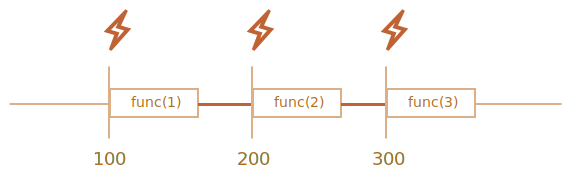

# Планування: setTimeout та setInterval

Ми можемо вирішити виконати функцію не зараз, а через певний час пізніше. Це називається "планування виклику".

Для цього існує два методи:

- `setTimeout` дозволяє нам запускати функцію **один раз** через певний інтервал часу.
- `setInterval` дозволяє нам запускати функцію **багаторазово**, починаючи через певний інтервал часу, а потім постійно повторюючи у цьому інтервалі.

Ці методи не є частиною специфікації JavaScript. Але більшість середовищ виконання JS-коду мають внутрішній планувальник і надають ці методи. Зокрема, вони підтримуються у всіх браузерах та Node.js.

## setTimeout

Синтаксис:

```js
let timerId = setTimeout(func|code, [delay], [arg1], [arg2], ...)
```

Параметри:

`func|code`
: Функція або рядок коду для виконання.
Зазвичай це функція. З історичних причин можна передати рядок коду, але це не рекомендується.

`delay`
: Затримка перед запуском, у мілісекундах (1000 мс = 1 секунда), типове значення -- 0.

`arg1`, `arg2`...
: Аргументи, які передаються у функцію (не підтримується в IE9-)

Наприклад, цей код викликає `sayHi()` через одну секунду:

```js run
function sayHi() {
  alert('Привіт');
}

*!*
setTimeout(sayHi, 1000);
*/!*
```

З аргументами:

```js run
function sayHi(phrase, who) {
  alert( phrase + ', ' + who );
}

*!*
setTimeout(sayHi, 1000, "Привіт", "Джон"); // Привіт, Джон
*/!*
```

Якщо перший аргумент - це рядок, то JavaScript створює з нього функцію.

Отже, це також буде працювати:

```js run no-beautify
setTimeout("alert('Привіт')", 1000);
```

Але використання рядків не рекомендується, використовуйте замість них стрілкові функції, наприклад:

```js run no-beautify
setTimeout(() => alert('Привіт'), 1000);
```

````smart header="Передайте функцію, але не запускайте її"
Розробники-початківці іноді помиляються, додаючи дужки `()` після функції:

```js
// неправильно!
setTimeout(sayHi(), 1000);
```
Це не працює, оскільки `setTimeout` очікує посилання на функцію. І тут `sayHi()` запускає функцію, і *результат її виконання* передається `setTimeout`. У нашому випадку результат `sayHi()` є `undefined` (функція нічого не повертає), тому нічого не планується.
````

### Скасування за допомогою clearTimeout

Виклик `setTimeout` повертає "ідентифікатор таймера" `timerId`, який ми можемо використовувати для скасування виконання.

Синтаксис для скасування:

```js
let timerId = setTimeout(...);
clearTimeout(timerId);
```

У наведеному нижче коді ми плануємо функцію, а потім скасовуємо її (просто передумали). В результаті нічого не відбувається:

```js run no-beautify
let timerId = setTimeout(() => alert("ніколи не відбувається"), 1000);
alert(timerId); // ідентифікатор таймера

clearTimeout(timerId);
alert(timerId); // той самий ідентифікатор (не приймає значення null після скасування)
```

Як ми бачимо з результату `alert`, в браузері ідентифікатор таймера -- це число. В інших середовищах це може бути щось інше. Наприклад, Node.js повертає об’єкт таймера з додатковими методами.

Знову ж таки, немає загальної специфікації для цих методів, тому це нормально.

Для браузерів таймери описані в [розділі таймерів](https://www.w3.org/TR/html5/webappapis.html#timers) стандарту HTML5.

## setInterval

Метод `setInterval` має той самий синтаксис, що і `setTimeout`:

```js
let timerId = setInterval(func|code, [delay], [arg1], [arg2], ...)
```

Усі аргументи мають такі ж самі значення. Але на відміну від `setTimeout`, цей метод запускає функцію не один раз, але регулярно через заданий проміжок часу.

Щоб припинити подальші виклики, нам слід викликати `clearInterval (timerId)`.

Наступний приклад буде відображати повідомлення кожні 2 секунди. Через 5 секунд вивід припиняється:

```js run
// повторити з інтервалом 2 секунди
let timerId = setInterval(() => alert('тік'), 2000);

// зупинити через 5 секунд
setTimeout(() => { clearInterval(timerId); alert('стоп'); }, 5000);
```

```smart header="Час продовжує йти, поки відображається `alert`"
У більшості браузерів, включаючи Chrome та Firefox, внутрішній таймер продовжує "тікати" тимчасом як показується `alert/confirm/prompt`.

Тому, якщо ви запустите наведений вище код і зачекаєте з закриттям `alert` деякий час, то наступний `alert` буде показано відразу ж, коли ви закриєте попередній. Фактичний інтервал між попередженнями буде меншим за 2 секунди.
```

## Вкладений setTimeout

Існує два способи запускати щось регулярно.

Один із них -- `setInterval`. Інший -- це вкладений `setTimeout`, наприклад:

```js
/** замість:
let timerId = setInterval(() => alert('тік'), 2000);
*/

let timerId = setTimeout(function tick() {
  alert('тік');
*!*
  timerId = setTimeout(tick, 2000); // (*)
*/!*
}, 2000);
```

Наведений вище `setTimeout` планує наступний виклик прямо в кінці поточного `(*)`.

Вкладений `setTimeout` є більш гнучким методом, ніж `setInterval`. Таким чином, наступний виклик може бути запланований по-різному, залежно від результатів поточного.

Наприклад, нам потрібно написати сервіс, який надсилає запит на сервер кожні 5 секунд для отримання даних, але у разі перевантаження сервера, він повинен збільшити інтервал до 10, 20, 40 секунд ...

Ось псевдокод:
```js
let delay = 5000;

let timerId = setTimeout(function request() {
  ...відправляємо запит...

  if (запит не вдався через перевантаження сервера) {
    // збільшити інтервал до наступного запуску
    delay *= 2;
  }

  timerId = setTimeout(request, delay);

}, delay);
```


І якщо функції, які ми плануємо, потребують багато процесорного ресурсу, ми можемо виміряти час, який витрачається на виконання, і рано чи пізно спланувати наступний виклик.

**Вкладений `setTimeout` дозволяє більш точно встановити затримку між виконанням, ніж `setInterval`.**

Давайте порівняємо два фрагменти коду. Перший використовує `setInterval`:

```js
let i = 1;
setInterval(function() {
  func(i++);
}, 100);
```

Другий використовує вкладений `setTimeout`:

```js
let i = 1;
setTimeout(function run() {
  func(i++);
  setTimeout(run, 100);
}, 100);
```

Для `setInterval` внутрішній планувальник запускатиме `func(i++)` кожні 100 мс:



Ви помітили?

**Фактична затримка між викликами `func` для `setInterval` менша, ніж у коді!**

Це нормально, оскільки час, необхідний для виконання `func`, "споживає" частину інтервалу.

Цілком можливо, що виконання `func` виявиться довшим, ніж ми очікували, і займе більше 100 мс.

У цьому випадку рушій чекає завершення `func`, а потім перевіряє планувальник і, якщо час закінчився, запускає його знову *негайно*.

У крайньому випадку, якщо функція завжди виконується довше, ніж `delay` мс, то виклики відбуватимуться взагалі без паузи.

І ось зображення процесу роботи вкладеного `setTimeout`:


**Вкладений `setTimeout` гарантує фіксовану затримку (тут 100 мс).**

Це тому, що новий виклик планується наприкінці попереднього.

````smart header="Збиранння сміття та setInterval/setTimeout колбек"
Коли функція передається у `setInterval/setTimeout`, до неї створюється внутрішнє посилання та зберігається у планувальнику. Це запобігає потраплянню функції до збиральника сміття, навіть якщо немає інших посилань на неї.

```js
// функція залишається в пам’яті до тих пір, поки її не викликає планувальник
setTimeout(function() {...}, 100);
```

Для `setInterval` функція залишається в пам’яті до виклику `clearInterval`.

Є й побічний ефект. Функція посилається на зовнішнє лексичне середовище, тому, поки вона живе, зовнішні змінні також живуть. Вони можуть зайняти набагато більше пам’яті, ніж сама функція. Тому, коли нам більше не потрібна запланована функція, краще її скасувати, навіть якщо вона дуже мала.
````

## setTimeout з нульовою затримкою

Існує особливий варіант використання: `setTimeout(func, 0)` або просто `setTimeout(func)`.

Це планує виконання `func` якнайшвидше. Але планувальник викликає його лише після завершення виконання поточного скрипту.

Таким чином, функція планується до запуску "відразу після" поточного скрипту.

Наприклад, це виводить "Привіт", а потім відразу "Світ":

```js run
setTimeout(() => alert("Світ"));

alert("Привіт");
```

Перший рядок "додає виклик у календар після 0мс". Але планувальник почне "перевіряти календар" тільки після завершення поточного скрипту, тому `"Привіт"` є першим, а `"Світ"` - після нього. The first line "puts the call into calendar after 0ms".

Існують також розширені, пов’язані з браузером, випадки використання тайм-аутів з нульовою затримкою, про які ми поговоримо в цьому розділі <info:event-loop>.

````smart header="Нульова затримка насправді не дорівнює нулю (у браузері)"
У браузері є обмеження щодо того, як часто можуть запускатися вкладені таймери. Згідно зі [стандартом HTML5](https://html.spec.whatwg.org/multipage/timers-and-user-prompts.html#timers): "після п’яти вкладених таймерів інтервал змушений бути не менше 4 мілісекунд.".

Давайте продемонструємо, що це означає, на прикладі нижче. `setTimeout` викликає перепланований себе з нульовою затримкою. Кожен виклик запам’ятовує реальний час з попереднього виклику в масиві `times`. Як виглядають реальні затримки? Подивимось:

```js run
let start = Date.now();
let times = [];

setTimeout(function run() {
  times.push(Date.now() - start); // запам’ятовуємо затримку з попереднього виклику

  if (start + 100 < Date.now()) alert(times); // показати затримки через 100 мс
  else setTimeout(run); // інакше перепланувати
});

// приклад можливого виводу:
// 1,1,1,1,9,15,20,24,30,35,40,45,50,55,59,64,70,75,80,85,90,95,100
```

Перші таймери запускаються негайно (так, як написано в специфікації), а потім у гру вступає оов’язкова затримка між викликами 4+ мс і ми бачимо `9, 15, 20, 24 ...`.

Подібне відбувається, якщо ми використовуємо `setInterval` замість `setTimeout`: `setInterval(f)` запускає `f` кілька разів з нульовою затримкою, а потім із затримкою 4+ мс.

Це обмеження походить з давніх часів, і багато сценаріїв спираються на нього, тому воно існує з історичних причин.

Таке обмеження відсутнє для серверного JavaScript і там існують інші способи планування негайної асинхронної задачі, наприклад [setImmediate](https://nodejs.org/api/timers.html#timers_setimmediate_callback_args) для Node.js. Тому ця примітка є специфічною для браузерів.
````

## Підсумки

- Методи `setTimeout (func, delay, ... args)` і `setInterval (func, delay, ... args)` дозволяють запускати `func` один раз/регулярно після `delay` мілісекунд.
- Щоб скасувати виконання, нам слід викликати `clearTimeout/clearInterval` зі значенням, яке повертає `setTimeout/setInterval`.
- Вкладені виклики `setTimeout` є більш гнучкою альтернативою` setInterval`, що дозволяє нам більш точно встановити час *між* виконаннями.
- Планування з нульовою затримкою за допомогою `setTimeout(func, 0)` (те саме, що `setTimeout(func)`) використовується для планування виклику "якомога швидше, але після завершення поточного скрипту".
- Браузер обмежує мінімальну затримку для п’яти або більше вкладених викликів `setTimeout` або` setInterval` (після 5 -го виклику) до 4 мс. Це з історичних причин.

Зверніть увагу, що всі методи планування *не гарантують* точну затримку.

Наприклад, таймер у браузері може сповільнитися з багатьох причин:
- Процесор перевантажений.
- Вкладка браузера знаходиться у фоновому режимі.
- Ноутбук працює від акумулятора.

Все це може збільшити мінімальний інтервал спрацьовування таймера (мінімальну затримку) до 300 мс або навіть 1000 мс залежно від налаштувань продуктивності на рівні браузера та ОС.
