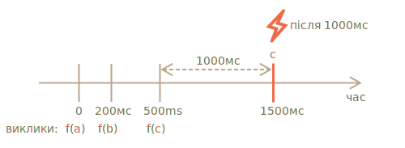

importance: 5

---

# Декоратор debounce

Результат `debounce(f, ms)` декоратору -- це обгортка, що призупиняє виклики до `f`, поки не пройде `ms` мілісекунд бездіяльності (без викликів, "cooldown period"), а потім викликає `f` один раз з останніми аргументами.

Іншими словами, `debounce` -- це як секретар, який приймає "телефонні дзвінки", і чекає, поки не закінчаться `ms` мілісекунди тиші. І лише тоді він передає останню інформацію про виклик до "боса" (викликає фактичну `f`).

Наприклад, у нас була функція `f` і замінили її на `f = debounce(f, 1000)`.

Тоді, якщо загорнута функція викликається при 0 мс, 200 мс та 500 мс, а потім викликів немає, то фактична `f` буде викликатися лише один раз, при 1500 мс. Тобто: після закінчення періоду 1000 мс від останнього виклику.



...І вона отримає аргументи самого останнього виклику, а інші виклики будуть ігноруватися.

Ось код для цього (використовує декоратор debounce з [Lodash library](https://lodash.com/docs/4.17.15#debounce)):

```js
let f = _.debounce(alert, 1000);

f("a");
setTimeout( () => f("b"), 200);
setTimeout( () => f("c"), 500);
// повернута з debounced функція чекає 1000 мс після останнього виклику, а потім запускає: alert("c")
```

Тепер практичний приклад. Скажімо, користувач друкує щось, і ми хотіли б надіслати запит на сервер, коли ввід закінчиться.

Немає сенсу надсилати запит на кожен набраний символ. Замість цього ми хотіли б почекати, а потім обробляти весь результат.

У веббраузері ми можемо налаштувати обробник подій -- функцію, яка викликається при кожній зміні поля введення.Зазвичай, обробник подій викликається дуже часто, для кожного друкованого символу. Але якщо ми використаємо `debounce` на 1000 мс, то він буде викликатися лише один раз, через 1000 мс після останнього введення.

```online

У цьому реальному прикладі обробник ставить результат у поле нижче, спробуйте це:

[iframe border=1 src="debounce" height=200]

Бачите? Другий ввід викликає функцію, що була повернута з `debounce`, тому цей вміст обробляється через 1000 мс з останнього введення.
```

Отже, `debounce` -- це чудовий спосіб обробки послідовності подій: будь то послідовність натискання клавіш, рухів миші або щось інше.

Він чекає певного часу після останнього дзвінка, а потім запускає свою функцію, яка може обробити результат.

Завдання полягає в тому, щоб реалізувати декоратор `debounce`.

Підказка: Це лише кілька рядків, якщо ви думаєте про це :)
