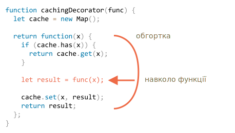

# Декоратори та переадресація виклику, call/apply

JavaScript дає виняткову гнучкість при роботі з функціями. Вони можуть бути передані в інші функції, використані як об'єкти, і тепер ми побачимо, як *перенаправляти* виклики між ними і *декорувати* їх.

## Прозоре кешування

Скажімо, у нас є функція `slow(x)`, яка виконує ресурсоємкі операції, але її результати стабільні. Іншими словами, для того ж `x` вона завжди повертає той же результат.

Якщо функція часто викликається, ми можемо кешувати (запам'ятати) її результати, щоб не витрачати час на перерахування.

Але замість того, щоб додати цю функціональність в `slow()` ми створимо функцію-обгортку, що додає кешування. Як ми побачимо, існує багато переваг такого підходу.

Ось код та пояснення:

```js run
function slow(x) {
  // тут можуть бути важкі ресурсозатратні операції
  alert(`Викликана з ${x}`);
  return x;
}

function cachingDecorator(func) {
  let cache = new Map();

  return function(x) {
    if (cache.has(x)) {    // якщо такий ключ є в кеш
      return cache.get(x); // прочитайти результат з нього
    }

    let result = func(x);  // в іншому випадку викликати func

    cache.set(x, result);  // і кешувати (запам'ятати) результат
    return result;
  };
}

slow = cachingDecorator(slow);

alert( slow(1) ); // slow(1) is cached and the result returned
alert( "Again: " + slow(1) ); // slow(1) result returned from cache

alert( slow(2) ); // slow(2) is cached and the result returned
alert( "Again: " + slow(2) ); // slow(2) result returned from cache
```

У коді вище `cachingDecorator` -- це *декоратор*: спеціальна функція, яка бере іншу функцію і змінює її поведінку.

Ідея полягає в тому, що ми можемо викликати `cachingDecorator` для будь-якої функції, і вона поверне обгортку з кешуванням. Це чудово тому, що ми можемо мати багато функцій, які могли б використовувати таку особливість, і все, що нам потрібно зробити, це примінити до них `cachingDecorator`.

Розділяючи кешування та код основної функції, ми також зберігаємо простоту основного коду.

Результат `cachingDecorator(func)` являє собою "обгортку": `function(x)`, що "обгортає" виклик `func(x)` в логіку кешування:



З зовнішнього коду, загорнута `slow` функція все ще робить те ж саме. Обгортка тільки додає кешування до її поведінки.

Підсумовуючи, існує кілька переваг використання окремого `cachingDecorator`, замість того, щоб змінити код самої `slow`:

- `cachingDecorator` багаторазовий. Ми можемо застосувати його до іншої функції.
- Логіка кешування відокремлена, вона не збільшила складність самої `slow` (якщо така була).
- Ми можемо поєднати декілька декораторів, якщо це необхідно (це ми розглянемо пізніше).

## Використання "func.call" для контексту

Кешуючий декоратор, згаданий вище, не підходить для роботи з методами об'єкта.

Наприклад, у коді нижче `worker.slow()` перестане працювати після використання декоратора:

```js run
// ми зробимо worker.slow з кешуванням
let worker = {
  someMethod() {
    return 1;
  },

  slow(x) {
    // страшно тяжке для процесора завдання тут  
    alert("Called with " + x);
    return x * this.someMethod(); // (*)
  }
};

// той же код, як і раніше
function cachingDecorator(func) {
  let cache = new Map();
  return function(x) {
    if (cache.has(x)) {
      return cache.get(x);
    }
*!*
    let result = func(x); // (**)
*/!*
    cache.set(x, result);
    return result;
  };
}

alert( worker.slow(1) ); // оригінальний метод працює

worker.slow = cachingDecorator(worker.slow); // тепер зробимо йому кешування

*!*
alert( worker.slow(2) ); // Ой! Помилка: Cannot read property 'someMethod' of undefined (*)
*/!*
```

Помилка виникає в рядку `(*)`, що намагається отримати доступ до `this.someMethod` та завершається з помилкою. Чи можете ви зрозуміти, чому?

Причиною є те, що обгортка викликає оригінальну функцію, як `func(x)` у рядку `(**)`. І, коли ця функція викликається так, вона отримує `this = undefined`.

Ми спостерігаємо подібну ситуацію, коли намагаємося запустити:

```js
let func = worker.slow;
func(2);
```

Отже, обгортка передає виклик до оригінального методу, але без контексту `this`. Звідси помилка.

Давайте це виправимо.

Існує спеціальний вбудований метод функції [func.call(context, ...args)](mdn:js/Function/call), що дозволяє викликати функцію явно задаючи їй `this`.

Синтаксис:

```js
func.call(context, arg1, arg2, ...)
```

Вона викликає `func`, використовуючи перший аргумент як `this`, а наступний -- як аргументи.

Простіше кажучи, ці два виклики майже однакові:
```js
func(1, 2, 3);
func.call(obj, 1, 2, 3)
```

Обидва вони викликаюсь `func` з аргументами `1`, `2` і `3`. Єдина відмінність полягає в тому, що `func.call` також встановлює `this` рівним `obj`.

Як приклад, у коді нижче ми викликаємо `sayHi` в контексті різних об'єктів: `sayHi.call(user)` викликає `sayHi`, передаючи `this=user`, а на наступних рядках встановлюється `this=admin`:

```js run
function sayHi() {
  alert(this.name);
}

let user = { name: "Іван" };
let admin = { name: "Адмін" };

// використовуйте call, щоб передати різні об'єкти як "this"
sayHi.call( user ); // Іван
sayHi.call( admin ); // Адмін
```

І тут ми використовуємо `call`, щоб викликати `say` з даним контекстом і фразою:


```js run
function say(phrase) {
  alert(this.name + ': ' + phrase);
}

let user = { name: "Іван" };

// користувач стає this, і "Привіт" стає першим аргументом
say.call( user, "Привіт" ); // Іван: Привіт
```

У нашому випадку ми можемо використовувати `call` у обгортці, щоб передати контекст до початкової функції:

```js run
let worker = {
  someMethod() {
    return 1;
  },

  slow(x) {
    alert("Викликана з " + x);
    return x * this.someMethod(); // (*)
  }
};

function cachingDecorator(func) {
  let cache = new Map();
  return function(x) {
    if (cache.has(x)) {
      return cache.get(x);
    }
*!*
    let result = func.call(this, x); // "this" зараз передано правильно
*/!*
    cache.set(x, result);
    return result;
  };
}

worker.slow = cachingDecorator(worker.slow); // тепер зробимо цьому методу кешування

alert( worker.slow(2) ); // працює
alert( worker.slow(2) ); // працює, не викликаючи оригінальну функцію (кешується)
```

Тепер все добре.

Щоб все було зрозуміло, давайте подивимося більш глибоко, як `this` передається:

1. Після декорування `worker.slow` стає функцією обгортки `function (x) { ... }`.
2. Отже, коли `worker.slow(2)` виконується, обгортка отримує `2` в якості аргумента і `this=worker` (це об'єкт перед крапкою).
3. Всередині обгортки, якщо результат ще не кешований, `func.call(this, x)` передає поточний `this` (`=worker`) та поточний аргумент (`=2`) до оригінального методу.

## Переходимо до декількох аргументів з «func.apply»

Тепер давайте зробимо `cachingDecorator` ще більш універсальним. Дотепер він працював лише з функціями з одним аргументом.

Тепер, як кешувати метод `worker.slow` з багатьма аргументами?

```js
let worker = {
  slow(min, max) {
    return min + max; // тут може бути складна задача
  }
};

// слід запам'ятати виклики з однаковими аргументами
worker.slow = cachingDecorator(worker.slow);
```

Раніше, для одного аргументу `x`, ми могли просто `cache.set(x, result)`, щоб зберегти результат та `cache.get(x)`, щоб отримати його. Але тепер нам потрібно пам'ятати результат для *комбінації аргументів* `(min,max)`. Вбудований `Map` приймає лише одне значення як ключ.

Є багато можливих рішень:

1. Впровадити нову (або скористайтеся сторонньою) map-подібну структуру даних, яка більш універсальна і дозволяє використовувати декілька ключів.
2. Використати вкладені коллекції: `cache.set(min)` буде `Map`, що зберігає пару `(max, result)`. Таким чином, ми можемо отримати `result` як `cache.get(min).get(max)`.
3. З'єднати два значення в одне. У нашому конкретному випадку ми можемо просто використовувати рядок `"min,max"` як ключ `Map`. Для гнучкості ми можемо забезпечити *функція хешування* для декоратора, що знає, як зробити одне значення з багатьох.

Для багатьох практичних застосунків, 3-й варіант досить хороший, тому ми будемо дотримуватися його.

Також ми повинні передати не просто `x`, але всі аргументи в `func.call`. Давайте пригадаємо, що в `function()` ми можемо отримати псевдо-масив її аргументів, як `arguments`, тому `func.call(this, x)` слід замінити на `func.call(this, ...arguments)`.

Ось більш потужний `cachingDecorator`:

```js run
let worker = {
  slow(min, max) {
    alert(`Викликана з ${min},${max}`);
    return min + max;
  }
};

function cachingDecorator(func, hash) {
  let cache = new Map();
  return function() {
*!*
    let key = hash(arguments); // (*)
*/!*
    if (cache.has(key)) {
      return cache.get(key);
    }

*!*
    let result = func.call(this, ...arguments); // (**)
*/!*

    cache.set(key, result);
    return result;
  };
}

function hash(args) {
  return args[0] + ',' + args[1];
}

worker.slow = cachingDecorator(worker.slow, hash);

alert( worker.slow(3, 5) ); // працює
alert( "Знову " + worker.slow(3, 5) ); // те ж саме значення (з кешу)
```

Тепер він працює з будь-якою кількістю аргументів (хоча хеш-функція також повинна бути пристосована, щоб використовувати будь-яку кількість аргументів. Цікавий спосіб зробити це буде наведено нижче).

Є дві зміни:

- В рядку `(*)` викликається `hash`, щоб створити одну ключ з `arguments`. Тут ми використовуємо просту функцію "приєднання", яка перетворює аргументи `(3, 5)` у ключ `"3,5"`. Більш складні випадки можуть потребувати інших функцій хешування.
- Потім `(**)` використовує `func.call(this, ...arguments)`, щоб передати як контекст, так і всі аргументи (а не тільки перший) обгортки до оригінальної функції.

## func.apply

Замість `func.call(this, ...arguments)` ми могли б використовувати `func.apply(this, arguments)`.

Синтаксис вбудованого методу [func.apply](mdn:js/Function/apply):

```js
func.apply(context, args)
```

Він запускає `func`, встановлюючи `this = context` і використовує псевдо-масив `args` як список аргументів.

Єдина різниця синтаксису між `call` та `apply` в тому, що `call` очікує список аргументів, в той час як `apply` приймає псевдо-масив з ними.

Отже, ці два виклики майже еквівалентні:

```js
func.call(context, ...args);
func.apply(context, args);
```

Вони виконують той самий виклик `func` з даним контекстом та аргументами.

Є тільки тонка різниця щодо `args`:

- Оператор розширення `...` дозволяє передати *ітерований* `args` як список до `call`.
- `apply` приймає лише *псевдо-масив* `args`.

... і для об'єктів, які є як ітерованими, так і псевдо-масивами, а так само як і справжніми масивами, ми можемо використовувати будь-який з цих методів, але `apply`, мабуть, буде швидше, тому що більшість рушіїв JavaScript внутрішньо оптимізують його краще.

Передача всіх аргументів разом з контекстом до іншої функції називається *переадресація виклику*.

Це найпростіша її форма:

```js
let wrapper = function() {
  return func.apply(this, arguments);
};
```

Коли зовнішній код викликає такий `wrapper`, це не відрізняється від виклику оригінальної функції `func`.

## Запозичення методу [#method-borrowing]

Тепер давайте зробимо ще одне незначне поліпшення функції хешування:

```js
function hash(args) {
  return args[0] + ',' + args[1];
}
```

Зараз вона працює лише на двох аргументах. Було б краще, якби вона могла зкріпити будь-яку кількість `args`.

Звичайним рішенням буде використати [arr.join](mdn:js/Array/join) метод:

```js
function hash(args) {
  return args.join();
}
```

...На жаль, це не буде працювати. Тому що ми викликаємо `hash(arguments)`, а об'єкт `arguments` є як ітерованим, так і псевдо-масивом, але не справжнім масивом.

Отже, виклик `join` на цьому об'єкті буде призводити до помилки, що ми бачимо нижче:

```js run
function hash() {
*!*
  alert( arguments.join() ); // Помилка: arguments.join не є функцією
*/!*
}

hash(1, 2);
```

Тим не менш, є простий спосіб використи з'єднання масиву:

```js run
function hash() {
*!*
  alert( [].join.call(arguments) ); // 1,2
*/!*
}

hash(1, 2);
```

Трюк називається *запозичення методу*.

Ми беремо (запозичуємо) метод приєднання від звичайного масиву (`[].join`) і використовуємо `[].join.call` щоб запустити його в контексті `arguments`.

Чому це працює?

Це тому, що внутрішній алгоритм нативного методу `arr.join(glue)` дуже простий.

Взято зі специфікації майже "як-є":

1. Нехай `glue` буде першим аргументом або, якщо немає аргументів, то ним буде кома `","`.
2. Нехай `result` буде порожнім рядком.
3. Додати `this[0]` до `result`.
4. Додати `glue` і `this[1]`.
5. Додати `glue` і `this[2]`.
6. ...Робити це до тих пір, поки `this.length` елементів буде склеїно.
7. Повернути `result`.

Отже, технічно цей метод приймає `this` і з'єднує `this[0]`, `this[1]`  ... і т.д. разом. Він навмисно написаний таким чином, що дозволяє будь-який псевдо-масив `this` (не випадково, багато методів дотримуються цієї практики). Ось чому це також працює з `this=arguments`.

## Декоратори та функціональні властивості

Як правило, можна безпечно замінити функцію або метод декоратором, за винятком однієї дрібниці. Якщо оригінальна функція мала властивості в собі, як наприклад `func.calledCount` або щось інше, то декорований об'єкт не буде надавати доступ до них. Тому що це обгортка. Тому потрібно бути обережним, якщо використовує її.

Наприклад, у прикладі вище, якщо `slow` функція мала будь-які властивості в собі, то `cachingDecorator(slow)` -- це обгортка без них.

Деякі декоратори можуть забезпечити свої власні властивості.Наприклад, декоратор може підрахувати, скільки разів функція була викликана, і скільки часу це зайняло, і виставляти цю інформацію за допомогою властивостей обгортки.

Існує спосіб створити декоратори, які зберігають доступ до властивостей функцій, але це вимагає використання спеціального об'єкту `Proxy`, щоб обернути функцію. Ми обговоримо це пізніше у статті <info:proxy#proxy-apply>.

## Підсумки

*Декоратор* -- це обгортка навколо функції, яка змінює її поведінку. Основна робота все ще виконується за допомогою функції.

Декоратори можна розглядати як "особливості" або "аспекти", які можна додати до функції. Ми можемо додати один або додати багато декораторів. І все це, не змінюючи коду оригінальної функції!

Для реалізації `cachingDecorator`, ми вивчали методи:

- [func.call(context, arg1, arg2...)](mdn:js/Function/call) -- викликає `func` з заданим контекстом та аргументами.
- [func.apply(context, args)](mdn:js/Function/apply) -- викликає `func` передаючи `context` як `this` та псевдо-масив `args` як список аргументів.

Зазвичай *переадресація викликів* виконується завдяки `apply`:

```js
let wrapper = function() {
  return original.apply(this, arguments);
};
```

Ми також бачили приклад *запозичення методу*, коли ми беремо метод з об'єкта та `call` його в контексті іншого об'єкта.Досить поширено брати методи масиву та застосувати їх до `arguments`. Альтернативою є використання об'єкта, який є справжнім масивом, за допомогою rest оператору.

На практиці є багато декораторів для різних задач. Перевірте, наскільки добре ви засвоїли їх, вирішивши завдання цієї глави.
