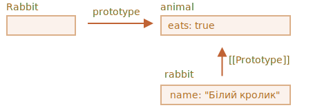
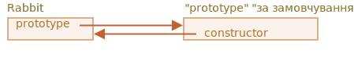
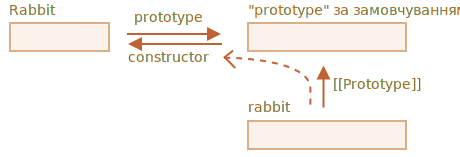

# F.prototype

Як відомо, ми можемо створювати нові об’єкти за допомогою функції-конструктора, ось так `new F()`.

Якщо розглядати `F.prototype` як властивість об’єкта, то оператор `new` автоматично створює приховану властивість `[[Prototype]]` для новоствореного об’єкта.

```smart
JavaScript мала можливість успадкування властивостей через прототипи ще від самого початку її створення. Це було одним з головних особливостей мови.

Але в ті часи, не було прямого доступу до прототипів. Тільки одна річ, яка працювала надійно, була властивість функції-конструктора `"prototype"` , яка і описана в цій главі. Ось чому ще існує багато коду де цю властивість використовують.
```

Зауважте, що `F.prototype` тут означає звичайну властивість, яку назвали `"prototype"` в об’єкті `F`. Це звучить дуже співзвучно з терміном "prototype", але тут це означає всього лиш звичайне ім’я властивості.

Ось приклад:

```js run
let animal = {
  eats: true
};

function Rabbit(name) {
  this.name = name;
}

*!*
Rabbit.prototype = animal;
*/!*

let rabbit = new Rabbit("White Rabbit"); //  rabbit.__proto__ == animal

alert( rabbit.eats ); // true
```

Вираз `Rabbit.prototype = animal` дослівно означає наступне: "коли `new Rabbit` створено, його властивість `[[Prototype]]` посилається на об’єкт `animal`".

Ось кінцева картинка:



На картинці, `"prototype"` що показана горизонтальною стрілкою, це звичайна властивість, а `[[Prototype]]`показана вертикальною, що означає `rabbit` успадковує властивості від свого прототипа `animal`.

```smart header="`F.prototype` використовується тільки у разі використання функції-конструктора `new F`"
Властивість `F.prototype` використовується коли буде викликано `new F`, і створює властивість `[[Prototype]]` для нового об’єкта.

Якщо властивість `F.prototype` після створення змінюється (`F.prototype = <another object>`), тоді і новий об’єкт який створюється функцією-конструктором `new F` буде мати посилання `[[Prototype]]` на інший об’єкт, а в раніше створених об’єктах є свої прототипи які були визначені ще  при їх створенні.
```

## Типове значення F.prototype, властивості конструктора

Кожна функція має властивість `"prototype"` навіть якщо ми цю властивість самі не прописуємо. Тобто вона існує за замовчуванням, або ця властивість є типовою.

В свою чергу, така типова властивість `"prototype"` представляє собою об’єкт, який має єдину властивість з назвою `constructor`, що зворотньо посилається на назву самої функції-конструктора.

Ось як тут:

```js
function Rabbit() {}

/* властивість створена за замовчуванням
Rabbit.prototype = { constructor: Rabbit };
*/
```



Можемо перевірити це:

```js run
function Rabbit() {}
// за замовчуванням:
// Rabbit.prototype = { constructor: Rabbit }

alert( Rabbit.prototype.constructor == Rabbit ); // true
```

Отже, якщо ми нічого не робимо з властивістю `constructor` то вона є доступна для всіх об’єктів rabbits через `[[Prototype]]`:

```js run
function Rabbit() {}
// за замовчуванням:
// Rabbit.prototype = { constructor: Rabbit }

let rabbit = new Rabbit(); // успадковує від {constructor: Rabbit}

alert(rabbit.constructor == Rabbit); // true (від прототипу)
```



Ми можемо використовувати властивість `constructor` для створення нових об’єктів використовуючи той самий конструктор, який вже існує.

Як тут:

```js run
function Rabbit(name) {
  this.name = name;
  alert(name);
}

let rabbit = new Rabbit("White Rabbit");

*!*
let rabbit2 = new rabbit.constructor("Black Rabbit");
*/!*
```

Це дуже практично у випадку наявності об’єкта, але не знаємо за допомогою якого саме конструктора той об’єкт був створений (для прикладу який був імпортований з якоїсь бібліотеки), а нам потрібно створити новий об’єкт по типу того, що вже існує.

Але самим важливим моментом щодо `"constructor"` є те, що...

**...Сама мова JavaScript не забезпечує правильного значення `"constructor"`.**

Так, воно існує за замовчуванням у властивостях `"prototype"` для функцій, але це все, що є. Те, що стається з `"constructor"` пізніше, цілковито залежить від нас самих.

А саме, якщо ми замінимо типове значення на якесь інше, тоді в ньому не буде ніякого `"constructor"`.

Наприклад:

```js run
function Rabbit() {}
Rabbit.prototype = {
  jumps: true
};

let rabbit = new Rabbit();
*!*
alert(rabbit.constructor === Rabbit); // false
*/!*
```

Отже, щоб мати правильний `"constructor"` ми можемо чи додавати, чи видаляти властивості у дефолтному `"prototype"` замість того, щоб її цілковито заміняти:

```js
function Rabbit() {}

// Тут ми не заміняємо цілковито властивість Rabbit.prototype
// а просто додаємо до неї
Rabbit.prototype.jumps = true
// а тому дефолтне Rabbit.prototype.constructor зберігається
```

чи по іншоу, відновлюємо `constructor` ручним способом:

```js
Rabbit.prototype = {
  jumps: true,
*!*
  constructor: Rabbit
*/!*
};

// і тепер, constructor також правильний, тому що ми додали його вручну
```


## Підсумок

В цьому розділі було коротко описано шлях для встановлення прихованої властивості `[[Prototype]]` об’єктів, які були створені за допомогою функції-конструктора. Пізніше, буде надано більше прикладів коду, які покладаються на ці властивості.

Все досить просто, тільки треба додати кілька деталей щоб усе було зрозуміло:

- Властивість об’єкта `F.prototype` (ні в якому разі не `[[Prototype]]`) встановлює приховану властивість `[[Prototype]]` нового об’єкта, тільки тоді, коли буде викликана через `new F()`.
- Значення властивості `F.prototype` може бути, або посиланням на об’єкт, або `null`: інші значення не працюють.
- Тільки властивість `"prototype"` має такий спеціальний ефект: може встановлюватись в конструкторі та може викликатись через оператор `new`.

У звичайних об’єктах властивість `prototype` не є чимось спеціальним:
```js
let user = {
  name: "John",
  prototype: "Bla-bla" // немає ніякої магії
};
```

За замовчуванням, усі функції мають `F.prototype = { constructor: F }`, і ми можемо отримати конструктор об’єкта через його властивість `"constructor"`.
