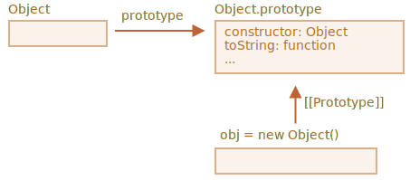

# Вбудовані прототипи

Властивість `"prototype"` широко використовується ядром самого JavaScript. Всі вбудовані функції конструктора використовують її.

Спочатку ми розглянемо деталі, а потім розберемося як використовувати `"prototype"` для додавання нових можливостей вбудованим об’єктам.

## Object.prototype

Скажімо, ми виводимо порожній об’єкт:

```js run
let obj = {};
alert( obj ); // "[object Object]" ?
```

Де код, який генерує рядок `"[object Object]"`? Це вбудований метод `toString`, але де це? `obj` порожній!

...але коротке позначення `obj = {}` -- це те саме, що `obj = new Object()`, де `Object` є вбудованою функцією-конструктором об’єкта, з власним `prototype`, що посилається на величезний об’єкт з `toString` та іншими методами.

Ось що відбувається:


Коли викликається `new Object()` (або створюється літеральний об’єкт `{...}`), у властивість `[[Prototype]]` встановлюється `Object.prototype` згідно з правилом, який ми обговорювали у попередньому розділі:



Отже, коли викликається `obj.toString()`, цей метод береться з `Object.prototype`.

Ми можемо перевірити це так:

```js run
let obj = {};

alert(obj.__proto__ === Object.prototype); // true

alert(obj.toString === obj.__proto__.toString); //true
alert(obj.toString === Object.prototype.toString); //true
```

Будь ласка, зверніть увагу, що більше немає `[[Prototype]]` у ланцюгу викликів над `Object.prototype`:

```js run
alert(Object.prototype.__proto__); // null
```

## Інші вбудовані прототипи

Інші вбудовані об’єкти, такі як `Array`, `Date`, `Function` та інші також зберігають методи у прототипах.

Наприклад, коли ми створюємо масив `[1, 2, 3]`, внутрішньо використовується конструктор `new Array()`. Таким чином `Array.prototype` стає його прототипом і надає свої методи. Це дуже ефективно.

За специфікацією, на вершині ієрархії всі вбудовані прототипи мають `Object.prototype`. Ось чому деякі люди кажуть, що "все успадковується від об’єктів".

Ось загальна картина (для 3 вбудованих об’єктів):


Перевірмо прототипи вручну:

```js run
let arr = [1, 2, 3];

// arr успадковується від Array.prototype?
alert( arr.__proto__ === Array.prototype ); // true

// потім від Object.prototype?
alert( arr.__proto__.__proto__ === Object.prototype ); // true

// і null на вершині.
alert( arr.__proto__.__proto__.__proto__ ); // null
```

Деякі методи в прототипах можуть перекриватися, наприклад, `Array.prototype` має свій власний `toString`, який перелічує елементи розділені комами:

```js run
let arr = [1, 2, 3]
alert(arr); // 1,2,3 <-- результат Array.prototype.toString
```

Як ми бачили раніше, `Object.prototype` також має `toString`, але `Array.prototype` ближче по ланцюгу прототипів, тому використовується варіант масиву.


Інструменти браузера, такі як консоль розробника Chrome, також показують наслідування (можливо, доведеться використовувати `console.dir` для вбудованих об’єктів):


Інші вбудовані об’єкти також працюють так само. Навіть функції -- вони є об’єктами вбудованого конструктора `Function`, а їхні методи (`call`/`apply` та інші) беруться з `Function.prototype`. Функції мають власні `toString`.

```js run
function f() {}

alert(f.__proto__ == Function.prototype); // true
alert(f.__proto__.__proto__ == Object.prototype); // true, успадковується від об’єктів
```

## Примітиви

Найскладніша річ відбувається з рядками, числами та бульовими значеннями.

Як ми пам’ятаємо, вони не є об’єктами. Але якщо ми спробуємо отримати доступ до їх властивостей, створюються тимчасові об’єкти-обгортки, використовуючи вбудовані конструктори `String`, `Number` та `Boolean`. Вони забезпечують методи, а після цього зникають.

Ці об’єкти створюються приховано від нас, і більшість рушіїв оптимізують їх, але специфікація описує це саме таким чином.Методи цих об’єктів також знаходяться у прототипах, доступних як `String.prototype`, `Number.prototype` та `Boolean.prototype`.

```warn header="Значення `null` та `undefined` не мають жодних об’єктів-обгорток"
Спеціальні значення `null`  та `undefined` стоять окремо. Вони не мають об’єктів-обгорток, тому для них недоступні методи та властивості. І вони також не мають відповідних прототипів.
```

## Зміна вбудованих прототипів [#native-prototype-change]

Вбудовані прототипи можуть бути змінені. Наприклад, якщо додати спосіб до `String.prototype, він стає доступним для всіх рядків:

```js run
String.prototype.show = function() {
  alert(this);
};

"БУМ!".show(); // БУМ!
```

Під час розробки ми можемо мати ідеї для нових вбудованих методів, які ми хотіли б мати, і ми можемо мати спокусу додати їх до вбудованих прототипів. Але це, як правило, погана ідея.

```warn
Прототипи є глобальними, тому так можна легко отримати конфлікт. Якщо дві бібліотеки додають метод `String.prototype.show`, то один з них буде перезаписаний іншим.

Отже, загалом, модифікація вбудованого прототипу вважається поганою ідеєю.
```

**У сучасному програмі існує лише один випадок, коли затверджується модифікація рідних прототипів. Це створення поліфілів.**

Поліфіл -- це термін, що означає заміну методу, який існує в специфікації JavaScript, але ще не підтримується певним рушієм JavaScript.

Тоді ми можемо реалізувати його вручну та заповнити вбудований прототип ним.

Наприклад:

```js run
if (!String.prototype.repeat) { // якщо такого методу немає
  // додайте його до прототипу

  String.prototype.repeat = function(n) {
    // повторіть рядок n разів

    // власне, код повинен бути трохи складнішим, ніж це
    // (повний алгоритм у можна знайти в специфікації)
    // але навіть недосконалий поліфіл часто вважається досить добрим
    return new Array(n + 1).join(this);
  };
}

alert( "Ла".repeat(3) ); // ЛаЛаЛа
```


## Запозичення з прототипів

У розділі <info:call-apply-decorators#method-borrowing> ми говорили про запозиченння методів.

Це коли ми приймаємо метод від одного об’єкта і копіюємо його в інший.

Деякі методи вбудованих прототипів часто позичаються.

Наприклад, якщо ми створимо об’єкт, подібний до масиву, ми можемо скопіювати деякі методи `Array` до нього.

Приклад:

```js run
let obj = {
  0: "Привіт",
  1: "світ!",
  length: 2,
};

*!*
obj.join = Array.prototype.join;
*/!*

alert( obj.join(',') ); // Привіт,світ!
```

Це працює, оскільки для внутрішнього алгоритму вбудованого методу `join` важливі тільки правильні індекси та властивість `length`. Це метод не перевіряє, чи дійсно об’єкт є масивом. Багато вбудованих методів працюють подібним чином.

Ще одна можливість полягає в тому, щоб успадкуватися від масиву, встановлюючи `obj.__ proto__` як `Array.prototype`, таким чином всі методи `Array` автоматично будуть доступні в `obj`.

Але це неможливо, якщо `obj` вже успадковує від іншого об’єкта. Пам’ятайте, що ми можемо успадкувати від одного об’єкта за один раз.

Запозичення методів є гнучкими, воно дозволяє змішувати функції з різних об’єктів, якщо це необхідно.

## Підсумки

- Всі вбудовані об’єкти слідують за однією моделлю:
    - Методи зберігаються у прототипі (`Array.prototype`, `Object.prototype`, `Date.prototype` та ін.)
    - Сам об’єкт зберігає лише дані (елементи масиву, властивості об’єкта, дату)
- Природу також зберігають методи у прототипах об’єктів-обгорток: `Number.prototype`, `String.prototype` and `Boolean.prototype`. Тільки `undefined` і `null` не мають об’єктів-обгорток
- Вбудовані прототипи можуть бути змінені або доповнені новими методами. Але їх не рекомендується змінювати. Єдиний допустимий випадок, мабуть, коли ми додаємо якийсь новий стандарт, котрий ще не підтримується рушієм JavaScript
