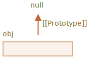

# Методи прототипів, об’єкти без __proto__

В першій главі цього розділу, ми згадували сучасні методи роботи з прототипом.

Властивість `__proto__` вважається застарілою (підтримується браузером відповідно до стандарту).

Сучасні методи:

- [Object.create(proto, [descriptors])](mdn:js/Object/create) -- створює пустий об’єкт з властивістю `[[Prototype]]`, що посилається на переданий об’єкт `proto`, та необов’язковими для передачі дескрипторами властивостей `descriptors`.
- [Object.getPrototypeOf(obj)](mdn:js/Object/getPrototypeOf) -- повертає значення `[[Prototype]]` об’єкту `obj`.
- [Object.setPrototypeOf(obj, proto)](mdn:js/Object/setPrototypeOf) -- встановлює значення `[[Prototype]]` об’єкту `obj` рівне `proto`.

Ці методи необхідно використовувати на відміну від `__proto__`.

Наприклад:

```js run
let animal = {
  eats: true
};

// створюється новий об’єкт з прототипом animal
*!*
let rabbit = Object.create(animal);
*/!*

alert(rabbit.eats); // true

*!*
alert(Object.getPrototypeOf(rabbit) === animal); // true
*/!*

*!*
Object.setPrototypeOf(rabbit, {}); // змінює прототип об’єкту rabbit на {}
*/!*
```

`Object.create` має необов’язковий другий аргумент: дескриптори властивостей. Ми можемо надати додаткові властивості новому об’єкту, як тут:

```js run
let animal = {
  eats: true
};

let rabbit = Object.create(animal, {
  jumps: {
    value: true
  }
});

alert(rabbit.jumps); // true
```

Формат дескрипторів описаний в цій главі <info:property-descriptors>.

Ми можемо використати `Object.create`, щоб клонувати об’єкт ефективніше ніж циклом `for..in`:

```js
let clone = Object.create(Object.getPrototypeOf(obj), Object.getOwnPropertyDescriptors(obj));
```

Таким чином ми створюємо справжню копію об’єкта `obj`, включаючи всі властивості: перелічувані та не перелічувані, сетери/гетери -- з правильним значенням `[[Prototype]]`.

## Коротка історія

Якщо порахувати всі способи керування властивістю `[[Prototype]]`, їх буде багато! Багато способів робити одне й те ж саме!

Чому?

Так склалося історично.

- Властивість `"prototype"` функції-конструктора реалізована з самих давніх часів.
- Пізніше, в 2012 році, метод `Object.create` став стандартом. Це дало можливість створювати об’єкти з певним прототипом, проте не дозволяло отримувати або встановлювати його. Тому браузери реалізували не стандартний аксесор `__proto__`, що дозволяв користувачу отримувати та встановлювати прототип в будь-який час.
- Ще пізніше, в 2015 році, методи `Object.setPrototypeOf` та `Object.getPrototypeOf` були додані до стандарту, для того, щоб виконувати аналогічну функціональність як і `__proto__`. Оскільки `__proto__` було широко реалізовано, воно згадується в Додатку B стандарту як не обов’язкове для не-браузерних середовищ, але вважається свого роду застарілим.

Таким чином зараз ми маємо всі ці способи для роботи з прототипом.

Чому `__proto__` було замінено методами `getPrototypeOf/setPrototypeOf`? Це цікаве питання, яке вимагає від нас розуміння чому `__proto__` має недоліки. Прочитайте далі, щоб дізнатися відповідь.

```warn header="Не змінюйте `[[Prototype]]` в існуючих об’єктів, якщо швидкість важлива"
Технічно, ми можемо отримати/встановити `[[Prototype]]` в будь-який момент. Але зазвичай ми тільки встановлюємо його один раз під час створення об’єкту та більше не змінюємо: `rabbit` наслідується від `animal` і це не зміниться.

JavaScript рушій є високо оптимізованим для цього. Зміна прототипу "на льоту" за допомогою `Object.setPrototypeOf` або `obj.__proto__=` дуже повільна операція, яка порушує внутрішню оптимізацію для операції з доступу до властивості об’єкта. Щоб уникнути цього, ви маєте розуміти що ви робите і для чого або швидкодія виконання JavaScript коду повністю не важлива для вас.
```

## "Прості" об’єкти [#very-plain]

Як ми знаємо, об’єкти можуть використовуватися як асоціативні масиви для зберігання пар ключ/значення.

...Проте якщо ми спробуємо зберегти *створені користувачем* ключі в ньому (наприклад, словник з користувацьким вводом), ми можемо спостерігати цікавий збій: усі ключі працюють правильно окрім `"__proto__"`.

Розгляньте приклад:

```js run
let obj = {};

let key = prompt("Введіть ключ", "__proto__");
obj[key] = "певне значення";

alert(obj[key]); // [object Object], не "певне значення"!
```

В цьому випадку, якщо користувач введе `__proto__`, присвоєння проігнорується!

Це не повинно дивувати нас. Властивість `__proto__` є особливою: вона має бути або об’єктом або `null`. Рядок не може стати прототипом.

Проте ми не намагалися реалізувати таку поведінку. Ми хотіли зберегти пари ключ/значення і при цьому ключ з назвою `"__proto__"` не зберігся. Тому це помилка!

В цьому прикладі наслідки не такі жахливі. Однак в інших випадках ми можемо встановлювати об’єктні значення і тоді прототип може дійсно змінитись. В результаті, виконання коду піде неправильним та неочікуваним шляхом.

Найгірше в цьому -- зазвичай розробники не задумаються над тим, що така ситуація взагалі можлива. Це робить подібні помилки важкими для виявлення і перетворюються їх у вразливості, особливо коли JavaScript використовується на стороні серверу.

Неочікувані речі можуть траплятися при встановлені значення для властивості `toString`, яка за замовчуванням є функцією, та для інших вбудованих методів.

Як ми можемо уникнути цієї проблеми?

В першу чергу, для зберігання ми можемо просто використовувати `Map` замість простих об’єктів, тоді все працює правильно.

Проте `Object` може також послужити нам, оскільки творці мови задумувались над цією проблемою вже дуже давно.

`__proto__` не є властивістю об’єкту, але є аксесором `Object.prototype`:


Таким чином, якщо `obj.__proto__` зчитується або встановлюється, відповідний гетер/сетер викликається з прототипу та отримує/встановлює `[[Prototype]]`.

Як було сказано на початку цього розділу: `__proto__` це спосіб доступу до `[[Prototype]]`, але не є самим `[[Prototype]]`.

Тепер, коли ми хочемо використати об’єкт як асоціативний масив та уникнути таких проблем, ми можемо зробити це за допомогою невеликої хитрості:

```js run
*!*
let obj = Object.create(null);
*/!*

let key = prompt("Введіть ключ", "__proto__");
obj[key] = "певне значення";

alert(obj[key]); // "певне значення"
```

`Object.create(null)` створює пустий об’єкт без прототипу (`[[Prototype]]` дорівнює `null`):



Таким чином, відсутні наслідувані гетер/сетер для `__proto__`. Тепер ми працюємо зі звичайною властивістю, тому приклад вище працює правильно.

Ми можемо називати такі об’єкти "простими" або "чистим словниковим" об’єктом, тому що вони навіть простіше ніж звичайні об’єкти `{...}`.

Недоліком є те, що такі об’єкти не мають вбудовані методи для роботи з ними, наприклад `toString`:

```js run
*!*
let obj = Object.create(null);
*/!*

alert(obj); // Помилка (відсутній метод toString)
```

...Але це зазвичай нормально для асоціативних масивів.

Зверніть увагу, що більшість методів пов’язаних з об’єктом `Object.something(...)`, такі як `Object.keys(obj)` -- не розміщуються в прототипі, тому вони будуть працювати з такими об’єктами:


```js run
let chineseDictionary = Object.create(null);
chineseDictionary.hello = "你好";
chineseDictionary.bye = "再见";

alert(Object.keys(chineseDictionary)); // hello,bye
```

## Підсумок

Сучасними методами встановлення та прямого доступу до прототипу є:

- [Object.create(proto, [descriptors])](mdn:js/Object/create) -- створює пустий об’єкт з переданим `proto` як `[[Prototype]]` (може дорівнювати `null`) та необов’язковими дескрипторами властивостей.
- [Object.getPrototypeOf(obj)](mdn:js/Object/getPrototypeOf) -- повертає `[[Prototype]]` об’єкту `obj` (так само як і гетер `__proto__`).
- [Object.setPrototypeOf(obj, proto)](mdn:js/Object/setPrototypeOf) -- встановлює `[[Prototype]]` об’єкту `obj` значення `proto` (так само як і сетер `__proto__`).

Вбудований гетер/сетер `__proto__` небезпечний, якби ми захотіли помістити згенеровані користувачем ключі в об’єкт. Тому що користувач може ввести `"__proto__"` як ключ і буде помилка, з неочікуваними наслідками.

Тому ми можемо використовувати як і `Object.create(null)`, щоб створити "простий" об’єкт без `__proto__`, так і `Map` для цього.

Також, `Object.create` надає простий спосіб створити копію об’єкту з усіма дескрипторами:

```js
let clone = Object.create(Object.getPrototypeOf(obj), Object.getOwnPropertyDescriptors(obj));
```

Ми також з’ясували що `__proto__` є гетер/сетер для `[[Prototype]]` та існує в `Object.prototype`, як і інші методи.

Ми можемо створити об’єкт без прототипу за допомогою `Object.create(null)`. Такі об’єкти використовуються як "чисті словники", у них відсутні проблеми з `"__proto__"` як ключем.

Інші методи:

- [Object.keys(obj)](mdn:js/Object/keys) / [Object.values(obj)](mdn:js/Object/values) / [Object.entries(obj)](mdn:js/Object/entries) -- повертає масив перелічуваних власних рядкових властивостей ключі/значення/пари ключ-значення.
- [Object.getOwnPropertySymbols(obj)](mdn:js/Object/getOwnPropertySymbols) -- повертає масив всіх власних символьних ключів.
- [Object.getOwnPropertyNames(obj)](mdn:js/Object/getOwnPropertyNames) -- повертає масив всіх власних рядкових ключів.
- [Reflect.ownKeys(obj)](mdn:js/Reflect/ownKeys) -- повертає масив усіх власних ключів.
- [obj.hasOwnProperty(key)](mdn:js/Object/hasOwnProperty): повертає `true` якщо `obj` має власний (не наслідуваний) ключ з назвою `key`.

Всі методи, що повертають властивості об’єкта (такі як `Object.keys` і інші) -- повертають "власні" властивості. Якщо нам потрібні також наслідувані властивості, ми можемо використовувати цикл `for..in`.
