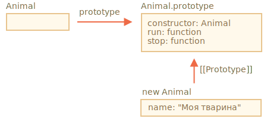
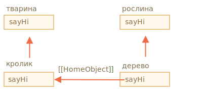

# Наслідування класу

Наслідування класу -- це спосіб для одного класу, щоб розширити інший клас.

Таким чином, ми можемо створити нову функціональність на основі існуючої.

## Ключове слово "extends"

Скажімо, у нас є клас `Animal`:

```js
class Animal {
  constructor(name) {
    this.speed = 0;
    this.name = name;
  }
  run(speed) {
    this.speed = speed;
    alert(`${this.name} біжить зі швидкістю ${this.speed}.`);
  }
  stop() {
    this.speed = 0;
    alert(`${this.name} стоїть.`);
  }
}

let animal = new Animal("Моя тварина");
```

Ось як ми можемо представляти об'єкт `animal` і клас `Animal` графічно:



...І ми хотіли б створити інший `class Rabbit`.

Так як кролики є тваринами, клас `Rabbit` повинен базуватися на `Animal`, мати доступ до методів тварин, щоб кролики могли робити те, що можуть робити "загальні" тварини.

Синтаксис, щоб розширити інший клас: `class Child extends Parent`.

Давайте створимо `class Rabbit`, які успадковують від `Animal`:

```js
*!*
class Rabbit extends Animal {
*/!*
  hide() {
    alert(`${this.name} ховається!`);
  }
}

let rabbit = new Rabbit("Білий Кролик");

rabbit.run(5); // Білий Кролик біжить зі швидкістю 5.
rabbit.hide(); // Білий Кролик ховається!
```

Об'єкт класу `Rabbit` має доступ і до методів `Rabbit`, таких як `rabbit.hide()`, і до методів `Animal`.

Внутрішньо, ключове слово `extends` працює за допомогою хорошої старої механіки прототипу. Він встановлює в `Rabbit.prototype.[[Prototype]]` значення `Animal.prototype`. Отже, якщо метод не знайдено в `Rabbit.prototype`, JavaScript бере його з `Animal.prototype`.


Наприклад, для пошуку методу `rabbit.run`, рушій перевіряє (знизу вгору на рисунку):
1. Об'єкт `rabbit` (не має `run`).
2. Його прототип, тобто `Rabbit.prototype` (має `hide`, але не має `run`).
3. Його прототип, тобто (завдяки `extends`) `Animal.prototype`, що, нарешті, має метод `run`.

Як ми можемо згадати з розділу <info:native-prototypes>, сам JavaScript використовує прототипне наслідування для вбудованих об'єктів. Наприклад, `Date.prototype.[[Prototype]]` -- це `Object.prototype`. Ось чому дати мають доступ до загальних методів об'єкта.

````smart header="Будь-який вираз допускається після `extends`"
Синтаксис класу дозволяє вказати не лише клас, але будь-який вираз після `extends`.

Наприклад, виклик функції, який генерує батьківський клас:

```js run
function f(phrase) {
  return class {
    sayHi() { alert(phrase); }
  };
}

*!*
class User extends f("Привіт") {}
*/!*

new User().sayHi(); // Привіт
```
Тут `class User` успадковує від результату `f("Привіт")`.

Це може бути корисним для просунутих паттернів програмування, коли ми використовуємо функції для створення класів залежно від багатьох умов і можемо успадкуватися від них.
````

## Перевизначення методу

Тепер давайте рухатися вперед і перевизначимо метод. За замовчуванням всі методи, які не вказані в `class Rabbit`, беруться безпосередньо "як є" від `class Animal`.

Але якщо ми вкажемо наш власний метод в `Rabbit`, наприклад, `stop()`, то він буде використовуватися замість методу з `class Animal`:

```js
class Rabbit extends Animal {
  stop() {
    // ...тепер це буде використано для rabbit.stop()
    // замість stop() з класу Animal
  }
}
```

Зазвичай ми не хочемо повністю замінити батьківський метод, але, скоріше, побудувати метод на його основі, щоб налаштувати або розширити функціональність. Ми робимо щось у нашому методі, але викликаемо батьківський метод до/після нього або в процесі.

Класи забезпечують ключове слово `"super"` для цього.

- `super.method(...)`, щоб викликати батьківський метод.
- `super(...)`, щоб викликати батьківський конструктор (лише в нашому конструкторі).

Наприклад, нехай наш кролик автоматично ховається, коли зупиняється:

```js run
class Animal {

  constructor(name) {
    this.speed = 0;
    this.name = name;
  }

  run(speed) {
    this.speed = speed;
    alert(`${this.name} біжить зі швидкістю ${this.speed}.`);
  }

  stop() {
    this.speed = 0;
    alert(`${this.name} стоїть.`);
  }

}

class Rabbit extends Animal {
  hide() {
    alert(`${this.name} ховається!`);
  }

*!*
  stop() {
    super.stop(); // викликає батьківський stop
    this.hide(); // а потім ховається
  }
*/!*
}

let rabbit = new Rabbit("Білий Кролик");

rabbit.run(5); // Білий Кролик біжить зі швидкістю 5.
rabbit.stop(); // Білий Кролик стоїть. Білий Кролик ховається!
```

Тепер "Кролик" має метод "Стоп", який називає батька "Super.Stop" () "у процесі.

````smart header="Стрілочні функції не мають `super`"
Як зазначалося в розділі <info:arrow-functions>, стрілочні функції не мають `super`.

Якщо `super` доступний, то він береться із зовнішньої функції. Наприклад:
```js
class Rabbit extends Animal {
  stop() {
    setTimeout(() => super.stop(), 1000); // викликає батьківський stop після 1 сек
  }
}
```

`super` у стрілочної функції такий же, як у `stop()`, тому він працює як передбачається. Якщо ми вказали "звичайну" функцію тут, то буде помилка:

```js
// Unexpected super
setTimeout(function() { super.stop() }, 1000);
```
````


## Перевизначення конструктора

З конструкторами трохи складніше.

До цих пір `Rabbit` не мав власного конструктора.

Згідно із [специфікацією](https:///tc39.github.io/ecma262/#secuntime-semantics-classdefinutionevaluation), якщо клас розширює ще один клас і не має конструктора, то автоматично створюється "порожній" конструктор:

```js
class Rabbit extends Animal {
  // генерується для класів-нащадків без власних конструкторів
*!*
  constructor(...args) {
    super(...args);
  }
*/!*
}
```

Як ми бачимо, він в основному викликає батьківський конструктор та передає йому всі аргументи. Це відбувається, якщо ми не напишемо для нашого класу свій власний конструктор.

Тепер додамо індивідуальний конструктор до `Rabbit`. Він буде визначати `earLength` на додачу до `name`:

```js run
class Animal {
  constructor(name) {
    this.speed = 0;
    this.name = name;
  }
  // ...
}

class Rabbit extends Animal {

*!*
  constructor(name, earLength) {
    this.speed = 0;
    this.name = name;
    this.earLength = earLength;
  }
*/!*

  // ...
}

*!*
// Не працює!
let rabbit = new Rabbit("Білий Кролик", 10); // Error: this is not defined.
*/!*
```

Упс! У нас є помилка. Тепер ми не можемо створювати кроликів. Що пішло не так?

Коротка відповідь:

- **Конструктори в класі, що наслідується, повинні викликати `super(...)` і (!) зробити це перед використанням `this`.**

...Але чому? Що тут відбувається? Дійсно, ця вимога здається дивною.

Звичайно, є пояснення. Давайте поглибимося в деталі, щоб ви дійсно зрозуміли, що відбувається.

У JavaScript існує відмінність між функцією-конструктором успадковуючого класу (так званого "похідного конструктора") та іншими функціями. Похідний конструктор має особливу внутрішню власність `[[ConstructorKind]]:"derived"`. Це особлива внутрішня позначка.

Ця позначка впливає на поведінку функції-конструктора з `new`.

- Коли звичайна функція виконується з ключовим словом `new`, воно створює порожній об'єкт і присвоює його `this`.
- Але коли працює похідний конструктор, він не робить цього. Він очікує, що батьківський конструктор виконує цю роботу.

Таким чином, похідний конструктор повинен викликати `super`, щоб виконати його батьківський (базовий) конструктор, інакше об'єкт для `this` не буде створено. І ми отримаємо помилку.

Для роботи конструктора `Rabbit` він повинен викликати `super()` перед використанням `this`, як тут:

```js run
class Animal {

  constructor(name) {
    this.speed = 0;
    this.name = name;
  }

  // ...
}

class Rabbit extends Animal {

  constructor(name, earLength) {
*!*
    super(name);
*/!*
    this.earLength = earLength;
  }

  // ...
}

*!*
// тепер добре
let rabbit = new Rabbit("Білий Кролик", 10);
alert(rabbit.name); // Білий Кролик
alert(rabbit.earLength); // 10
*/!*
```


### Перевизначення поля класу: складна примітка

```warn header="Просунута примітка"
Ця примітка передбачає, що у вас є певний досвід роботи з класами, можливо, на інших мовах програмування.

Це забезпечує краще розуміння мови, а також пояснює поведінку, яка може бути джерелом помилок (але не дуже часто).

Якщо вам важко зрозуміти цю секцію, просто продовжуйте читати далі, а потім можете повернутися до неї через деякий час.
```

Ми можемо перевизначити не тільки методи, а й поля класу.

Хоча, що існує складна поведінка, коли ми отримуємо доступ до перевизначеного поля в батьківському конструкторі, яка сильно відрізняється від більшості інших мов програмування.

Розглянемо цей приклад:

```js run
class Animal {
  name = 'тварина';

  constructor() {
    alert(this.name); // (*)
  }
}

class Rabbit extends Animal {
  name = 'кролик';
}

new Animal(); // тварина
*!*
new Rabbit(); // тварина
*/!*
```

Тут клас `Rabbit` наслідує клас `Animal` і перевизначає поле `name` власним значенням.

Немає власного конструктора в `Rabbit`, тому викликається конструктор `Animal`.

Цікаво, що в обох випадках: `new Animal()` і `new Rabbit()`, `alert` в рядку `(*)` показує `animal`.

**Іншими словами, батьківський конструктор завжди використовує власне значення поля, а не перевизначене.**

Що в цьому дивного?

Якщо це ще не зрозуміло, будь ласка, порівняйте з методами.

Ось той самий код, але замість поля `this.name` ми викликаємо метод `this.showName()`.

```js run
class Animal {
  showName() {  // замість this.name = 'тварина'
    alert('тварина');
  }

  constructor() {
    this.showName(); // замість alert(this.name);
  }
}

class Rabbit extends Animal {
  showName() {
    alert('кролик');
  }
}

new Animal(); // тварина
*!*
new Rabbit(); // кролик
*/!*
```

Будь ласка, зверніть увагу: тепер вивід відрізняється.

І це те, що ми, дійсно, очікуємо. Коли батьківський конструктор викликається в похідному класі, він використовує перевизначений метод.

...Але для полів класу це не так. Як сказано, батьківський конструктор завжди використовує батьківське поле.

Чому існує різниця?

Ну, причина полягає у порядку ініціалізації поля. Поле класу ініціалізується:
- До конструктора для базового класу (котрий нічого не наслідує),
- Відразу після `super()` для похідного класу.

У нашому випадку `Rabbit` -- це похідний клас. У ньому немає конструктора. Як сказано раніше, це те ж саме, якби там був порожній конструктор лише з `super(...args)`.

Отже, `new Rabbit()` викликає `super()`, таким чином, виконуючи батьківський конструктор, і (за правилом для похідних класів) лише після того ініціалізує свої поля класу. На момент виконання батьківського конструктора, ще немає полів класу `Rabbit`, тому використовуються класу `Animal`.

Ця тонка різниця між полями та методами є специфічною для JavaScript

На щастя, ця поведінка виявляє себе лише якщо у перевизначене поле використовується у батьківському конструкторі. Тоді важко зрозуміти, що відбувається, тому ми пояснюємо це тут.

Якщо це стає проблемою, її можна вирішити за допомогою методів або геттерів/сеттерів, а не полів.


## Super: властивості, [[HomeObject]]

```warn header="Просунута примітка"
Якщо ви читаєте підручник вперше - цей розділ можете пропустити.

В ньому йде мова про внутрішній механізм наслідування та `super`.
```

Давайте подивимося трохи глибше під капот `super`. Ми побачимо деякі цікаві речі.

Перш за все, з усього, що ми дізналися дотепер, `super` взагалі неможе працювати!

Так, дійсно, давайте задамося питанням, як він повинен технічно працювати? Коли метод об'єкта запускається, він отримує поточний об'єкт як `this`. Якщо ми викликаємо `super.method()`, рушій повинен отримати `method` від прототипу поточного об'єкта. Але як?

Завдання може здатися простим, але це не так. Рушій знає поточний об'єкт `this`, тому він міг би отримати батьківський `method` як `this.__proto__.method`. На жаль, таке "нативне" рішення не буде працювати.

Давайте демонструємо проблему. Без класів, використовуючи прості об'єкти заради наглядності.

Ви можете пропустити цю частину та перейти нижче до розділу `[[HomeObject]]` якщо ви не хочете знати деталі. Це не завдасть шкоди вашому загальному розумінню. Або читайте, якщо ви зацікавлені в розумінні поглиблених речей.

У прикладі нижче, `rabbit.__proto__ = animal`. Тепер давайте спробуємо: у `rabbit.eat()` ми викличемо `animal.eat()`, використовуючи `this.__proto__`:

```js run
let animal = {
  name: "Тварина",
  eat() {
    alert(`${this.name} їсть.`);
  }
};

let rabbit = {
  __proto__: animal,
  name: "Кролик",
  eat() {
*!*
    // ось як super.eat() міг би, мабуть, працювати
    this.__proto__.eat.call(this); // (*)
*/!*
  }
};

rabbit.eat(); // Кролик їсть.
```

На лінії `(*)` ми беремо `eat` з прототипу (`animal`) і викликаємо його в контексті поточного об'єкта. Зверніть увагу, що `.call(this)` є важливим тут, тому що простий `this.__proto__.eat()` буде виконувати батьківський `eat` в контексті прототипу, а не поточного об'єкта.

І в коді вище, це насправді працює, як це передбачено: у нас є правильний `alert`.

Тепер давайте додамо ще один об'єкт до ланцюга наслідування. Ми побачимо, як все зламається:

```js run
let animal = {
  name: "Тварина",
  eat() {
    alert(`${this.name} їсть.`);
  }
};

let rabbit = {
  __proto__: animal,
  eat() {
    // ...робимо щось специфічне для кролика і викликаємо батьківський (animal) метод
    this.__proto__.eat.call(this); // (*)
  }
};

let longEar = {
  __proto__: rabbit,
  eat() {
    // ...зробимо щось, що пов’язане з довгими вухами, і викликаємо батьківський (rabbit) метод
    this.__proto__.eat.call(this); // (**)
  }
};

*!*
longEar.eat(); // Error: Maximum call stack size exceeded
*/!*
```

Код більше не працює! Ми бачимо помилку, намагаючись викликати `longEar.eat()`.

Це може бути не таким очевидним, але якщо ми відстежимо виклик `longEar.eat()`, то ми можемо зрозуміти, чому так відбувається. В обох рядках `(*)` і `(**)` значення `this` є поточним об'єктом (`longEar`). Це важливо: всі методи об'єкта отримують поточний об'єкт, як `this`, а не прототип або щось інше.

So, in both lines `(*)` and `(**)` the value of `this.__proto__` is exactly the same: `rabbit`. They both call `rabbit.eat` without going up the chain in the endless loop.
Отже, в обох рядках `(*)` і `(**)` значення `this.__proto__` точно таке ж саме: `rabbit`. Вони обидва викликають `rabbit.eat`. Не піднімаючись ланцюзі наслідування та перебуваючи в нескінченній петлі.

Ось картина того, що відбувається:


1. Всередині `longEar.eat()`, рядок `(**)` викликає `rabbit.eat` надаючи йому `this=longEar`.
    ```js
    // всередині longEar.eat() у нас є this = longEar
    this.__proto__.eat.call(this) // (**)
    // стає
    longEar.__proto__.eat.call(this)
    // тобто те саме, що
    rabbit.eat.call(this);
    ```
2. Тоді в рядку `(*)` в ` rabbit.eat`, ми хотіли б передати виклик ще вище в ланцюгу наслідування, але `this=longEar`, тому `this.__proto__.eat` знову `rabbit.eat`!

    ```js
    // всередині rabbit.eat() у нас також є this = longEar
    this.__proto__.eat.call(this) // (*)
    // стає
    longEar.__proto__.eat.call(this)
    // або (знову)
    rabbit.eat.call(this);
    ```

3. ...Отже, `rabbit.eat` викликає себе в нескінченній петлі, тому що він не може піднятися вище.

Проблема не може бути вирішена лише за допомогою `this`.

### `[[HomeObject]]`

Щоб забезпечити рішення, JavaScript додає ще одну спеціальну внутрішню власність для функцій: `[[HomeObject]]`.

Коли функція вказана як метод класу або об'єкта, її властивість `[[HomeObject]]` стає цим об'єктом.

Тоді `super` використовує цю властивість для знаходження батьківського прототипу та його методів.

Давайте подивимося, як це працює, спочатку з простими об'єктами:

```js run
let animal = {
  name: "Тварина",
  eat() {         // animal.eat.[[HomeObject]] == animal
    alert(`${this.name} їсть.`);
  }
};

let rabbit = {
  __proto__: animal,
  name: "Кролик",
  eat() {         // rabbit.eat.[[HomeObject]] == rabbit
    super.eat();
  }
};

let longEar = {
  __proto__: rabbit,
  name: "Довговухий кролик",
  eat() {         // longEar.eat.[[HomeObject]] == longEar
    super.eat();
  }
};

*!*
// працює правильно
longEar.eat();  // Довговухий кролик їсть.
*/!*
```

It works as intended, due to `[[HomeObject]]` mechanics. A method, such as `longEar.eat`, knows its `[[HomeObject]]` and takes the parent method from its prototype. Without any use of `this`.

### Methods are not "free"

As we've known before, generally functions are "free", not bound to objects in JavaScript. So they can be copied between objects and called with another `this`.

The very existence of `[[HomeObject]]` violates that principle, because methods remember their objects. `[[HomeObject]]` can't be changed, so this bond is forever.

The only place in the language where `[[HomeObject]]` is used -- is `super`. So, if a method does not use `super`, then we can still consider it free and copy between objects. But with `super` things may go wrong.

Here's the demo of a wrong `super` result after copying:

```js run
let animal = {
  sayHi() {
    alert(`I'm an animal`);
  }
};

// rabbit inherits from animal
let rabbit = {
  __proto__: animal,
  sayHi() {
    super.sayHi();
  }
};

let plant = {
  sayHi() {
    alert("I'm a plant");
  }
};

// tree inherits from plant
let tree = {
  __proto__: plant,
*!*
  sayHi: rabbit.sayHi // (*)
*/!*
};

*!*
tree.sayHi();  // I'm an animal (?!?)
*/!*
```

A call to `tree.sayHi()` shows "I'm an animal". Definitely wrong.

The reason is simple:
- In the line `(*)`, the method `tree.sayHi` was copied from `rabbit`. Maybe we just wanted to avoid code duplication?
- Its `[[HomeObject]]` is `rabbit`, as it was created in `rabbit`. There's no way to change `[[HomeObject]]`.
- The code of `tree.sayHi()` has `super.sayHi()` inside. It goes up from `rabbit` and takes the method from `animal`.

Here's the diagram of what happens:



### Methods, not function properties

`[[HomeObject]]` is defined for methods both in classes and in plain objects. But for objects, methods must be specified exactly as `method()`, not as `"method: function()"`.

The difference may be non-essential for us, but it's important for JavaScript.

In the example below a non-method syntax is used for comparison. `[[HomeObject]]` property is not set and the inheritance doesn't work:

```js run
let animal = {
  eat: function() { // intentionally writing like this instead of eat() {...
    // ...
  }
};

let rabbit = {
  __proto__: animal,
  eat: function() {
    super.eat();
  }
};

*!*
rabbit.eat();  // Error calling super (because there's no [[HomeObject]])
*/!*
```

## Summary

1. To extend a class: `class Child extends Parent`:
    - That means `Child.prototype.__proto__` will be `Parent.prototype`, so methods are inherited.
2. When overriding a constructor:
    - We must call parent constructor as `super()` in `Child` constructor before using `this`.
3. When overriding another method:
    - We can use `super.method()` in a `Child` method to call `Parent` method.
4. Internals:
    - Methods remember their class/object in the internal `[[HomeObject]]` property. That's how `super` resolves parent methods.
    - So it's not safe to copy a method with `super` from one object to another.

Also:
- Arrow functions don't have their own `this` or `super`, so they transparently fit into the surrounding context.
