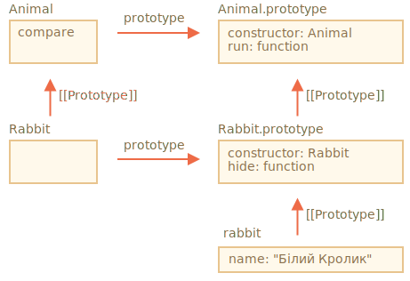

# Статичні властивості та методи

Ми також можемо присвоїти метод самій функції класу, а не її `"prototype"`. Такі методи називаються *статичними*.

У класі перед ними стоїть ключове слово `static`, наприклад:

```js run
class User {
*!*
  static staticMethod() {
*/!*
    alert(this === User);
  }
}

User.staticMethod(); // true
```

Фактично це те ж саме, що й безпосередньо присвоїти метод як властивість функції:

```js run
class User { }

User.staticMethod = function() {
  alert(this === User);
};

User.staticMethod(); // true
```

Значенням `this` при виклику `User.staticMethod()` є сам конструктор класу `User` (правило «об'єкт перед крапкою»).

Зазвичай статичні методи використовуються для реалізації функцій, які належать до класу, але не до будь-якого окремого його об’єкта.

Наприклад, у нас є об’єкти статей `Article` і необхідна функція для їх порівняння. Очевидне рішення - додати метод `Article.compare`, наприклад:

```js run
class Article {
  constructor(title, date) {
    this.title = title;
    this.date = date;
  }

*!*
  static compare(articleA, articleB) {
    return articleA.date - articleB.date;
  }
*/!*
}

// використання
let articles = [
  new Article("HTML", new Date(2019, 1, 1)),
  new Article("CSS", new Date(2019, 0, 1)),
  new Article("JavaScript", new Date(2019, 11, 1))
];

*!*
articles.sort(Article.compare);
*/!*

alert( articles[0].title ); // CSS
```

Тут `Article.compare` стоїть «над» статтями, як засіб їх порівняння. Це не метод статті, а скоріше всього класу.

Іншим прикладом може бути так званий «фабричний» метод. Уявіть собі, нам потрібно кілька способів, щоб створити статтю:

1. Створити за заданими параметрами (`title`, `date` тощо).
2. Створити порожню статтю з сьогоднішньою датою.
3. ...або якось інакше.

Перший спосіб може бути реалізований через конструктор. А для другого ми можемо використати статичний метод класу.

Такий як `Article.createTodays()` тут:

```js run
class Article {
  constructor(title, date) {
    this.title = title;
    this.date = date;
  }

*!*
  static createTodays() {
    // пам'ятайте, this = Article
    return new this("Сьогоднішній дайджест", new Date());
  }
*/!*
}

let article = Article.createTodays();

alert( article.title ); // Сьогоднішній дайджест
```

Тепер щоразу, коли нам потрібно створити сьогоднішній дайджест, ми можемо викликати `Article.createToday()`. Знову ж таки, це не метод конкретної статті, а метод цілого класу.

Статичні методи також використовуються в класах, що пов’язані з базою даних, для пошуку/збереження/видалення записів із бази даних, наприклад:

```js
// припустимо, що Article - це спеціальний клас для керування статтями
// статичний метод видалення статті:
Article.remove({id: 12345});
```

## Статичні властивості

[recent browser=Chrome]

Статичні властивості також можливі, вони виглядають як звичайні властивості класу, але до них додається `static`:

```js run
class Article {
  static publisher = "Ілля Кантор";
}

alert( Article.publisher ); // Ілля Кантор
```

Це те саме, що й пряме присвоєння `Article`:

```js
Article.publisher = "Ілля Кантор";
```

## Спадкування статичних властивостей і методів [#statics-and-inheritance]

Статичні властивості та методи наслідуються.

Наприклад, `Animal.compare` та `Animal.planet` у коді нижче успадковуються та доступні як `Rabbit.compare` та `Rabbit.planet`:

```js run
class Animal {
  static planet = "Земля";

  constructor(name, speed) {
    this.speed = speed;
    this.name = name;
  }

  run(speed = 0) {
    this.speed += speed;
    alert(`${this.name} біжить зі швидкістю ${this.speed}.`);
  }

*!*
  static compare(animalA, animalB) {
    return animalA.speed - animalB.speed;
  }
*/!*

}

// Inherit from Animal
class Rabbit extends Animal {
  hide() {
    alert(`${this.name} ховається!`);
  }
}

let rabbits = [
  new Rabbit("Білий Кролик", 10),
  new Rabbit("Чорний Кролик", 5)
];

*!*
rabbits.sort(Rabbit.compare);
*/!*

rabbits[0].run(); // Чорний Кролик біжить зі швидкістю 5.

alert(Rabbit.planet); // Земля
```

Тепер, коли ми викликаємо `Rabbit.compare`, буде викликано успадкований `Animal.compare`.

Як це працює? Знову ж таки, використовуючи прототипи. Як ви вже могли здогадатися, `extends` дає `Rabbit` посилання `[[Prototype]]` на `Animal`.



Отже, `Rabbit extends Animal` створює два посилання `[[Prototype]]`:

1. Функція `Rabbit` прототипно успадковує від функції `Animal`.
2. `Rabbit.prototype` прототипно успадковує від `Animal.prototype`.

В результаті успадкування працює як для звичайних, так і для статичних методів.

Перевірмо це кодом:

```js run
class Animal {}
class Rabbit extends Animal {}

// для статичних
alert(Rabbit.__proto__ === Animal); // true

// для звичайних методів
alert(Rabbit.prototype.__proto__ === Animal.prototype); // true
```

## Підсумок

Статичні методи використовуються для функціональності, що належить до класу «в цілому». Це не стосується конкретного екземпляра класу.

Наприклад, метод порівняння `Article.compare(article1, article2)` або фабричний метод `Article.createTodays()`.

В оголошенні класу вони позначені ключовим словом `static`.

Статичні властивості використовуються тоді, коли ми хочемо зберігати дані на рівні класу, а не якогось одного екземпляра.

Синтаксис:

```js
class MyClass {
  static property = ...;

  static method() {
    ...
  }
}
```

Технічно, статичне оголошення – це те ж саме, що й присвоєння класу:

```js
MyClass.property = ...
MyClass.method = ...
```

Статичні властивості та методи успадковуються.

Для `class B extends A`, прототип класу `B` вказує на `A`: `B.[[Prototype]] = A`. Тож якщо поле не знайдено в `B`, пошук продовжується в `A`.
