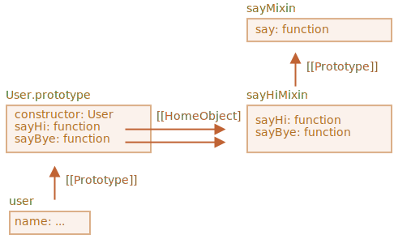

# Міксини

В JavaScript ми можемо успадкуватися лише від одного об’єкта. Може бути лише один `[[Prototype]]` для об’єкта. І клас може розширювати лише один інший клас.

Але іноді це викликає обмеження. Наприклад, у нас є клас `StreetSweeper` і клас `Bicycle`, і ми хочемо зробити їхню суміш: `StreetSweepingBicycle`.

Або у нас є клас `User` та клас `EventEmitter`, який реалізує генерацію подій, і ми хотіли б додати функціональність `Eventemitter` до `User`, щоб наші користувачі могли генерувати події.

Є концепція, яка може допомогти тут, називається "міксини" (mixins).

Як визначено у Вікіпедії, [mixin](https://en.wikipedia.org/wiki/Mixin) -- це клас, що містить методи, які можуть бути використані іншими класами без необхідності успадкуватися від нього.

Іншими словами, *міксин* забезпечує методи, які реалізують певну поведінку, але ми не використовуємо його самостійно, ми використовуємо його, щоб додати цю поведінку до інших класів.

## Приклад міксину

Найпростіший спосіб реалізації міксинів в JavaScript є створення об’єкта з корисними методами, щоб ми могли легко об’єднати їх у прототип будь-якого класу.

Наприклад, тут використовується міксин `sayHiMixin`, щоб додати можливість "говорити" для класу `User`:

```js run
*!*
// міксин
*/!*
let sayHiMixin = {
  sayHi() {
    alert(`Привіт, ${this.name}`);
  },
  sayBye() {
    alert(`До побачення, ${this.name}`);
  }
};

*!*
// використання:
*/!*
class User {
  constructor(name) {
    this.name = name;
  }
}

// копіюємо методи
Object.assign(User.prototype, sayHiMixin);

// тепер User може сказати привіт
new User("Іван").sayHi(); // Привіт, Іван!
```

Тут немає наслідування, а простий метод копіювання. Таким чином, `User`  може успадкуватися від іншого класу, а також включати міксини, що "домішують" додаткові методи, наприклад:

```js
class User extends Person {
  // ...
}

Object.assign(User.prototype, sayHiMixin);
```

Міксини можуть використовувати наслідування всередині себе.

Наприклад, тут `sayHiMixin` успадковується від `sayMixin`:

```js run
let sayMixin = {
  say(phrase) {
    alert(phrase);
  }
};

let sayHiMixin = {
  __proto__: sayMixin, // (або ми б могли тут використовувати Object.setPrototypeOf для встановлення прототипу)

  sayHi() {
    *!*
    // виклик батьківського методу
    */!*
    super.say(`Привіт, ${this.name}`); // (*)
  },
  sayBye() {
    super.say(`До побачення, ${this.name}`); // (*)
  }
};

class User {
  constructor(name) {
    this.name = name;
  }
}

// копіюємо методи
Object.assign(User.prototype, sayHiMixin);

// тепер User може сказати привіт
new User("Іван").sayHi(); // Привіт, Іван!
```

Зверніть увагу, що виклик батьківського методу `super.say()` з `sayHiMixin` (на лініях, позначених `(*)`), шукає метод у прототипі цього міксину, а не класу.

Ось діаграма (див. праву частину):



Це тому, що методи `sayHi` і `sayBye` були спочатку створені в `sayHiMixin`. Таким чином, хоча вони були скопійовані, але їх внутрішня власність `[[HomeObject]]` посилається на `sayHiMixin`, як показано на малюнку вище.

Оскільки `super` шукає батьківські методи в `[[HomeObject]].[[Prototype]]`, то це означає, що воно шукає `sayHiMixin.[[Prototype]]`, а не `User.[[Prototype]]`.

## EventMixin

Тепер зробімо міксин для реального життя.

Важливою особливістю багатьох об’єктів браузера (для прикладу) є те, що вони можуть створювати події. Події -- це чудовий спосіб "транслювати інформацію" будь-кому, хто хоче її приймати. Отже, зробімо міксин, який дозволяє нам легко додавати функції, що пов’язані з подіями для будь-якого класу/об’єкта.

- Міксин забезпечить метод `.trigger(name, [...data])`, щоб "генерувати подію", коли щось відбувається з ним. Аргумент `name` -- це назва події, за бажанням можуть передаватися додаткові аргументи з даними про подію.
- Також метод `.on(name, handler)`, що додає функцію `handler` як слухача до подій з даною назвою. Вона буде викликатися, коли подія з даним «ім’ям», і отримати аргументи з дзвінка `.trigger`.
- ...і метод `.off(name, handler)`, що видаляє слухач `handler`.

Після додавання міксину, об’єкт `user` зможе генерувати подію `"login"`, коли відвідувач входить у систему. А інший об’єкт, скажімо, `calendar`, можливо захоче слухати такі події, щоб завантажити календар для зареєстрованої людини.

Або `menu` може генерувати подію `"select"`, коли вибрано пункт меню, а інші об’єкти можуть призначати обробники, щоб реагувати на цю подію. І так далі.

Ось код:

```js run
let eventMixin = {
  /**
   * Підписатися на подію, використання:
   *  menu.on('select', function(item) { ... }
  */
  on(eventName, handler) {
    if (!this._eventHandlers) this._eventHandlers = {};
    if (!this._eventHandlers[eventName]) {
      this._eventHandlers[eventName] = [];
    }
    this._eventHandlers[eventName].push(handler);
  },

  /**
   * Скасувати підписку, використання:
   *  menu.off('select', handler)
   */
  off(eventName, handler) {
    let handlers = this._eventHandlers?.[eventName];
    if (!handlers) return;
    for (let i = 0; i < handlers.length; i++) {
      if (handlers[i] === handler) {
        handlers.splice(i--, 1);
      }
    }
  },

  /**
   * Створити подію з вказаною назвою та даними
   *  this.trigger('select', data1, data2);
   */
  trigger(eventName, ...args) {
    if (!this._eventHandlers?.[eventName]) {
      return; // немає обробників для події з цією назвою
    }

    // виклик обробників
    this._eventHandlers[eventName].forEach(handler => handler.apply(this, args));
  }
};
```


- `.on(eventName, handler)` -- призначає функцію `handler`, яку треба викликати, коли відбувається подія з цією назвою. Технічно, існує `_eventHandlers` властивість, яка зберігає масив оброблювачів для кожного імені події, і цей метод просто додає його в список.
- `.off(eventname, handler)` -- видаляє функцію зі списку обробників.
- `.trigger(eventName, ...args)` -- генерує подію: всі обробники з `_eventHandlers[eventName]` викликаються, зі списком аргументів `...args`.

Використання:

```js run
// Створимо клас
class Menu {
  choose(value) {
    this.trigger("select", value);
  }
}
// Додамо міксин з методами, що пов’язані з подіями
Object.assign(Menu.prototype, eventMixin);

let menu = new Menu();

// додамо обробник, який буде викликатися при події "select":
*!*
menu.on("select", value => alert(`Вибрано значення: ${value}`));
*/!*

// викликає подію => обробник вище запускається і показує:
// Вибрано значення: 123
menu.choose("123");
```

Тепер, якщо ми б хотіли, щоб будь-який код реагував на вибір меню, то ми можемо слухати цю подію за допомогою `menu.on(...)`.

І міксин `eventMixin` дозволяє легко додавати таку поведінку до багатьох класів так, як ми хотіли, не використовуючи ланцюжок наслідування.

## Висновки

*Міксин* -- це загальний термін об’єктноорієнтованого програмування: клас, який містить методи для інших класів.

Деякі інші мови дозволяють багаторазове наслідування. JavaScript його не підтримує, але міксини можуть бути реалізовані шляхом копіювання методів у прототип.

Ми можемо використовувати міксини як спосіб збільшення класу, додаючи додаткову поведінку, наприклад, обробка подій, як ми бачили вище.

Міксини можуть стати причиною конфлікту, якщо вони випадково перезаписують методи класу, що існують. Тому, як правило, слід добре подумати про іменування методів міксину, щоб мінімізувати ймовірність цього.
