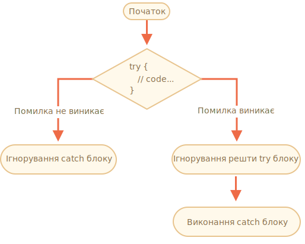

# Робота з помилками, "try...catch"

На скільки чудовими програмістами ми б не були, але часом трапляється, що в роботі наших скрипів можуть виникати виключні ситуації. Вони виникають через наші помилки, непередбачувані вхідні дані від користувачів, неправильні відповіді від сервера або з тисяч інших причин.

Якщо виникають помилки, то скрипти, зазвичай, "помирають" (раптово припиняють роботу) та виводять інформацію про помилку в консоль.

Але існує синтаксична конструкція `try...catch`, що дозволяє нам "перехоплювати" помилки, що дає змогу скриптам виконати потрібні дії, а не раптово припинити роботу.

## Синтаксис "try...catch"

Конструкція `try...catch` містить два головних блоки: `try`, а потім `catch`:

```js
try {

  // код...

} catch (err) {

  // код обробки помилки

}
```

Це працює наступним чином:

1. В першу чергу виконується код в блоці `try {...}`.
2. Якщо не виникає помилок, то блок `catch (err)` ігнорується: виконання досягає кінця блоку `try` та продовжується поза `catch` блоком.
3. Якщо виникає помилка, тоді виконання в `try` припиняється і виконання коду продовжується з початку `catch (err)` блоку. Змінна `err` (можна обрати інше ім’я) буде містити об’єкт помилки з додатковою інформацією.



Отже, помилка всередині `try {...}` блоку не призводить до раптового припинення роботи скрипту - ми отримуємо можливість обробити її в `catch`.

Подивімося на декілька прикладів.

- Приклад без виключень: виводить `alert` `(1)` та `(2)`:

    ```js run
    try {

      alert('Початок try блоку');  // *!*(1) <--*/!*

      // ...код без помилок

      alert('Кінець try блоку');   // *!*(2) <--*/!*

    } catch (err) {

      alert('Помилок немає, тому catch ігнорується'); // (3)

    }
    ```
- Приклад з виключенням: виводить `(1)` та `(3)`:

    ```js run
    try {

      alert('Початок try блоку');  // *!*(1) <--*/!*

    *!*
      lalala; // помилка, змінна не визначена!
    */!*

      alert('Кінець try блоку (не буде виконано)');  // (2)

    } catch (err) {

      alert(`Виникла помилка!`); // *!*(3) <--*/!*

    }
    ```


````warn header="`try...catch` працює тільки з виключеннями, що виникають в під час роботи скрипту"
Щоб блок `try...catch` спрацював, код повинен запускатися. Іншими словами, це повинен бути валідний JavaScript.

Це не спрацює, якщо код містить синтаксичні помилки, як-от незакриті фігурні дужки:

```js run
try {
  {{{{{{{{{{{{
} catch (err) {
  alert("Це не валідний код, рушій його не зрозуміє");
}
```

JavaScript рушій спочатку прочитує код і тільки потім виконує його. Помилки, що виникають у фазі читання називаються "помилки парсингу", вони не можуть бути обробленими і скрипти припиняють свою роботу. Це виникає через те, що рушій не може зрозуміти код.

Тому `try...catch` може тільки обробляти помилки, що виникають у правильному коді. Такі помилки називаються "помилки часу виконання" або "виключення".
````


````warn header="`try...catch` працює синхронно"
Якщо виключення трапляється у "запланованому до виконання" коді, як `setTimeout`, тоді `try...catch` не зможе перехопити помилку:

```js run
try {
  setTimeout(function() {
    noSuchVariable; // скрипт припинить свою роботу
  }, 1000);
} catch (err) {
  alert( "не спрацює" );
}
```

Це відбувається через те, що функція буде виконана пізніше, коли рушій вже вийде з блоку `try...catch`.

Щоб перехопити виключення всередині функції запланованої до виконання, `try...catch` повинен бути всередині цієї функції:
```js run
setTimeout(function() {
  try {
    noSuchVariable; // try...catch опрацює помилку!
  } catch {
    alert( "помилку перехоплено тут!" );
  }
}, 1000);
```
````

## Об’єкт помилки

Коли виникає помилка, JavaScript генерує об’єкт, що містить інформацію про неї. Потім цей об’єкт передається як аргумент в `catch`:

```js
try {
  // ...
} catch (err) { // <-- "об’єкт помилки", можна використати іншу назву замість err
  // ...
}
```

Для всіх вбудованих помилок об’єкт помилки має дві головні властивості:

`name`
: Назва помилки. Наприклад, для невизначеної змінної назва буде `"ReferenceError"`.

`message`
: Текстове повідомлення з додатковою інформацією про помилку.

Існують інші властивості, що доступні в більшості оточень. Одна з найуживаніших та часто підтримується:

`stack`
: Current call stack: a string with information about the sequence of nested calls that led to the error. Used for debugging purposes.

: Поточний стек викликів: рядок з інформацією про послідовність вкладених викликів, що призвели до помилки. Використовується для налагодження.

Наприклад:

```js run untrusted
try {
*!*
  lalala; // помилка, змінна не визначена!
*/!*
} catch (err) {
  alert(err.name); // ReferenceError
  alert(err.message); // lalala is not defined
  alert(err.stack); // ReferenceError: lalala is not defined at (...call stack)

  // Також можливо вивести всю інформацію про помилку
  // Помилку конвертовано в рядок формату "name: message"
  alert(err); // ReferenceError: lalala is not defined
}
```

## Опціональність аргументів "catch" блоку

[recent browser=new]

Блок `catch` не обов’язково повинен перехоплювати інформацію про об’єкт помилки:

```js
try {
  // ...
} catch { // <-- без (err)
  // ...
}
```

## Використання "try...catch"

Подивімось на реальний приклад використання `try...catch`.

Як ми вже знаємо, JavaScript може читати значення у форматі JSON за допомогою методу [JSON.parse(str)](mdn:js/JSON/parse).

Зазвичай ми використовуємо його для декодування даних отриманих з сервера чи іншого джерела через мережу.

Ми отримуємо дані та викликаємо `JSON.parse` наступним чином:

```js run
let json = '{"name":"Іван", "age": 30}'; // дані з серверу

*!*
let user = JSON.parse(json); // трансформуємо текстове значення в JS об’єкт
*/!*

// тепер user це об’єкт, що містить властивості з рядку
alert( user.name ); // Іван
alert( user.age );  // 30
```

Ви можете знайти більше інформації про використання JSON в розділі <info:json>.

**Якщо використати `JSON.parse` з неправильно сформованим `json` повідомленням, це призведе до помилки та раптового припинення роботи скрипту.**

Така поведінка задовольняє нас? Звичайно ні!

Користувач ніколи не дізнається якщо з даними щось трапилося (якщо не відкриє консоль розробника). Люди не очікують, що щось раптово може припинити роботу без будь-якої інформації про помилку.

Для оброблення помилки використаймо `try...catch`:

```js run
let json = "{ неправильний формат json }";

try {

*!*
  let user = JSON.parse(json); // <-- тут виникає помилка...
*/!*
  alert( user.name ); // не буде виконано

} catch (err) {
*!*
  // ...виконання передається в цей блок
  alert( "Перепрошуємо, але дані містять помилки. Ми спробуємо запросити їх ще раз." );
  alert( err.name );
  alert( err.message );
*/!*
}
```

У цьому разі `catch` блок використано тільки для виведення повідомлення про помилку, але може бути використаним іншим чином: відправити новий запит, запропонувати користувачі інші опції, відправити інформацію про помилку для логування та ін. Будь-який спосіб використання краще, ніж раптове припинення роботи.

## Створення та викидання власних типів помилок

Уявімо ситуацію, що `json` синтаксично правильний, але не містить необхідного поля `name`.

Наприклад:

```js run
let json = '{ "age": 30 }'; // неповні дані

try {

  let user = JSON.parse(json); // <-- помилка не виникає
*!*
  alert( user.name ); // відсутнє поле name!
*/!*

} catch (err) {
  alert( "не буде виконано" );
}
```

В такому разі `JSON.parse` відпрацює без виключень, але відсутність поля `name` є помилкою з нашої точки зору.

Ми будемо використовувати оператор `throw` для об’єднання способів обробки помилок.

### Оператор "throw"

Оператор `throw` використовується для викидання помилки.

Оператор має синтаксис:

```js
throw <об’єкт помилки>
```

Рушії дозволяє використовувати будь-які значення як об’єкти помилки. Це може бути навіть примітивне значення, як число чи рядок, але краще використовувати об’єкти, що мають властивості `name` та `message` (для сумісності з вбудованим типом помилок).

JavaScript має багато вбудованих конструкторів для вбудованих помилок: `Error`, `SyntaxError`, `ReferenceError`, `TypeError` та інші. Також вони можуть бути використаними для створення об’єктів помилок.

Синтаксис ініціалізації вбудованих помилок:

```js
let error = new Error(message);
// or
let error = new SyntaxError(message);
let error = new ReferenceError(message);
// ...
```

Для вбудованого типу помилки, властивість `name` має значення імені конструктора, а `message` отримує значення з аргументу.

Наприклад:

```js run
let error = new Error("Щось трапилось o_O");

alert(error.name); // Error
alert(error.message); // Щось трапилось o_O
```

Подивімося на тип помилки, згенерований функцією `JSON.parse`:

```js run
try {
  JSON.parse("{ це не json o_O }");
} catch (err) {
*!*
  alert(err.name); // SyntaxError
*/!*
  alert(err.message); // expected property name or '}' at line 1 column 3 of the JSON data
}
```

Як бачимо, назва помилки `SyntaxError`.

У такому разі відсутність властивості `name` є помилкою, оскільки користувачам потрібна інформація з цього поля.

Тож давайте викинемо її:

```js run
let json = '{ "age": 30 }'; // неповні дані

try {

  let user = JSON.parse(json); // <-- немає помилки

  if (!user.name) {
*!*
    throw new SyntaxError("Неповні дані: відсутнє поле name"); // (*)
*/!*
  }

  alert( user.name );

} catch (err) {
  alert( "JSON Error: " + err.message ); // JSON Error: Неповні дані: відсутнє поле name
}
```

У рядку `(*)` оператор `throw` генерує `SyntaxError` із заданим значення поля `message`, таким же чином це зробив би JavaScript. Виконання коду в блоці `try` одразу припиняється і контроль передається в `catch`.

Тепер в блоці `catch` обробляються всі види помилок: від `JSON.parse` та інших випадків.

## Повторне викидання помилок

В наступному прикладі використаємо `try...catch`, щоб обробити неправильні дані. Але чи може всередині блоку `try {...}` виникнути *інша непередбачувана помилка*? Наприклад, це не просто "неправильні дані", а програміст помилився і забув визначити змінну чи ще щось?

Наприклад:

```js run
let json = '{ "age": 30 }'; // неповні дані

try {
  user = JSON.parse(json); // <-- не поставлено "let" перед user

  // ...
} catch (err) {
  alert("JSON Error: " + err); // JSON Error: ReferenceError: user is not defined
  // (але перехоплена помилка не пов’язана з JSON Error)
}
```

Звичайно таке можливо! Програмісти теж помиляються. Навіть програми з відкритим кодом, що використовуються десятиріччями можуть раптово виявитися вразливими.

В нашому прикладі `try...catch` використовується для перехоплення помилок, що виникають у разі неповних даних. Але `catch` перехоплює *всі* типи помилок, що виникають в `try`. Тут виникає непередбачувана помилка, але все одно в в повідомленні виводиться `"JSON Error"`. Це неправильна поведінка, що ускладнює налагодження.

Щоб уникати таких проблем, ми можемо використовувати підхід "повторного викидання помилок". Правило просте:

**Блок `catch` повинен оброблювати тільки відомі помилки та повторно генерувати всі інші типи помилок.**

Розгляньмо підхід "повторного викидання" покроково:

1. Конструкція `catch` перехоплює всі помилки.
2. В блоці `catch (err) {...}` ми аналізуємо об’єкт помилки `err`.
3. Якщо ми не знаємо як правильно обробити помилку, ми робимо `throw err`.

Зазвичай, тип помилки можна перевірити за допомогою оператора `instanceof`:

```js run
try {
  user = { /*...*/ };
} catch (err) {
*!*
  if (err instanceof ReferenceError) {
*/!*
    alert('ReferenceError'); // "ReferenceError" помилка доступу до невизначеної змінної
  }
}
```

Для визначення класу помилки можливо перевірити властивість `err.name`. Всі вбудовані помилки мають її. Також можна перевірити значення `err.constructor.name`.

В коді нижче, щоб `catch` опрацьовував тільки `SyntaxError` ми "повторно викидаємо" помилки інших типів.

```js run
let json = '{ "age": 30 }'; // неповні дані
try {

  let user = JSON.parse(json);

  if (!user.name) {
    throw new SyntaxError("Неповні дані: відсутнє поле name");
  }

*!*
  blabla(); // непередбачувана помилка
*/!*

  alert( user.name );

} catch (err) {

*!*
  if (err instanceof SyntaxError) {
    alert( "JSON Error: " + err.message );
  } else {
    throw err; // повторне викидання (*)
  }
*/!*

}
```

Помилка, що виникає в рядку `(*)`, не проходить перевірку в `catch` блоці і повторно викидається. Виключення, після повторної генерації, може знову бути перехопленим конструкцією `try...catch` (якщо вона існує) або призведе до аварійного припинення роботи скрипту.

Така поведінка `catch` блоку дає змогу перехоплювати тільки помилки, для яких передбачено правила обробки та "пропускати" решту типів помилок.

Приклад нижче демонструє, як реалізувати перехоплення таких помилок ще одним рівнем `try...catch`:

```js run
function readData() {
  let json = '{ "age": 30 }';

  try {
    // ...
*!*
    blabla(); // помилка!
*/!*
  } catch (err) {
    // ...
    if (!(err instanceof SyntaxError)) {
*!*
      throw err; // повторне викидання (обробка іншого типу помилок не передбачена)
*/!*
    }
  }
}

try {
  readData();
} catch (err) {
*!*
  alert( "Зовнішнє перехоплення: " + err ); // перехоплено!
*/!*
}
```

Функція `readData` дозволяє опрацьовувати тільки `SyntaxError` помилки, а зовнішній блок `try...catch` знає як опрацювати будь-який тип.

## try...catch...finally

Зачекайте, бо це ще не все.

Конструкція `try...catch` дозволяє додати ще один блок: `finally`.

Якщо він існує, то виконується в будь-якому разі:

- після `try`, якщо помилка не виникла,
- після `catch`, якщо помилка була перехоплена.

Розширений синтаксис виглядає наступним чином:

```js
*!*try*/!* {
   ... спроба виконати код ...
} *!*catch*/!* (err) {
   ... обробка помилки ...
} *!*finally*/!* {
   ... завжди буде виконано ...
}
```

Спробуйте запустити цей код:

```js run
try {
  alert( 'try' );
  if (confirm('Помилка потрібна?')) BAD_CODE();
} catch (err) {
  alert( 'catch' );
} finally {
  alert( 'finally' );
}
```

Код має дві гілки для виконання:

1. Якщо відповісти "Гаразд" на "Помилка потрібна?", буде `try -> catch -> finally`.
2. Якщо відповісти "Скасувати", тоді `try -> finally`.

Блок `finally` використовується, якщо ми почали виконувати якусь роботу і хочемо завершити її в будь-якому разі.

Наприклад, ми хочемо виміряти час роботи функції, що рахує числа Фібоначчі. Для цього ми можемо почати вимірювання на початку виконання і закінчити після. А якщо протягом роботи функції виникне помилка? Зокрема, імплементація `fib(n)` нижче генерує виключення, якщо на вхід подано від’ємне або неціле число.

Конструкція `finally` відмінне місце для завершення вимірювання незалежно від результату.

Блок `finally` гарантує, що час буде виміряно правильно як в ситуації успішного виконання, так і в разі помилки.

```js run
let num = +prompt("Введіть додатне ціле число?", 35)

let diff, result;

function fib(n) {
  if (n < 0 || Math.trunc(n) != n) {
    throw new Error("Число не повинно бути від’ємним або дробовим.");
  }
  return n <= 1 ? n : fib(n - 1) + fib(n - 2);
}

let start = Date.now();

try {
  result = fib(num);
} catch (err) {
  result = 0;
*!*
} finally {
  diff = Date.now() - start;
}
*/!*

alert(result || "виникла помилка");

alert( `виконання тривало ${diff}мс` );
```

Якщо після запуску коду ввести в число `35` -- скрипт буде виконано без помилок, блок `finally` після блоку `try`. Але якщо ввести `-1` -- одразу буде згенеровано помилку, а виконання код займе `0ms`. Обидва вимірювання будуть проведені правильно.

Інакше кажучи, функція може завершуватися через або `return`, або `throw`, але блок `finally` буде завжди виконано.


```smart header="Змінні визначені всередині `try...catch...finally` є локальними"
Зверніть увагу, змінні `result` та `diff`, в коді вище, оголошено "перед" `try...catch`.

Якщо ми оголосимо змінну за допомогою `let` в блоці `try` вона залишиться видимою тільки всередині цього блоку.
```

````smart header="`finally` та `return`"
Частина `finally` виконається в *будь-якому* разі при виході з `try...catch`. Навіть якщо явно викликати `return`.

У прикладі нижче вихід з блоку `try` відбувається за допомогою `return`. Тоді блок `finally` буде виконано одразу перед поверненням виконання до зовнішнього коду.

```js run
function func() {

  try {
*!*
    return 1;
*/!*

  } catch (err) {
    /* ... */
  } finally {
*!*
    alert( 'finally' );
*/!*
  }
}

alert( func() ); // спочатку спрацює alert з finally, а потім код в цьому рядку
```
````

````smart header="`try...finally`"

Конструкція `try...finally` може не мати `catch` частини, що також може стати у нагоді. Така конфігурація може бути використана, коли ми не хочемо перехоплювати помилку, але потрібно завершити розпочаті задачі.

```js
function func() {
  // розпочато задачу, що потребує завершення (наприклад вимірювання)
  try {
    // ...
  } finally {
    // закінчити задачу навіть, якщо все раптово припинило роботу
  }
}
```
В коді вище помилка виникає всередині `try` та завжди передається вище в стеку викликів через відсутність `catch`, але `finally` виконається до того, як потік виконання вийде з функції.
````

## Глобальний catch

```warn header="Environment-specific"
Інформація, що наведено в цій секції не є частиною мови JavaScript.
```

Припустимо, через помилку програміста виключення трапилося поза блоком `try...catch` і призвело до припинення роботи скрипту.

Як нам вчинити в такому випадку? Ми можемо логувати помилку, виводити повідомлення користувачу (переважно, користувачі не повинні бачити повідомлення про помилки) тощо.

Специфікація не згадує таку можливість, але оточення, зазвичай, надають таку функцію для зручності. Наприклад, Node.js дозволяє викликати [`process.on("uncaughtException")`](https://nodejs.org/api/process.html#process_event_uncaughtexception) для цього. В браузері можна присвоїти функцію спеціальній властивості [window.onerror](mdn:api/GlobalEventHandlers/onerror), що виконається, коли виникне помилка.

Синтаксис:

```js
window.onerror = function(message, url, line, col, error) {
  // ...
};
```

`message`
: Повідомлення помилки.

`url`
: URL скрипту, де трапилась помилка.

`line`, `col`
: Номер рядку та колонки, де трапилась помилка.

`error`
: Об’єкт помилки.

Приклад:

```html run untrusted refresh height=1
<script>
*!*
  window.onerror = function(message, url, line, col, error) {
    alert(`${message}\n Помилка трапилась в ${line}:${col} з ${url}`);
  };
*/!*

  function readData() {
    badFunc(); // Трапилась помилка!
  }

  readData();
</script>
```

Глобальний обробник `window.onerror` не передбачений для відновлювання роботи скрипту, а тільки відправлення повідомлення про помилку розробникам.

Для логування помилок в таких випадках існують спеціальні вебсервіси: <https://errorception.com> чи <http://www.muscula.com>.

Вони працюють наступним чином:

1. Розробник реєструється в сервісі та отримує JS скрипт (чи URL скрипту), який потрібно додати на сторінку.
2. Цей скрипт встановлює власну функцію в `window.onerror`.
3. Коли трапляється помилка скрипт відправляє мережевий запит до цього сервісу.
4. Розробник може зайти в сервіс та переглядати отримані помилки.

## Підсумки

Конструкція `try...catch` дозволяє обробляти помилки, що виникають протягом роботи скрипту. Це, в прямому сенсі, дозволяє "спробувати" виконати код та "перехопити" помилки, що можуть виникнути.

Синтаксис:

```js
try {
  // виконання коду
} catch (err) {
  // якщо трапилась помилка,
  // передати виконання в цей блок
} finally {
  // завжди виконається після try/catch
}
```

Також ми можемо пропустити секцію `catch` чи `finally`, тому скорочені конструкції `try...catch` та `try...finally` теж валідні.

Об’єкт помилки має наступні властивості:
- `message` -- розбірливе повідомлення про помилку.
- `name` -- рядок з іменем помилки (назва конструктора помилки).
- `stack` (нестандартна, але широко-підтримувана) -- стек викликів на момент створення помилки.

Ми можемо пропустити отримання об’єкту помилки, якщо використати `catch {` замість `catch (err) {`.

Також ми можемо генерувати власні помилки за допомогою оператору `throw`. Технічно, будь-що можна передати аргументом в `throw`, але, зазвичай, використовується об'єкт успадкований від вбудованого класу `Error`. Більше про розширення помилок в наступному розділі.

*Повторне викидання* -- важливий шаблон в роботі з помилками: переважно блок `catch` знає як обробляти помилки певного типу, тому він повинен знову викидати невідомі типи помилок.

Навіть, якщо ми не використовуємо `try...catch`, більшість оточень дозволяють встановити "глобальний" обробник помилок. В браузерах це `window.onerror`.
