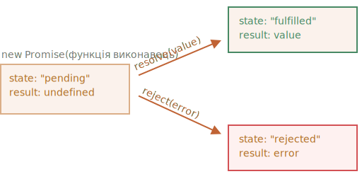
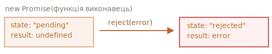

# Проміси

Уявіть, що ви співак-суперзірка і ваші фани постійно дошкуляють запитаннями про майбутній сингл.

Щоб вони перестали вам набридати, ви обіцяєте розіслати їм сингл як тільки-но він буде випущений. Ви даєте своїм фанатам листочок, в який вони можуть вписати свій e-mail. На який вони отримають або пісню як тільки-но вона буде готова, або ж, якщо щось піде не так (наприклад, в студії станеться пожежа), то вони отримають сповіщення, що пісні взагалі не буде.

Всім добре: ви, бо вам більше не дошкуляють, а фанати, бо можуть більше не переживати, що пропустять новий сингл.

Це аналогія з реального життя для ситуацій з якими ми часто стикаємось в програмуванні:

1. Є код–"виробник", котрий робить щось, що займає час. Наприклад, завантажує дані з мережі. Згідно з нашою аналогією це "співак".
2. Є код–"споживач", котрий очікує отримати результат від коду-"виробника", як тільки-но результат буде готовий. Цей результат може знадобитися багатьом функціям. Ці функції -- "фанати"
3. *Проміс* (англ. Promise) -- це спеціальний об’єкт в JavaScript, котрий зв’язує "виробника" і "споживача" разом. В контексті нашої аналогії -- це "список підписників". Код-"виробник" виконується стільки часу, скільки потрібно щоб отримати результат, а проміс робить результат доступним для коду-"споживача", який на нього підсився, як тільки-но код-"виробник" поверне результат.

Аналогія не зовсім точна, оскільки реалізація промісів в JavaScript набагато складніша ніж простий список підписок. В промісів більше можливостей і обмежень. Але для початку варто почати з простішого.

Синтаксис створення проміса:

```js
let promise = new Promise(function(resolve, reject) {
  // код, котрий поверне результат (по аналогії код–"виробник", код-"співак")
});
```

Функція передана в `new Promise` називається *виконавцем*. Коли створюється `new Promise` вона запускається автоматично. В ній знаходиться код "виробник" котрий зрештою поверне результат. В контексті нашої аналогії: виконавець -- це "співак".

Аргументи функції виконавця `resolve` і `reject` -- це колбеки, які надає сам JavaScript. Наш код має бути тільки всередині функції виконавця.

Після завершення своєї роботи функція виконавець повинна викликати один з цих колбеків:

- `resolve(value)` -- якщо код успішно виконався, з результатом `value`. (resolve перекладається як вирішити, розв'язати)
- `reject(error)` -- якщо виникла помилка, `error` -- об’єкт помилки. (reject в перекладі відхилити, відмовити)

Отже, функція виконавець запускається автоматично і намагається виконати роботу. А потім викликає перший аргумент (`resolve`) якщо спроба була успішною чи другий аргумент (`reject`) якщо виникла помилка.

`new Promise` повертає об'єкт `promise`. В цього об'єкта є дві властивості: `state` і `result`:
- `state` - спочатку має значення `"pending"` (очікування). А далі значення змінюється або на `"fulfilled"` якщо функція виконавець викликала аргумент `resolve`, або на `"rejected"`, якщо функція виконавець викликала `reject`.
- `result` - спочатку має значення `undefined`. А далі значення змінюється або на `value` якщо функція-виконавець викликала `resolve(value)`, або ж на `error`, якщо функція виконавець викликала `reject(error)`.

````smart header="Словничок англійських слів"
promise - обіцянка;
resolve - розв'язувати, вирішувати;
value - значення, вміст;
fulfilled - виконаний, здійснений;
reject - відхиляти, скасовувати;
error - помилка;
rejected - відхилений, скасований;
settled - усталений, завершений, втихомирений;
````

Отже, виконавець зрештою переводить `promise` в один з наступних станів:



Пізніше ми розглянемо, як "фанати" можуть підписуватись на ці зміни.

Нижче приклад конструктора проміса і простої функції-виконавця з кодом-"виробником", що видає результат з затримкою (через `setTimeout`):

```js
let promise = new Promise(function(resolve, reject) {
  // функція-виробник викликається автоматично, при виклику new Promise

  // через 1 секундну повідомляється що задача виконання з результатом "завершено"
  setTimeout(() => *!*resolve("завершено")*/!*, 1000);
});
```

Ми можемо спостерігати за двома моментами запустивши код вище:

1. Функція-виконавець викликається одразу ж при виклику `new Promise`.
2. Функція-виконавець отримує два аргументи: `resolve` і `reject` -- ці функції вбудовані в JavaScript, тому нам непотрібно їх створювати. Нам слід всього лиш викликати одну з них по готовності.

    Через одну секунду "обробки" виконавець викличе `resolve("done")`, щоб передати результат. Ця дія змінить стан об’єкта `promise` (що був створений конструктором `new Promise`) з `"pending"` на `"fulfilled"`:

    

Це був приклад успішно виконаної задачі, в результаті ми отримали "виконаний (fulfilled)" проміс.

А ось приклад коли функція-виконавець повідомить нам, що задача виконана з помилкою:

```js
let promise = new Promise(function(resolve, reject) {
  // через 1 секунду повідомляється що задача виконана з помилкою
  setTimeout(() => *!*reject(new Error("Ооооой!"))*/!*, 1000);
});
```

Виклик першого аргумента (`reject(...)`) переводить стан об’єкта `promise` в `"rejected"`:



Підіб’ємо проміжні підсумки: функція-виконавець виконує задачу (щось, що як правило потребує часу), потім викликається один з методів `resolve` чи `reject`, в залежності від успішності виконання коду. Які своєю чергою змінюють стан об’єкта який був повернутий з конструктора `new Promise`.

Проміс -- в стані `resolve` чи `reject` будемо називати "завершеним" (англ. settled), на відміну від початкового стану проміса "в очікуванні" (англ. pending).

````smart header="Може бути тільки щось одне: або результат, або помилка"
Функція-виконавець повинен викликати тільки щось одне: `resolve` або `reject`. Стан проміса може бути змінений лише один раз.

Всі наступні виклики `resolve` чи `reject` будуть проігноровані:

```js
let promise = new Promise(function(resolve, reject) {
*!*
  resolve("завершено");
*/!*

  reject(new Error("…")); // ігнорується
  setTimeout(() => resolve("…")); // ігнорується
});
```

Ідея в тому, що функція виконавець може мати тільки один результат: або успішний результат, або помилку.

Зверніть увагу, що методи `resolve`/`reject` можуть прийняти тільки один аргумент (або жодного) й ігнорують всі інші аргументи.
````

```smart header="Викликайте `reject` з об’єктом `Error`"
У випадку якщо щось пішло не так, функції-виконавцю слід викликати другий аргумент (`reject`). В `reject` можна передати аргумент будь-якого типу (як і в `resolve`), але рекомендується використовувати об’єкт `Error` (чи успадкований від нього об’єкт). Чому так? Скоро вам стане зрозуміло.
```

````smart header="Негайний виклик `resolve`/`reject`"
На практиці функція-виконавець робить щось асинхронне і викликає `resolve`/`reject` через деякий час. Проте можна викликати `resolve` чи `reject` одразу і це теж працюватиме:

```js
let promise = new Promise(function(resolve, reject) {
  // задача, що не потребує часу
  resolve(123); // моментально видасть результат: 123
});
```

Для прикладу, таке може статись коли JavaScript почав виконувати певну задачу, проте одразу ж побачив, що раніше її виконували й результат закешований.

Така ситуація нормальна. Проміс стає завершеним одразу ж.
````

```smart header="Властивості `state` і `result` -- внутрішні"
Властивості `state` і `result` -- це внутрішні / вбудовані / "підкапотні" властивості об’єкта створюваного конструтором Promise. Вони є "під капотом", але ми не маємо до них прямого доступу. Для обробки результату слід використовувати методи: `.then`/`.catch`/`.finally`. Про них піде мова далі.
```

## Споживачі: then, catch

Об’єкт, створюваний конструтором `Promise`, служить зв’язною ланкою між функцією виконавцем (код "виробник" чи "співак") і функціями-споживачами ("фанатами"), котрі отримають або результат, або помилку. Функції-споживачі можна зареєструвати (підписати на розсилку) за допомогою методів `.then` та `.catch`.

### then

Найважливіший і фундаментальний метод -- `.then`.

Синтаксис:

```js
promise.then(
  function(result) { *!*/* обробляє успішне виконання */*/!* },
  function(error) { *!*/* обробляє помилку */*/!* }
);
```

Перший аргумент метода `.then` -- це функція, що викликається коли проміс успішно виконується, тобто тоді, коли `state` переходить зі стану `"pending"` в `"resolved"`. Ця функція аргументом отримує результат проміса.

Другим аргументом метод `.then` приймає функцію, що викликається коли проміс переходить в стан `"rejected"`. Ця функція аргументом отримує помилку.

Для прикладу, наступним чином виглядає реакція на успішно виконаний проміс:

```js run
let promise = new Promise(function(resolve, reject) {
  setTimeout(() => resolve("завершено!"), 1000);
});

// після запуску resolve запуститься перший аргумент в .then
promise.then(
*!*
  result => alert(result), // виведе "завершено!" через 1 секунду
*/!*
  error => alert(error) // не запуститься ніколи
);
```

Тут запустилась перша функція.

А в випадку помилки в промісі - виконається друга:

```js run
let promise = new Promise(function(resolve, reject) {
  setTimeout(() => reject(new Error("Ооооой!")), 1000);
});

// метод reject запустить другу функцію передану в .then
promise.then(
  result => alert(result), // не запуститься ніколи
*!*
  error => alert(error) // виведе "Error: Ооооой!" через 1 секунду
*/!*
);
```

Якщо ми зацікавлені тільки в успішному виконанні задачі, тоді в `.then` можна передати тільки одну функцію:

```js run
let promise = new Promise(resolve => {
  setTimeout(() => resolve("завершено!"), 1000);
});

*!*
promise.then(alert); // виведе "завершено!" через 1 секунду
*/!*
```

### catch

Якби ми хотіли обробити лише помилку, тоді ми можемо використати `null` як перший аргумент `.then(null, errorHandlingFunction)`. Або можемо скористатись методом `.catch(errorHandlingFunction)`, котрий зробить те ж саме:


```js run
let promise = new Promise((resolve, reject) => {
  setTimeout(() => reject(new Error("Ооооой!")), 1000);
});

*!*
// .catch(f) те саме що й promise.then(null, f)
promise.catch(alert); // виведе "Error: Ооооой!" через 1 секунду
*/!*
```

Виклик `.catch(f)` -- це скорочений варіант `.then(null, f)`.

## Cleanup: finally

По аналогії з блоком `finally` зі звичайного `try {...} catch {...}`, у промісів також є свій метод `finally`

Виклик `.finally(f)` подібний до `.then(f, f)`, в тому сенсі, що `f` виконається в будь-якому випадку, коли проміс перейде в стан `"виконано (settled)"`. Як у випадку якщо стан проміса стане `resolved`, так і у випадку якщо `rejected`.

`finally` добре підходить для чистки, наприклад зупинки індикатора завантаження, тому, що його потрібно зупинити незалежно від результату.

Наприклад зупинка завантаження індикаторів, закриття непотрібних підключень тощо.

<<<<<<< HEAD
Подумайте про це як про завершення вечірки. Незалежно від того, була вечірка хорошою чи поганою, скільки друзів на ній було, ми все одно повинні прибрати по її завершенні.
=======
Think of it as a party finisher. Irresepective of whether a party was good or bad, how many friends were in it, we still need (or at least should) do a cleanup after it.
>>>>>>> d78b01e9833009fab534462e05c03cffc51bf0e3

Код може виглядати так:

```js
new Promise((resolve, reject) => {
  /* зробити щось, що займе час і потім викликати resolve/reject */
})
*!*
  // виконається коли проміс завершиться (стане "settled"), незалежно від того, успішно чи ні
  .finally(() => зупинити індикатор завантаження)
  // отож індикатор завантаження завжди зупинятиметься перед тим як ми будемо обробляти результат/помилку
*/!*
  .then(result => вивести результат, err => вивести помилку)
```

Проте `finally(f)` точно не є псевдонімом `then(f,f)`.

Є декілька важливих відмінностей:

1. Обробник `finally` не приймає аргументів. В `finally` ми не знаємо як був завершений проміс, успішно чи ні. І це нормально, тому що зазвичай наше завдання полягає в тому щоб виконати "загальні" процедури по завершенню.

    Подивіться на наведений вище приклад: як бачите, обробник `finally` не має аргументів, а результат промісу обробляється наступним обробником.
2. Обробник `finally` пропускає результат чи помилку до наступних обробників.

    Наприклад, тут результат проходить через `finally` до `then`:
    ```js run
    new Promise((resolve, reject) => {
      setTimeout(() => resolve("результат"), 2000)
    })
      .finally(() => alert("Проміс завершений")) // запускається першим
      .then(result => alert(result)); // <-- .then показує "резульат"
    ```

    Як бачите, "результат", який повертає перший проміс, передається через `finally` наступному `then`.

    Це дуже зручно, оскільки `finally` не призначений для обробки результату промісу. Як було сказано, це метод для загального очищення, незалежно від результату.

    А ось приклад помилки, щоб ми могли побачити, як вона передається через `finally` до `catch`:

    ```js run
    new Promise((resolve, reject) => {
      throw new Error("помилка");
    })
      .finally(() => alert("Проміс завершений")) // запускається першим
      .catch(err => alert(err));  // <-- .catch обробляє об’єкт помилки
    ```

3. Функція-обробник `f` з `.finally(f)` також не повинна нічого повертати. А навіть якщо вона щось і повертає, це значення всодно буде проігнороване.

    Єдиним винятком із цього правила є випадки, коли функція-обробник `finally` видає помилку. В такій ситуації помилка переходить до наступної функції-обробника замість будь-якого попереднього результату проміса.

У підсумку:

- Функція обробник `f` з `.finally(f)` не отримує результат попередньої функції обробника (у нього немає аргументів). Замість цього цей результат передається наступному відповідному обробнику.
- Якщо функція обробник `f` в `.finally(f)` щось повертає, це значення буде проігнороване.
- Якщо виникає помилка в `finally`, виконання переходить до найближчого обробника помилок.

Ці особливості є корисними й забезпечують правильну роботу, якщо ми використовуємо `finally` так, як це передбачено: для загальних процедур очищення.

````smart header="На завершених промісах обробники запускаються одразу"
Якщо проміс в стані очікування, `.then/catch/finally` будуть на нього чекати.

Іноді може бути й таке, що проміс стане виконаним ще до того, як ми додамо до нього обробник.

У такому випадку ці обробники просто запускаються негайно:

```js run
// при створенні проміс одразу ж перейде в стан успішно завершений (`"resolved"`)
let promise = new Promise(resolve => resolve("завершено!"));

promise.then(alert); // виведе "завершено!"
```

Зауважте, що це робить проміси більш потужними, ніж життєвий приклад "списку підписок". Якщо співак вже випустив свою пісню, а потім людина підписалась, вона імовірно не отримає цю пісню. Передоплата в реальному житті повинна бути здійсненою до початку події.

Проміси своєю чергою більш гнучкі. Ми можемо додати обробник в будь-який час: якщо результат вже є, вони просто виконуються.
````

## Приклад: loadScript [#loadscript]

Тепер, розгляньмо декілька прикладів з тим як проміси можуть облегшити нам написання асинхронного коду.

В нас є функція `loadScript` для завантаження скрипту з попереднього розділу.

Згадаймо як виглядає варіант з колбеком:

```js
function loadScript(src, callback) {
  let script = document.createElement('script');
  script.src = src;

  script.onload = () => callback(null, script);
  script.onerror = () => callback(new Error(`Помилка завантаження скрипта ${src}`));

  document.head.append(script);
}
```

Тепер перепишемо її використавши проміс.

Новій функції `loadScript` більше не потрібен колбек. Замість цього вона буде створювати й повертати об’єкт проміса, котрий перейде в стан "успішно завершений", коли завантаження завершиться. Зовнішній код також може додавати обробників ("підписників") використовуючи `.then`:

```js run
function loadScript(src) {
  return new Promise(function(resolve, reject) {
    let script = document.createElement('script');
    script.src = src;

    script.onload = () => resolve(script);
    script.onerror = () => reject(new Error(`Помилка завантаження скрипта ${src}`));

    document.head.append(script);
  });
}
```

Застосування:

```js run
let promise = loadScript("https://cdnjs.cloudflare.com/ajax/libs/lodash.js/4.17.11/lodash.js");

promise.then(
  script => alert(`${script.src} завантажений!`),
  error => alert(`Помилка: ${error.message}`)
);

promise.then(script => alert('Ще один обробник...'));
```

Одразу ж помітно декілька переваг над використання підходу з використанням колбеків:


| Проміси | Колбеки |
|----------|-----------|
| Проміси дозволяють нам виконувати речі в природному порядку. Спочатку ми запускаємо `loadScript(script)`, і потім ми прописуємо в `.then` що робити з результатом. | У нас повинна бути функція `callback` на момент виклику `loadScript(script, callback)`. Іншими словами нам потрібно знати що робити з результатом *до того* як викличеться `loadScript`. |
| Ми можемо викликати `.then` у проміса стільки раз, скільки захочемо. Кожного разу коли ми додаємо нового "фаната", нову функцію-підписку в "список-підписників". Більше про це в наступному розділі: [ланцюжок промісів](info:promise-chaining). | Колбек може бути тільки один. |

Таким чином проміси покращують порядок коду і дають нам гнучкість. Але це далеко не все. Ми дізнаємось ще багато корисного в наступних розділах.
