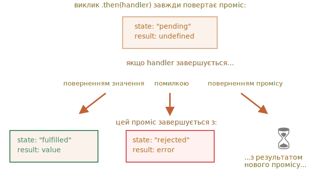

# Ланцюжок промісів

Повернемося до проблеми, згаданої в розділі [Введення: колбеки](info:callbacks): у нас є послідовність асинхронних задач, які потрібно виконувати одну за одною — наприклад, завантаження скриптів. Як ми можемо це добре закодувати?

Проміси надають кілька способів вирішення подібних задач.

У цьому розділі ми розглянемо ланцюжок промісів.

Він виглядає наступним чином:

```js run
new Promise(function(resolve, reject) {

  setTimeout(() => resolve(1), 1000); // (*)

}).then(function(result) { // (**)

  alert(result); // 1
  return result * 2;

}).then(function(result) { // (***)

  alert(result); // 2
  return result * 2;

}).then(function(result) {

  alert(result); // 4
  return result * 2;

});
```

Ідея полягає в тому, що результат передається через ланцюжок `.then` обробників.

Ось потік виконання:
1. Початковий проміс успішно виконується через 1 секунду `(*)`,
2. Далі викликається обробник `.then` `(**)`, який у свою чергу, створює новий проміс (вирішується зі значенням `2`).
3. Наступний `then` `(***)` приймає результат попереднього, оброблює його (подвоює) та передає до наступного обробника.
4. ...і так далі.

Коли результат передається по ланцюжку обробників, ми бачимо послідовність викликів `alert`: `1` -> `2` -> `4`.


Усе це працює тому, що кожний виклик `.then` повертає новий проміс, тому ми можемо викликати наступний `.then` на ньому.

Коли обробник повертає значення, воно стає результатом того промісу, тому наступний `.then` викликається з цим значенням.

**Класична помилка новачка: технічно ми також можемо додати багато `.then` до одного промісу. Та це не ланцюжок.**

Наприклад:
```js run
let promise = new Promise(function(resolve, reject) {
  setTimeout(() => resolve(1), 1000);
});

promise.then(function(result) {
  alert(result); // 1
  return result * 2;
});

promise.then(function(result) {
  alert(result); // 1
  return result * 2;
});

promise.then(function(result) {
  alert(result); // 1
  return result * 2;
});
```

Те, що ми зробили тут, — це додали лише кілька обробників до одного промісу. Вони не передають результат один одному; натомість вони обробляють його самостійно.

Ось малюнок (порівняйте його з ланцюжком вище):


Усі `.then` на одному й тому самому промісі отримують той самий результат - результат цього промісу. Тож у коді вище усі `alert` показують те саме: `1`.

На практиці нам рідко потрібні кілька обробників для одного промісу. Набагато частіше використовується ланцюжок.

## Повернення промісів

Обробник, використанний в `.then(handler)` може створити й повернути проміс.

У цьому випадку інші обробники чекають, поки він виконається, а потім отримають його результат.

Наприклад:

```js run
new Promise(function(resolve, reject) {

  setTimeout(() => resolve(1), 1000);

}).then(function(result) {

  alert(result); // 1

*!*
  return new Promise((resolve, reject) => { // (*)
    setTimeout(() => resolve(result * 2), 1000);
  });
*/!*

}).then(function(result) { // (**)

  alert(result); // 2

  return new Promise((resolve, reject) => {
    setTimeout(() => resolve(result * 2), 1000);
  });

}).then(function(result) {

  alert(result); // 4

});
```

<<<<<<< HEAD
Тут перший `.then` показує `1` і повертає `new Promise(…)` у рядку `(*)`. Через одну секунду він вирішується, а результат (аргумент `resolve`, тут це `результат * 2`) передається обробнику другого `.then`. Цей обробник знаходиться в рядку `(**)`, він показує `2` і робить те ж саме.
=======
Here the first `.then` shows `1` and returns `new Promise(…)` in the line `(*)`. After one second it resolves, and the result (the argument of `resolve`, here it's `result * 2`) is passed on to the handler of the second `.then`. That handler is in the line `(**)`, it shows `2` and does the same thing.
>>>>>>> 29216730a877be28d0a75a459676db6e7f5c4834

Отже, результат такий же, як і в попередньому прикладі: 1 -> 2 -> 4, але тепер із затримкою в 1 секунду між викликами `alert`.

Повернення промісів дозволяє нам будувати ланцюжки асинхронних дій.

## Приклад: loadScript

Давайте використовувати цю можливість з промісифікацією `loadScript`, визначеною у [попередньому розділі](info:promise-basics#loadscript), щоб завантажувати скрипти один за одним, у послідовності:

```js run
loadScript("/article/promise-chaining/one.js")
  .then(function(script) {
    return loadScript("/article/promise-chaining/two.js");
  })
  .then(function(script) {
    return loadScript("/article/promise-chaining/three.js");
  })
  .then(function(script) {
    // викличемо функції, оголошені в скриптах
    // щоб показати, що вони дійсно завантажені
    one();
    two();
    three();
  });
```

Цей код можна зробити трохи коротшим за допомогою стрілкових функцій:

```js run
loadScript("/article/promise-chaining/one.js")
  .then(script => loadScript("/article/promise-chaining/two.js"))
  .then(script => loadScript("/article/promise-chaining/three.js"))
  .then(script => {
    // скрипти завантажені, ми можемо використовувати оголошені там функції
    one();
    two();
    three();
  });
```


Тут кожен виклик `loadScript` повертає проміс, а наступний `.then` запускається, коли він виконується. Потім він ініціює завантаження наступного сценарію. Таким чином, скрипти завантажуються один за одним.

Ми можемо додати більше асинхронних дій до ланцюжка. Зверніть увагу, що код все ще "плоский" — він росте вниз, а не вправо. Немає жодних ознак "піраміди приреченості".

Технічно ми можемо додати `.then` безпосередньо до кожного `loadScript`, наприклад:

```js run
loadScript("/article/promise-chaining/one.js").then(script1 => {
  loadScript("/article/promise-chaining/two.js").then(script2 => {
    loadScript("/article/promise-chaining/three.js").then(script3 => {
      // ця функція має доступ до змінних script1, script2 і script3
      one();
      two();
      three();
    });
  });
});
```

Цей код робить те ж саме: завантажує 3 скрипти послідовно. Але він "росте вправо". Тож у нас та ж проблема, що й з колбеками.

Люди, які починають використовувати проміси, іноді не знають про ланцюжок, тому пишуть це так. Як правило, перевага віддається ланцюжкам.

Іноді нормально писати `.then` відразу, оскільки вкладена функція має доступ до зовнішньої області видимості. У наведеному вище прикладі найбільш вкладений колбек має доступ до всіх змінних `script1`, `script2`, `script3`. Але це швидше виняток, ніж правило.


````smart header="Thenables"
Якщо бути точним, обробник може повернути не зовсім проміс, а так званий об’єкт "thenable" - довільний об’єкт, який має метод `.then`. Це буде розглядатися так само, як проміс.

Ідея полягає в тому, що сторонні бібліотеки можуть реалізовувати власні промісо-сумісні об’єкти. Вони можуть мати розширений набір методів, але також можуть бути сумісні з нативними промісами, оскільки вони реалізують `.then`.

Ось приклад такого об’єкта:

```js run
class Thenable {
  constructor(num) {
    this.num = num;
  }
  then(resolve, reject) {
    alert(resolve); // function() { native code }
    // буде успішно виконано з аргументом this.num*2 через 1 секунду
    setTimeout(() => resolve(this.num * 2), 1000); // (**)
  }
}

new Promise(resolve => resolve(1))
  .then(result => {
*!*
    return new Thenable(result); // (*)
*/!*
  })
  .then(alert); // показує 2 через 1000 мс
```

JavaScript перевіряє об’єкт, повернутий обробником `.then` у рядку `(*)`: якщо він має викликаний метод з ім’ям `then`, тоді він викликає цей метод, та надає власні функції `resolve`, `reject` як аргументи (подібно виконавцю) і чекає, поки один з них не буде викликаний. У наведеному вище прикладі `resolve(2)` викликається через 1 секунду `(**)`. Потім результат передається далі по ланцюжку.

Ця функція дозволяє нам інтегрувати власні об’єкти з ланцюжками промісів без успадкування від `Promise`.
````


## Складніший приклад: fetch

У інтерфейсному програмуванні проміси часто використовуються для мережевих запитів. Тож давайте подивимося на розширений приклад цього.

Ми будемо використовувати метод [fetch](info:fetch), щоб завантажити інформацію про користувача з віддаленого сервера. Він має багато опціональних параметрів, які розглядаються в [окремих розділах](info:fetch), але основний синтаксис досить простий:

```js
let promise = fetch(url);
```

Зазначений код робить мережевий запит до `url` і повертає проміс. Проміс розв’язується за допомогою об’єкта `response`, коли віддалений сервер відповідає заголовками, але *до завантаження повної відповіді*.

Щоб прочитати повну відповідь, ми повинні викликати метод `response.text()`: він повертає проміс, який виконується, коли повний текст завантажується з віддаленого сервера, і містить цей текст як результат.

Наведений нижче код робить запит до `user.json` і завантажує його текст із сервера:

```js run
fetch('/article/promise-chaining/user.json')
  // .then нижче запускається, коли віддалений сервер відповідає
  .then(function(response) {
    // response.text() повертає новий проміс, який вирішується з повним текстом відповіді,
    // коли він завантажується
    return response.text();
  })
  .then(function(text) {
    // ...а ось вміст віддаленого файлу
    alert(text); // {"name": "iliakan", "isAdmin": true}
  });
```

Об’єкт `response`, повернутий із `fetch`, також включає метод `response.json()`, який зчитує віддалені дані у форматі JSON. У нашому випадку це ще зручніше, тож перейдемо до нього.

Ми також будемо використовувати стрілкові функції для стислості:

```js run
// те саме, що й вище, але response.json() зчитує віддалений контент у форматі JSON
fetch('/article/promise-chaining/user.json')
  .then(response => response.json())
  .then(user => alert(user.name)); // iliakan, отримали ім’я користувача
```

Тепер давайте зробимо щось із завантаженим користувачем.

Наприклад, ми можемо зробити ще один запит до GitHub, завантажити профіль користувача та показати аватар:

```js run
// Запитуємо user.json
fetch('/article/promise-chaining/user.json')
  // Завантажуємо дані у форматі json
  .then(response => response.json())
  // Робимо запит до GitHub
  .then(user => fetch(`https://api.github.com/users/${user.name}`))
  // Завантажуємо відповідь у форматі json
  .then(response => response.json())
  // Показуємо аватар (githubUser.avatar_url) протягом 3 секунд (можливо, з анімацією)
  .then(githubUser => {
    let img = document.createElement('img');
    img.src = githubUser.avatar_url;
    img.className = "promise-avatar-example";
    document.body.append(img);

    setTimeout(() => img.remove(), 3000); // (*)
  });
```

Код працює; дивіться коментарі щодо деталей. Однак у цьому є потенційна проблема, типова помилка для тих, хто починає використовувати проміси.

Подивіться на рядок `(*)`: як ми можемо щось зробити *після* того, як аватар закінчить відображатися і видалиться? Наприклад, ми хотіли б показати форму для редагування цього користувача чи щось інше. Поки що такої можливості немає.

Щоб ланцюжок міг розширюватися, нам потрібно повернути проміс, який розв’язується, коли аватар закінчує відображатися.

Ось так:

```js run
fetch('/article/promise-chaining/user.json')
  .then(response => response.json())
  .then(user => fetch(`https://api.github.com/users/${user.name}`))
  .then(response => response.json())
*!*
  .then(githubUser => new Promise(function(resolve, reject) { // (*)
*/!*
    let img = document.createElement('img');
    img.src = githubUser.avatar_url;
    img.className = "promise-avatar-example";
    document.body.append(img);

    setTimeout(() => {
      img.remove();
*!*
      resolve(githubUser); // (**)
*/!*
    }, 3000);
  }))
  // спрацьовує через 3 секунди
  .then(githubUser => alert(`Завершили показ ${githubUser.name}`));
```

Тобто обробник `.then` у рядку `(*)` тепер повертає `new Promise`, який перейде у стан "виконаний" лише після виклику `resolve(githubUser)` у `setTimeout` `(**)`. Наступний `.then` в ланцюжку буде чекати цього.

Як хороша практика, асинхронна дія завжди повинна повертати проміс. Це дає можливість планувати дії після нього; навіть якщо ми не плануємо розширювати ланцюжок зараз, можливо, це нам знадобиться пізніше.

Нарешті, ми можемо розділити код на функції, що можуть бути перевикористані:

```js run
function loadJson(url) {
  return fetch(url)
    .then(response => response.json());
}

function loadGithubUser(name) {
  return loadJson(`https://api.github.com/users/${name}`);
}

function showAvatar(githubUser) {
  return new Promise(function(resolve, reject) {
    let img = document.createElement('img');
    img.src = githubUser.avatar_url;
    img.className = "promise-avatar-example";
    document.body.append(img);

    setTimeout(() => {
      img.remove();
      resolve(githubUser);
    }, 3000);
  });
}

// Використаємо їх:
loadJson('/article/promise-chaining/user.json')
  .then(user => loadGithubUser(user.name))
  .then(showAvatar)
  .then(githubUser => alert(`Завершили показ ${githubUser.name}`));
  // ...
```

## Підсумки

Якщо обробник `.then` (або `catch/finally`, не має різниці) повертає проміс, решта ланцюжка чекає, доки він виконається. Коли це відбувається, його результат (або помилка) передається далі.

Ось повна картина:


