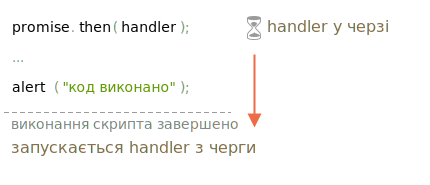

# Мікрозадачі

Обробники промісів `.then`/`.catch`/`.finally` завжди асинхронні.

Навіть коли проміс буде негайно виконано, код у рядках *нижче* `.then`/`.catch`/`.finally` все одно виконається до цих обробників.

Ось демо:

```js run
let promise = Promise.resolve();

promise.then(() => alert("проміс виконано!"));

alert("код виконано"); // цей alert показується першим
```

Якщо ви його запустите, то побачите спочатку `код виконано`, а потім `проміс виконано!`.

Це дивно, адже проміс, безумовно, виконується з самого початку.

Чому потім спрацював `.then`? Що відбувається?

## Черга мікрозадач

Асинхронні задачі потребують належного керування. Для цього стандарт ECMA визначає внутрішню чергу `PromiseJobs`, яку частіше називають "чергою мікрозадач" (термін v8).

Як зазначено в [специфікації](https://tc39.github.io/ecma262/#sec-jobs-and-job-queues):

- Черга функціонує за принципом першим-прийшов-першим-пішов: задачі, які стоять у черзі, виконуються першими.
- Виконання задач починається лише тоді, коли більше нічого не виконується.

Або, простіше кажучи, коли проміс виконано, його обробники `.then/catch/finally` поміщаються в чергу; вони ще не виконані. Коли рушій JavaScript звільняється від виконання поточного коду, він бере задачу з черги та виконує її.

Ось чому "код виконано" у прикладі вище показується першим.



Обробники промісів завжди проходять через цю внутрішню чергу.

Якщо є ланцюжок з кількох `.then/catch/finally`, то кожен з них виконується асинхронно. Тобто спочатку він потрапляє в чергу, а потім виконується, коли виконання поточного коду буде завершено, а попередні обробники в черзі виконані.

**Що робити, якщо порядок має значення для нас? Як ми можемо зробити так, щоб `код виконано` відображалося після `проміс виконано`?**

Легко, просто поставте його в чергу за допомогою `.then`:

```js run
Promise.resolve()
  .then(() => alert("проміс виконано!"))
  .then(() => alert("код виконано"));
```

Тепер порядок відповідає задуму.

## Необроблені помилки

Пам'ятаєте подію `unhandledrejection` зі статті <info:promise-error-handling>?

Тепер ми бачимо, як саме JavaScript дізнається про необроблені помилки.

**"Необроблена помилка" виникає тоді, коли помилка проміса не обробляється в кінці черги мікрозадач.**

Зазвичай, якщо ми очікуємо помилку, то додаємо `.catch` до ланцюжка промісів для її обробки:

```js run
let promise = Promise.reject(new Error("Помилка в промісі!"));
*!*
promise.catch(err => alert('спіймана'));
*/!*

// не запуститься: помилка оброблена
window.addEventListener('unhandledrejection', event => alert(event.reason));
```

Але якщо ми забудемо додати `.catch`, тоді, коли черга мікрозадач буде порожня, рушій ініціює подію:

```js run
let promise = Promise.reject(new Error("Помилка в промісі!"));

// Помилка в промісі!
window.addEventListener('unhandledrejection', event => alert(event.reason));
```

А що, якщо ми обробимо помилку пізніше? Наприклад ось так:

```js run
let promise = Promise.reject(new Error("Помилка в промісі!"));
*!*
setTimeout(() => promise.catch(err => alert('спіймана')), 1000);
*/!*

// Error: Помилка в промісі!
window.addEventListener('unhandledrejection', event => alert(event.reason));
```

Тепер, якщо ми його запустимо, то спочатку побачимо `Помилка в промісі!`, а потім `спіймана`.

Якби ми не знали про чергу мікрозадач, то могли б задатися питанням: "Чому запустився обробник `unhandledrejection`? Ми спіймали та обробили помилку!"

Але тепер ми розуміємо, що `unhandledrejection` генерується, коли черга мікрозадач завершується: рушій перевіряє проміси, і, якщо будь-який з них знаходиться в стані "rejected", то ініціюється ця подія.

У вищенаведеному прикладі `.catch`, доданий в `setTimeout`, також спрацює. Але це відбувається пізніше, після того, як `unhandledrejection` вже виникло, тому це ні на що не впливає.

## Підсумки

Обробка промісів завжди асинхронна, оскільки всі дії промісів проходять через внутрішню чергу "promise jobs", яку також називають "чергою мікрозадач" (термін v8).

Тому обробники `.then/catch/finally` завжди викликаються після виконання поточного коду.

Якщо нам потрібно гарантувати, що фрагмент коду виконується після `.then/catch/finally`, ми можемо додати його до ланцюжкового виклику `.then`.

У більшості рушіїв Javascript, включаючи браузери та Node.js, концепція мікрозадач тісно пов'язана з "циклом подій" ("event loop") і "макрозадачами". Оскільки вони не мають прямого відношення до промісів, вони розглянуті в іншій частині підручника, у статті <info:event-loop>.