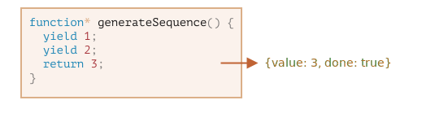

# Генератори

Звичайні функції повертають лише одне, єдине значення (або нічого).

Генератори можуть повертати ("yield") кілька значень, одне за одним, на вимогу. Вони чудово працюють з [об'єктами, що перебираються](info:iterable), дозволяючи легко створювати потоки даних.

## Функції-генератори

Щоб створити генератор, нам потрібна спеціальна синтаксична конструкція: `function*`, так звана "функція-генератор".

Це виглядає ось так:

```js
function* generateSequence() {
  yield 1;
  yield 2;
  return 3;
}
```

Функції-генератори поводяться інакше, ніж звичайні. Коли така функція викликається, вона не запускає свій код. Замість цього вона повертає спеціальний об'єкт, який називається «об'єкт-генератор», щоб керувати її виконанням.

Ось подивіться:

```js run
function* generateSequence() {
  yield 1;
  yield 2;
  return 3;
}

// "функція-генератор" створює "об'єкт-генератор"
let generator = generateSequence();
*!*
alert(generator); // [object Generator]
*/!*
```

Виконання коду функції ще не розпочато:


Основним методом генератора є `next()`. При виклику він запускає виконання коду до найближчого оператора `yield <value>` (`value` можна опустити, тоді воно є `undefined`). Потім виконання функції призупиняється, а отримане `value` повертається до зовнішнього коду.

Результатом `next()` завжди є об'єкт з двома властивостями:
- `value`: отримане значення.
- `done`: `true`, якщо код функції закінчився, інакше `false`.

Наприклад, тут ми створюємо генератор і отримуємо його перше значення, що повертається:

```js run
function* generateSequence() {
  yield 1;
  yield 2;
  return 3;
}

let generator = generateSequence();

*!*
let one = generator.next();
*/!*

alert(JSON.stringify(one)); // {value: 1, done: false}
```

На даний момент ми отримали лише перше значення, а виконання функції відбувається на другому рядку:


Давайте знову викличемо `generator.next()`. Він відновлює виконання коду і повертає наступний `yield`:

```js
let two = generator.next();

alert(JSON.stringify(two)); // {value: 2, done: false}
```


І якщо ми викликаємо його втретє, виконання досягає оператора `return`, який завершує виконання функції:

```js
let three = generator.next();

alert(JSON.stringify(three)); // {value: 3, *!*done: true*/!*}
```



Тепер генератор виконався. Ми можемо побачити це за допомогою `done:true` і обробити `value:3` як кінцевий результат.

Нові виклики `generator.next()` більше не мають сенсу. Якщо ми їх робимо, вони повертають той самий об'єкт: `{done: true}`.

```smart header="`function* f(…)` чи `function *f(…)`?"
Обидва синтаксиси правильні.

Але зазвичай перевага віддається першому синтаксису, оскільки зірочка `*` означає, що це функція-генератор, вона описує вид, а не ім'я, тому її слід розташовувати разом із ключовим словом `function`.
```

## Перебір генераторів

Як ви, напевно, вже здогадалися, дивлячись на метод `next()`, генератори є [об'єктами, що перебираються](info:iterable).

Ми можемо перебирати їх значення за допомогою `for..of`:

```js run
function* generateSequence() {
  yield 1;
  yield 2;
  return 3;
}

let generator = generateSequence();

for(let value of generator) {
  alert(value); // 1, потім 2
}
```

Виглядає набагато приємніше, ніж виклик `.next().value`, чи не так?

...Але зверніть увагу: у прикладі вище показано `1`, потім `2`, і це все. Значення `3` не показується!

Це тому, що перебір через `for..of` ігнорує останнє `value`, коли `done: true`. Отже, якщо ми хочемо, щоб усі результати відображалися через `for..of`, то повинні повертати їх через `yield`:

```js run
function* generateSequence() {
  yield 1;
  yield 2;
*!*
  yield 3;
*/!*
}

let generator = generateSequence();

for(let value of generator) {
  alert(value); // 1, потім 2, потім 3
}
```

Оскільки генератори є об'єктами, що перебираються, ми можемо використовувати всю пов'язану з ними функціональність, наприклад синтаксис розширення `...`:

```js run
function* generateSequence() {
  yield 1;
  yield 2;
  yield 3;
}

let sequence = [0, ...generateSequence()];

alert(sequence); // 0, 1, 2, 3
```

У наведеному вище коді `...generateSequence()` перетворює об'єкт-генератор, що перебирається, в масив елементів (докладніше про синтаксис розширення читайте у главі [](info:rest-parameters-spread#spread-syntax))

## Використання генераторів для об'єктів, що перебираються

Деякий час тому в главі [](info:iterable) ми створили об'єкт `range`, що перебирається та повертає значення `from..to`.

Ось, давайте згадаємо код:

```js run
let range = {
  from: 1,
  to: 5,

  // for..of range викликає цей метод один раз на самому початку
  [Symbol.iterator]() {
    // ...він повертає об'єкт, що перебирається:
    // далі for..of працює лише з цим об'єктом, запитуючи в нього наступні значення
    return {
      current: this.from,
      last: this.to,

      // next() викликається при кожній ітерації цикла for..of
      next() {
        // повинно повернути значення як об'єкт {done:.., value :...}
        if (this.current <= this.last) {
          return { done: false, value: this.current++ };
        } else {
          return { done: true };
        }
      }
    };
  }
};

// при переборі об'єкта range повертаються числа від range.from до range.to
alert([...range]); // 1,2,3,4,5
```

Ми можемо використовувати функцію-генератор для перебору об'єкта, вказавши її як `Symbol.iterator`.

Ось той самий `range`, але набагато компактніший:

```js run
let range = {
  from: 1,
  to: 5,

  *[Symbol.iterator]() { // скорочення для [Symbol.iterator]: function*()
    for(let value = this.from; value <= this.to; value++) {
      yield value;
    }
  }
};

alert( [...range] ); // 1,2,3,4,5
```

Це працює, тому що `range[Symbol.iterator]()` тепер повертає генератор, а методи генератора – це саме те, що очікує `for..of`:
- він має метод `.next()`
- повертає значення у вигляді `{value: ..., done: true/false}`

Це, звичайно, не випадковість. Генератори були додані до мови JavaScript з урахуванням об'єктів, що перебираються, щоб їх було легше реалізувати.

Варіант з генератором набагато лаконічніший, ніж оригінальний код `range`, що перебирається, і зберігає ту саму функціональність.

```smart header="Генератори можуть генерувати значення нескінченно"
У вищенаведених прикладах ми створили кінцеві послідовності, але ми також можемо створити генератор, який видає значення нескінченно. Наприклад, нескінченна послідовність псевдовипадкових чисел.

Безсумнівно, для цього буде потрібно `break` (або `return`) у циклі `for..of` в такому генераторі. Інакше цикл повторюватиметься нескінченно та зависне.
```

## Композиція генераторів

Композиція генераторів – це особливість генераторів, що дозволяє прозоро "вбудовувати" генератори один в одного.

Наприклад, у нас є функція, яка генерує послідовність чисел:

```js
function* generateSequence(start, end) {
  for (let i = start; i <= end; i++) yield i;
}
```

Тепер ми хотіли б повторно використати його для створення складнішої послідовності:
- спочатку цифри `0..9` (з кодами символів 48..57),
- за якими йдуть великі літери алфавіту `A..Z` (коди символів 65..90)
- за якими йдуть малі літери алфавіту `a..z` (коди символів 97..122)

Ми можемо використовувати цю послідовність, наприклад створювати паролі, вибираючи з неї символи (можна також додати символи пунктуації), але давайте спочатку згенеруємо її.

У звичайній функції, щоб об'єднати результати кількох інших функцій, ми викликаємо їх, зберігаємо результати, а потім об'єднуємо в кінці.

Для генераторів існує спеціальний синтаксис `yield*` для "вбудовування" (компонування) одного генератора в інший.

Ось композиція генераторів:

```js run
function* generateSequence(start, end) {
  for (let i = start; i <= end; i++) yield i;
}

function* generatePasswordCodes() {

*!*
  // 0..9
  yield* generateSequence(48, 57);

  // A..Z
  yield* generateSequence(65, 90);

  // a..z
  yield* generateSequence(97, 122);
*/!*

}

let str = '';

for(let code of generatePasswordCodes()) {
  str += String.fromCharCode(code);
}

alert(str); // 0..9A..Za..z
```

Директива `yield*` *делегує* виконання іншому генератору. Цей термін означає, що `yield* gen` виконує ітерацію над генератором `gen` і прозоро передає його вихід назовні. Ніби значення були отримані зовнішнім генератором.

Результат такий самий, як якби ми вставили код із вкладених генераторів:

```js run
function* generateSequence(start, end) {
  for (let i = start; i <= end; i++) yield i;
}

function* generateAlphaNum() {

*!*
  // yield* generateSequence(48, 57);
  for (let i = 48; i <= 57; i++) yield i;

  // yield* generateSequence(65, 90);
  for (let i = 65; i <= 90; i++) yield i;

  // yield* generateSequence(97, 122);
  for (let i = 97; i <= 122; i++) yield i;
*/!*

}

let str = '';

for(let code of generateAlphaNum()) {
  str += String.fromCharCode(code);
}

alert(str); // 0..9A..Za..z
```

Композиція генераторів - це природний спосіб вставити потік одного генератора в інший. Вона не використовує додаткову пам'ять для зберігання проміжних результатів.

## "yield" — дорога з двостороннім рухом

До цього моменту генератори були схожі на об'єкти, що перебираються, зі спеціальним синтаксисом для генерування значень. Але насправді вони набагато потужніші й гнучкіші.

Це тому, що `yield` є дорогою з двостороннім рухом: він не лише повертає результат назовні, але також може передати значення всередину генератора.

Для цього ми повинні викликати `generator.next(arg)` з аргументом. Цей аргумент стає результатом `yield`.

Подивімося на прикладі:

```js run
function* gen() {
*!*
  // Передаємо запитання зовнішньому коду та чекаємо відповіді
  let result = yield "2 + 2 = ?"; // (*)
*/!*

  alert(result);
}

let generator = gen();

let question = generator.next().value; // <-- yield повертає значення

generator.next(4); // --> передає результат в генератор  
```


1. Перший виклик `generator.next()` завжди має здійснюватися без аргументу (аргумент ігнорується, якщо він переданий). Він розпочинає виконання та повертає результат першого `yield "2+2=?"`. У цей момент генератор зупиняє виконання, залишаючись на рядку `(*)`.
2. Потім, як показано на зображенні вище, результат `yield` потрапляє до змінної `question` у коді, що викликає.
3. На `generator.next(4)` генератор відновлюється, і `4` потрапляє як результат: `let result = 4`.

Зауважте, що зовнішній код не повинен негайно викликати `next(4)`. Це може зайняти час. Це не проблема: генератор зачекає.

Наприклад:

```js
// відновити роботу генератора через деякий час
setTimeout(() => generator.next(4), 1000);
```

Як бачимо, на відміну від звичайних функцій, генератор і код, що його викликає, можуть обмінюватися результатами, передаючи значення в `next/yield`.

Щоб зробити речі більш очевидними, ось інший приклад із більшою кількістю викликів:

```js run
function* gen() {
  let ask1 = yield "2 + 2 = ?";

  alert(ask1); // 4

  let ask2 = yield "3 * 3 = ?"

  alert(ask2); // 9
}

let generator = gen();

alert( generator.next().value ); // "2 + 2 = ?"

alert( generator.next(4).value ); // "3 * 3 = ?"

alert( generator.next(9).done ); // true
```

Зображення виконання:


1. Перший `.next()` починає виконання... Він досягає першого `yield`.
2. Результат повертається до зовнішнього коду.
3. Другий `.next(4)` передає `4` назад у генератор як результат першого `yield` і відновлює виконання.
4. ...Воно досягає другого `yield`, який стає результатом виклику генератора.
5. Третій `next(9)` передає `9` у генератор як результат другого `yield` і відновлює виконання, яке досягає кінця функції, тому `done: true`.

Це як гра в "пінг-понг". Кожне `next(value)` (за винятком першого) передає значення в генератор, яке стає результатом поточного `yield`, а потім повертає результат наступного `yield`.

## generator.throw

Як ми помітили у прикладах вище, зовнішній код може передати значення в генератор, як результат `yield`.

...Але він також може ініціювати (викинути) там помилку. Це природно, оскільки помилка – це свого роду результат.

Щоб передати помилку в `yield`, ми повинні викликати `generator.throw(err)`. У цьому випадку `err` викидається в рядок із цим `yield`.

Наприклад, тут `"2 + 2 = ?"` призводить до помилки:

```js run
function* gen() {
  try {
    let result = yield "2 + 2 = ?"; // (1)

    alert("Виконання не доходить сюди, тому що вище викинуто виняток");
  } catch(e) {
    alert(e); // покаже помилку
  }
}

let generator = gen();

let question = generator.next().value;

*!*
generator.throw(new Error("Відповідь не знайдено в моїй базі даних")); // (2)
*/!*
```

Помилка, яка прокидається в генератор на рядку `(2)`, призводить до винятку на рядку `(1)` з `yield`. У вищенаведеному прикладі `try..catch` ловить та показує його.

Якщо ми його не зловимо, то, як і будь-який виняток, він "випадає" з генератора у код, що його викликав.

Поточний рядок коду, що викликає – це рядок із `generator.throw`, позначений як `(2)`. Тож ми можемо зловити її тут, наприклад:

```js run
function* generate() {
  let result = yield "2 + 2 = ?"; // Помилка в цьому рядку
}

let generator = generate();

let question = generator.next().value;

*!*
try {
  generator.throw(new Error("Відповідь не знайдено в моїй базі даних"));
} catch(e) {
  alert(e); // покаже помилку
}
*/!*
```

Якщо ми не перехопимо помилку там, то далі, як зазвичай, вона потрапляє до зовнішнього коду (якщо є) і, якщо не перехоплена, вбиває скрипт.

## generator.return

`generator.return(value)` завершує виконання генератора та повертає задане `value`.

```js
function* gen() {
  yield 1;
  yield 2;
  yield 3;
}

const g = gen();

g.next();        // { value: 1, done: false }
g.return('foo'); // { value: "foo", done: true }
g.next();        // { value: undefined, done: true }
```

Якщо ми знову використаємо `generator.return()` у завершеному генераторі, він знову поверне це значення ([MDN](https://developer.mozilla.org/en-US/docs/Web/JavaScript/Reference/Global_Objects/Generator/return)).

Часто ми не використовуємо його, оскільки в більшості випадків хочемо отримати всі значення, що повертаються, але це може бути корисно, коли ми хочемо зупинити генератор у певному стані.

## Підсумки

- Генератори створюються функціями-генераторами `function* f(…) {…}`.
- Усередині генераторів (лише в них) існує оператор `yield`.
- Зовнішній код і генератор можуть обмінюватися результатами за допомогою викликів `next/yield`.

У сучасному JavaScript генератори використовуються рідко. Але іноді вони стають у пригоді, оскільки здатність функції обмінюватися даними з кодом, що її викликає, під час самого виконання є досить унікальною. І, безсумнівно, вони чудово підходять для створення об'єктів, що перебираються.

Крім того, у наступному розділі ми ознайомимося з асинхронними генераторами, які використовуються для зчитування потоків асинхронно згенерованих даних (наприклад, які посторінково завантажуються з мережі) у циклах `for await ... of`.

У вебпрограмуванні ми часто працюємо з потоковими даними, тому це ще один дуже важливий варіант використання.