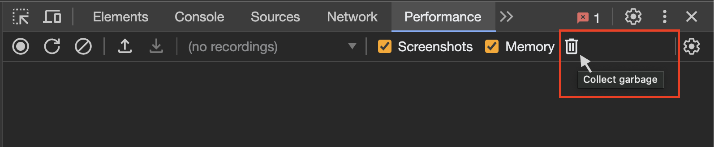
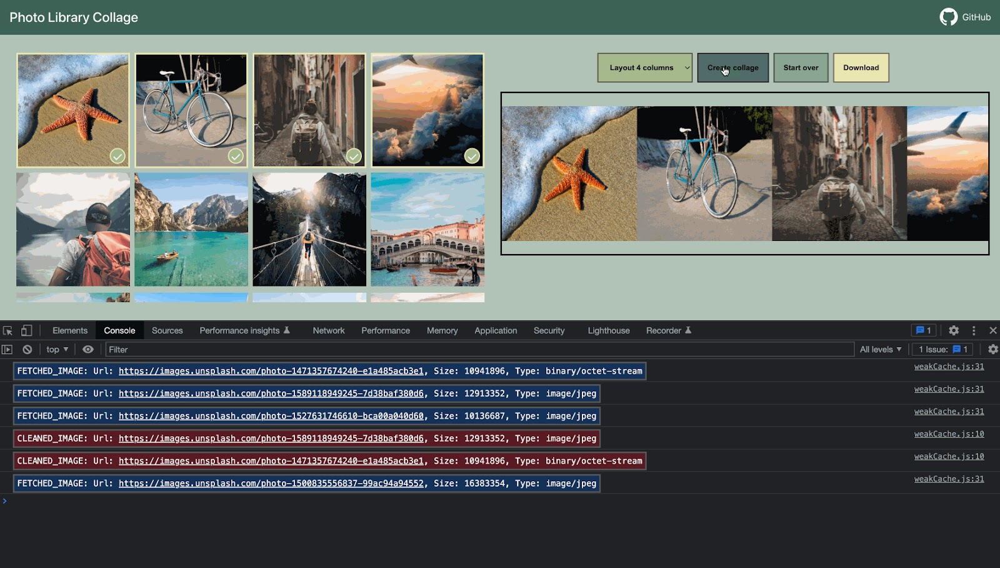

<<<<<<< HEAD
# WeakRef та FinalizationRegistry

```warn header="\"Приховані\" можливості мови"
У цій статті розглядається дуже вузькоспрямована тема, з якою більшість розробників на практиці стикаються надзвичайно рідко (а можуть і взагалі не знати про її існування).

Ми рекомендуємо пропустити цей розділ, якщо ви тільки почали вивчення JavaScript.
```

Згадуючи основну концепцію *принципу досяжності* з розділу <info:garbage-collection>, ми можемо відзначити,
що рушій JavaScript гарантовано зберігає у пам'яті значення, які досяжні або використовуються.  

Наприклад:


```js
//  у змінній user знаходиться сильне посилання на об'єкт
let user = { name: "John" };

// перезапишемо значення змінної user
user = null;

// посилання втрачається і об'єкт буде видалено з пам'яті

```

Або схожий, але трохи складніший код із двома сильними посиланнями:

```js
//  у змінній user знаходиться сильне посилання на об'єкт
let user = { name: "John" };

// скопіювали сильне посилання на об'єкт у змінну admin
=======
# WeakRef and FinalizationRegistry

```warn header="\"Hidden\" features of the language"
This article covers a very narrowly focused topic, that most developers extremely rarely encounter in practice (and may not even be aware of its existence).  

We recommend skipping this chapter if you have just started learning JavaScript.
```

Recalling the basic concept of the *reachability principle* from the <info:garbage-collection> chapter,
we can note that the JavaScript engine is guaranteed to keep values in memory that are accessible or in use.

For example:


```js
//  the user variable holds a strong reference to the object
let user = { name: "John" };

// let's overwrite the value of the user variable
user = null;

// the reference is lost and the object will be deleted from memory

```

Or a similar, but slightly more complicated code with two strong references:

```js
//  the user variable holds a strong reference to the object
let user = { name: "John" };

// copied the strong reference to the object into the admin variable
>>>>>>> d78b01e9833009fab534462e05c03cffc51bf0e3
*!*
let admin = user;
*/!*

<<<<<<< HEAD
// перезапишемо значення змінної user
user = null;

// об'єкт все ще доступний через змінну admin
```
Об'єкт `{ name: "John" }` видалиться з пам'яті тільки в разі відсутності сильних посилань на нього (якби ми також перепризначили значення змінної `admin`).  

У JavaScript існує концепція під назвою `WeakRef`, яка працює трохи інакше в цьому випадку.


````smart header="Терміни: \"Сильне посилання\", \"Слабке посилання\""
**Сильне посилання** - це посилання на об'єкт або значення, яке запобігає їх видаленню збирачем сміття. При цьому, зберігаючи об'єкт або значення в пам'яті, на які воно вказує.

Це означає, що об'єкт або значення залишаються в пам'яті й не видаляються збирачем сміття доти, доки на них є активні сильні посилання.  

У JavaScript стандартні посилання на об'єкти є *сильними* посиланнями. Наприклад:

```js
// змінна user містить сильне посилання на цей об'єкт
let user = { name: "John" };
```
**Слабке посилання** - це посилання на об'єкт або значення, яке *не* запобігає їх видаленню збирачем сміття.
Об'єкт або значення можуть бути видалені збирачем сміття у випадку, якщо на них існують тільки слабкі посилання.
=======
// let's overwrite the value of the user variable
user = null;

// the object is still reachable through the admin variable
```
The object `{ name: "John" }` would only be deleted from memory if there were no strong references to it (if we also overwrote the value of the `admin` variable).  

In JavaScript, there is a concept called `WeakRef`, which behaves slightly differently in this case.


````smart header="Terms: \"Strong reference\", \"Weak reference\""
**Strong reference** - is a reference to an object or value, that prevents them from being deleted by the garbage collector. Thereby, keeping the object or value in memory, to which it points.  

This means, that the object or value remains in memory and is not collected by the garbage collector as long, as there are active strong references to it.  

In JavaScript, ordinary references to objects are strong references. For example:

```js
// the user variable holds a strong reference to this object
let user = { name: "John" };
```
**Weak reference** - is a reference to an object or value, that does *not* prevent them from being deleted by the garbage collector.
An object or value can be deleted by the garbage collector if, the only remaining references to them are weak references.
>>>>>>> d78b01e9833009fab534462e05c03cffc51bf0e3
````

## WeakRef


<<<<<<< HEAD
````warn header="Застереження"
Перш ніж ми перейдемо до вивчення, варто зазначити, що правильне застосування структур з цієї статті, вимагає дуже ретельного обмірковування, і якщо це можливо, їхнього використання краще уникати.
````

`WeakRef` - це об'єкт, що містить слабке посилання на інший об'єкт, який називається `target` або `referent`.

Особливість `WeakRef` полягає в тому, що він не перешкоджає збирачеві сміття видаляти свій об'єкт-референт. Іншими словами, він просто не утримує його "в живих".  

Тепер давайте візьмемо змінну `user` в якості "референта" і створимо слабке посилання від неї до змінної `admin`.
Щоб створити слабке посилання, необхідно використовувати конструктор `WeakRef`, передавши цільовий об'єкт (об'єкт, на який ви хочете створити слабке посилання).  

У нашому випадку — це змінна `user`:  


```js
//  у змінній user знаходиться сильне посилання на об'єкт
let user = { name: "John" };

//  у змінній admin знаходиться слабке посилання на об'єкт
=======
````warn header="Note of caution"
Before we dive into it, it is worth noting that the correct use of the structures discussed in this article requires very careful thought, and they are best avoided if possible. 
````

`WeakRef` - is an object, that contains a weak reference to another object, called `target` or `referent`. 

The peculiarity of `WeakRef` is that it does not prevent the garbage collector from deleting its referent-object. In other words, a `WeakRef` object does not keep the `referent` object alive.  

Now let's take the `user` variable as the "referent" and create a weak reference from it to the `admin` variable.
To create a weak reference, you need to use the `WeakRef` constructor, passing in the target object (the object you want a weak reference to).

In our case — this is the `user` variable:


```js
//  the user variable holds a strong reference to the object
let user = { name: "John" };

//  the admin variable holds a weak reference to the object
>>>>>>> d78b01e9833009fab534462e05c03cffc51bf0e3
*!*
let admin = new WeakRef(user);
*/!*

```

<<<<<<< HEAD
На схемі нижче зображено два типи посилань: сильне посилання з використанням змінної `user` і слабке посилання з використанням змінної `admin`:

  

Потім, у якийсь момент, ми перестаємо використовувати змінну `user` - вона перезаписується, виходить з області видимості тощо, при цьому зберігаючи екземпляр `WeakRef` у змінній `admin`:  

```js
// перезапишемо значення змінної user
user = null;
```

Слабкого посилання на об'єкт недостатньо, щоб зберегти його "в живих". Коли лишаються тільки слабкі посилання, збирач сміття має право знищити об'єкт і використовувати цю пам'ять для чогось іншого.

Однак доти, доки об'єкт фактично не знищено, слабке посилання може повернути його, навіть якщо на цей об'єкт більше немає сильних посилань.
Тобто наш об'єкт стає своєрідним "[котом Шредінгера](https://uk.wikipedia.org/wiki/Кіт_Шредінгера)" - ми не можемо знати точно, "живий" він чи "мертвий":  


На цьому етапі, щоб отримати об'єкт з екземпляру `WeakRef`, ми використаємо його `deref()` метод.  

Метод `deref()` повертає об'єкт-референт, на який посилається `WeakRef`, якщо об'єкт все ще перебуває в пам'яті. Якщо об'єкт було видалено збирачем сміття, - метод `deref()` поверне `undefined`:
=======
The diagram below depicts two types of references: a strong reference using the `user` variable and a weak reference using the `admin` variable:

  

Then, at some point, we stop using the `user` variable - it gets overwritten, goes out of scope, etc., while keeping the `WeakRef` instance in the `admin` variable:

```js
// let's overwrite the value of the user variable
user = null;
```

A weak reference to an object is not enough to keep it "alive". When the only remaining references to a referent-object are weak references, the garbage collector is free to destroy this object and use its memory for something else.

However, until the object is actually destroyed, the weak reference may return it, even if there are no more strong references to this object.
That is, our object becomes a kind of "[Schrödinger's cat](https://en.wikipedia.org/wiki/Schr%C3%B6dinger%27s_cat)" – we cannot know for sure whether it's "alive" or "dead":


At this point, to get the object from the `WeakRef` instance, we will use its `deref()` method.  

The `deref()` method returns the referent-object that the `WeakRef` points to, if the object is still in memory. If the object has been deleted by the garbage collector, then the `deref()` method will return `undefined`:
>>>>>>> d78b01e9833009fab534462e05c03cffc51bf0e3


```js
let ref = admin.deref();

if (ref) {
<<<<<<< HEAD
  // об'єкт усе ще доступний: можемо здійснити будь-які маніпуляції з ним
} else {
  // об'єкт було видалено збирачем сміття
}
```

## Варіанти використання WeakRef

`WeakRef` зазвичай використовується для створення кешу або [асоціативних масивів](https://uk.wikipedia.org/wiki/Асоціативний_масив), де зберігаються великі об'єкти.
Це дозволяє уникнути перешкоджанню видаленню цих об'єктів збирачем сміття тільки на основі їхньої присутності в кеші або асоціативному масиві.  

Один з основних прикладів - це ситуація, коли ми маємо велику кількість об'єктів бінарних зображень (наприклад, представлених у вигляді `ArrayBuffer` або `Blob`), і ми хочемо пов'язати ім'я або шлях з кожним зображенням.
Існуючі структури даних не зовсім підходять для таких цілей:

- Використання `Map` для створення зв'язку між іменами та зображеннями, або навпаки, збереже об'єкти зображень у пам'яті, оскільки вони фігурують у `Map` як ключі або значення.
- `WeakMap` також не підійде в цьому випадку: через те, що об'єкти, представлені у якості ключів `WeakMap`, використовують слабкі посилання і не захищені від видалення збирачем сміття.

Тому в цій ситуації нам потрібна структура даних, яка б використовувала слабкі посилання у своїх значеннях.

Для цього ми можемо використати колекцію `Map`, значеннями якої будуть екземпляри `WeakRef`, що посилаються на потрібні великі об'єкти.
Отже, ми не зберігатимемо в пам'яті ці великі та непотрібні об'єкти довше, ніж треба.  

Ба більше це спосіб отримати об'єкт зображення з кешу, якщо він все ще доступний.
Якщо ж він був видалений збирачем сміття, ми згенеруємо або завантажимо його знову.  

Таким чином, у деяких ситуаціях використовується менше пам'яті.  

## Приклад №1: застосування WeakRef для кешування

Нижче міститься фрагмент коду, який демонструє техніку використання `WeakRef`.  

Одним словом, ми використовуємо `Map` з рядками для ключів та об'єктами `WeakRef` як їх значення.
Якщо об'єкт `WeakRef` не був видалений збирачем сміття, ми беремо його з кеша.
У протилежному випадку ми завантажуємо його знову та розміщуємо в кеш для можливості подальшого повторного використання:  

```js
function fetchImg() {
  // абстрактна функція для завантаження зображень...
}

function weakRefCache(fetchImg) { // (1)
  const imgCache = new Map(); // (2)
  
  return (imgName) => { // (3)
    const cachedImg = imgCache.get(imgName); // (4)
    
    if (cachedImg?.deref()) { // (5)
      return cachedImg?.deref();
    }

    const newImg = fetchImg(imgName); // (6)
    imgCache.set(imgName, new WeakRef(newImg)); // (7)

    return newImg;
  };
}

const getCachedImg = weakRefCache(fetchImg);
```

Давайте детально розберемо все, що тут сталося:
1. `weakRefCache` - це функція вищого порядку, яка приймає іншу функцію `fetchImg` як аргумент. У цьому прикладі ми можемо знехтувати докладним описом функції `fetchImg`, оскільки це може бути абсолютно будь-яка логіка завантаження зображень.
2. `imgCache` - це кеш зображень, який зберігає кешовані результати функції `fetchImg`, з ключами рядками (ім'я зображення) та об'єктами `WeakRef` як їх значення.
3. Повертаємо анонімну функцію, яка приймає ім'я зображення як аргумент. Даний аргумент буде використовуватися як ключ для кешованого зображення.
4. Намагаємося отримати кешований результат з кешу, використовуючи наданий ключ (ім'я зображення).
5. Якщо кеш містить значення за вказаним ключем, і об'єкт `WeakRef` не був видалений збирачем сміття, повертаємо кешований результат.
6. Якщо в кеші немає запису для цього ключа, або метод `deref()` повертає `undefined` (що означає, що об'єкт `WeakRef` було видалено збирачем сміття), функція `fetchImg` завантажує зображення заново.
7. Розміщуємо завантажене зображення в кеш у вигляді `WeakRef` об'єкта.

Тепер у нас є колекція `Map`, в якій ключі - це імена зображень у вигляді рядків, а значення - це об'єкти `WeakRef`, що містять самі зображення.  

Ця техніка допомагає уникнути виділення великого об'єму пам'яті на ресурсомісткі об'єкти, які більше ніхто не використовує.
Також вона заощаджує пам'ять та час у разі повторного використання кешованих об'єктів.  

Ось візуальне відображення того, як виглядає цей код:

 

Однак, у цієї реалізації є свої недоліки: згодом `Map` буде заповнюватися рядками в якості ключів, які вказують на `WeakRef`, чий об'єкт-референт вже був видалений збирачем сміття:  


Один зі способів подолати цей недолік - це періодично перевіряти кеш і видаляти "мертві" записи.
Інший спосіб - використовувати фіналізатори, з якими ми ознайомимося далі.  


## Приклад №2: застосування WeakRef для відстеження об'єктів DOM

Ще один варіант використання `WeakRef` - відстеження об'єктів DOM.  

Уявімо ситуацію, коли будь-який сторонній код або бібліотека працюють з елементами на нашій сторінці доти, доки вони існують у DOM.
Наприклад, це може бути стороння утиліта для моніторингу та сповіщень про стан системи (так званий "логер" - програма, яка надсилає інформаційні повідомлення, що називаються "логами").  

Інтерактивний приклад:

[codetabs height=420 src="weakref-dom"]

При натисканні на кнопку "Почати відправку повідомлень", у так званому "вікні відображення логів" (елемент з класом `.window__body`) починають з'являтися написи (логи).  

Але, як тільки цей елемент видалиться з DOM, логер повинен припинити надсилати повідомлення.
Щоб відтворити видалення даного елемента, достатньо лише натиснути на кнопку "Закрити" у правому верхньому куті.  

Для того, щоб нам не ускладнювати роботу, і не сповіщати сторонній код кожен раз, коли наш DOM-елемент доступний, а коли - ні, достатньо буде створити для нього слабке посилання за допомогою `WeakRef`.  

Після того як елемент буде видалено з DOM, логер це побачить і припинить надсилати повідомлення.  

Тепер давайте розглянемо вихідний код детальніше (*вкладка `index.js`*):  

1. Отримуємо DOM-елемент кнопки "Почати відправку повідомлень".
2. Отримуємо DOM-елемент кнопки "Закрити".
3. Отримуємо DOM-елемент вікна відображення логів за допомогою конструктора `new WeakRef()`. Таким чином змінна `windowElementRef` зберігає слабке посилання на DOM-елемент.
4. Додаємо обробник подій на кнопку "Почати відправку повідомлень", який відповідає за запуск логера при натисканні.
5. Додаємо обробник подій на кнопку "Закрити", який відповідає за закриття вікна відображення логів при натисканні.
6. За допомогою `setInterval` запускаємо відображення нового повідомлення кожну секунду.
7. Якщо DOM-елемент вікна відображення логів усе ще доступний і знаходиться в пам'яті, створюємо та відправляємо нове повідомлення.
8. Якщо метод `deref()` повертає `undefined`, це означає, що DOM-елемент було видалено з пам'яті. У такому випадку логер припиняє показ повідомлень і скидає таймер.
9. `alert`, який буде викликано після того, як DOM-елемент вікна відображення логів видалиться з пам'яті (тобто після натискання на кнопку "Закрити"). **Зверніть увагу, що видалення з пам'яті може відбутися не одразу, оскільки воно залежить тільки від внутрішніх механізмів збирача сміття.**

    Ми не можемо контролювати цей процес безпосередньо з коду. Але, незважаючи на це, у нас все ще є можливість виконати примусовий збір сміття з браузера. 

   У Google Chrome, наприклад, для цього потрібно відкрити інструменти розробника (`key:Ctrl` + `key:Shift` + `key:J` на Windows/Linux або `key:Option` + `key:⌘` + `key:J` на macOS), перейти до вкладки "Performance" та натиснути на кнопку з іконкою урни – "Collect garbage":  

   

   <br>
    Даний функціонал підтримується у більшості сучасних браузерів. Після виконаних дій <code>alert</code> спрацює невідкладно.

## FinalizationRegistry

А тепер настав час поговорити про фіналізатори. Перш ніж ми перейдемо далі, давайте розберемося з термінологією:  

**Колбек очищення (фіналізатор)** - це функція, яка виконується у випадку, якщо об'єкт, зареєстрований в `FinalizationRegistry`, видаляється з пам'яті збирачем сміття.  

Його мета - надати можливість виконання додаткових операцій, пов'язаних з об'єктом, після його остаточного видалення з пам'яті.  

**Registry** (або `FinalizationRegistry`) - це спеціальний об'єкт у JavaScript, який керує реєстрацією та скасуванням реєстрації об'єктів та їх колбеків очищення.  

Цей механізм дозволяє зареєструвати об'єкт для відстеження і пов'язати з ним колбек очищення.
По суті, це структура, яка зберігає інформацію про зареєстровані об'єкти та їх колбеки очищення, а потім автоматично викликає ці колбеки при видаленні об'єктів з пам'яті.  

Для створення екземпляра реєстру `FinalizationRegistry`, необхідно викликати його конструктор, який приймає єдиний аргумент - колбек очищення (фіналізатор).

Синтаксис:

```js
function cleanupCallback(heldValue) { 
  // код колбека очищення 
=======
  // the object is still accessible: we can perform any manipulations with it
} else {
  // the object has been collected by the garbage collector
}
```

## WeakRef use cases

`WeakRef` is typically used to create caches or [associative arrays](https://en.wikipedia.org/wiki/Associative_array) that store resource-intensive objects.
This allows one to avoid preventing these objects from being collected by the garbage collector solely based on their presence in the cache or associative array.  

One of the primary examples - is a situation when we have numerous binary image objects (for instance, represented as `ArrayBuffer` or `Blob`), and we want to associate a name or path with each image.
Existing data structures are not quite suitable for these purposes:

- Using `Map` to create associations between names and images, or vice versa, will keep the image objects in memory since they are present in the `Map` as keys or values.
- `WeakMap` is ineligible for this goal either: because the objects represented as `WeakMap` keys use weak references, and are not protected from deletion by the garbage collector.

But, in this situation, we need a data structure that would use weak references in its values.

For this purpose, we can use a `Map` collection, whose values are `WeakRef` instances referring to the large objects we need.
Consequently, we will not keep these large and unnecessary objects in memory longer than they should be.  

Otherwise, this is a way to get the image object from the cache if it is still reachable.
If it has been garbage collected, we will re-generate or re-download it again.  

This way, less memory is used in some situations.  

## Example №1: using WeakRef for caching

Below is a code snippet that demonstrates the technique of using `WeakRef`.  

In short, we use a `Map` with string keys and `WeakRef` objects as their values.
If the `WeakRef` object has not been collected by the garbage collector, we get it from the cache.
Otherwise, we re-download it again and put it in the cache for further possible reuse:  

```js
function fetchImg() {
    // abstract function for downloading images...
}

function weakRefCache(fetchImg) { // (1)
    const imgCache = new Map(); // (2)

    return (imgName) => { // (3)
        const cachedImg = imgCache.get(imgName); // (4)

        if (cachedImg?.deref()) { // (5)
            return cachedImg?.deref();
        }

        const newImg = fetchImg(imgName); // (6)
        imgCache.set(imgName, new WeakRef(newImg)); // (7)

        return newImg;
    };
}

const getCachedImg = weakRefCache(fetchImg);
```  

Let's delve into the details of what happened here:
1. `weakRefCache` - is a higher-order function that takes another function, `fetchImg`, as an argument. In this example, we can neglect a detailed description of the `fetchImg` function, since it can be any logic for downloading images.
2. `imgCache` - is a cache of images, that stores cached results of the `fetchImg` function, in the form of string keys (image name) and `WeakRef` objects as their values.
3. Return an anonymous function that takes the image name as an argument. This argument will be used as a key for the cached image.
4. Trying to get the cached result from the cache, using the provided key (image name).
5. If the cache contains a value for the specified key, and the `WeakRef` object has not been deleted by the garbage collector, return the cached result.
6. If there is no entry in the cache with the requested key, or `deref()` method returns `undefined` (meaning that the `WeakRef` object has been garbage collected), the `fetchImg` function downloads the image again.
7. Put the downloaded image into the cache as a `WeakRef` object.  

Now we have a `Map` collection, where the keys - are image names as strings, and values - are `WeakRef` objects containing the images themselves.

This technique helps to avoid allocating a large amount of memory for resource-intensive objects, that nobody uses anymore.
It also saves memory and time in case of reusing cached objects.  

Here is a visual representation of what this code looks like:  

 

But, this implementation has its drawbacks: over time, `Map` will be filled with strings as keys, that point to a `WeakRef`, whose referent-object has already been garbage collected:  


One way to handle this problem - is to periodically scavenge the cache and clear out "dead" entries.
Another way - is to use finalizers, which we will explore next.  


## Example №2: Using WeakRef to track DOM objects

Another use case for `WeakRef` - is tracking DOM objects.  

Let's imagine a scenario where some third-party code or library interacts with elements on our page as long as they exist in the DOM.
For example, it could be an external utility for monitoring and notifying about the system's state (commonly so-called "logger" – a program that sends informational messages called "logs").

Interactive example:  

[codetabs height=420 src="weakref-dom"]  

When the "Start sending messages" button is clicked, in the so-called "logs display window" (an element with the `.window__body` class), messages (logs) start to appear.  

But, as soon as this element is deleted from the DOM, the logger should stop sending messages.
To reproduce the removal of this element, just click the "Close" button in the top right corner.  

In order not to complicate our work, and not to notify third-party code every time our DOM-element is available, and when it is not, it will be enough to create a weak reference to it using `WeakRef`.    

Once the element is removed from the DOM, the logger will notice it and stop sending messages.  

Now let's take a closer look at the source code (*tab `index.js`*):

1. Get the DOM-element of the "Start sending messages" button.
2. Get the DOM-element of the "Close" button.
3. Get the DOM-element of the logs display window using the `new WeakRef()` constructor. This way, the `windowElementRef` variable holds a weak reference to the DOM-element.
4. Add an event listener on the "Start sending messages" button, responsible for starting the logger when clicked.
5. Add an event listener on the "Close" button, responsible for closing the logs display window when clicked.
6. Use `setInterval` to start displaying a new message every second.
7. If the DOM-element of the logs display window is still accessible and kept in memory, create and send a new message.
8. If the `deref()` method returns `undefined`, it means that the DOM-element has been deleted from memory. In this case, the logger stops displaying messages and clears the timer.
9. `alert`, which will be called, after the DOM-element of the logs display window is deleted from memory (i.e. after clicking the "Close" button). **Note, that deletion from memory may not happen immediately, as it depends only on the internal mechanisms of the garbage collector.**

   We cannot control this process directly from the code. However, despite this, we still have the option to force garbage collection from the browser.

   In Google Chrome, for example, to do this, you need to open the developer tools (`key:Ctrl` + `key:Shift` + `key:J` on Windows/Linux or `key:Option` + `key:⌘` + `key:J` on macOS), go to the "Performance" tab, and click on the bin icon button – "Collect garbage":

   

    <br>
    This functionality is supported in most modern browsers. After the actions are taken, the <code>alert</code> will trigger immediately.

## FinalizationRegistry

Now it is time to talk about finalizers. Before we move on, let's clarify the terminology:  

**Cleanup callback (finalizer)** - is a function that is executed, when an object, registered in the `FinalizationRegistry`, is deleted from memory by the garbage collector.  

Its purpose - is to provide the ability to perform additional operations, related to the object, after it has been finally deleted from memory.  

**Registry** (or `FinalizationRegistry`) - is a special object in JavaScript that manages the registration and unregistration of objects and their cleanup callbacks.  

This mechanism allows registering an object to track and associate a cleanup callback with it.
Essentially it is a structure that stores information about registered objects and their cleanup callbacks, and then automatically invokes those callbacks when the objects are deleted from memory.  

To create an instance of the `FinalizationRegistry`, it needs to call its constructor, which takes a single argument - the cleanup callback (finalizer).  

Syntax:

```js
function cleanupCallback(heldValue) { 
  // cleanup callback code 
>>>>>>> d78b01e9833009fab534462e05c03cffc51bf0e3
}

const registry = new FinalizationRegistry(cleanupCallback);
```

<<<<<<< HEAD
Тут:

- `cleanupCallback` - колбек очищення, який буде автоматично викликаний при видаленні зареєстрованого об'єкта з пам'яті.
- `heldValue` - значення, яке передається як аргумент для колбека очищення. Якщо `heldValue` є об'єктом, реєстр зберігає на нього сильне посилання.
- `registry` - екземпляр `FinalizationRegistry`.

Методи `FinalizationRegistry`:

- `register(target, heldValue [, unregisterToken])` - використовується для реєстрації об'єктів у реєстрі.

  `target` - об'єкт, що реєструється для відстеження. Якщо `target` буде видалено збирачем сміття, колбек очищення буде викликано з аргументом `heldValue`.

  Опціональний `unregisterToken` - токен скасування реєстрації. Може бути переданий для скасування реєстрації до видалення об'єкта збирачем сміття. Зазвичай як `unregisterToken` використовується об'єкт `target`, що є стандартною практикою.
- `unregister(unregisterToken)` - метод `unregister` використовується для скасування реєстрації об'єкта в реєстрі. Він приймає один аргумент - `unregisterToken` (токен скасування реєстрації, який був отриманий під час реєстрації об'єкта).    

Тепер перейдемо до простого прикладу. Скористаємося вже відомим нам об'єктом `user` і створимо екземпляр `FinalizationRegistry`:  
=======
Here:

- `cleanupCallback` - a cleanup callback that will be automatically called when a registered object is deleted from memory.
- `heldValue` - the value that is passed as an argument to the cleanup callback. If `heldValue` is an object, the registry keeps a strong reference to it.
- `registry` - an instance of `FinalizationRegistry`.

`FinalizationRegistry` methods:

- `register(target, heldValue [, unregisterToken])` - used to register objects in the registry.

  `target` - the object being registered for tracking. If the `target` is garbage collected, the cleanup callback will be called with `heldValue` as its argument.

  Optional `unregisterToken` – an unregistration token. It can be passed to unregister an object before the garbage collector deletes it. Typically, the `target` object is used as `unregisterToken`, which is the standard practice.
- `unregister(unregisterToken)` - the `unregister` method is used to unregister an object from the registry. It takes one argument - `unregisterToken` (the unregister token that was obtained when registering the object).  

Now let's move on to a simple example. Let's use the already-known `user` object and create an instance of `FinalizationRegistry`:  
>>>>>>> d78b01e9833009fab534462e05c03cffc51bf0e3

```js
let user = { name: "John" };

const registry = new FinalizationRegistry((heldValue) => {
<<<<<<< HEAD
  console.log(`${heldValue} був видалений збирачем сміття.`);
});
```

Потім зареєструємо об'єкт, для якого потрібен колбек очищення, викликавши метод `register`:
=======
  console.log(`${heldValue} has been collected by the garbage collector.`);
});
```

Then, we will register the object, that requires a cleanup callback by calling the `register` method:
>>>>>>> d78b01e9833009fab534462e05c03cffc51bf0e3

```js
registry.register(user, user.name);
```

<<<<<<< HEAD
Реєстр не зберігає сильне посилання на об'єкт, що реєструється, оскільки це б суперечило його призначенню. Якби реєстр зберігав сильне посилання, то об'єкт ніколи б не був видалений збирачем сміття.

Якщо ж об'єкт видаляється збирачем сміття, наш колбек очищення може бути викликаний в якийсь момент у майбутньому, з переданим йому `heldValue`:

```js
// Коли об'єкт user видалиться збирачем сміття, у консоль буде виведено повідомлення:
"John був видалений збирачем сміття."
```

Також існують ситуації, коли навіть у реалізаціях, де використовується колбек очищення, є ймовірність, що він не буде викликаний.  

Наприклад:
- Коли програма повністю завершує свою роботу (наприклад, під час закриття вкладки в браузері). 
- Коли сам екземпляр `FinalizationRegistry` більше не доступний для JavaScript коду.
  Якщо об'єкт, що створює екземпляр `FinalizationRegistry`, виходить з області видимості або видаляється, то колбеки очищення, зареєстровані в цьому реєстрі, також можуть бути не викликані.  

## Кешування с FinalizationRegistry

Повертаючись до нашого прикладу *слабкого* кешу, ми можемо помітити наступне:
- Незважаючи на те, що значення, обгорнуті у `WeakRef`, були зібрані збирачем сміття, все ще актуальна проблема "витоку пам'яті" у вигляді ключів, що залишилися, значення яких були зібрані збирачем сміття.

Ось покращений приклад кешування, у якому використовується `FinalizationRegistry`:

```js
function fetchImg() {
  // абстрактна функція для завантаження зображень...
=======
The registry does not keep a strong reference to the object being registered, as this would defeat its purpose. If the registry kept a strong reference, then the object would never be garbage collected.  

If the object is deleted by the garbage collector, our cleanup callback may be called at some point in the future, with the `heldValue` passed to it:

```js
// When the user object is deleted by the garbage collector, the following message will be printed in the console:
"John has been collected by the garbage collector."
```

There are also situations where, even in implementations that use a cleanup callback, there is a chance that it will not be called.

For example:
- When the program fully terminates its operation (for example, when closing a tab in a browser).
- When the `FinalizationRegistry` instance itself is no longer reachable to JavaScript code.
  If the object that creates the `FinalizationRegistry` instance goes out of scope or is deleted, the cleanup callbacks registered in that registry might also not be invoked.

## Caching with FinalizationRegistry

Returning to our *weak* cache example, we can notice the following:
- Even though the values wrapped in the `WeakRef` have been collected by the garbage collector, there is still an issue of "memory leakage" in the form of the remaining keys, whose values have been collected by the garbage collector.

Here is an improved caching example using `FinalizationRegistry`:

```js
function fetchImg() {
  // abstract function for downloading images...
>>>>>>> d78b01e9833009fab534462e05c03cffc51bf0e3
}

function weakRefCache(fetchImg) {
  const imgCache = new Map();

  *!*
  const registry = new FinalizationRegistry((imgName) => { // (1)
    const cachedImg = imgCache.get(imgName);
    if (cachedImg && !cachedImg.deref()) imgCache.delete(imgName);
  });
  */!*

  return (imgName) => {
    const cachedImg = imgCache.get(imgName);
    
    if (cachedImg?.deref()) {
      return cachedImg?.deref();
    }

    const newImg = fetchImg(imgName);
    imgCache.set(imgName, new WeakRef(newImg));
    *!*
    registry.register(newImg, imgName); // (2)
    */!*

    return newImg;
  };
}

const getCachedImg = weakRefCache(fetchImg);
```

<<<<<<< HEAD
1. Для керування очищенням "мертвих" записів у кеші, коли пов'язані з ними об'єкти `WeakRef` збираються збирачем сміття, створюємо реєстр очищення `FinalizationRegistry`.

   Важливим моментом тут є те, що в колбеку очищення повинно перевірятися, чи був запис видалений збирачем сміття і чи не був доданий заново, щоб не видалити "живий" запис. 
2. Після завантаження і запису нового значення (зображення) в кеш, реєструємо його в реєстрі фіналізатора для відстеження об'єкта `WeakRef`.

Ця реалізація містить тільки актуальні або "живі" пари ключ/значення.
У цьому випадку кожен об'єкт `WeakRef` зареєстрований у `FinalizationRegistry`.
А після того, як об'єкти будуть очищені збирачем сміття, колбек очищення видалить всі значення `undefined`.

Ось візуальне відображення оновленого коду:


Ключовим аспектом в оновленій реалізації є те, що фіналізатори дають змогу створювати паралельні процеси між "основною" програмою та колбеками очищення.
У контексті JavaScript, "основна" програма - це наш JavaScript-код, який запускається і виконується в нашому застосунку або на вебсторінці.  

Отже, з моменту, коли об'єкт позначається для видалення збирачем сміття, до фактичного виконання колбека очищення, може виникнути певний проміжок часу.
Важливо розуміти, що в цьому часовому інтервалі основна програма може внести будь-які зміни в об'єкт або навіть повернути його назад у пам'ять.  

Тому в колбеку очищення ми повинні перевірити, чи не було запис додано назад у кеш основною програмою, щоб уникнути видалення "живих" записів.
Аналогічно, під час пошуку ключа в кеші існує ймовірність того, що значення було видалено збирачем сміття, але колбек очищення ще не було виконано.  

Такі ситуації потребують особливої уваги, якщо ви працюєте з `FinalizationRegistry`.

## Використання WeakRef і FinalizationRegistry на практиці

Переходячи від теорії до практики, уявіть собі реальний сценарій, коли користувач синхронізує свої фотографії на мобільному пристрої з якимось хмарним сервісом
(як-от [iCloud](https://uk.wikipedia.org/wiki/ICloud) або [Google Photos](https://uk.wikipedia.org/wiki/Google_Фото)),
і хоче переглядати їх з інших пристроїв. Подібні сервіси крім основного функціоналу перегляду фотографій, пропонують масу додаткових можливостей, наприклад:

- Редагування фотографій та відео ефекти.
- Створення "спогадів" та альбомів. 
- Монтаж відео з серії фотографій. 
- ...і багато іншого.  

Як приклад тут ми використовуватимемо досить примітивну реалізацію такого сервісу.
Основна суть - показати можливий сценарій спільного використання `WeakRef` і `FinalizationRegistry` в реальному житті.  

Ось як це виглядає:
=======
1. To manage the cleanup of "dead" cache entries, when the associated `WeakRef` objects are collected by the garbage collector, we create a `FinalizationRegistry` cleanup registry.

   The important point here is, that in the cleanup callback, it should be checked, if the entry was deleted by the garbage collector and not re-added, in order not to delete a "live" entry.
2. Once the new value (image) is downloaded and put into the cache, we register it in the finalizer registry to track the `WeakRef` object.

This implementation contains only actual or "live" key/value pairs.
In this case, each `WeakRef` object is registered in the `FinalizationRegistry`.
And after the objects are cleaned up by the garbage collector, the cleanup callback will delete all `undefined` values.

Here is a visual representation of the updated code:  


A key aspect of the updated implementation is that finalizers allow parallel processes to be created between the "main" program and cleanup callbacks.
In the context of JavaScript, the "main" program - is our JavaScript-code, that runs and executes in our application or web page.  

Hence, from the moment an object is marked for deletion by the garbage collector, and to the actual execution of the cleanup callback, there may be a certain time gap.
It is important to understand that during this time gap, the main program can make any changes to the object or even bring it back to memory.  

That's why, in the cleanup callback, we must check to see if an entry has been added back to the cache by the main program to avoid deleting "live" entries.
Similarly, when searching for a key in the cache, there is a chance that the value has been deleted by the garbage collector, but the cleanup callback has not been executed yet.  

Such situations require special attention if you are working with `FinalizationRegistry`.

## Using WeakRef and FinalizationRegistry in practice

Moving from theory to practice, imagine a real-life scenario, where a user synchronizes their photos on a mobile device with some cloud service
(such as [iCloud](https://en.wikipedia.org/wiki/ICloud) or [Google Photos](https://en.wikipedia.org/wiki/Google_Photos)),
and wants to view them from other devices. In addition to the basic functionality of viewing photos, such services offer a lot of additional features, for example:  

- Photo editing and video effects.
- Creating "memories" and albums.
- Video montage from a series of photos.
- ...and much more.

Here, as an example, we will use a fairly primitive implementation of such a service.
The main point - is to show a possible scenario of using `WeakRef` and `FinalizationRegistry` together in real life.

Here is what it looks like:
>>>>>>> d78b01e9833009fab534462e05c03cffc51bf0e3


<br>
<<<<<<< HEAD
Ліворуч знаходиться хмарна бібліотека фотографій (вони відображаються у вигляді мініатюр).
Ми можемо вибрати потрібні нам зображення і створити колаж, натиснувши на кнопку "Create collage" у правій частині сторінки.
Потім, отриманий результат можна буде завантажити у вигляді зображення. 
</br><br>

Для збільшення швидкості завантаження сторінки розумно буде завантажувати і показувати мініатюри фотографій саме в *стислій* якості.
Але, для створення колажу з обраних фотографій, завантажувати і використовувати їх у *повнорозмірній* якості.  

Нижче ми бачимо, що внутрішній розмір мініатюр становить 240×240 пікселів.
Розмір був обраний спеціально для збільшення швидкості завантаження.
Крім того, нам не потрібні повнорозмірні фотографії в режимі попереднього перегляду.
=======
On the left side, there is a cloud library of photos (they are displayed as thumbnails).
We can select the images we need and create a collage, by clicking the "Create collage" button on the right side of the page.
Then, the resulting collage can be downloaded as an image.
</br><br>

To increase page loading speed, it would be reasonable to download and display photo thumbnails in *compressed* quality.
But, to create a collage from selected photos, download and use them in *full-size* quality.  

Below, we can see, that the intrinsic size of the thumbnails is 240x240 pixels.
The size was chosen on purpose to increase loading speed.
Moreover, we do not need full-size photos in preview mode.
>>>>>>> d78b01e9833009fab534462e05c03cffc51bf0e3


<br>
<<<<<<< HEAD
Припустимо, що нам потрібно створити колаж із 4 фотографій: ми вибираємо їх, після чого натискаємо кнопку "Create collage".
На цьому етапі вже відома нам функція <code>weakRefCache</code> перевіряє, чи є потрібне зображення в кеші.
Якщо ні, то завантажує його з хмари і розміщує в кеш для можливості подальшого використання.
І так відбувається для кожного обраного зображення: 
=======
Let's assume, that we need to create a collage of 4 photos: we select them, and then click the "Create collage" button.
At this stage, the already known to us <code>weakRefCache</code> function checks whether the required image is in the cache.
If not, it downloads it from the cloud and puts it in the cache for further use.
This happens for each selected image:
>>>>>>> d78b01e9833009fab534462e05c03cffc51bf0e3
</br><br>


</br>

<<<<<<< HEAD
Звернувши увагу що показує консоль, можна побачити, які з фотографій були завантажені з хмари - на це вказує <span style="background-color:#133159;color:white;font-weight:500">FETCHED_IMAGE</span>.
Оскільки це перша спроба створення колажу, це означає, що на даному етапі "слабкий кеш" ще був порожній, а всі фотографії були завантажені з хмари і розміщені в нього.  

Але, поряд із процесом завантаження зображень, відбувається ще й процес очищення пам'яті збирачем сміття.
Це означає, що об'єкт, який зберігається в кеші і на який ми посилаємося, використовуючи слабке посилання, видаляється збирачем сміття.
І наш фіналізатор виконується успішно, тим самим видаляючи ключ, за яким зображення зберігалося в кеші.
Про це нас повідомляє <span style="background-color:#901e30;color:white;font-weight:500;">CLEANED_IMAGE</span>:
=======
Paying attention to the output in the console, you can see, which of the photos were downloaded from the cloud - this is indicated by <span style="background-color:#133159;color:white;font-weight:500">FETCHED_IMAGE</span>.
Since this is the first attempt to create a collage, this means, that at this stage the "weak cache" was still empty, and all the photos were downloaded from the cloud and put in it.

But, along with the process of downloading images, there is also a process of memory cleanup by the garbage collector.
This means, that the object stored in the cache, which we refer to, using a weak reference, is deleted by the garbage collector.
And our finalizer executes successfully, thereby deleting the key, by which the image was stored in the cache.
<span style="background-color:#901e30;color:white;font-weight:500;">CLEANED_IMAGE</span> notifies us about it:
>>>>>>> d78b01e9833009fab534462e05c03cffc51bf0e3



<br>
<<<<<<< HEAD
Далі ми розуміємо, що нам не подобається отриманий колаж, і вирішуємо змінити одне із зображень і створити новий.
Для цього достатньо прибрати виділення з непотрібного зображення, вибрати інше, та ще раз натиснути на кнопку "Create collage":
=======
Next, we realize that we do not like the resulting collage, and decide to change one of the images and create a new one.
To do this, just deselect the unnecessary image, select another one, and click the "Create collage" button again:
>>>>>>> d78b01e9833009fab534462e05c03cffc51bf0e3
</br><br>


<br>
<<<<<<< HEAD
Але, цього разу не всі зображення були викачані з мережі, і одне з них було взяте зі слабкого кешу: про це нам говорить повідомлення <span style="background-color:#385950;color:white;font-weight:500;">CACHED_IMAGE</span>.
Це означає, що на момент створення колажу збирач сміття ще не видалив наше зображення, і ми сміливо взяли його з кеша,
тим самим скоротивши кількість мережевих запитів і прискоривши загальний час процесу створення колажу:
=======
But this time not all images were downloaded from the network, and one of them was taken from the weak cache: the <span style="background-color:#385950;color:white;font-weight:500;">CACHED_IMAGE</span> message tells us about it.
This means that at the time of collage creation, the garbage collector had not yet deleted our image, and we boldly took it from the cache,
thereby reducing the number of network requests and speeding up the overall time of the collage creation process:
>>>>>>> d78b01e9833009fab534462e05c03cffc51bf0e3
</br><br>


<br>
<<<<<<< HEAD
Давайте ще трохи "пограємо", замінивши одне із зображень ще раз і створивши новий колаж:  
=======
Let's "play around" a little more, by replacing one of the images again and creating a new collage:
>>>>>>> d78b01e9833009fab534462e05c03cffc51bf0e3
</br><br>


<br>
<<<<<<< HEAD
Цього разу результат ще більш значний. З 4-ьох обраних зображень, 3-ри з них були взяті зі слабкого кешу, і тільки одне довелося завантажити з мережі.
Зниження навантаження на мережу склало близько 75%. Вражає, чи не так?
=======
This time the result is even more impressive. Of the 4 images selected, 3 of them were taken from the weak cache, and only one had to be downloaded from the network.
The reduction in network load was about 75%. Impressive, isn't it?
>>>>>>> d78b01e9833009fab534462e05c03cffc51bf0e3
</br><br>


</br>

<<<<<<< HEAD
Звісно, не слід забувати, що така поведінка не є гарантованою, і залежить від конкретної реалізації та роботи збирача сміття.  

Виходячи з цього, одразу ж виникає цілком логічне запитання: чому б нам не використати звичайний кеш, де ми можемо самі керувати його вмістом, а не покладатися на збирач сміття?
Все вірно, у більшості випадків немає необхідності використовувати `WeakRef` і `FinalizationRegistry`.  

Тут ми просто продемонстрували альтернативну реалізацію подібного функціоналу, використовуючи нетривіальний підхід із цікавими особливостями мови.
Тим не менш, ми не можемо покладатися на цей приклад, якщо нам необхідний постійний і передбачуваний результат.

Ви можете [відкрити цей приклад у пісочниці](sandbox:weakref-finalizationregistry).

## Підсумки

`WeakRef` - призначений для створення слабких посилань на об'єкти, що дозволяє їм бути видаленими з пам'яті збирачем сміття, якщо на них більше немає сильних посилань.
Це корисно для розв'язання проблеми надмірного використання пам'яті та оптимізації використання системних ресурсів у застосунках.  

`FinalizationRegistry` - це засіб реєстрації колбеків, які виконуються під час знищення об'єктів, на які більше немає сильних посилань.
Це дає змогу звільняти пов'язані з об'єктом ресурси або виконувати інші необхідні операції перед видаленням об'єкта з пам'яті.
=======
Of course, it is important to remember, that such behavior is not guaranteed, and depends on the specific implementation and operation of the garbage collector.  

Based on this, a completely logical question immediately arises: why do not we use an ordinary cache, where we can manage its entities ourselves, instead of relying on the garbage collector?
That's right, in the vast majority of cases there is no need to use `WeakRef` and `FinalizationRegistry`.  

Here, we simply demonstrated an alternative implementation of similar functionality, using a non-trivial approach with interesting language features.
Still, we cannot rely on this example, if we need a constant and predictable result.

You can [open this example in the sandbox](sandbox:weakref-finalizationregistry).

## Summary

`WeakRef` - designed to create weak references to objects, allowing them to be deleted from memory by the garbage collector if there are no longer strong references to them.
This is beneficial for addressing excessive memory usage and optimizing the utilization of system resources in applications.

`FinalizationRegistry` - is a tool for registering callbacks, that are executed when objects that are no longer strongly referenced, are destroyed.
This allows releasing resources associated with the object or performing other necessary operations before deleting the object from memory.
>>>>>>> d78b01e9833009fab534462e05c03cffc51bf0e3
