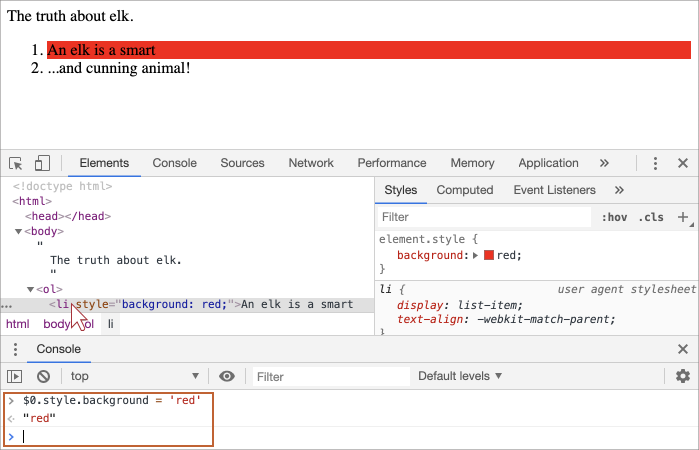

libs:
  - d3
  - domtree

---

# DOM дерево

Основою HTML-документа є теги.

Відповідно до об'єктної моделі документа ("Document Object Model", DOM), кожен HTML-тег є об'єктом. Вкладені теги є "дітьми" батьківського елементу. Текст, який знаходиться всередині тегу, також є об'єктом.

Всі ці об'єкти доступні за допомогою JavaScript, і ми можемо використовувати їх для зміни сторінки.

Наприклад, `document.body` це об'єкт, що представляє тег `<body>`.

Запуск цього коду зробить `<body>` червоним протягом 3 секунд:

```js run
document.body.style.background = 'red'; // зробити фон червоним

setTimeout(() => document.body.style.background = '', 3000); // повернути назад
```

Тут ми використовували `style.background`, щоб змінити фоновий колір `document.body`, але тут є багато інших властивостей, таких як.

- `innerHTML` -- вміст HTML вузла.
- `offsetWidth` -- ширина вузла (у пікселях).
- ...і так далі.

Незабаром ми дізнаємося більше способів маніпулювати DOM, але спочатку потрібно познайомитись з його структурою.

## Приклад DOM

Почнемо з наступного простого документа:

```html run no-beautify
<!DOCTYPE HTML>
<html>
<head>
  <title>Про лосів</title>
</head>
<body>
  Правда про лосів.
</body>
</html>
```

DOM -- це представлення HTML-документа в вигляді дерева тегів. Ось як це виглядає:

<div class="domtree"></div>

<script>
let node1 = {"name":"HTML","nodeType":1,"children":[{"name":"HEAD","nodeType":1,"children":[{"name":"#text","nodeType":3,"content":"\n  "},{"name":"TITLE","nodeType":1,"children":[{"name":"#text","nodeType":3,"content":"Про лосів"}]},{"name":"#text","nodeType":3,"content":"\n"}]},{"name":"#text","nodeType":3,"content":"\n"},{"name":"BODY","nodeType":1,"children":[{"name":"#text","nodeType":3,"content":"\n  Правда про лосів.\n\n\n"}]}]}

drawHtmlTree(node1, 'div.domtree', 690, 320);
</script>

```online
На зображенні вище, ви можете натиснути на вузли-елементи, а їхні діти будуть відкриватися і закриватися.
```

Кожен вузол дерева є об'єктом.

Теги є *вузлами-елементами* (або просто елементами), вони утворюють структуру дерева: `<html>` -- кореневий, `<head>` та `<body>` -- його дочірні вузли тощо.

Текст всередині елементів утворює *текстові вузли*, позначені як `#text`. Текстовий вузол містить лише рядок. У нього не може буди нащадків, тобто він завжди знаходиться на найнижчому рівні.

Наприклад, тег `<title>` має текст `"Про лосів"`.

Зверніть увагу на спеціальні символи в текстових вузлах:

- перехід на новий рядок: `↵` (в JavaScript відомий як `\n`)
- пробіл: `␣`

Пробіли та переходи на нові рядки є абсолютно діючими символами, як букви та цифри. Вони утворюють текстові вузли і стають частиною DOM. Отже, наприклад, наведений вище тег `<head>` містить деякі пробіли перед `<title>`, і цей текст стає `#text` вузлом (він містить лише символ нового рядку та деякілька пробілів).

Є лише два винятки з цього правила:
1. Пробіли та переходи на нові рядки до `<head>` ігноруються з історичних причин.
2. Якщо ми запишемо щось після закриваючого тегу `</body>`, браузер автоматично перемістить цей запис в кінець `body`, оскільки специфікація HTML вимагає, щоб весь вміст був всередині `<body>`. Отже, після `<body>` не може бути ніяких пробілів.

В інших випадках все просто -- якщо в документі є пробіли (так само, як будь-який символ), то вони стають текстовими вузлами дерева в DOM, і якщо ми видалимо ці пробіли, то текстових вузлів в DOM також не буде.

Тут немає текстових вузлів з пробілами:

```html no-beautify
<!DOCTYPE HTML>
<html><head><title>Про оленів</title></head><body>Правда про оленів.</body></html>
```

<div class="domtree"></div>

<script>
let node2 = {"name":"HTML","nodeType":1,"children":[{"name":"HEAD","nodeType":1,"children":[{"name":"TITLE","nodeType":1,"children":[{"name":"#text","nodeType":3,"content":"Про оленів"}]}]},{"name":"BODY","nodeType":1,"children":[{"name":"#text","nodeType":3,"content":"Правда про оленів."}]}]}

drawHtmlTree(node2, 'div.domtree', 690, 210);
</script>

```smart header="Пробіли на початку/в кінці рядку та ті вузли, що містять тільки пробіли, як правило, приховані в інструментах розробки"
Інструменти браузера (будуть розглянуті скоро), що працюють з DOM, як правило, не показують пробіли на початку/кінці тексту та порожні текстові вузли (переходи на нові рядки) між тегами.

Таким чином інструменти розробника зберігають екранний простір.

На подальших рисунках DOM ми іноді будемо опускати текстові вузли з пробілів та переходів, якщо вони не мають значення. Такі пробіли зазвичай не впливають на те, як відображається документ.
```

## Автокорекція

Якщо браузер зтикається з невалідним HTML-кодом, він автоматично виправляє його при створенні DOM.

Наприклад, напочатку документу завжди повинен бути тег `<html>`. Навіть якщо він не існує в документі, він буде існувати в дереві DOM, тому що браузер створить його. Те ж саме стосується `<body>`.

Як приклад, якщо файл HTML містить єдине слово `"Привіт"`, браузер оберне його в `<html>` і `<body>`, та додасть необхідний тег `<head>`, а DOM буде виглядати наступним чином:


<div class="domtree"></div>

<script>
let node3 = {"name":"HTML","nodeType":1,"children":[{"name":"HEAD","nodeType":1,"children":[]},{"name":"BODY","nodeType":1,"children":[{"name":"#text","nodeType":3,"content":"Привіт"}]}]}

drawHtmlTree(node3, 'div.domtree', 690, 150);
</script>

Під час створення DOM, браузери автоматично обробляють помилки у документі, закривають теги тощо.

Документ з відкритими тегами:

```html no-beautify
<p>Привіт
<li>Мама
<li>і
<li>Тато
```

...стане нормальним DOM, оскільки браузер читає теги та відновлює відсутні частини:

<div class="domtree"></div>

<script>
let node4 = {"name":"HTML","nodeType":1,"children":[{"name":"HEAD","nodeType":1,"children":[]},{"name":"BODY","nodeType":1,"children":[{"name":"P","nodeType":1,"children":[{"name":"#text","nodeType":3,"content":"Привіт"}]},{"name":"LI","nodeType":1,"children":[{"name":"#text","nodeType":3,"content":"Мама"}]},{"name":"LI","nodeType":1,"children":[{"name":"#text","nodeType":3,"content":"і"}]},{"name":"LI","nodeType":1,"children":[{"name":"#text","nodeType":3,"content":"Тато"}]}]}]}

drawHtmlTree(node4, 'div.domtree', 690, 360);
</script>

````warn header="Таблиці завжди мають `<tbody>`"
Цікавий "особливий випадок" -- це таблиці. Згідно DOM специфікації вони повинні мати тег `<tbody>`, але в HTML офіційно можна писати без нього. Тоді браузер створює `<tbody>` у DOM автоматично.

Наприклад, HTML:

```html no-beautify
<table id="table"><tr><td>1</td></tr></table>
```

DOM-структура:
<div class="domtree"></div>

<script>
let node5 = {"name":"TABLE","nodeType":1,"children":[{"name":"TBODY","nodeType":1,"children":[{"name":"TR","nodeType":1,"children":[{"name":"TD","nodeType":1,"children":[{"name":"#text","nodeType":3,"content":"1"}]}]}]}]};

drawHtmlTree(node5,  'div.domtree', 600, 200);
</script>

Бачите? Тег `<tbody>` з'явився з нізвідки. Ми повинні мати це на увазі під час роботи з таблицями, щоб уникати сюрпризів.
````

## Інші типи вузлів

Окрім елементів та текстових вузлів є деякі інші типи вузлів.

Наприклад, вузли-коментарі:

```html
<!DOCTYPE HTML>
<html>
<body>
  Правда про оленів.
  <ol>
    <li>Олень -- це розумний</li>
*!*
    <!-- comment -->
*/!*
    <li>...і хитрий звір!</li>
  </ol>
</body>
</html>
```

<div class="domtree"></div>

<script>
let node6 = {"name":"HTML","nodeType":1,"children":[{"name":"HEAD","nodeType":1,"children":[]},{"name":"BODY","nodeType":1,"children":[{"name":"#text","nodeType":3,"content":"\n  Правда про оленів.\n  "},{"name":"OL","nodeType":1,"children":[{"name":"#text","nodeType":3,"content":"\n    "},{"name":"LI","nodeType":1,"children":[{"name":"#text","nodeType":3,"content":"Олень -- це розумний"}]},{"name":"#text","nodeType":3,"content":"\n    "},{"name":"#comment","nodeType":8,"content":"comment"},{"name":"#text","nodeType":3,"content":"\n    "},{"name":"LI","nodeType":1,"children":[{"name":"#text","nodeType":3,"content":"...і хитрий звір!"}]},{"name":"#text","nodeType":3,"content":"\n  "}]},{"name":"#text","nodeType":3,"content":"\n\n\n"}]}]};

drawHtmlTree(node6, 'div.domtree', 690, 500);
</script>

Тут ми бачимо новий тип вузла дерева -- *вузол-коментар*, позначений як `#comment`, між двома текстовими вузлами.

Ми могли подумати -- чому коментар додається до DOM? Це не впливає на візуальне уявлення. Але є важливе правило -- якщо щось є в HTML, то воно також повинно бути в DOM дереві.

**Все в HTML, навіть коментарі, стає частиною DOM.**

Навіть директива `<!DOCTYPE...>` на самому початку HTML також є вузлом DOM. Вона є DOM дереві прямо перед `<html>`. Мало хто знає про це. Ми не збираємося звертатися до цього вузла, ми навіть не малюємо його на діаграмах, але він там є.

Об'єкт `document`, який представляє весь документ, формально також є вузлом DOM.

Існує [12 типів вузлів](https://dom.spec.whatwg.org/#node). На практиці ми зазвичай працюємо з 4-ма з них:

1. `document` -- "пункт входу" в DOM.
2. вузли-елементи -- HTML-теги, будівельні блоки дерев.
3. текстові вузли -- містять текст.
4. коментарі -- іноді ми можемо записати туди інформацію, вона не буде показана, але JS може читати її з DOM.

## Поекспериментуйте самі

Щоб побачити структуру DOM у режимі реального часу, спробуйте [Live Dom Viewer](https://software.hixie.ch/utilities/js/live-dom-viewer/). Просто введіть щось, і внизу ви відразу побачите, як змінюється DOM.

Іншим способом вивчення DOM є використання інструментів розробника браузера. Взагалі, це те, що ми використовуємо при розробці кожен день.

Для цього відкрийте веб-сторінку [elk.html](elk.html), увімкніть інструменти розробника в браузері та перейдіть на вкладку "Elements".

Це повинно виглядати так:


Ви можете побачити DOM, натиснути на елементи, переглянути їхні деталі і так далі.

Зверніть увагу, що структура DOM в інструментах розробника відображається в спрощеному вигляді. Текстові вузли показані так само, як текст. І взагалі немає "порожніх" (тільки пробіли) текстових вузлів. Це добре, тому що більшу частину часу ми зацікавлені в вузлах-елементах.

Якщо натиснути кнопку <span class="devtools" style="background-position:-328px -124px"></span> у лівому верхньому куті, то можна буде вибрати вузол з веб-сторінки за допомогою миші (або інших пристроїв покажчика) і "проінспектувати" його (прокрутити до нього на вкладці "Elements"). Це чудово працює, коли у нас є величезна HTML-сторінка (і відповідний величезний дом) і хотілося б побачити місце конкретного елемента в ньому.

Інший спосіб зробити це -- просто натиснувши праву клавіщу миші на веб-сторінці та вибирати "Inspect" у контекстному меню.


У правій частині інструментів є наступні підвкладки:
- **Styles** -- ми можемо бачити CSS правила, які застосовано до поточного елемента, включаючи вбудовані правила (показані сірим). Майже все можна відредагувати на місці, включаючи розміри, внутрішні та зовнішні відступи тощо.
- **Computed** -- для перегляду CSS, що застосовується до елемента за властивістю: для кожної властивості ми можемо побачити правило, яке це дає (включаючи наслідування CSS та ін.).
- **Event Listeners** -- щоб побачити слухачів подій, що прикріплені до елементів DOM (ми розглянемо їх у наступній частині підручника).
- ...і так далі.

Найкращий спосіб вивчити все це поекспериментувати. Більшість значень можна редагувати на місці та дивитись на результат.

## Взаємодія з консоллю

Коли ми працюємо з DOM, ми також можемо застосувати до нього JavaScript. Наприклад, отримайти вузол і запустити якийсь код, щоб змінити його так, щоб побачити результат. Ось декілька порад, щоб переміщатися між вкладкою "Elements" та консоллю.

Для початку:

1. Виберіть першу `<li>` на вкладці елементів.
2. Натисніть `key:Esc` -- це відкриє консоль прямо під вкладкою "Елементи".

Тепер останній вибраний елемент доступний як `$0`, раніше вибраний -- `$1`, тощо.

Ми можемо запустити команди на них. Наприклад, `$0.style.background = 'red'` робить вибраний список елементів червоним, наприклад:



Ось як отримати вузол з елементів у консолі.

Також існує зворотній шлях. Якщо є змінна, що посилається на вузол DOM, то ми можемо використовувати команду `inspect(node)` у консолі, щоб побачити його в панелі елементів.

Або ми можемо просто вивести вузол DOM в консолі та дослідити його "на місці", як і `document.body` нижче:


Звичайно, це використовується з метою відлагодження. З наступної глави ми будемо отримувати доступ та змінювати DOM за допомогою JavaScript.

Інструменти розробника браузера -- є дуже корисними у розробці: ми можемо досліджувати DOM, випробовувати різні речі і дивитися, що йде не так.

## Підсумки

HTML/XML документ представляється всередині браузера, як дерево DOM.

- Теги стають вузлами-елементами та утворюють структуру.
- Текст стає текстовими вузлами.
- ...і т.д., все, що є в HTML, представлено в DOM, навіть коментарі.

Ми можемо використовувати інструменти розробника в браузері, щоб перевіряти DOM та змінювати його вручну.

Тут ми розглянули основи, що найчастіше використовуються і важливі прийоми необхідні для початку розробки. Існує велика документація про інструменти розробника Chrome на <https://developers.google.com/web/tools/chrome-devtools>. Найкращий спосіб дізнатися більше про інструменти розробника -- це відкрити їх та ознайомитися з ними: більшість можливостей очевидні. Пізніше, коли ви загалом розберетеся з ними, читайте документацію, щоб дослідити решту функціоналу.

Вузли DOM мають властивості та методи, які дозволяють нам переміщуватися між ними, змінювати їх, переміщуватися по сторінці та багато іншого. Ми розберемо їх у наступних розділах.
