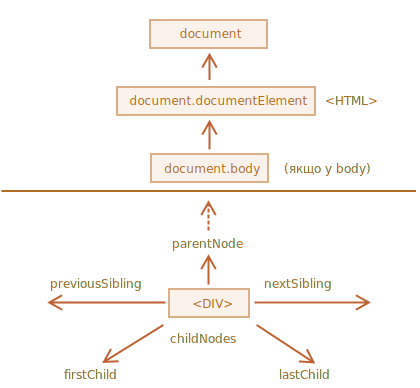
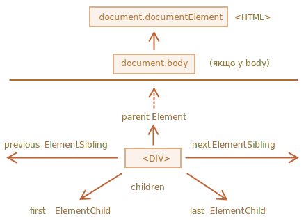

libs:
  - d3
  - domtree

---


# Навігація по DOM

DOM дозволяє нам робити будь-що з елементами та їх вмістом, але спочатку нам потрібно знайти відповідний DOM об’єкт.

Усі операції з DOM починаються з об’єкта `document`. Це головна "точка входу" в DOM. З нього ми можемо отримати доступ до будь-якого вузла.

Ось зображення структури посилань, які дозволяють переміщатися між вузлами DOM:



Обговоримо їх більш детально.

## Зверху: documentElement і body

Найвищі вузли дерева доступні безпосередньо як властивості `document`:

`<html>` = `document.documentElement`
: Найвищий вузол документа -- `document.documentElement`. Це вузол DOM тегу `<html>`.

`<body>` = `document.body`
: Іншим широко використовуваним вузлом DOM є елемент `<body>` -- `document.body`.

`<head>` = `document.head`
: Тег `<head>` доступний як `document.head`.

````warn header="Але є загвоздка: `document.body` може бути `null`"
Скрипт не може отримати доступ до елемента, який не існує на момент виконання цього скрипта.

Зокрема, якщо скрипт знаходиться всередині `<head>`, то `document.body` недоступний, оскільки браузер ще не прочитав його.

Отже, у прикладі нижче перший `alert` виведе `null`:

```html run
<html>

<head>
  <script>
*!*
    alert( "Якщо у HEAD: " + document.body ); // null, ще немає <body>
*/!*
  </script>
</head>

<body>

  <script>
    alert( "Якщо у BODY: " + document.body ); // HTMLBodyElement, тепер body існує
  </script>

</body>
</html>
```
````

```smart header="У світі DOM `null` означає \"не існує\""
У DOM значення `null` означає "не існує" або "такого вузла немає".
```

## Дочірні елементи: childNodes, firstChild, lastChild

Відтепер ми будемо використовувати два терміни:

- **Дочірні вузли (або діти)** -- елементи, які є безпосередніми дітьми. Іншими словами, вони вкладені саме в цей вузол. Наприклад, `<head>` і `<body>` є дочірніми елементами `<html>`.
- **Нащадки** -- всі елементи, які вкладені в даний, включаючи дітей, їхніх дітей тощо.

Наприклад, тут `<body>` має дочірні `<div>` і `<ul>` (і кілька пустих текстових вузлів):

```html run
<html>
<body>
  <div>Begin</div>

  <ul>
    <li>
      <b>Information</b>
    </li>
  </ul>
</body>
</html>
```

...А нащадками `<body>` є не тільки прямі дочірні елементи `<div>`, `<ul>`, але й більш глибоко вкладені елементи, такі як `<li>` (дочірній елемент `<ul>`) та `<b>` (дочірній елемент `<li>`) -- тобто усе піддерево.

**Колекція `childNodes` містить список усіх дочірніх вузлів, включаючи текстові вузли.**

Наведений нижче приклад показує дочірні елементи `document.body`:

```html run
<html>
<body>
  <div>Початок</div>

  <ul>
    <li>Інформація</li>
  </ul>

  <div>Кінець</div>

  <script>
*!*
    for (let i = 0; i < document.body.childNodes.length; i++) {
      alert( document.body.childNodes[i] ); // Text, DIV, Text, UL, ..., SCRIPT
    }
*/!*
  </script>
  ...щось ще...
</body>
</html>
```

Зверніть увагу на цікаву деталь. Якщо ми запустимо наведений вище приклад, останнім показаним елементом буде `<script>`. Насправді нижче в документі є більше речей, але на момент виконання сценарію браузер його ще не прочитав, тому скрипт його не бачить.

**Властивості `firstChild` і `lastChild` надають швидкий доступ до першого та останнього дочірнього елемента.**

Це лише скорочення. Якщо існують дочірні вузли, то завжди вірно наступне:
```js
elem.childNodes[0] === elem.firstChild
elem.childNodes[elem.childNodes.length - 1] === elem.lastChild
```

Існує також спеціальна функція `elem.hasChildNodes()`, що перевіряє, чи є взагалі дочірні вузли.

### DOM collections

As we can see, `childNodes` looks like an array. But actually it's not an array, but rather a *collection* -- a special array-like iterable object.

There are two important consequences:

1. We can use `for..of` to iterate over it:
  ```js
  for (let node of document.body.childNodes) {
    alert(node); // shows all nodes from the collection
  }
  ```
  That's because it's iterable (provides the `Symbol.iterator` property, as required).

2. Array methods won't work, because it's not an array:
  ```js run
  alert(document.body.childNodes.filter); // undefined (there's no filter method!)
  ```

The first thing is nice. The second is tolerable, because we can use `Array.from` to create a "real" array from the collection, if we want array methods:

  ```js run
  alert( Array.from(document.body.childNodes).filter ); // function
  ```

```warn header="DOM collections are read-only"
DOM collections, and even more -- *all* navigation properties listed in this chapter are read-only.

We can't replace a child by something else by assigning `childNodes[i] = ...`.

Changing DOM needs other methods. We will see them in the next chapter.
```

```warn header="DOM collections are live"
Almost all DOM collections with minor exceptions are *live*. In other words, they reflect the current state of DOM.

If we keep a reference to `elem.childNodes`, and add/remove nodes into DOM, then they appear in the collection automatically.
```

````warn header="Don't use `for..in` to loop over collections"
Collections are iterable using `for..of`. Sometimes people try to use `for..in` for that.

Please, don't. The `for..in` loop iterates over all enumerable properties. And collections have some "extra" rarely used properties that we usually do not want to get:

```html run
<body>
<script>
  // shows 0, 1, length, item, values and more.
  for (let prop in document.body.childNodes) alert(prop);
</script>
</body>
````

## Siblings and the parent

*Siblings* are nodes that are children of the same parent.

For instance, here `<head>` and `<body>` are siblings:

```html
<html>
  <head>...</head><body>...</body>
</html>
```

- `<body>` is said to be the "next" or "right" sibling of `<head>`,
- `<head>` is said to be the "previous" or "left" sibling of `<body>`.

The next sibling is in `nextSibling` property, and the previous one - in `previousSibling`.

The parent is available as `parentNode`.

For example:

```js run
// parent of <body> is <html>
alert( document.body.parentNode === document.documentElement ); // true

// after <head> goes <body>
alert( document.head.nextSibling ); // HTMLBodyElement

// before <body> goes <head>
alert( document.body.previousSibling ); // HTMLHeadElement
```

## Element-only navigation

Navigation properties listed above refer to *all* nodes. For instance, in `childNodes` we can see both text nodes, element nodes, and even comment nodes if they exist.

But for many tasks we don't want text or comment nodes. We want to manipulate element nodes that represent tags and form the structure of the page.

So let's see more navigation links that only take *element nodes* into account:



The links are similar to those given above, just with `Element` word inside:

- `children` -- only those children that are element nodes.
- `firstElementChild`, `lastElementChild` -- first and last element children.
- `previousElementSibling`, `nextElementSibling` -- neighbor elements.
- `parentElement` -- parent element.

````smart header="Why `parentElement`? Can the parent be *not* an element?"
The `parentElement` property returns the "element" parent, while `parentNode` returns "any node" parent. These properties are usually the same: they both get the parent.

With the one exception of `document.documentElement`:

```js run
alert( document.documentElement.parentNode ); // document
alert( document.documentElement.parentElement ); // null
```

The reason is that the root node `document.documentElement` (`<html>`) has `document` as its parent. But `document` is not an element node, so `parentNode` returns it and `parentElement` does not.

This detail may be useful when we want to travel up from an arbitrary element `elem` to `<html>`, but not to the `document`:
```js
while(elem = elem.parentElement) { // go up till <html>
  alert( elem );
}
```
````

Let's modify one of the examples above: replace `childNodes` with `children`. Now it shows only elements:

```html run
<html>
<body>
  <div>Begin</div>

  <ul>
    <li>Information</li>
  </ul>

  <div>End</div>

  <script>
*!*
    for (let elem of document.body.children) {
      alert(elem); // DIV, UL, DIV, SCRIPT
    }
*/!*
  </script>
  ...
</body>
</html>
```

## More links: tables [#dom-navigation-tables]

Till now we described the basic navigation properties.

Certain types of DOM elements may provide additional properties, specific to their type, for convenience.

Tables are a great example of that, and represent a particularly important case:

**The `<table>`** element supports (in addition to the given above) these properties:
- `table.rows` -- the collection of `<tr>` elements of the table.
- `table.caption/tHead/tFoot` -- references to elements `<caption>`, `<thead>`, `<tfoot>`.
- `table.tBodies` -- the collection of `<tbody>` elements (can be many according to the standard, but there will always be at least one -- even if it is not in the source HTML, the browser will put it in the DOM).

**`<thead>`, `<tfoot>`, `<tbody>`** elements provide the `rows` property:
- `tbody.rows` -- the collection of `<tr>` inside.

**`<tr>`:**
- `tr.cells` -- the collection of `<td>` and `<th>` cells inside the given `<tr>`.
- `tr.sectionRowIndex` -- the position (index) of the given `<tr>` inside the enclosing `<thead>/<tbody>/<tfoot>`.
- `tr.rowIndex` -- the number of the `<tr>` in the table as a whole (including all table rows).

**`<td>` and `<th>`:**
- `td.cellIndex` -- the number of the cell inside the enclosing `<tr>`.

An example of usage:

```html run height=100
<table id="table">
  <tr>
    <td>one</td><td>two</td>
  </tr>
  <tr>
    <td>three</td><td>four</td>
  </tr>
</table>

<script>
  // get td with "two" (first row, second column)
  let td = table.*!*rows[0].cells[1]*/!*;
  td.style.backgroundColor = "red"; // highlight it
</script>
```

The specification: [tabular data](https://html.spec.whatwg.org/multipage/tables.html).

There are also additional navigation properties for HTML forms. We'll look at them later when we start working with forms.

## Summary

Given a DOM node, we can go to its immediate neighbors using navigation properties.

There are two main sets of them:

- For all nodes: `parentNode`, `childNodes`, `firstChild`, `lastChild`, `previousSibling`, `nextSibling`.
- For element nodes only: `parentElement`, `children`, `firstElementChild`, `lastElementChild`, `previousElementSibling`, `nextElementSibling`.

Some types of DOM elements, e.g. tables, provide additional properties and collections to access their content.
