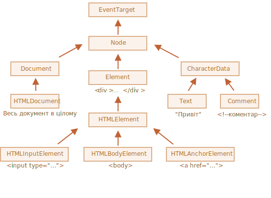

# Властивості вузлів: тип, тег та вміст

Давайте детальніше розглянемо вузли DOM.

У цій главі ми розглянемо їх сутність і дізнаємося про найбільш часто використовувані властивості.

## Класи DOM вузлів

Різні вузли DOM можуть мати різні властивості. Наприклад, елемент, що відповідає тегу `<a>`, має властивості, пов’язані з посиланням, тоді як елемент, що відповідає `<input>`, має властивості, пов’язані з введенням даних, тощо. Текстові вузли відрізняються від вузлів елементів. Проте, між ними також існують загальні властивості та методи, оскільки всі класи вузлів DOM утворюють єдину ієрархію.

Кожен вузол DOM належить відповідному вбудованому класу.

Коренем ієрархії є [EventTarget](https://dom.spec.whatwg.org/#eventtarget), від нього успадковується [Node](https://dom.spec.whatwg.org/#interface-node), а інші вузли DOM успадкують вже від нього.

На наведеному нижче рисунку показані основні класи:



Класи:

- [EventTarget](https://dom.spec.whatwg.org/#eventtarget) -- це кореневий "абстрактний" клас клас для всього. 

    Об’єкти цього класу ніколи не створюються. Він служить основою, тому всі вузли DOM підтримують так звані "події", які ми розглянемо пізніше.

- [Node](https://dom.spec.whatwg.org/#interface-node) -- це також "абстрактний" клас, що служить базою для вузлів DOM. 

    Він забезпечує основну функціональність дерева: `parentNode`, `nextSibling`, `childNodes` і так далі (це гетери). Об’єкти класу `Node` ніколи не створюються. Але є конкретні класи вузлів, які успадковуються від нього, і таким чином успадковують функціональність `Node`.

- [Document](https://dom.spec.whatwg.org/#interface-document), з історичних причин часто успадковується `HTMLDocument` (хоча остання специфікація цього не диктує) -- це документ як ціле.

    Глобальний об’єкт `document` належить саме цьому класу. Він служить точкою входу в DOM.

- [CharacterData](https://dom.spec.whatwg.org/#interface-characterdata) -- "абстрактний" клас, успадкований:
    - [Text](https://dom.spec.whatwg.org/#interface-text) -- клас, що відповідає тексту всередині елементів, напр. `Hello` в `<p>Hello</p>`.
    - [Comment](https://dom.spec.whatwg.org/#interface-comment) -- клас для коментарів. Вони не відображаються, але кожен коментар стає членом DOM.

- [Element](https://dom.spec.whatwg.org/#interface-element) -- це базовий клас для елементів DOM. 

    Він забезпечує навігацію на рівні елементів, таку як `nextElementSibling`, `children` та пошукові методи, такі як `getElementsByTagName`, `querySelector`. 
    
    Браузер підтримує не тільки HTML, але й XML та SVG. Клас `Element` служить базою для більш специфічних класів: `SVGElement`, `XMLElement` (вони нам тут не потрібні) та `HTMLElement`.

- Нарешті, [HTMLElement](https://html.spec.whatwg.org/multipage/dom.html#htmlelement) -- це, основний клас для всіх елементів HTML. Ми будемо працювати з ним більшу частину часу.

    Він успадковується конкретними елементами HTML:
    - [HTMLInputElement](https://html.spec.whatwg.org/multipage/forms.html#htmlinputelement) -- це клас для `<input>` елементів,
    - [HTMLBodyElement](https://html.spec.whatwg.org/multipage/semantics.html#htmlbodyelement) -- це клас для `<body>` елементів,
    - [HTMLAnchorElement](https://html.spec.whatwg.org/multipage/semantics.html#htmlanchorelement) -- це клас для `<a>` елементів,
    - ...тощо.

Існує багато інших тегів з власними класами, які можуть мати певні властивості та методи, тоді як деякі елементи, такі як `<span>`, `<section>`, `<article>` не мають специфічних властивостей і, тому, вони є екземплярами класу `HTMLElement`.

Таким чином, повний набір властивостей та методів для певного вузла формується в результаті ланцюга успадкування.

Наприклад, давайте розглянемо об’єкт DOM для елемента `<input>`. Він належить до класу [HTMLInputElement](https://html.spec.whatwg.org/multipage/forms.html#htmlinputelement).

Він отримує властивості та методи шляхом "накладання" наступних класів (подані в порядку успадкування):

- `HTMLInputElement` -- цей клас надає специфічні властивості для елемента введення,
- `HTMLElement` -- надає загальні методи для HTML-елементів (такі як отримання та встановлення значень),
- `Element` -- надає загальні методи для елементів,
- `Node` -- надає загальні властивості для вузлів DOM,
- `EventTarget` -- цей клас забезпечує підтримку подій (ми розглянемо це пізніше),
- ... і, нарешті, цей клас успадковується від `Object`, тому він має доступ до загальних методів "простого об'єкту", наприклад, `hasOwnProperty`.

Щоб переглянути ім'я класу вузла DOM, ми можемо згадати, що зазвичай у об'єкта є властивість `constructor`. Вона посилається на конструктор класу, і `constructor.name` є його ім'ям:

```js run
alert(document.body.constructor.name); // HTMLBodyElement
```

...Або ми можемо просто викликати `toString`:

```js run
alert(document.body); // [object HTMLBodyElement]
```

Ми також можемо використовувати `instanceof`, щоб перевірити наслідування:

```js run
alert(document.body instanceof HTMLBodyElement); // true
alert(document.body instanceof HTMLElement); // true
alert(document.body instanceof Element); // true
alert(document.body instanceof Node); // true
alert(document.body instanceof EventTarget); // true
```

Як ми бачимо, вузли DOM є звичайними об’єктами JavaScript. Вони використовують прототипні класи для успадкування.

Це також легко побачити, якщо вивести елемент за допомогою `console.dir(elem)` у браузері. Там в консолі ви побачите `HTMLElement.prototype`, `Element.prototype` і так далі.

```smart header="`console.dir(elem)` проти `console.log(elem)`"
Більшість браузерів підтримують дві команди у своїх інструментах розробника: `console.log` та `console.dir`. Вони виводять свої аргументи в консоль. Для об’єктів JavaScript ці команди зазвичай працюють однаково.

Але для DOM елементів вони різні:

- `console.log(elem)` показує елемент в вигляді DOM дерева.
- `console.dir(elem)` показує елемент як об’єкт DOM, це добре для того, щоб вивчити його властивості.

Спробуйте це на `document.body`.
```

````smart header="Специфікація IDL"
У специфікації, класи DOM описані не за допомогою JavaScript, а спеціальною [мовою опису інтерфейсу](https://uk.wikipedia.org/wiki/Мова_опису_інтерфейсів)(IDL), яку зазвичай легко зрозуміти.

У IDL всі властивості представлені з їхними типами. Наприклад, `DOMString`, `boolean` тощо.

Ось витяг з цієї специфікації, з коментарями:

```js
// Define HTMLInputElement
*!*
// Двакрапка ":" означає, що HTMLInputElement наслідується від HTMLElement
*/!*
interface HTMLInputElement: HTMLElement {
  // тут визначаються всі властивості та методи елементів <input>

*!*
  // "DOMString" означає, що значенням властивості є рядок
*/!*
  attribute DOMString accept;
  attribute DOMString alt;
  attribute DOMString autocomplete;
  attribute DOMString value;

*!*
  // булева властивість (true/false)
  attribute boolean autofocus;
*/!*
  ...
*!*
  // тепер метод: "void" означає, що метод не повертає значення
*/!*
  void select();
  ...
}
```
````

## Властивість "nodeType"

Властивість `nodeType` надає ще один "старомодний" спосіб отримання "типу" вузла DOM.

Вона має числове значення:
- `elem.nodeType == 1` для вузлів-елементів,
- `elem.nodeType == 3` для текстових вузлів,
- `elem.nodeType == 9` для об’єкта документа,
- [В специфікації](https://dom.spec.whatwg.org/#node) можна переглянути всі значення.

Наприклад:

```html run
<body>
  <script>
  let elem = document.body;

  // давайте перевіримо: який тип вузла в elem?
  alert(elem.nodeType); // 1 => element

  // і перший дочірній елемент ...
  alert(elem.firstChild.nodeType); // 3 => text

  // для об’єкта document тип дорівнює 9
  alert( document.nodeType ); // 9
  </script>
</body>
```

У сучасних скриптах ми можемо використовувати оператор `instanceof` та інші перевірки на основі класів для визначення типу вузла, що може бути більш зручним. Однак іноді використання властивості `nodeType` може бути простішим. Це дозволяє нам читати тип вузла, але ми не можемо змінювати його за допомогою цієї властивості.

## Тег: nodeName та tagName

Для визначення імені тегу DOM-вузла ми можемо скористатися властивостями `nodeName` або `tagName`.

Наприклад:

```js run
alert( document.body.nodeName ); // BODY
alert( document.body.tagName ); // BODY
```

Чи існує різниця між `tagName` і `nodeName`?

Звісно, різниця відображається у їх назвах, але це дійсно трохи неочевидно.

- Властивість `tagName` існує лише для вузлів типу `Element`.
- Властивість `nodeName` визначається для будь-якого вузла типу `Node`:
    - для елементів вона має те ж значення, що і `tagName`.
    - для інших типів вузлів (текст, коментар тощо) вона містить рядок з типом вузла.

Іншими словами, `tagName` підтримується лише вузлами елементів (адже походить від класу `Element`), тоді як `nodeName` може сказати щось про інші типи вузлів.

Для прикладу, порівняємо `tagName` і `nodeName` для вузла `document` та коментаря:


```html run
<body><!-- коментар -->

  <script>
    // для коментаря
    alert( document.body.firstChild.tagName ); // undefined (це не елемент)
    alert( document.body.firstChild.nodeName ); // #comment

    // для документу
    alert( document.tagName ); // undefined (це не елемент)
    alert( document.nodeName ); // #document
  </script>
</body>
```

Якщо ми маємо справу лише з елементами, то ми можемо використовувати як `tagName`, так і `nodeName` -- немає ніякої різниці.

```smart header="Назва тегів завжди написана великими літерами, за винятком режиму XML"
Браузер має два режими обробки документів: HTML та XML. Зазвичай HTML-режим використовується для веб-сторінок. Режим XML вмикається, коли браузер отримує документ XML з заголовком: `Content-Type: application/xml+xhtml`.

У режимі HTML `tagName/nodeName` завжди пишуться великими літерами: це `BODY` як для `<body>`, так і для `<BoDy>`.

У режимі XML регістр літер зберігається "як є". В даний час XML режим рідко використовується.
```


## innerHTML: вміст

Властивість [innerHTML](https://w3c.github.io/dom-parsing/#the-innerhtml-mixin) дозволяє отримати HTML всередині елемента як рядок.

Ми також можемо змінювати його. Таким чином, це один з найпотужніших способів зміни інформації на сторінці.

На прикладі показано вміст `document.body` який потім повністю замінюється.

```html run
<body>
  <p>A paragraph</p>
  <div>A div</div>

  <script>
    alert( document.body.innerHTML ); // читаємо поточний вміст
    document.body.innerHTML = 'Новий BODY!'; // замінюємо його
  </script>

</body>
```

Ми можемо спробувати вставити невалідний HTML, браузер виправить наші помилки:

```html run
<body>

  <script>
    document.body.innerHTML = '<b>тест'; // забули закрити тег
    alert( document.body.innerHTML ); // <b>тест</b> (виправлено)
  </script>

</body>
```

```smart header="Скрипти не виконуються"
Якщо `innerHTML` вставляє тег `<script>` у документ -- він стає частиною HTML, але не виконується.
```

### Обережно: "innerHTML+=" повністью перезаписує вміст

Ми можемо додавати HTML до елемента, використовуючи `elem.innerHTML+="більше html"`.

Наприклад:

```js
chatDiv.innerHTML += "<div>Привіт !</div>";
chatDiv.innerHTML += "Як справи?";
```

Але ми повинні бути дуже обережними, оскільки те, що відбувається -- це *не* додавання, а повний перезапис.

Технічно ці два рядки роблять те ж саме:

```js
elem.innerHTML += "...";
// коротший спосіб записати:
*!*
elem.innerHTML = elem.innerHTML + "..."
*/!*
```

Іншими словами, `innerHTML+=` робить наступне:

1. Старий вміст видаляється.
2. Замість нього написано новий `innerHTML` (конкатенація старого та нового).

**Оскільки вміст "обнуляється" і перезаписується з нуля, всі зображення та інші ресурси будуть перезавантажені**.

У прикладі `chatDiv` вище рядок `chatDiv.innerHTML+="How goes?"` повністю перезаписує вміст HTML і перезавантажує зображення `smile.gif` (сподіваємось, що воно закешоване). Якщо `chatDiv` має багато іншого тексту та зображень, то перезавантаження стане помітним.

Є й інші побічні ефекти. Наприклад, якщо старий текст виділений за допомогою миші, то більшість браузерів видалять виділення під час перезапису `innerHTML`. І якщо є `<input>` з введеним текстом, то текст буде видалено. І так далі.

На щастя, є й інші способи додавання HTML, крім `innerHTML`, і ми скоро з ними ознайомимося.

## outerHTML: повний HTML елемента

Властивість `outerHTML` містить повний HTML елемента. Це як `innerHTML`, але включає сам елемент.

Ось приклад:

```html run
<div id="elem">Привіт <b>Світ</b></div>

<script>
  alert(elem.outerHTML); // <div id="elem">Привіт <b>Світ</b></div>
</script>
```

**Обережно: на відміну від `innerHTML`, запис у `outerHTML` не змінює елемент. Замість цього він замінює його в DOM.**

Так, це звучить дивно, так воно і є, ось тому ми робимо окрему примітку про це тут. Подивіться.

Розглянемо приклад:

```html run
<div>Привіт, світ!</div>

<script>
  let div = document.querySelector('div');

*!*
  // replace div.outerHTML with <p>...</p>
*/!*
  div.outerHTML = '<p>Новий елемент</p>'; // (*)

*!*
  // Ого! 'div' все ще той самий!
*/!*
  alert(div.outerHTML); // <div>Привіт, світ!</div> (**)
</script>
```

Виглядає дуже дивно, чи не так?

У рядку `(*)` ми замінили `div` на `<p>Новий елемент</p>`. У зовнішньому документі (DOM) ми можемо побачити новий вміст замість `<div>`. Але, як ми можемо бачити в рядку `(**)`, значення старої змінної `div` не змінилося!

Присвоєння `outerHTML` не змінює елемент DOM (об'єкт, на який посилається, у даному випадку, змінна 'div'), але видаляє його з DOM і вставляє новий HTML замість нього.

Отже, в `div.outerHTML=...` сталося наступне:
- `div` був видалений з документа.
- Інший шматок HTML `<p>Новий елемент</p>` був вставлений на його місце.
- Змінна `div` ще має своє старе значення. Новий HTML не був збережений в жодну змінну.

Так дуже легко допустити помилку: змінити `div.outerHTML`, а потім продовжувати працювати з `div` вважаючи, що його вміст змінився. Однак, цього не сталось. Таке припущення було б правильним для `innerHTML`, але не для `outerHTML`.

Ми можемо записувати у `elem.outerHTML`, але маємо пам'ятати, що це не змінює елемент, до якого ми записуємо ('elem'). Замість цього воно замінює його в DOM. Ми можемо отримати посилання на нові елементи, запитуючи DOM.

## nodeValue/data: вміст тексту вузла

Властивість `innerHTML` існує лише для вузлів-елементів.

Інші типи вузлів, такі як текстові вузли, мають свій аналог: `nodeValue` і `data` властивості. Ці дві властивості практично ідентичні за своїм призначенням, є лише незначні різниці в специфікації. Тому ми будемо використовувати `data`, тому що воно коротше.

Ось приклад читання вмісту текстового вузла та коментаря:

```html run height="50"
<body>
  Привіт
  <!-- Коментар -->
  <script>
    let text = document.body.firstChild;
*!*
    alert(text.data); // Привіт
*/!*

    let comment = text.nextSibling;
*!*
    alert(comment.data); // Коментар
*/!*
  </script>
</body>
```

Для текстових вузлів ми можемо уявити собі причину читати або змінити їх, але чому коментарі?

Іноді розробники вбудовують в HTML інформацію або шаблонні інструкції, як у цьому прикладі:

```html
<!-- if isAdmin -->
  <div>Ласкаво просимо, Адмін!</div>
<!-- /if -->
```

...Потім JavaScript може прочитати її з властивості `data` та обробити вбудовані інструкції.

## textContent: чистий текст

Властивість `textContent` надає доступ до _тексту_ всередині елемента: лише текст, без усіх `<тегів>`.

Наприклад:

```html run
<div id="news">
  <h1>Заголовок!</h1>
  <p>Марсіанці нападають на людей!</p>
</div>

<script>
  // Заголовок! Марсіанці нападають на людей!
  alert(news.textContent);
</script>
```

Як ми бачимо, повертається лише текст, як ніби всі `<теги>` були вирізані, але текст залишився.

На практиці читання такого тексту рідко потрібне.

**Запис в `textContent` набагато корисніше, тому що це дозволяє записати текст "безпечним способом".**

Скажімо, у нас є довільний рядок, наприклад той, що ввів користувач, і який він хочете показати.

- За допомогою `innerHTML` він буде вставлений "як HTML", з усіма HTML-тегами.
- За допомогою `textContent` він буде вставлений "як текст", всі символи будуть трактуватися буквально.

Порівняймо ці два підходи:

```html run
<div id="elem1"></div>
<div id="elem2"></div>

<script>
  let name = prompt("Як вас звати?", "<b>Вінні Пух!</b>");

  elem1.innerHTML = name;
  elem2.textContent = name;
</script>
```

1. Перший `<div>` отримує назву "як HTML": всі теги стають тегами, тому ми бачимо назву жирним шрифтом.
2. Другий `<div>` отримує назву "як текст", тому ми буквально бачимо `<b>Вінні Пух!</b>`.

У більшості випадків ми очікуємо отримати текст від користувача, і хочемо працювати з ним як з текстом. Ми не хочемо непередбачуваних HTML-вставок на нашому сайті. Присвоєння `textContent` дозволяє досягти саме цього.

## Властивість "hidden"

Атрибут "hidden" та властивість DOM визначає видно елемент чи ні.

Ми можемо використовувати її в HTML або призначити її за допомогою JavaScript, як наприклад:

```html run height="80"
<div>Обидва div нижче приховані</div>

<div hidden>За допомогою атрибуту "hidden"</div>

<div id="elem">JavaScript призначив властивість "hidden"</div>

<script>
  elem.hidden = true;
</script>
```

Технічно, `hidden` працює так само, як `style="display:none"`. Але це коротше писати.

Ось блимаючий елемент:


```html run height=50
<div id="elem">Блимаючий елемент</div>

<script>
  setInterval(() => elem.hidden = !elem.hidden, 1000);
</script>
```

## Більше властивостей

Елементи DOM також мають додаткові властивості, зокрема, ті, які залежать від класу:

- `value` -- значення для `<input>`, `<select>` та `<textarea>` (`HTMLInputElement`, `HTMLSelectElement`...).
- `href` -- адрес посилання "href" для `<a href="...">` (`HTMLAnchorElement`).
- `id` -- значення атрибуту "id" для всіх елементів (`HTMLElement`).
- ...і багато іншого...

Наприклад:

```html run height="80"
<input type="text" id="elem" value="value">

<script>
  alert(elem.type); // "text"
  alert(elem.id); // "elem"
  alert(elem.value); // значення
</script>
```

Найбільш стандартні атрибути HTML мають відповідну DOM-властивість, і ми можемо отримати доступ до неї.

Якщо ми хочемо знати повний список підтримуваних властивостей для заданого класу, ми можемо знайти їх у специфікації. Наприклад, `HTMLInputElement` задокументовано на <https://html.spec.whatwg.org/#htmlinpelement>.

Або якщо ми хотіли б отримати їх швидко, або зацікавлені в конкретному специфікації браузера -- ми завжди можемо вивести елемент за допомогою `console.dir(elem)` та прочитати властивості. Або вивчити "DOM properties" на вкладці "Elements" інструментів розробника браузера.

## Підсумки

Кожен вузол DOM належить до певного класу. Класи утворюють ієрархію. Повний набір властивостей та методів приходить як результат наслідування.

Основні властивості DOM вузла це:

`nodeType`
: Використовується для визначення, чи є вузол текстовим чи елементним вузлом. Має числове значення: `1` для елементів, `3` для текстових вузлів та декілька інших значень для інших типів вузлів. Лише для читання.

`nodeName/tagName`
: Для елементів -- це назва тегів (записуються в верхньому регістрі, якщо не XML-режим). Для неелементних вузлів `nodeName` описує їх тип. Лише для читання.

`innerHTML`
: Вміст HTML елемента. Можна змінювати.

`outerHTML`
: Повний HTML елемента. Операція запису в `elem.outerHTML` не змінює сам `elem`. Замість цього він замінюється новим HTML у зовнішньому контексті.

`nodeValue/data`
: Вміст не-елементного вузла (тексту, коментаря). Ці дві властивості майже однакові, зазвичай ми використовуємо `data`. Можна змінювати.

`textContent`
: Текст всередині елемента: HTML мінус усі `<теги>`. Записуючи в нього, ми отримуємо текст всередині елемента, з усіма спеціальними символами та тегами, трактованими як текст. Дозволяє безпечно вставляти користувацький текст, захищаючи від небажаних вставок HTML.

`hidden`
: Коли встановлено `true`, робитьте ж саме, що й CSS `display:none`.

DOM вузли також мають інші властивості залежно від їх класу. Наприклад, `<input>` елементи (`HTMLInputElement`) підтримують `value`, `type`, тоді як елементи `<a>` (`HTMLAnchorElement`) підтримують `href` та ін. Більшість стандартних атрибутів HTML мають відповідні властивості.

Однак атрибути HTML та властивості DOM не завжди однакові, як ми побачимо у наступному розділі.
