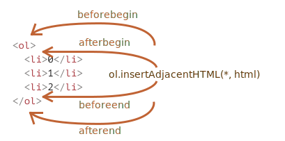

# Внесення змін в документ

Маніпуляціїї з DOM(об’єктна модель документа) це ключ до створення «живих» сторінок.

Тут ми побачимо як створювати нові елементи «на льоту» та змінювати вже існуючі.

## Приклад: показати повідомлення

Розглянемо на прикладі. Ми додамо на сторінку повідомлення яке виглядатиме краще аніж `alert`.

Ось так воно виглядатиме:

```html autorun height="80"
<style>
.alert {
  padding: 15px;
  border: 1px solid #d6e9c6;
  border-radius: 4px;
  color: #3c763d;
  background-color: #dff0d8;
}
</style>

*!*
<div class="alert">
  <strong>Привіт!</strong> Ви прочитали важливе повідомлення.
</div>
*/!*
```

Це був приклад HTML розмітки. Тепер створимо такий самий `div` за допомогою JavaScript (припускаємо, що стилі вже є в HTML або в окремому CSS-файлі).

## Створення елементу

Є два способи створення DOM вузлів:

`document.createElement(tag)`
: Створює новий _елемент_ з заданим тегом:

    ```js
    let div = document.createElement('div');
    ```

`document.createTextNode(text)`
: Створює новий _текстовий вузол_ з заданим текстом:

    ```js
    let textNode = document.createTextNode('От і я');
    ```

У більшості випадків нам потрібно створювати саме _елементи_, такі як `div` для повідомлень.

### Створення повідомлень

Створення div елементу для повідомлення складається з трьох кроків:

```js
// 1. Створіть елемент <div>
let div = document.createElement('div');

// 2. Задайте йому клас "alert"
div.className = 'alert';

// 3. Наповніть <div> змістом
div.innerHTML = "<strong>Всім привіт!</strong> Ви прочитали важливе повідомлення.";
```

Ми створили елемент, але поки що він знаходиться лише у змінній під назвою `div`, а не на сторінці. Тому ми не можемо його побачити.

## Методи вставки

Щоб `div` показався нам потрібно вставити його десь на сторінці в `document`. Наприклад, в елемент `<body>` який можна отримати звернувшись до `document.body`.

Для цього існує спеціальний метод `append`: `document.body.append(div)`.

Нижче повна версія коду:

```html run height="80"
<style>
  .alert {
    padding: 15px;
    border: 1px solid #d6e9c6;
    border-radius: 4px;
    color: #3c763d;
    background-color: #dff0d8;
  }
</style>

<script>
    let div = document.createElement('div');
    div.className = "alert";
    div.innerHTML = "<strong>Всім привіт!</strong> Ви прочитали важливе повідомлення.";

  *!*
    document.body.append(div);
  */!*
</script>
```

В наведеному прикладі ми викликали метод `append` на `document.body`, але це можна зробити на будь-якому іншому елементі з ціллю вставити інший елемент всередину. Наприклад, ми можемо додати щось до `<div>` викливавши `div.append(anotherElement)`.

Нижче наведено більше методів для вставки, вони вказують куди саме буде вставлено вміст:

- `node.append(...вузли або рядки)` -- додає вузли або рядки _в кінець_ `node`,
- `node.prepend(...вузли або рядки)` -- вставляє вузли вбо рядки _на початку_ `node`,
- `node.before(...вузли або рядки)` -- вставляє вузли або рядки _попереду_ `node`,
- `node.after(...вузли або рядки)` -- вставляє вузли або рядки _після_ `node`,
- `node.replaceWith(...вузли або рядки)` -- замінює `node` заданими вузлами або рядками.

Аргументами цих методів може бути довільний список DOM вузлів або текстові рядки(які автоматично перетворюються на текстові вузли).

Подивимося на них в дії.

Нижче наведено приклад використання цих методів, щоб додати до списку нові пункти та текст до/після нього.

```html autorun
<ol id="ol">
  <li>0</li>
  <li>1</li>
  <li>2</li>
</ol>

<script>
  ol.before('before'); // вставити рядок "before" перед <ol>
  ol.after('after'); // вставити рядок "after" після <ol>

  let liFirst = document.createElement('li');
  liFirst.innerHTML = 'prepend';
  ol.prepend(liFirst); // вставити liFirst на початку <ol>

  let liLast = document.createElement('li');
  liLast.innerHTML = 'append';
  ol.append(liLast); // вставити liLast в кінці <ol>
</script>
```

Наочна ілюстрацію роботи методів:


Фінальний список виглядатиме так:

```html
before
<ol id="ol">
  <li>prepend</li>
  <li>0</li>
  <li>1</li>
  <li>2</li>
  <li>append</li>
</ol>
after
```

Як вже було сказано, ці методи можуть вставляти декілька вузлів та фрагментів тексту за один виклик.

Наприклад, тут вставлено рядок та елемент одночасно.

```html run
<div id="div"></div>
<script>
  div.before('<p>Привіт!</p>', document.createElement('hr'));
</script>
```

Пам'ятайте, що текст вставляється «як текст», а не «як HTML», з відповідними замінами таких символів як `<`, `>`.

Тому фінальний HTML буде таким:

```html run
*!*
&lt;p&gt;Привіт&lt;/p&gt;
*/!*
<hr />
<div id="div"></div>
```

Іншими словами, рядки вставляються безпечним способом, як це робить `elem.textContent`.

Тому ці методи можна використовувати лише для вставки DOM вузлів або фрагментів тексту.

Але що, як нам потрібно вставити рядок HTML «як html», з усіма тегами та іншим, в той самий спосіб як це робить `elem.innerHTML`?

## insertAdjacentHTML/Text/Element

Для цього ми можемо використовувати інший, досить універсальний метод: `elem.insertAdjacentHTML(куди, html)`.

Перший параметр це кодове слово, яке вказує куди вставляти відносно `elem`. Його значенння має бути одним з наступних:

- `"beforebegin"` -- вставити `html` безпосередньо перед `elem`,
- `"afterbegin"` -- вставити `html` в `elem`, на початку,
- `"beforeend"` -- вставити `html` в `elem`, в кінці,
- `"afterend"` -- вставити `html` безпосередньо після `elem`.

Другий параметр це рядок у форматі HTML.

Наприклад:

```html run
<div id="div"></div>
<script>
  div.insertAdjacentHTML('beforebegin', '<p>Привіт</p>');
  div.insertAdjacentHTML('afterend', '<p>Бувай</p>');
</script>
```

...виглядатиме як:

```html run
<p>Привіт</p>
<div id="div"></div>
<p>Бувай</p>
```

Ось так ми можемо додавати HTML на сторінку.

На зображенні показані всі можливі варіанти вставки.



Можна легко помітити схожість між цим та попереднім зображенням. Місця вставки насправді ті ж самі, але останній метод вставляє HTML.

Метод має двох братів:

- `elem.insertAdjacentText(куди, текст)` -- синтаксис той самий, але рядок тексту вставляється «як текст» замість HTML
- `elem.insertAdjacentElement(куди, текст)` -- синтаксис той самий, але вставляється елемент

Наведені методи існують для того щоб синтаксис залишався «однорідним». На практиці ж, у більшості випадків використовується `insertAdjacentHTML`. Тому що для вставки елементів та тексту є методи `append/prepend/before/after` -- вони коротші для написання і так само вміють вставляти вузли чи фрагменти тексту.

Ось так можна вивести повідомлення на екран альтернативним способом:

```html run
<style>
.alert {
  padding: 15px;
  border: 1px solid #d6e9c6;
  border-radius: 4px;
  color: #3c763d;
  background-color: #dff0d8;
}
</style>

<script>
  document.body.insertAdjacentHTML("afterbegin", `<div class="alert">
    <strong>Всім привіт!</strong> Ви прочитали важливе повідомлення.
  </div>`);
</script>
```

## Видалення вузлів

Щоб видалити вузол використовуйте метод `node.remove()`.

Спробуємо зробити так, щоб наше повідомлення зникало через одну секунду:

```html run untrusted
<style>
.alert {
  padding: 15px;
  border: 1px solid #d6e9c6;
  border-radius: 4px;
  color: #3c763d;
  background-color: #dff0d8;
}
</style>

<script>
  let div = document.createElement('div');
  div.className = "alert";
  div.innerHTML = "<strong>Всім привіт!</strong> Ви прочитали важливе повідомлення.";

  document.body.append(div);
*!*
  setTimeout(() => div.remove(), 1000);
*/!*
</script>
```

Зверніть увагу: якщо ми хочемо _перемістити_ елемент на інше місце в документі -- тоді немає потреби його видаляти.

**Всі методи вставки автоматично видаляють вузол з попереднього місця розташування.**

Наприклад, поміняємо елементи місцями:

```html run height=50
<div id="first">Перший</div>
<div id="second">Другий</div>
<script>
  // немає потреби викликати .remove
  second.after(first); // взяти #другий та після нього вставити #перший
</script>
```

## Клонування вузлів: cloneNode

Як вставити ще одне схоже повідомлення?

Можна створити функцію та помістити код в неї. Але є ще один спосіб -- _клонувати_ існуючий `div` та змінити текст всередині(якщо потрібно).

У випадку, коли наш елемент великий, це може бути швидше і простіше.

- Виклик `elem.cloneNode(true)` створює «глибоку» копію елемента. -- з усіма атрибутами та піделементами. Якщо ми викличемо `elem.cloneNode(false)`, тоді буде створена копія без дочірніх елементів.

Приклад копіювання повідомлення:

```html run height="120"
<style>
.alert {
  padding: 15px;
  border: 1px solid #d6e9c6;
  border-radius: 4px;
  color: #3c763d;
  background-color: #dff0d8;
}
</style>

<div class="alert" id="div">
  <strong>Всім привіт!</strong> Ви прочитали важливе повідомлення.
</div>

<script>
*!*
  let div2 = div.cloneNode(true); // клонувати елемент
  div2.querySelector('strong').innerHTML = 'Bye there!'; // змінити клона

  div.after(div2); // вставити клонований елемент після існуючого `div`
*/!*
</script>
```

## DocumentFragment [#document-fragment]

`DocumentFragment` це спеціальний DOM-вузол який служить обгорткою для передачі списку вузлів.

Ми можемо додавати до нього інші вузли, але коли ми вставляємо кудись його самого, тоді вставляється лише його вміст(контент).

Наприклад, нижче `getListContent` генерує фрагмент з пунктами `<li>`, які пізніше вставляються в `<ul>`:

```html run
<ul id="ul"></ul>

<script>
  function getListContent() {
    let fragment = new DocumentFragment();

    for(let i=1; i<=3; i++) {
      let li = document.createElement('li');
      li.append(i);
      fragment.append(li);
    }

    return fragment;
  }

  *!*
  ul.append(getListContent()); // (*)
  */!*
</script>
```

Зверніть увагу, що в останньому рядку коду `(*)` ми додаємо `DocumentFragment`, але він «зникає», тому в результаті структура будет такою:

```html
<ul>
  <li>1</li>
  <li>2</li>
  <li>3</li>
</ul>
```

`DocumentFragment` рідко використовується. Навіщо додавати спеціальний вид вузла, якщо натомість можна повернути масив вузлів? Переписаний приклад:

```html run
<ul id="ul"></ul>

<script>
function getListContent() {
  let result = [];

  for(let i=1; i<=3; i++) {
    let li = document.createElement('li');
    li.append(i);
    result.push(li);
  }

  return result;
}

*!*
ul.append(...getListContent()); // append + оператор "..." = друзі!
*/!*
</script>
```

Ми згадуємо `DocumentFragment` в основному тому що на ньому базуються деякі концепції, як от елемент [template](info:template-element), який ми розберемо пізніше.

## Застарілі методи вставки/видалення

[old]

Також є застарілі методи для маніпуляціі з DOM, які існують лише з історичних причин.

Це методи прийшли з давніх часів. Сьогодні немає причин їх використовувати, оскільки сучасні методи, такі як `append`, `prepend`, `before`, `after`, `remove`, `replaceWith`, набагато зручніші у використанні.

Ми перераховуємо ці методи лише тому, що вони можуть зустрітися вам в багатьох старих скриптах:

`parentElem.appendChild(node)`
: Додає `node` як останній дочірній елемент `parentElem`.

    В наведеному нижче прикладі додаємо `<li>` в кінець `<ol>`:

    ```html run height=100
    <ol id="list">
      <li>0</li>
      <li>1</li>
      <li>2</li>
    </ol>

    <script>
      let newLi = document.createElement('li');
      newLi.innerHTML = 'Привіт, світ';

      list.appendChild(newLi);
    </script>
    ```

`parentElem.insertBefore(node, nextSibling)`
: Вставляє `node` перед `nextSibling` в `parentElem`.

    В наведеному нижче прикладі вставляється новий елемент списку перед другим `<li>`:

    ```html run height=100
    <ol id="list">
      <li>0</li>
      <li>1</li>
      <li>2</li>
    </ol>
    <script>
      let newLi = document.createElement('li');
      newLi.innerHTML = 'Привіт, світ!';

    *!*
      list.insertBefore(newLi, list.children[1]);
    */!*
    </script>
    ```
    Щоб вставити `newLi` першим елементом, ми можемо зробити так:

    ```js
    list.insertBefore(newLi, list.firstChild);
    ```

`parentElem.replaceChild(node, oldChild)`
: Замінює `oldChild` на `node` поміж дочірніми елементами `parentElem`.

`parentElem.removeChild(node)`
: Видаляє `node` з `parentElem` (припускаючи, що `node` це його дочірній елемент).

    В наведеному нижче прикладі з `<ol>` видаляється перший `<li>` :

    ```html run height=100
    <ol id="list">
      <li>0</li>
      <li>1</li>
      <li>2</li>
    </ol>

    <script>
      let li = list.firstElementChild;
      list.removeChild(li);
    </script>
    ```

Всі ці методи повертаються вставлені/видалено вузли. Іншими словами, `parentElem.appendChild(node)` повертає `node`. Але зазвичай повернуті значення не використовуються, ми лише запускаємо метод.

## Декілька слів про «document.write»

Є ще один дуже застарілий метод щоб додати вміст на веб-сторінку: `document.write`.

Синтаксис:

```html run
<p>Десь на сторінці...</p>
*!*
<script>
  document.write('<b>Привіт від JS</b>');
</script>
*/!*
<p>Кінець</p>
```

Виклик `document.write(html)` записує `html` на сторінку «прямо тут і зараз». Рядок `html` може бути згенерований динамічно, тож метод дещо гнучкий. За допомою JavaScript ми можемо створити повноцінну веб-сторінку та записати її в документ.

Метод прийшов з тих часів коли не було ані DOM(об'єктна модель документу), ані стандартів... Справді давні часи. Метод досі живий, тому що є скрипти, в яких він використовується.

В сучасних скриптах він рідко зустрічається через наступні важливі обмеження:

**Виклик `document.write` працює поки сторінка завантажується.**

Якщо ми викличемо його пізніше, то існуючий вміст документу буде видалений.

Наприклад:

```html run
<p>Через одну секунду вміст цієї сторінки буде замінено...</p>
*!*
<script>
  // document.write через 1 секунду
  // виклик відбувся після того як сторінка завантажилася, тому метод стирає вміст
  setTimeout(() => document.write('<b>...By this.</b>'), 1000);
</script>
*/!*
```

Тому цей метод непридатний на стадії «після завантаження», на відміну від інших DOM-методів які ми розібрали раніше.

Це його недолік.

Окрім того є і перевага. Технічно, коли `document.write` викликається поки браузер читає («розбирає») вхідний HTML і щось записує в документ, то браузер сприймає його так, наче він з самого початку був там, в HTML-документі.

Тому він працює надзвичайно швидко, адже не відбувається _жодних DOM-модифікацій_. Він записує беспосередньо в текст сторінки, поки DOM ще не сформований.

Тому якщо нам потрібно динамічно додати в HTML велику кількість тексту, і ми на стадії завантаження сторінки, і швидкість завантаження має значення -- цей метод може допомогти. Але на практиці всі ці вимоги рідко поєднуються. І зазвичай цей метод зустрічається в скриптах лише тому, що вони старі.

## Підсумки

- Методи для створення нових вузлів:

  - `document.createElement(tag)` -- створює елемент з заданим тегом,
  - `document.createTextNode(value)` -- створює текстовий вузол (рідко використовється),
  - `elem.cloneNode(deep)` -- клонує елемен, якщо `deep==true` то з усіма нащадками.

- Вставка та видалення:

  - `node.append(...nodes or strings)` -- вставляє в `node`, в кінець,
  - `node.prepend(...nodes or strings)` -- вставляє в `node`, на початку,
  - `node.before(...nodes or strings)` -- вставляє прямо перед `node`,
  - `node.after(...nodes or strings)` -- вставляє відразу після `node`,
  - `node.replaceWith(...nodes or strings)` -- замінює `node`.
  - `node.remove()` -- видаляє `node`.

  Текстові рядки вставляються «як текст».

- Також є застарілі методи:

  - `parent.appendChild(node)`
  - `parent.insertBefore(node, nextSibling)`
  - `parent.removeChild(node)`
  - `parent.replaceChild(newElem, node)`

  Всі вони повертають `node`.

- Метод `elem.insertAdjacentHTML(where, html)` вставляє заданий HTML в залежності від значення параметру `where`:

  - `"beforebegin"` -- вставляє `html` прямо перед `elem`,
  - `"afterbegin"` -- вставляє `html` в `elem`, на початку,
  - `"beforeend"` -- вставляє `html` в `elem`, в кінці,
  - `"afterend"` -- вставляє `html` відразу після `elem`.

  Також є схожі методи, `elem.insertAdjacentText` та `elem.insertAdjacentElement`, що вставляють текстові рядки та елементи, але їх рідко використовують.

- Шоб додати HTML на сторінку до того як вона повністю завантажиться:

  - `document.write(html)`

  Після завантаження сторінки такий виклик призведе до стирання документу. В основному зустрічається в старих скриптах.
