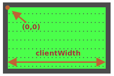

М'яч має `position:absolute`. Це означає, що його `left/top` координати вимірюються від найближчого розташованого елемента(батька), тобто `#field` (тому що він має `position:relative`).

Координати починаються з внутрішнього лівого верхнього кута поля:



Ширина/висота внутрішнього поля `clientWidth/clientHeight`. Отже, центр поля має координати `(clientWidth/2, clientHeight/2)`.

...Але якщо ми встановимо `ball.style.left/top` до таких значень, то в центрі буде не м'яч в цілому, а його лівий верхній кут:

```js
ball.style.left = Math.round(field.clientWidth / 2) + 'px';
ball.style.top = Math.round(field.clientHeight / 2) + 'px';
```

Ось як це виглядає:

[iframe height=180 src="ball-half"]

Щоб вирівняти центр м'яча з центром поля, ми повинні перемістити м'яч на половину його ширини вліво і на половину його висоти вгору:

```js
ball.style.left = Math.round(field.clientWidth / 2 - ball.offsetWidth / 2) + 'px';
ball.style.top = Math.round(field.clientHeight / 2 - ball.offsetHeight / 2) + 'px';
```

Тепер м'яч нарешті відцентрований.

````warn header="Attention: the pitfall!"

Код не працюватиме надійно, поки `` не має ширини/висоти:

```html

```
````

Коли браузер не знає ширини/висоти зображення (з атрибутів тегів або CSS), він вважає, що вони дорівнюють `0` поки не закінчиться завантаження зображення.

Отже, значення `ball.offsetWidth` буде `0` поки не завантажиться зображення. Це призводить до неправильних координат у коді вище.

Після першого завантаження браузер зазвичай кешує зображення, і при перезавантаженні воно відразу матиме розмір. Але при першому завантаженні значення `ball.offsetWidth` дорівнює `0`.

Ми повинні це виправити, додавши `width/height` до ``:

```html

```

...Або вказати розмір у CSS:

```css
#ball {
  width: 40px;
  height: 40px;
}
```
