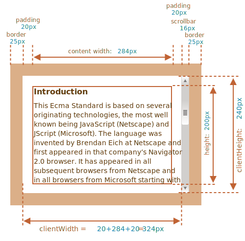
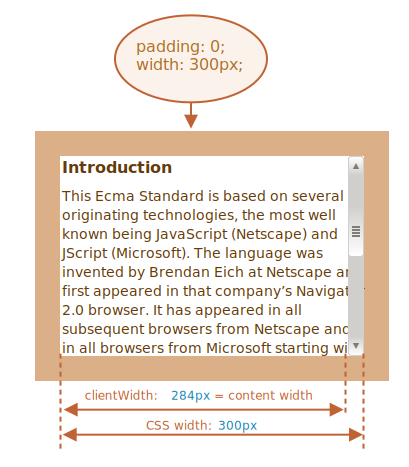

# Розмір і прокрутка елемента

Є багато властивостей JavaScript, які дозволяють нам читати інформацію про ширину, висоту елемента та інші геометричні характеристики.

Ми часто потребуємо їх під час переміщення або позиціювання елементів в JavaScript.

## Приклад елемента

Як приклад елемента для демонстрації властивостей ми використаємо наведений нижче:

```html no-beautify
<div id="example">
  ...Текст...
</div>
<style>
  #example {
    width: 300px;
    height: 200px;
    border: 25px solid #E8C48F;
    padding: 20px;
    overflow: auto;
  }
</style>
```

Він має межі, відступи та прокручування. Повний набір функцій. Тут немає відступів (margins), оскільки вони не є частиною самого елемента, і для них немає спеціальних властивостей.

Елемент виглядає ось так:


Ви можете [відкрити документ у пісочниці](sandbox:metric).

```smart header="Зверніть увагу на смугу прокрутки"
На малюнку вище показаний найскладніший випадок, коли елемент має смугу прокрутки. Деякі браузери (не всі) резервують місце для нього, беручи його з вмісту (позначеного вище як "content width").

Таким чином, без смуги прокрутки ширина вмісту становила б `300px`, але якщо ширина смуги прокрутки `16px` (ширина може відрізнятися залежно від пристрою та браузера), то залишається лише `300 - 16 = 284px`, і ми повинні це враховувати. Ось чому приклади з цього розділу надані зі смугою прокрутки. Без неї деякі розрахунки будуть простіші.
```

```smart header="Область `padding-bottom` (нижній внутрішній відступ) може бути заповнена текстом"
Зазвичай на наших ілюстраціях відступи відображаються порожніми, але якщо в елементі забагато тексту і він переповнюється, то браузери показують "випадаючий" текст в області `padding-bottom`, і це нормально.
```

## Геометрія

Ось загальна картина з геометричними властивостями:


Значення цих властивостей технічно є числами, але ці числа є "пікселями", тому це вимірювання у пікселях.

Почнемо досліджувати, починаючи зовні елемента.

## offsetParent, offsetLeft/Top

Ці властивості рідко потрібні, але все ж це "найбільш зовнішні" геометричні властивості, тому й почнемо з них.

У властивості `offsetParent` знаходиться предок елементу, який браузер використовує для обчислення координат під час візуалізації.

Тобто найближчий предок, який задовольняє наступним умовам:

1. Є CSS-позиціонованим (CSS-властивість `position` є `absolute`, `relative`, `fixed` або `sticky`),
2. або `<td>`, `<th>`, `<table>`,
3. або `<body>`.

Властивості `offsetLeft/offsetTop` надають координати x/y відносно верхнього лівого кута `offsetParent`.

У наведеному нижче прикладі внутрішній `<div>` має `<main>` в якості `offsetParent`, а властивості `offsetLeft/offsetTop` є зсувами щодо верхнього лівого кута (`180`):

```html run height=10
<main style="position: relative" id="main">
  <article>
    <div id="example" style="position: absolute; left: 180px; top: 180px">...</div>
  </article>
</main>
<script>
  alert(example.offsetParent.id); // main
  alert(example.offsetLeft); // 180 (зверніть увагу: число, а не рядок "180px")
  alert(example.offsetTop); // 180
</script>
```


Існує декілька випадків, коли `offsetParent` дорівнює `null`:

1. Для елементів, що не відображаються (`display:none` або коли його немає у документі).
2. Для елементів `<body>` та `<html>`.
3. Для елементів з `position:fixed`.

## offsetWidth/Height

Тепер перейдемо до самого елемента.

Ці дві властивості є найпростішими. Вони забезпечують "зовнішню" ширину/висоту елемента. Або, іншими словами, його повний розмір, включаючи рамки(border).


Для нашого елемента:

- `offsetWidth = 390` -- зовнішня ширина блоку, її можна отримати додаванням внутрішньої CSS-ширини (`300px`), внутрішніх відступів (`2 * 20px`) та рамок (`2 * 25px`).
- `offsetHeight = 290` -- зовнішня висота блоку.

````smart header="Геометричні властивості приймають значення нуль/null для елементів, які не відображаються"
Геометричні властивості, такі як координати та розміри, обчислюються лише для відображених елементів.

Якщо елемент (або будь-який із його предків) має  `display:none` або його немає в документі, тоді всі геометричні властивості дорівнюють нулю (або `null` для `offsetParent`).

Наприклад,  `offsetParent` дорівнює `null`, а `offsetWidth`, `offsetHeight` дорівнюють `0`, якщо ми створили елемент, але ще не вставили його в документ, або він (або його предок) має `display:none`.

Ми можемо використати це, щоб перевірити, чи приховано елемент, наприклад:

```js
function isHidden(elem) {
  return !elem.offsetWidth && !elem.offsetHeight;
}
```

Зауважимо, що функція `isHidden` також поверне `true` для елементів, які в принципі показуються, але їх розміри дорівнюють нулю (наприклад, порожні `<div>`).
````

## clientTop/Left

Підемо далі. Всередині елемента у нас є рамки (border).

Для їх вимірювання існують геометричні властивості `clientTop` та `clientLeft`.

Для нашого елемента:

- `clientLeft = 25` -- ширина лівої рамки
- `clientTop = 25` -- ширина верхньої рамки


...Але якщо бути точним -- ці властивості не ширина/висота рамки, а відступи внутрішньої частини елемента від зовнішньої.

Яка різниця?

Вона виникає, коли документ написаний справа наліво (операційна система арабською або івритом). Тоді смуга прокрутки розташована не праворуч, а ліворуч, а тому clientLeft також включає ширину смуги прокрутки.

У цьому випадку `clientLeft` буде не `25`, бо додасться ширина смуги прокрутки -- `25 + 16 = 41`.

Ось приклад на івриті:


## clientWidth/Height

Ці властивості забезпечують розмір області всередині рамок елемента.

Вони включають ширину вмісту разом із внутрішніми відступами `padding`, але без смуги прокрутки:



На зображенні вище давайте спочатку розглянемо висоту `clientHeight`.

Немає горизонтальної смуги прокрутки, тому це точно сума того, що знаходиться всередині меж елемента: CSS-висота `200px` плюс верхній і нижній відступи (`2 * 20px`) загалом `240px`.

Тепер `clientWidth` -- ширина вмісту тут дорівнює не `300px`, а `284px`, тому що `16px` займає смуга прокрутки. Таким чином, сума становить `284px` плюс відступи ліворуч і праворуч, разом `324px`.

**Якщо немає відступів `padding`, то `clientWidth/Height` в точності рівні розміру області вмісту всередині рамок за вирахуванням смуги прокручування (якщо вона є).**



Тому в тих випадках, коли ми точно знаємо, що відступів немає, можна використовувати `clientWidth/clientHeight` для отримання розмірів внутрішньої області вмісту.

## scrollWidth/Height

Ці властивості схожі на `clientWidth/clientHeight`, але вони також включають прокручену (приховану) частину елемента:


На зображенні вище:

- `scrollHeight = 723` -- повна внутрішня висота області вмісту, включаючи прокручену область.
- `scrollWidth = 324` -- це повна внутрішня ширина, тут у нас немає горизонтальної прокрутки, тому вона дорівнює `clientWidth`.

Ми можемо використовувати ці властивості, щоб розширити елемент на всю ширину/висоту.

Як тут:

```js
// розгорнути елемент на всю висоту вмісту
element.style.height = `${element.scrollHeight}px`;
```

```online
Натисніть кнопку, щоб розгорнути елемент:

<div id="element" style="width:300px;height:200px; padding: 0;overflow: auto; border:1px solid black;">текст текст текст текст текст текст текст текст текст текст текст текст текст текст текст текст текст текст текст текст текст текст текст текст текст текст текст текст текст текст текст текст текст текст текст текст текст текст текст текст текст текст текст текст текст текст текст текст текст текст текст текст текст текст текст текст текст текст текст текст текст текст текст текст текст текст текст текст текст текст текст текст текст текст текст текст текст текст текст текст текст текст текст текст текст текст текст текст текст текст текст текст текст текст текст текст текст текст текст текст текст текст текст текст текст текст текст текст текст текст текст текст текст текст текст текст текст текст текст текст текст текст текст текст текст текст текст текст текст текст текст текст текст текст текст текст текст текст текст текст</div>

<button style="padding:0" onclick="element.style.height = `${element.scrollHeight}px`">element.style.height = `${element.scrollHeight}px`</button>
```

## scrollLeft/scrollTop

Властивості  `scrollLeft/scrollTop` це ширина/висота прихованої, прокрученої частини елемента.

На малюнку нижче ми бачимо `scrollHeight` та `scrollTop` для блоку з вертикальною прокруткою.


Іншими словами, `scrollTop` означає "скільки прокручено вгору".

````smart header="Властивості `scrollLeft/scrollTop` можна змінювати"
Більшість геометричних властивостей тут доступні лише для читання, але `scrollLeft/scrollTop` можна змінювати, і браузер прокрутить елемент відповідно до змін.

```online
Якщо клацнути на елемент нижче, буде виконано код `elem.scrollTop += 10`. Це змусить вміст елемента прокрутитися на `10px` вниз.

<div onclick="this.scrollTop+=10" style="cursor:pointer;border:1px solid black;width:100px;height:80px;overflow:auto">Нажміть<br>На мене<br>1<br>2<br>3<br>4<br>5<br>6<br>7<br>8<br>9</div>
```

Встановлення  `scrollTop` на `0` або навпаки велике значення, наприклад `1e9` змусить елемент прокрутитися до самого верху/низу відповідно.
````

## Не варто брати ширину/висоту з CSS

Ми щойно розглянули геометричні властивості елементів DOM, які можна використовувати для отримання ширини, висоти та обчислення відстані.

Але, як ми знаємо з розділу <info:styles-and-classes>, ми можемо зчитати CSS висоту та ширину за допомогою `getComputedStyle`.

То чому б не прочитати ширину елемента за допомогою `getComputedStyle`, ось так?

```js run
let elem = document.body;

alert( getComputedStyle(elem).width ); // показує CSS-ширину elem
```

Чому ми повинні замість цього використовувати геометричні властивості? Є дві причини:

1. По-перше, CSS `width/height` залежить від іншої властивості: `box-sizing` яка визначає "що таке" ширина та висота CSS. Виходить, що зміна `box-sizing`, наприклад, для зручнішої верстки, зламає такий JavaScript.
2. По-друге, CSS `width/height` може бути `auto`, наприклад для вбудованого елемента:

    ```html run
    <span id="elem">Привіт!</span>

    <script>
    *!*
      alert( getComputedStyle(elem).width ); // auto
    */!*
    </script>
    ```
 
    Звісно, з точки зору CSS, `width:auto` є абсолютно нормальним, але в JavaScript нам потрібен точний розмір у `px` який ми можемо використовувати для обчислень. Виходить, що в цьому випадку ширина CSS взагалі безкорисна.

І є ще одна причина: смуга прокрутки. Іноді код, який добре працює без смуги прокрутки, починає працювати з помилками, оскільки смуга прокрутки займає простір у вмісті в деяких браузерах. Отже, реальна ширина, доступна для вмісту, менша за ширину CSS. І `clientWidth/clientHeight` враховують це.

...Але з `getComputedStyle(elem).width` ситуація інша. Деякі браузери (наприклад, Chrome) повертають реальну внутрішню ширину без смуги прокрутки, а деякі з них (наприклад, Firefox) -- CSS ширину (ігнорує прокрутку). Такі між браузерні відмінності є причиною не використовувати `getComputedStyle`, а радше покладатися на геометричні властивості.

```online
Якщо ваш браузер резервує простір для смуги прокрутки (більшість браузерів для Windows це роблять), ви можете перевірити це нижче.

[iframe src="cssWidthScroll" link border=1]

Елемент із текстом має CSS `width:300px`.

На комп’ютері в ОС Windows, Firefox, Chrome, Edge резервується місце для смуги прокрутки. Але Firefox показує `300px`, а Chrome і Edge -- менше. Це тому, що Firefox повертає ширину CSS, а інші браузери повертають "реальну" ширину.
```

Зверніть увагу, що описана різниця стосується лише читання `getComputedStyle(...).width` з JavaScript, візуально все правильно.

## Підсумки

Елементи мають наступні геометричні властивості:

- `offsetParent` -- це найближчий CSS-позиціонований предок або найближчий `td`, `th`, `table`, `body`.
- `offsetLeft/offsetTop` -- координати відносно лівого верхнього куту `offsetParent`.
- `offsetWidth/offsetHeight` -- "зовнішня" ширина/висота елемента, включаючи рамки.
- `clientLeft/clientTop` -- відстані від верхнього лівого зовнішнього кута до верхнього лівого внутрішнього (вміст + відступ) кута. Для ОС, орієнтованої зліва направо, це завжди ширина лівої/верхньої рамки. Для ОС, орієнтованої справа наліво, вертикальна смуга прокрутки розташована ліворуч, тому `clientLeft` також включає її ширину.
- `clientWidth/clientHeight` -- ширина/висота вмісту, включаючи відступи, але без смуги прокрутки.
- `scrollWidth/scrollHeight` -- ширина/висота вмісту, як і `clientWidth/clientHeight`, але також включає прокручену невидиму частину елемента.
- `scrollLeft/scrollTop` -- ширина/висота прокрученої верхньої частини елемента, починаючи з його верхнього лівого кута.

Усі властивості доступні лише для читання, за винятком `scrollLeft/scrollTop` які змушують браузер прокручувати елемент у разі зміни.
