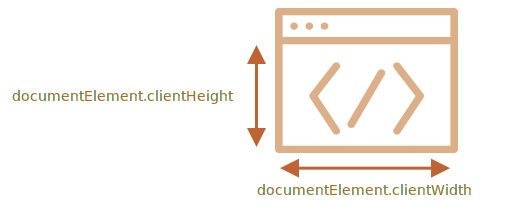

# Розміри вікна і прокрутка

Як визначити ширину та висоту вікна браузера? Як отримати повну ширину та висоту документа, включаючи прокручену частину? Як можна прокрутити сторінку за допомогою JavaScript?

Для цього ми можемо використовувати кореневий елемент документа `document.documentElement`, який відповідає тегу `<html>`. Але є додаткові методи та особливості, які слід враховувати.

## Ширина/висота вікна

Щоб отримати ширину та висоту вікна, ми можемо використовувати `clientWidth/clientHeight` з `document.documentElement`:



```online
Наприклад, ця кнопка показує висоту вашого вікна:

<button onclick="alert(document.documentElement.clientHeight)">alert(document.documentElement.clientHeight)</button>
```

`` ``warn header="Не `window.innerWidth/innerHeight`"
Браузери також підтримують властивості `window.innerWidth/innerHeight`. Начебто схоже на те, що нам потрібно. Чому не використати їх?

Якщо є смуга прокрутки, і вона займає деякий простір, то властивості `clientWidth/clientHeight` нададуть ширину/висоту без прокрутки (віднявши її). Інакше кажучи, вони повертають ширину/висоту видимої частини документа, доступної для вмісту.

А `window.innerWidth/innerHeight` включають смугу прокрутки.

Якщо є смуга прокрутки та вона займає деякий простір, то ці два рядки покажуть різні значення:
```js run
alert( window.innerWidth ); // повна ширина вікна
alert( document.documentElement.clientWidth ); // ширина вікна мінус смуга прокрутки
```

У більшості випадків нам потрібна *доступна* ширина вікна без смуги прокрутки, щоб намалювати або розташувати щось. Тому ми повинні використовувати `documentElement.clientHeight/clientWidth`.
`` ``

` ``warn header="`DOCTYPE` важливий"
Зверніть увагу: геометричні властивості верхнього рівня можуть працювати дещо інакше, якщо в HTML немає `<!DOCTYPE HTML>`. Можливі дивні речі.

У сучасному HTML ми завжди повинні вказувати `DOCTYPE`.
` ``

## Ширина/висота документа

Теоретично, оскільки кореневим елементом документа є `document.documentElement`, і він охоплює весь вміст, ми можемо виміряти повний розмір документа як `document.documentElement.scrollWidth/scrollHeight`.

Але для цього елемента для всієї сторінки ці властивості не працюють належним чином. У Chrome/Safari/Opera, якщо немає смуги прокрутки, то `documentElement.scrollHeight` може бути навіть меншим, ніж `documentElement.clientHeight`! З точки зору елемента це неможлива ситуація.

Щоб надійно отримати повну висоту документа, ми повинні взяти максимальне з цих властивостей:

```js run
let scrollHeight = Math.max(
  document.body.scrollHeight, document.documentElement.scrollHeight,
  document.body.offsetHeight, document.documentElement.offsetHeight,
  document.body.clientHeight, document.documentElement.clientHeight
);

alert('Повна висота документа з прокрученою частиною: ' + scrollHeight);
```

Чому так? Краще не запитуйте. Ці невідповідності походять із давніх часів, а не з глибокої логіки.

## Отримання поточної позиції прокрутки [#page-scroll]

Елементи DOM зберігають свій поточний стан прокрутки у властивостях `scrollLeft/scrollTop`.

Стан прокрутки документа міститься в `document.documentElement.scrollLeft/scrollTop`, та працює в більшості браузерів, за винятком старіших вебпереглядачів створених на WebKit, таких як Safari (помилка [5991](https://bugs.webkit.org/show_bug.cgi?id=5991)), де ми повинні використовувати `document.body` замість `document.documentElement`.

На щастя, нам не потрібно пам’ятати про ці особливості, оскільки прокрутка доступна у спеціальних властивостях `window.pageXOffset/pageYOffset`:

```js run
alert('Поточна прокрутка зверху: ' + window.pageYOffset);
alert('Поточна прокрутка зліва: ' + window.pageXOffset);
```

Ці властивості доступні лише для читання.

` ``
smart header="Також доступні як властивості `window` `scrollX` та `scrollY`"
З історичних причин обидві властивості існують, але вони однакові:
- `window.pageXOffset` є псевдонімом `window.scrollX`.
- `window.pageYOffset` є псевдонімом  `window.scrollY`.
` ``

## Прокрутка: scrollTo, scrollBy, scrollIntoView [#window-scroll]

` ``warn
Для того, щоб прокручувати сторінку за допомогою JavaScript, її DOM має бути повністю створено.

Наприклад, якщо ми спробуємо прокрутити сторінку за допомогою скрипту в `<head>`, це не спрацює.
` ``

Звичайні елементи можна прокручувати, змінюючи `scrollTop/scrollLeft`.

Ми можемо зробити те ж саме для сторінки, використовуючи `document.documentElement.scrollTop/scrollLeft` (крім Safari, де замість цього слід використовувати `document.body.scrollTop/Left`).

Також існує простіший та універсальний підхід: спеціальні методи [window.scrollBy(x,y)](mdn:api/Window/scrollBy) і [window.scrollTo(pageX,pageY)](mdn:api/Window/scrollTo).

- Метод `scrollBy(x,y)` прокручує сторінку *відносно її поточної позиції*. Наприклад, `scrollBy(0,10)` прокручує сторінку на `10px` вниз.

    ```online
    Кнопка нижче демонструє це:

    <button onclick="window.scrollBy(0,10)">window.scrollBy(0,10)</button>
    ```
- Метод `scrollTo(pageX,pageY)` прокручує сторінку *на абсолютні координати*, так що верхній лівий кут видимої частини мав координати `(pageX, pageY)` відносно верхнього лівого кута документа. Це те ж саме, що призначити `scrollLeft/scrollTop`.

    Щоб прокрутити до самого початку, ми можемо використовувати `scrollTo(0,0)`.

    ```online
    <button onclick="window.scrollTo(0,0)">window.scrollTo(0,0)</button>
    ```

Ці методи працюють для всіх браузерів однаково.

## scrollIntoView

Для повноти розглянемо ще один метод: [elem.scrollIntoView(top)](mdn:api/Element/scrollIntoView).

Виклик `elem.scrollIntoView(top)` прокручує сторінку таким чином, щоб зробити `elem` видимим. Він має один аргумент:

- Якщо `top=true` (за замовчуванням), то сторінка буде прокручена так, щоб `elem` з’явився у верхній частині вікна. Верхній край елемента буде вирівняний з верхньою частиною вікна.
- Якщо `top=false`, то сторінка прокручується так, щоб `elem` з’явився внизу. Нижній край елемента буде вирівняний з нижньою частиною вікна.

```online
Кнопка нижче прокручує сторінку, щоб розмістити себе у верхній частині вікна:

<button onclick="this.scrollIntoView()">this.scrollIntoView()</button>

А ця кнопка прокручує сторінку, щоб розмістити себе у нижній частині вікна:

<button onclick="this.scrollIntoView(false)">this.scrollIntoView(false)</button>
```

## Заборона прокручування

Іноді нам потрібно зробити документ «не прокручуваним». Наприклад, коли нам потрібно закрити сторінку великим повідомленням, яке вимагає негайної уваги, і ми хочемо, щоб відвідувач взаємодіяв з цим повідомленням, а не з документом.

Щоб зробити документ недоступним для прокручування, достатньо встановити `document.body.style.overflow = "hidden"`. Сторінка «завмре» у поточній позиції прокручування.

```online
Спробуй:

<button onclick="document.body.style.overflow = 'hidden'">document.body.style.overflow = 'hidden'</button>

<button onclick="document.body.style.overflow = ''">document.body.style.overflow = ''</button>

Перша кнопка зупиняє прокрутку, а друга відновлює.
```

Ми можемо використовувати ту саму техніку, щоб заморозити прокрутку для інших елементів, а не лише для `document.body`.

Недоліком цього методу є те, що смуга прокрутки зникає. Якщо вона займала деякий простір, то це місце звільняється, і вміст «стрибає», щоб заповнити його.

Це виглядає трохи дивно, але це можна обійти, якщо порівняти `clientWidth` до і після заборони прокручування. Якщо ширина збільшилась (смуга прокрутки зникла), додайте `padding` до `document.body` замість смуги прокрутки, щоб зберегти ширину вмісту такою ж.

## Підсумки

Розміри:

- Ширина/висота видимої частини документа (ширина/висота області вмісту): `document.documentElement.clientWidth/clientHeight`
- Ширина/висота всього документа з прокрученою частиною:

    ```js
    let scrollHeight = Math.max(
      document.body.scrollHeight, document.documentElement.scrollHeight,
      document.body.offsetHeight, document.documentElement.offsetHeight,
      document.body.clientHeight, document.documentElement.clientHeight
    );
    ```

Прокрутка:

- Прочитати поточну прокрутку: `window.pageYOffset/pageXOffset`.
- Змінити поточну прокрутку:

    - `window.scrollTo(pageX,pageY)` -- абсолютні координати,
    - `window.scrollBy(x,y)` -- прокрутити відносно поточного місця,
    - `elem.scrollIntoView(top)` -- прокрутити, щоб зробити `elem` видимим (вирівняти з верхньою/нижньою частиною вікна).
