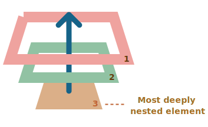

# Бульбашковий механізм (спливання та занурення)

Давайте почнемо з прикладу.

Цей обробник для `<div>` спрацює, якщо ви клікнете по будь-якому з вкладених тегів, чи то `<em>`, чи то `<code>`:

```html autorun height=60
<div onclick="alert('Обробник!')">
  <em>Якщо ви клікнете <code>EM</code>, обробник спрацює на <code>DIV</code> .</em>
</div>
```

Чи не дивно? Чому виконується обробник на `<div>`, якщо фактичний клік був на `<em>`?

## Спливання

Принцип Спливання простий.

**Коли подія відбувається на елементі, спочатку запускаються обробники на ньому, потім на його батькові, потім на інших предках і так до самого верху.**

Скажімо у нас є 3 вкладені елементи `FORM > DIV > P` з обробником на кожному з них:

```html run autorun
<style>
  body * {
    margin: 10px;
    border: 1px solid blue;
  }
</style>

<form onclick="alert('form')">FORM
  <div onclick="alert('div')">DIV
    <p onclick="alert('p')">P</p>
  </div>
</form>
```

При кліку на внутрішній `<p>` спочатку виконується `onclick`:
1. У самого `<p>`.
2. Потім зовнішнього `<div>`.
3. Потім зовнішнього `<form>`.
4. І так далі вгору до об’єкта `document`.



Отже, якщо ми клікнемо по `<p>`, то побачимо 3 попередження: `p` -> `div` -> `form`.

Процес називається "булькання (спливання)", тому що події спливають від внутрішнього елемента вгору через батьків, подібно до бульбашки у воді.

```warn header="*Майже* всі події спливають."
Ключове слово в цій фразі - "майже".

Наприклад, подія `focus` не спливає. Є й інші приклади, ми з ними познайомимося. Але все ж таки це скоріше виняток, ніж правило, більшість подій саме спливають.
```

## event.target

Обробник батьківського елемента завжди може отримати детальну інформацію про те, де це насправді сталося.

**Найбільш глибоко вкладений елемент, що викликав подію, називається *цільовим* елементом, та доступний як `event.target`.**

Зверніть увагу на відмінності від `this` (=`event.currentTarget`):

- `event.target` -- "цільовий" елемент, який ініціював подію, він не змінюється в процесі спливання.
- `this` -- "поточний" елемент, той, на якому в даний момент виконується обробник.

Наприклад, якщо у нас є один обробник `form.onclick`, то він може "ловити" всі кліки всередині форми. Незалежно від того, де стався клік, він спливає до `<form>` і запускає обробник.

В середині `form.onclick` обробника:

- `this` (=`event.currentTarget`) це елемент `<form>`, тому що обробник виконується на ньому.
- `event.target` це власне елемент всередині форми, на якому було зроблено клік.

Погляньте:

[codetabs height=220 src="bubble-target"]

Буває таке що `event.target` може дорівнювати `this` -- так трапляється, коли клік робиться безпосередньо на елементі `<form>`.

## Припинення спливання

Бульбашкова подія іде від цільового елемента прямо вгору. Зазвичай вона спливає вгору до елемента `<html>`, а потім до об'єкта `document`, і деякі події навіть досягають вікна, викликаючи всі обробники на своєму шляху.

Але будь-який обробник може вирішити, що подію повністю оброблено і зупинити її спливання.

Для цього існує метод - `event.stopPropagation()`.

Наприклад, тут обробник `body.onclick` не спрацює, якщо ви натиснете на `<button>`:

```html run autorun height=60
<body onclick="alert(`спливання не дійде сюди`)">
  <button onclick="event.stopPropagation()">Click me</button>
</body>
```

```smart header="event.stopImmediatePropagation()"
Якщо на елементі є кілька обробників подій для однієї події, то навіть якщо один з них зупиняє спливання, інші все одно виконуються.

Іншими словами, `event.stopPropagation()` зупиняє подальше рухання вгору, але на поточному елементі виконуються всі інші обробники.

Щоб зупинити спливання та запобігти виконанню обробників на поточному елементі, є метод `event.stopImmediatePropagation()`. Після його виклику інші обробники не виконуються.
```

```warn header="Не зупиняйте спливання без потреби!"
Бульбашковий механізм є зручним. Не зупиняйте його без реальної потреби: це очевидно і має добре обґрунтовану архітектуру.

Іноді `event.stopPropagation()` може створювати сховані пастки, які в майбутньому можуть стати проблемою.

Наприклад:

1. Ми створюємо вкладене меню. Кожне підменю обробляє кліки на своїх елементах і викликає `stopPropagation`, щоб зовнішнє меню не спрацьовувало.
2. Пізніше ми вирішуємо відслідковувати кліки по всьому вікні, щоб відстежувати поведінку користувачів (де люди натискають). Деякі аналітичні системи це роблять. Зазвичай код використовує `document.addEventListener('click'…)`, щоб відслідковувати всі кліки.
3. Наша аналітика не працюватиме в області, де кліки зупиняються за допомогою stopPropagation. Нажаль, у нас виникає "мертва зона".

Зазвичай немає справжньої потреби зупиняти бульбашковий механізм. Задачу, яка, здається, вимагає цього, можна вирішити іншими способами. Один з них - використання користувацьких подій (custom events), які ми розглянемо пізніше. Також ми можемо записати наші дані в об'єкт event в одному обробнику і прочитати їх в іншому, щоб передати інформацію про обробку нижче рівня батьківських обробників. Таким чином, ми можемо передавати батьківським обробникам інформацію про обробку, яка відбувається нижче.
```


## Занурення

Існує ще одна фаза обробки подій, яку називають "зануренням". Цей механізм рідко використовується у реальному коді, але іноді може бути корисним.

Стандарт [DOM Events](http://www.w3.org/TR/DOM-Level-3-Events/) описує 3 фази поширення подій:

1. Фаза занурення (capturing phase) - подія спускається до елемента.
2. Фаза цілі (target phase) - подія досягає цільового елемента.
3. Фаза спливання (bubbling phase) - подія "спливає" від елемента вгору.

Ось малюнок кліку на `<td>` всередині таблиці, взятий зі специфікації:


Це означає, що для кліку на `<td>` подія спочатку проходить вниз по ланцюжку предків до елемента (фаза занурення), потім досягає цільового елемента і там спрацьовує (фаза цілі), а потім вона піднімається вгору (фаза спливання), викликаючи обробники на своєму шляху.

**Раніше ми говорили тільки про спливання, тому що фаза занурення мало використовується. Зазвичай вона залишається невидимою для нас.**

Обробники, додані за допомогою властивостей `on<event>`, використання HTML-атрибутів або двоаргументного методу `addEventListener(event, handler)` не знають нічого про занурення, вони виконуються тільки на другій і третій фазах.

Щоб перехопити подію на фазі занурення (capturing phase), нам потрібно встановити опцію `capture` обробника на значення `true`:

```js
elem.addEventListener(..., { capture: true })
// або просто "true" є псевдонімом для { capture: true }
elem.addEventListener(..., true)
```

Існують два можливих значення для опції `capture`:

- Якщо вона дорівнює `false` (типово), то обробник встановлюється на фазі спливання (bubbling phase).
- Якщо вона дорівнює `true`, то обробник встановлюється на фазі занурення (capturing phase).


Зверніть увагу, що хоча формально є 3 фази, друга фаза ("фаза цілі": подія досягла елемента) не обробляється окремо: обробники як на фазі занурення, так і на фазі спливання викликаються на цій фазі.

Давайте поглянемо, як працюють занурення і спливання на практиці:

```html run autorun height=140 edit
<style>
  body * {
    margin: 10px;
    border: 1px solid blue;
  }
</style>

<form>FORM
  <div>DIV
    <p>P</p>
  </div>
</form>

<script>
  for(let elem of document.querySelectorAll('*')) {
    elem.addEventListener("click", e => alert(`Capturing: ${elem.tagName}`), true);
    elem.addEventListener("click", e => alert(`Bubbling: ${elem.tagName}`));
  }
</script>
```

Цей код встановлює обробники подій кліку на **кожен** елемент у документі, щоб побачити, які з них працюють.

Якщо ви клікаєте на `<p>`, то послідовність виглядає так:

1. `HTML` -> `BODY` -> `FORM` -> `DIV` (занурення, перший обробник):
2. `P` (фаза цілі, викликається двічі, оскільки ми встановили два обробники: на зануренні та на спливанні)
3. `DIV` -> `FORM` -> `BODY` -> `HTML` (спливання, другий обробник).

Існує властивість `event.eventPhase`, яка показує нам номер фази, на якій було зловлено подію. Але це рідко використовується, оскільки ми зазвичай знаємо це в обробнику.

```smart header="Щоб видалити обробник, `removeEventListener` потребує тієї ж фази"
Якщо ми встановили `addEventListener(..., true)`, то ми повинні вказати ту ж фазу в `removeEventListener(..., true)`, щоб правильно видалити обробник.
```

````smart header="Обробники на тому ж елементі та в тій же фазі запускаються у встановленому порядку"
Якщо у нас є кілька обробників подій на одній фазі, призначених для одного елемента з використанням `addEventListener`, вони запускаються в тому ж порядку, в якому вони були створені.

```js
elem.addEventListener("click", e => alert(1)); // гарантовано виконається першими
elem.addEventListener("click", e => alert(2));
```
````

```smart header="Метод `event.stopPropagation()` під час занурення також перешкоджає спливанню події"
Метод `event.stopPropagation()` і його аналог `event.stopImmediatePropagation()` можуть бути викликані під час занурення. Тоді не тільки зупиняється подальше занурення, але і спливання події.
Іншими словами, зазвичай подія спочатку занурюється ("capturing") і потім піднімається ("bubbling"). Але якщо під час занурення викликати `event.stopPropagation()`, то подальша подорож події зупиниться і спливання не відбудеться.
```

## Підсумки

Коли відбувається подія, то найвкладеніший елемент, на якому вона відбувається, стає "елементом-ціллю" (`event.target`).

- Потім подія рухається вниз від кореня документа до `event.target`, викликаючи на шляху обробники, призначені з використанням `addEventListener(..., true)` (значення `true` є скороченням для `{capture: true}`).
- Потім обробники викликаються на самому цільовому елементі.
- Потім подія спливає від `event.target` до кореня, викликаючи обробники, призначені з використанням `on<event>`, HTML-атрибутів та `addEventListener` без третього аргументу або з третім аргументом `false/{capture:false}`.

Кожен обробник може отримати доступ до властивостей об’єкта `event`:

- `event.target` - найглибший елемент, який спричинив подію.
- `event.currentTarget` (=`this`) - поточний елемент, який обробляє подію (той, на якому є обробник).
- `event.eventPhase` - поточна фаза (занурення=1, ціль=2, спливання=3).

Будь-який обробник подій може зупинити подію, викликавши `event.stopPropagation()`, але це не рекомендується, оскільки ми не можемо бути впевнені, що нам не знадобиться це вище, можливо, для зовсім інших речей.

Фазу занурення (`capturing phase`) використовують дуже рідко, зазвичай ми обробляємо події на етапі спливання (`bubbling phase`). І за цим стоїть своя логіка.

В реальному світі, коли стається нещасний випадок, спочатку на нього реагують місцеві органи влади. Вони найкраще знають територію, де відбулося подія. Потім, якщо потрібно, залучаються вищі органи влади.

Те ж саме стосується обробників подій. Код, який встановлює обробник на певний елемент, знає найбільше деталей про цей елемент і його функціональність. Обробник на певному `<td>` може бути саме для цього `<td>`, він знає все про нього, тому йому слід мати першочергове право на обробку події. Потім його безпосередній батько також знає про контекст трохи менше, і так далі до самого верхнього елемента, який обробляє загальні концепції і виконує останній обробник.

Бульбашкове спливання та занурення становлять основу для "делегування подій" - надзвичайно потужного шаблону обробки подій, який ми вивчимо в наступній главі.
