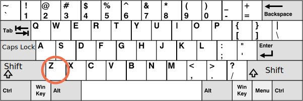

# Клавіатура: keydown та keyup

Перш ніж ми перейдемо до клавіатури, зверніть увагу, що на сучасних пристроях є й інші способи "щось ввести". Наприклад, люди використовують розпізнавання мовлення (особливо на мобільних пристроях) або копіюють/вставляють за допомогою миші.

Тож якщо ми хочемо відстежувати будь-яке введення даних у поле `<input>`, то подій клавіатури недостатньо. Існує ще одна подія під назвою `input` для відстеження змін у полі `<input>` будь-яким способом. І це може бути кращим рішенням такого завдання. Ми розглянемо цю подію пізніше в розділі <info:events-change-input>.

Події клавіатури слід використовувати, коли ми хочемо обробляти дії клавіатури (віртуальна клавіатура також враховується). Наприклад, щоб реагувати на клавіші зі стрілками `key:Up` та `key:Down` або гарячі клавіші (включаючи комбінації клавіш).


## Тестовий стенд [#keyboard-test-stand]

```offline
Щоб краще зрозуміти події клавіатури, ви можете скористатися [тестовим стендом](sandbox:keyboard-dump).
```

```online
Щоб краще зрозуміти події на клавіатурі, ви можете використовувати тестовий стенд, наведений нижче.

Спробуйте різні комбінації клавіш у текстовому полі.

[codetabs src="keyboard-dump" height=480]
```


## Keydown та keyup

Події `keydown` відбуваються, коли клавішу натискають, а потім `keyup`, коли її відпускають.

### event.code та event.key

Властивість `key` об’єкта події дозволяє отримати символ, а властивість `code` об’єкта події дозволяє отримати "фізичний код клавіші".

Наприклад, ту саму клавішу `key:Z` можна натискати з або без клавіші `key:Shift`. Це дає нам два різних символи: малий `z` і великий `Z`.

`event.key` -- це саме символ, і він може бути різним. Але `event.code` однаковий:

| Клавіша          | `event.key` | `event.code` |
|--------------|-------------|--------------|
| `key:Z`      |`z` (нижній регістр)         |`KeyZ`        |
| `key:Shift+Z`|`Z` (верхній регістр)          |`KeyZ`        |


Якщо користувач працює з різними мовами, то при перемиканні на іншу мову замість `"Z"` буде зовсім інший символ. Він стане значенням `event.key`, тоді як `event.code` буде завжди однаковим: `"KeyZ"`.

```smart header="\"KeyZ\" та інші коди клавіш"
Кожна клавіша має код, який залежить від її розташування на клавіатурі. Ключові коди, описані в [Специфікації коду UI подій](https://www.w3.org/TR/uievents-code/).

Наприклад:
- Клавіші літер мають коди `"Key<літера>"`: `"KeyA"`, `"KeyB"` і т.д.
- Цифрові клавіші мають коди: `"Digit<цифра>"`: `"Digit0"`, `"Digit1"` і т.д.
- Спеціальні клавіші кодуються своїми назвами: `"Enter"`, `"Backspace"`, `"Tab"` тощо.

Існує кілька поширених розкладок клавіатури, і специфікація містить коди клавіш для кожної з них.

Прочитайте [алфавітно-цифровий розділ специфікації](https://www.w3.org/TR/uievents-code/#key-alphanumeric-section), щоб отримати додаткові коди, або просто натисніть клавішу на [тестовому стенді](#keyboard-test-stand) вище.
```

```warn header="Регістр має значення: `\"KeyZ\"`, а не `\"keyZ\"`"
Здається очевидним, але більшість все одно припускається помилок.

Будь ласка, уникайте помилок: це `KeyZ`, а не `keyZ`. Перевірка на кшталт `event.code=="keyZ"` не працюватиме: перша літера `"Key"` має бути у верхньому регістрі.
```

Що робити, якщо клавіша не дає жодного символу? Наприклад, `key:Shift` або `key:F1` або інші. Для цих клавіш `event.key` приблизно такий самий, як `event.code`:

| Клавіша          | `event.key` | `event.code` |
|--------------|-------------|--------------|
| `key:F1`      |`F1`          |`F1`        |
| `key:Backspace`      |`Backspace`          |`Backspace`        |
| `key:Shift`|`Shift`          |`ShiftRight` або `ShiftLeft`        |

Зверніть увагу, що `event.code` точно визначає, яка клавіша натиснута. Наприклад, більшість клавіатур мають дві клавіші `key:Shift`: ліворуч і праворуч. `event.code` говорить нам, яка саме була натиснута, а `event.key` відповідає за "значення" клавіші: яка це саме клавіша (це "Shift").

Скажімо, ми хочемо обробити гарячу клавішу: `key:Ctrl+Z` (або `key:Cmd+Z` для Mac). Більшість текстових редакторів підключають до неї дію "Скасувати". Ми можемо встановити прослуховувач на `keydown` і перевірити, яка клавіша натиснута.

Тут виникає дилема: у такому прослуховуванні ми перевіряємо значення `event.key` або `event.code`?

З одного боку, значення `event.key` є символом, воно змінюється залежно від мови. Якщо відвідувач має кілька мов в ОС і перемикається між ними, одна і та ж клавіша дає різні символи. Тому має сенс перевірити `event.code`, він завжди однаковий.

Ось таким чином:

```js run
document.addEventListener('keydown', function(event) {
  if (event.code == 'KeyZ' && (event.ctrlKey || event.metaKey)) {
    alert('Скасувати!')
  }
});
```

З іншого боку, є проблема з `event.code`. Для різних розкладок клавіатури одна і та ж клавіша може мати різні символи.

Наприклад, ось розкладка США ("QWERTY") і німецька ("QWERTZ") під нею (з Вікіпедії):




Для тієї ж клавіші американська розкладка має "Z", а німецька — "Y" (букви змінюються місцями).

Без перебільшень, `event.code` буде дорівнювати `KeyZ` для людей з німецькою розкладкою, коли вони натиснуть `key:Y`.

Якщо ми перевіримо `event.code == 'KeyZ'` у нашому коді, то для людей з німецькою розкладкою такий тест пройде, коли вони натиснуть `key:Y`.

Звучить дуже дивно, але так і є. У [специфікації](https://www.w3.org/TR/uievents-code/#table-key-code-alphanumeric-writing-system) чітко згадується така поведінка.

Отже, `event.code` може збігатися з неправильним символом для неочікуваної розкладки. Одні й ті самі букви в різних розкладках можуть зіставлятися з різними фізичними клавішами, що призводить до різних кодів. На щастя, це відбувається лише з кількома кодами, напр. `keyA`, `keyQ`, `keyZ` (як ми бачили), і не відбувається зі спеціальними клавішами, такими як `Shift`. Список можна знайти в [специфікації](https://www.w3.org/TR/uievents-code/#table-key-code-alphanumeric-writing-system).

Для надійного відстеження символів, що залежать від розкладки, `event.key` може бути кращим рішенням.

<<<<<<< HEAD
З іншого боку, `event.code` має перевагу, так як залишається завжди однаковим, прив’язаним до місця розташування фізичної клавіші, навіть якщо відвідувач змінює мови. Тому гарячі клавіші, які покладаються на нього, працюють добре навіть у разі перемикання мови.
=======
On the other hand, `event.code` has the benefit of staying always the same, bound to the physical key location. So hotkeys that rely on it work well even in case of a language switch.
>>>>>>> 29216730a877be28d0a75a459676db6e7f5c4834

Чи хочемо ми обробляти клавіші, що залежать від розкладки? Тоді `event.key` -- це вихід.

Або ми хочемо, щоб гаряча клавіша працювала навіть після зміни мови? Тоді `event.code` може бути кращим рішенням.

## Автоповтор

Якщо клавіша натискається досить довго, вона починає автоматично повторюватися: `keydown` запускається знову і знову, а потім, коли вона відпускається, ми нарешті отримуємо `keyup`. Таким чином, це нормально мати багато `keydown` і один `keyup`.

Для подій, ініційованих автоповтором, об’єкт події має властивість `event.repeat`, встановлену на `true`.


## Типові дії

Типові дії можуть бути різними, оскільки існує багато можливих речей, які можуть бути ініційовані клавіатурою.

Наприклад:

- На екрані з’являється символ (найбільш очевидний результат).
- Символ видалено (`key:Delete` клавіша).
- Сторінка прокручується (`key:PageDown` клавіша).
- Браузер відкриває діалогове вікно "Зберегти сторінку". (`key:Ctrl+S`)
-  ...і так далі.

Запобігання типовій дії на `keydown` може скасувати більшість з них, за винятком спеціальних клавіш на основі ОС. Наприклад, у Windows `key:Alt+F4` закриває поточне вікно браузера. І немає способу зупинити це, запобігаючи типовій дії у JavaScript.

Наприклад, `<input>` нижче очікує номер телефону, тому він не приймає клавіші, крім цифр, `+`, `()` або `-`:

```html autorun height=60 run
<script>
function checkPhoneKey(key) {
  return (key >= '0' && key <= '9') || ['+','(',')','-'].includes(key);
}
</script>
<input *!*onkeydown="return checkPhoneKey(event.key)"*/!* placeholder="Номер телефону, будь ласка" type="tel">
```

Обробник `onkeydown` використовує тут `checkPhoneKey` для перевірки натиснення клавіші. Якщо вона валідна (від `0..9` або з `+-()`), обробник повертає `true`, інакше `false`.

Як ми знаємо, значення `false`, що повертається з обробника подій та присвоєне за допомогою властивості DOM або атрибута, як-от вище, запобігає типовій дії. Саме тому для клавіш, які не проходять тест, у `<input>` нічого не з’являється. (Повернуте значення `true` ні на що не впливає, має значення лише повернення `false`)

Зверніть увагу, що спеціальні клавіші, такі як `key:Backspace`, `key:Left`, `key:Right`, не працюють у полі для введення. Це побічний ефект суворого фільтра `checkPhoneKey`. Ці клавіші повертають `false`.

Давайте трохи послабимо фільтр, дозволивши клавіші зі стрілками `key:Left`, `key:Right`, `key:Backspace` та `key:Delete`:

```html autorun height=60 run
<script>
function checkPhoneKey(key) {
  return (key >= '0' && key <= '9') ||
    ['+','(',')','-',*!*'ArrowLeft','ArrowRight','Delete','Backspace'*/!*].includes(key);
}
</script>
<input onkeydown="return checkPhoneKey(event.key)" placeholder="Номер телефону, будь ласка" type="tel">
```

Тепер стрілки та видалення працюють добре.

Незважаючи на те, що у нас є фільтр клавіш, все одно можна ввести будь-що за допомогою миші та клацнути правою кнопкою миші + "Вставити". Мобільні пристрої надають інші засоби для введення значень. Тому фільтр не є надійним на 100%.

Альтернативним підходом було б відстежувати подію `oninput` -- вона запускається *після* будь-якої модифікації. Там ми можемо перевірити новий `input.value` та змінити його/виділити `<input>`, якщо він недійсний. Або ми можемо використовувати обидва обробники подій разом.

## Застарілий код

У минулому була подія `keypress`, а також `keyCode`, `charCode`, `which` властивості об’єкта події.

Під час роботи з ними було так багато несумісностей у браузерах, що у розробників специфікації не було іншого виходу, окрім як відмовитися від усіх них і створити нові, сучасні події (описані вище в цьому розділі). Старий код все ще працює, оскільки браузери продовжують підтримувати його, але більше немає потреби використовувати його.

## Мобільні клавіатури

Під час використання віртуальних/мобільних клавіатур, офіційно відомих як IME (Input-Method Editor), стандарт W3C стверджує, що у події клавіатури [`e.keyCode` має бути `229`](https://www.w3.org/TR/uievents/#determine-keydown-keyup-keyCode), а [`e.key` має бути `"Unidentified"`](https://www.w3.org/TR/uievents-key/#key-attr-values).

Хоча деякі з цих клавіатур все ще можуть використовувати правильні значення для `e.key`, `e.code`, `e.keyCode`... під час натискання певних клавіш, таких як стрілки або видалення, немає гарантії, тому ваша логіка клавіатури може не завжди працювати на мобільних пристроях.

## Підсумки

Натискання клавіші завжди генерує подію на клавіатурі, будь то клавіші-символи або спеціальні клавіші, як-от `key:Shift` або `key:Ctrl` тощо. Єдиним винятком є клавіша `key:Fn`, яка іноді зустрічається на клавіатурі ноутбука. Для неї немає жодних подій клавіатури, оскільки вони часто реалізуються на нижчому рівні, ніж ОС.

Події клавіатури:

- `keydown` -- при натисканні клавіші (автоматично повторюється, якщо клавіша довго утримується),
- `keyup` -- при відпусканні клавіші.

Основні властивості подій клавіатури:

- `code` -- "код клавіші" (`"KeyA"`, `"ArrowLeft"` і так далі), специфічний для фізичного розташування клавіші на клавіатурі.
- `key` -- символ (`"A"`, `"a"` і так далі), для несимвольних ключів, таких як `key:Esc`, зазвичай має те саме значення, що і `code`.

У минулому події клавіатури іноді використовувалися для відстеження даних, які користувач ввів у поля форми. Це ненадійно, оскільки вхідні дані можуть надходити з різних джерел. У нас є події `input` та `change` для обробки будь-якого введення (розглянуто далі в розділі <info:events-change-input>). Вони запускаються після будь-якого типу введення, включаючи копіювання або розпізнавання мовлення.

Ми повинні використовувати події клавіатури, коли нам дійсно потрібна клавіатура. Наприклад, реагувати на гарячі або спеціальні клавіші.
