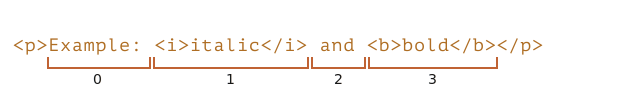

libs:
  - d3
  - domtree

---

# Selection і Range

У цьому розділі ми розглянемо виділення у документі та в полях форми, наприклад, в `<input>`.

JavaScript може отримати доступ до наявного виділення тексту, вибирати/скасовувати виділення вузлів DOM повністю або частково, видаляти виділений вміст із документа, або обгорнути його в тег тощо.

В кінці розділу ми підготували кілька готових рішень для типових задач (розділ "Підсумки"). Цілком можливо, цього буде достатньо щоб задовольнити всі ваші поточні потреби, проте ви отримаєте набагато більше, якщо прочитаєте статтю повністю.

З об’єктами `Range` та `Selection` можна розібратись досить легко, і тоді вам не знадобляться готові рішення для розв'язання задач.

## Range

Основою виділення є [Range](https://dom.spec.whatwg.org/#ranges), який по своїй суті є парою "граничних точок": початком і кінцем діапазону.

Об'єкт `Range`(діапазон) створюється без параметрів:

```js
let range = new Range();
```

Далі ми можемо встановити межі виділення за допомогою `range.setStart(node, offset)` і `range.setEnd(node, offset)`.

Як ви могли здогадатися, ми будемо використовувати об’єкти `Range` для виділення, але спочатку давайте створимо декілька таких об’єктів.

### Часткове виділення тексту

Цікаво те, що перший аргумент `node` в обох методах може бути або текстовим вузлом, або вузлом елементом, і від цього залежить значення другого аргументу.

**Якщо `node` -- це текстовий вузол, то `offset` має бути позицією в його тексті.**

Наприклад, в елементі `<p>Hello</p>`, ми можемо створити діапазон, що містить літери "ll" таким чином:

```html run
<p id="p">Hello</p>
<script>
  let range = new Range();
  range.setStart(p.firstChild, 2);
  range.setEnd(p.firstChild, 4);
  
  // toString діапазону повертає його вміст як текст
  console.log(range); // ll
</script>
```

Тут ми беремо перший дочірній елемент всередині `<p>` (це текстовий вузол) і вказуємо позиції в тексті для виділення:


### Виділення вузлів елементів

**Проте, якщо `node` є вузлом елементом, тоді `offset` має бути номером дочірнього елементу.** 

Це зручно для створення діапазонів, які містять вузли в цілому, а не зупиняються десь усередині їхнього тексту.

Наприклад, маємо більш складний фрагмент документу:

```html autorun
<p id="p">Example: <i>italic</i> and <b>bold</b></p>
```

Ось його структура DOM з вузлами елементами та текстовими вузлами:

<div class="select-p-domtree"></div>

<script>
let selectPDomtree = {
  "name": "P",
  "nodeType": 1,
  "children": [{
    "name": "#text",
    "nodeType": 3,
    "content": "Example: "
  }, {
    "name": "I",
    "nodeType": 1,
    "children": [{
      "name": "#text",
      "nodeType": 3,
      "content": "italic"
    }]
  }, {
    "name": "#text",
    "nodeType": 3,
    "content": " and "
  }, {
    "name": "B",
    "nodeType": 1,
    "children": [{
      "name": "#text",
      "nodeType": 3,
      "content": "bold"
    }]
  }]
}

drawHtmlTree(selectPDomtree, 'div.select-p-domtree', 690, 320);
</script>

Зробимо діапазон для `"Example: <i>italic</i>"`.

Як ми бачимо, ця фраза складається рівно з двох нащадків `<p>` з індексами `0` і `1`:



- Початкова точка має `<p>` як батьківський `node` і `0` як `offset`.

    Тому ми можемо встановити його як `range.setStart(p, 0)`.
- Кінцева точка також має `<p>` як батьківський `node`, але `2` як `offset` (вона вказує діапазон до, але не включаючи `offset`).

    Тому ми можемо встановити його як `range.setEnd(p, 2)`.

Нижче ми підготували приклад з демонстрацією. Якщо ви запустите його, то текст буде виділено:

```html run
<p id="p">Example: <i>italic</i> and <b>bold</b></p>

<script>
*!*
  let range = new Range();

  range.setStart(p, 0);
  range.setEnd(p, 2);
*/!*

  // toString діапазону повертає його вміст у вигляді тексту без тегів
  console.log(range); // Example: italic

  // застосуємо цей діапазон для виділення в document (пояснюється нижче)
  document.getSelection().addRange(range);
</script>
```

Ось гнучкіший тестовий приклад, де ви можете встановити початкові/кінцеві точки діапазону та дослідити інші варіанти:

```html run autorun
<p id="p">Example: <i>italic</i> and <b>bold</b></p>

From <input id="start" type="number" value=1> – To <input id="end" type="number" value=4>
<button id="button">Click to select</button>
<script>
  button.onclick = () => {
  *!*
    let range = new Range();

    range.setStart(p, start.value);
    range.setEnd(p, end.value);
  */!*

    // застосувати виділення, поясненюється нижче
    document.getSelection().removeAllRanges();
    document.getSelection().addRange(range);
  };
</script>
```

Наприклад, виділення у тому самому `<p>` від `offset` `1` до `4` дає нам діапазон `<i>italic</i> і <b>bold</b>`:


```smart header="Початковий і кінцевий вузли можуть бути різними"
Нам не потрібно використовувати однаковий вузол у `setStart` і `setEnd`. Діапазон може охоплювати багато непов’язаних вузлів. Важливо лише, щоб кінець був розташований в документі після початку.
```

### Виділення більшого фрагмента

Давайте збільшемо розмір виділеного фрагмента:


Ми вже знаємо, як це зробити. Нам просто потрібно встановити початок і кінець як відносне зміщення в текстових вузлах.

Нам потрібно створити діапазон, який:
- починається з позиції 2 у першому дочірньому вузлі елемента `<p>` (беручи всі, крім двох перших літер "Ex<b>ample:</b> ")
- закінчується на позиції 3 у `<b>` в першому дочірньому вузлі (бере перші три літери "<b>bol</b>d", але не більше):

```html run
<p id="p">Example: <i>italic</i> and <b>bold</b></p>

<script>
  let range = new Range();

  range.setStart(p.firstChild, 2);
  range.setEnd(p.querySelector('b').firstChild, 3);

  console.log(range); // ample: italic and bol

  // застосуємо цей діапазон для виділення в document (пояснюється нижче)
  window.getSelection().addRange(range);
</script>
```

Як бачите, досить легко створити діапазон для будь-чого.

Ба більше, якщо ми хочемо взяти вузли як ціле, треба передати елементи замість текстових вузлів в `setStart/setEnd`. Інакше це буде працювати на рівні тексту.

## Властивості Range 

Об’єкт діапазону, який ми використовували у прикладі вище, має такі властивості:


- `startContainer`, `startOffset` -- node і offset початку,
  - у наведеному вище прикладі: перший текстовий вузол всередині `<p>` і `2`.
- `endContainer`, `endOffset` -- node і offset кінця,
  - у прикладі вище: перший текстовий вузол всередині `<b>` і `3`.
- `collapsed` -- значення логічного типу, `true` якщо діапазон починається і закінчується в одній точці (тому всередині діапазону немає вмісту),
  - у прикладі вище: `false`
- `commonAncestorContainer` -- найближчий спільний предок усіх вузлів у діапазоні,
  - у прикладі вище: `<p>`


## Методи виділення в Range

Існує багато зручних методів по роботі з діапазонами.

Ми вже бачили `setStart` і `setEnd`, ось інші подібні методи.

Встановити початок діапазону:

- `setStart(node, offset)` встановити початок у: позиції `offset` в `node`
- `setStartBefore(node)` встановити початок: безпосередньо перед `node`
- `setStartAfter(node)` встановити початок: відразу після `node`

Встановити кінець діапазону (подібні методи):

- `setEnd(node, offset)` встановити кінець у: позиції `offset` в `node`
- `setEndBefore(node)` встановити кінець: безпосередньо перед `node`
- `setEndAfter(node)` встановити кінець: одразу після `node`

Технічно `setStart/setEnd` можуть робити що завгодно, але більше методів забезпечують більшу зручність.

У всіх цих методах `node` може бути як текстовим, так і вузлом елементом: для текстових вузлів `offset` пропускає таку кількість символів, тоді як для вузлів елементів стільки ж дочірніх вузлів.

Ще більше методів створення діапазонів:
- `selectNode(node)` встановити діапазон для виділення всього `node`
- `selectNodeContents(node)` встановити діапазон для виділення всього вмісту `node`
- `collapse(toStart)` якщо `toStart=true` встановити кінець=початок, інакше встановити початок=кінець, таким чином згорнувши діапазон
- `cloneRange()` створює новий діапазон із тим самим початком/кінцем

## Методи редагування Range

Після створення діапазону ми можемо маніпулювати його вмістом за допомогою таких методів:

- `deleteContents()` -- видалити вміст діапазону з документа
- `extractContents()` -- видалити вміст діапазону з документа та повернути як [DocumentFragment](info:modifying-document#document-fragment)
- `cloneContents()` -- клонувати вміст діапазону та повернути як [DocumentFragment](info:modifying-document#document-fragment)
- `insertNode(node)` -- вставити `node` в документ на початку діапазону
- `surroundContents(node)` -- обернути `node` навколо вмісту діапазону. Щоб це працювало, діапазон має містити відкриваючі та закриваючі теги для всіх елементів у ньому: жодних часткових діапазонів, як-от `<i>abc`.

За допомогою цих методів ми можемо робити що завгодно з виділенними вузлами.

Ось тестовий приклад, щоб побачити їх у дії:

```html run refresh autorun height=260
Натисніть кнопки, щоб запустити методи для виділення, "resetExample", щоб скинути його.

<p id="p">Example: <i>italic</i> and <b>bold</b></p>

<p id="result"></p>
<script>
  let range = new Range();

  // Кожен продемонстрований метод представлений тут:
  let methods = {
    deleteContents() {
      range.deleteContents()
    },
    extractContents() {
      let content = range.extractContents();
      result.innerHTML = "";
      result.append("extracted: ", content);
    },
    cloneContents() {
      let content = range.cloneContents();
      result.innerHTML = "";
      result.append("cloned: ", content);
    },
    insertNode() {
      let newNode = document.createElement('u');
      newNode.innerHTML = "NEW NODE";
      range.insertNode(newNode);
    },
    surroundContents() {
      let newNode = document.createElement('u');
      try {
        range.surroundContents(newNode);
      } catch(e) { console.log(e) }
    },
    resetExample() {
      p.innerHTML = `Example: <i>italic</i> and <b>bold</b>`;
      result.innerHTML = "";

      range.setStart(p.firstChild, 2);
      range.setEnd(p.querySelector('b').firstChild, 3);

      window.getSelection().removeAllRanges();  
      window.getSelection().addRange(range);  
    }
  };

  for(let method in methods) {
    document.write(`<div><button onclick="methods.${method}()">${method}</button></div>`);
  }

  methods.resetExample();
</script>
```

Існують також методи порівняння діапазонів, але вони використовуються рідко. Коли вони вам знадобляться, ви можете з ними познайомитись ось тут [spec](https://dom.spec.whatwg.org/#interface-range), або тут [MDN manual](mdn:/api/Range).


## Selection

`Range` -- це загальний об'єкт для керування діапазонами виділення. Хоча створення `Range` не означає, що ми бачимо виділення на екрані.

Ми можемо створювати об’єкти `Range`, передавати їх -- вони самі по собі нічого візуально не виділяють.

Виділення в документі представлено об’єктом `Selection`, який можна отримати як `window.getSelection()` або `document.getSelection()`. Виділення може містити нуль або більше діапазонів. Принаймні, [Selection API specification](https://www.w3.org/TR/selection-api/) каже саме так. Однак на практиці лише Firefox дозволяє вибирати кілька діапазонів у документі за допомогою `key:Ctrl+click` (`key:Cmd+click` для Mac).

Ось скріншот виділення з 3-ьома діапазонами, зроблений у Firefox:


Інші браузери підтримують максимум 1 діапазон. Як ми побачимо, деякі з методів `Selection` означають, що може бути багато діапазонів, але знову ж таки, у всіх браузерах, крім Firefox, їх не більше 1.

Ось невеликий приклад, який показує поточне виділення (виділіть щось і натисніть) як текст:

<button onclick="alert(document.getSelection())">alert(document.getSelection())</button>

## Властивості Selection

Як було сказано, об'єкт `Selection` теоретично може містити кілька діапазонів. Ми можемо отримати ці діапазони за допомогою методу:

- `getRangeAt(i)` -- отримати i-й діапазон, починаючи з `0`. У всіх браузерах, крім Firefox, використовується лише `0`.

Крім того, існують зручніші властивості.

Подібно до діапазону, об’єкт виділення має початок, який називається "anchor", і кінець, який називається "focus".

Основними властивостями `Selection` є:

- `anchorNode` -- вузол, де починається виділення,
- `anchorOffset` -- зміщення в `anchorNode`, де починається виділення,
- `focusNode` -- вузол, де закінчується виділення,
- `focusOffset` -- зсув у `focusNode`, де закінчується виділення,
- `isCollapsed` -- `true` якщо нічого не виділено (порожній діапазон) або не існує.
- `rangeCount` -- кількість діапазонів у виділенні, максимум `1` у всіх браузерах, крім Firefox.

```smart header="Selection кінець/початок у порівнянні з Range"

<<<<<<< HEAD
Існують важливі відмінності `Selection` anchor/focus порівняно з `Range` start/end.
=======
There's an important difference between a selection anchor/focus compared with a `Range` start/end.
>>>>>>> 51bc6d3cdc16b6eb79cb88820a58c4f037f3bf19

Як ми знаємо, об’єкти `Range` завжди мають початок(start) перед кінцем(end).

Для `Selection` це не завжди так.

Виділяти щось за допомогою миші можна в обох напрямках: або "зліва направо", або "справа наліво".

Іншими словами, коли кнопку миші натиснуто, а потім вона переміщується вперед у документі, то її кінець (focus) буде після її початку (anchor).

Наприклад якщо користувач починає виділяти мишею та переходить від "Example" до "italic":


...Але те саме виділення можна зробити і в зворотному напрямку: починаючи від "italic" до "Example" (напрямок назад), тоді його кінець (focus) буде перед початком (anchor):


```

## Події Selection

Існують події, щоб слідкувати за виділенням:

- `elem.onselectstart` -- коли виділення *починається* саме на елементі `elem` (або всередині нього). Наприклад, коли користувач натискає на ньому кнопку миші та починає рухати вказівник.
    - Запобігання типової дії скасовує початок виділення. Таким чином, почати виділення з цього елемента стає неможливо, але елемент все ще доступний для виділення загалом. Користувачу просто потрібно почати виділення з іншого місця.
- `document.onselectionchange` -- кожного разу, коли виділення змінюється або починається.
    - Зверніть увагу: цей обробник можна встановити лише на `document`, він відстежує всі виділення в ньому.

### Приклад з відстеженням Selection

Ось невелика демонстрація, яка показує поточний вибір та його межі у `document`:

```html run height=80
<p id="p">Select me: <i>italic</i> and <b>bold</b></p>

From <input id="from" disabled> – To <input id="to" disabled>
<script>
  document.onselectionchange = function() {
    let selection = document.getSelection();

    let {anchorNode, anchorOffset, focusNode, focusOffset} = selection;

    // anchorNode і focusNode зазвичай є текстовими вузлами
    from.value = `${anchorNode?.data}, offset ${anchorOffset}`;
    to.value = `${focusNode?.data}, offset ${focusOffset}`;
  };
</script>
```

### Виділення з копіюванням

Є два підходи до копіювання виділенного вмісту:

1. Ми можемо використати `document.getSelection().toString()`, щоб отримати його як текст.
2. В іншому випадку, щоб скопіювати повний DOM, напр. якщо нам потрібно продовжити форматування, ми можемо отримати виділенні діапазони за допомогою `getRangeAt(...)`. Об’єкт `Range`, у свою чергу, має метод `cloneContents()`, який клонує його вміст і повертає як об’єкт `DocumentFragment`, який ми можемо вставити в інше місце.

Ось приклад копіювання виділеного вмісту як тексту і як вузлів DOM:

```html run height=100
<p id="p">Select me: <i>italic</i> and <b>bold</b></p>

Cloned: <span id="cloned"></span>
<br>
As text: <span id="astext"></span>

<script>
  document.onselectionchange = function() {
    let selection = document.getSelection();

    cloned.innerHTML = astext.innerHTML = "";

    // Клонувати вузли DOM із діапазонів (тут ми підтримуємо множинне виділення)
    for (let i = 0; i < selection.rangeCount; i++) {
      cloned.append(selection.getRangeAt(i).cloneContents());
    }

    // Отримати як текст
    astext.innerHTML += selection;
  };
</script>
```

## Методи Selection

Ми можемо працювати з виділенням, додаючи/вилучаючи діапазони:

- `getRangeAt(i)` -- отримати i-й діапазон, починаючи з `0`. У всіх браузерах, крім Firefox, використовується лише `0`.
- `addRange(range)` -- додати `range` до виділення. Усі браузери, крім Firefox, ігнорують виклик, якщо у виділенні вже є діапазон.
- `removeRange(range)` -- видалити `range` з виділення.
- `removeAllRanges()` -- видалити всі діапазони.
- `empty()` -- метод аналогічний `removeAllRanges`.

Існують також зручні методи для безпосереднього керування діапазоном вибору без проміжних викликів `Range`:

- `collapse(node, offset)` -- замінити діапазон виділення на новий, який починається і закінчується на заданому `node`, на позиції `offset`.
- `setPosition(node, offset)` -- метод аналогічний `collapse`.
- `collapseToStart()` -- згорнути (замінити порожнім діапазоном) до початку виділення,
- `collapseToEnd()` -- згорнути до кінця виділення,
- `extend(node, offset)` -- перемістити фокус виділення на заданий `node`, положення `offset`,
- `setBaseAndExtent(anchorNode, anchorOffset, focusNode, focusOffset)` -- замінити діапазон виділення заданим початковим `anchorNode/anchorOffset` і кінцевим `focusNode/focusOffset`. Весь вміст між ними буде виділено.
- `selectAllChildren(node)` -- виділити всі дочірні елементи `node`.
- `deleteFromDocument()` -- видалити виділений вміст із документа.
- `containsNode(node, allowPartialContainment = false)` -- перевіряє, чи містить виділення заданий `node` (або частково, якщо другий аргумент `true`)

Для більшості завдань ці методи чудово підходять, немає необхідності звертатися до базового об’єкта `Range`.

Наприклад, виділення всього вмісту абзацу `<p>`:

```html run
<p id="p">Select me: <i>italic</i> and <b>bold</b></p>

<script>
  // виділити від 0-го дочірнього елемента <p> до останнього дочірнього
  document.getSelection().setBaseAndExtent(p, 0, p, p.childNodes.length);
</script>
```

Те саме з використанням діапазонів:

```html run
<p id="p">Select me: <i>italic</i> and <b>bold</b></p>

<script>
  let range = new Range();
  range.selectNodeContents(p); // або selectNode(p), щоб також виділити тег <p>

  document.getSelection().removeAllRanges(); // скинути наявне виділення, якщо воно є
  document.getSelection().addRange(range);
</script>
```

```smart header="Щоб зробити нове виділення, спочатку приберіть поточне"
Якщо вже щось виділене, спочатку приберіть це за допомогою `removeAllRanges()`. А потім додавайте діапазони. В іншому випадку всі браузери, крім Firefox, ігнорують нові діапазони.

Виняток становлять деякі методи, які замінюють існуюче виділення, наприклад `setBaseAndExtent`.
```

## Виділення в інтерактивних елементах форми

Такі елементи форми, як `input` і `textarea`, надають [спеціальний API для виділення](https://html.spec.whatwg.org/#textFieldSelection) без об’єктів `Selection` або `Range`. Ба більше, оскільки на вході завжди чистий текст, а не HTML, такі об’єкти просто не потрібні, все працює значно простіше.

Властивості:
- `input.selectionStart` -- позиція початку виділення (працює на запис),
- `input.selectionEnd` -- позиція кінця виділення (працює на запис),
- `input.selectionDirection` -- напрямок виділення, одне з: "forward", "backward" або "none" (якщо напр. виділено подвійним клацанням миші),

Події:
- `input.onselect` -- запускається, коли щось виділено.

Методи:

- `input.select()` -- виділяє все в текстовому елементі (може бути `textarea` замість `input`),
- `input.setSelectionRange(start, end, [direction])` -- змінити виділення на діапазон від позиції `start` до `end` у вказаному `direction` (необов’язковий параметер).
- `input.setRangeText(replacement, [start], [end], [selectionMode])` -- замінити діапазон тексту новим текстом.

    Необов’язкові аргументи `start` і `end`, якщо вони надані, встановлюють початок і кінець діапазону, інакше використовується виділення від користувача.

    Останній аргумент, `selectionMode`, визначає, як буде встановлено виділення після заміни тексту. Можливі значення:

    - `"select"` -- буде виділено щойно вставлений текст.
    - `"start"` -- діапазон виділення згортається безпосередньо перед вставленим текстом (курсор буде перед ним).
    - `"end"` -- діапазон виділення згортається відразу після вставленого тексту (курсор буде відразу за ним).
    - `"preserve"` -- спробує зберегти виділення. Це типове значення.

Тепер давайте подивимося на ці методи в дії.

### Приклад: відстеження виділення

Наприклад, цей код використовує подію `onselect` для відстеження виділення:

```html run autorun
<textarea id="area" style="width:80%;height:60px">
Selecting in this text updates values below.
</textarea>
<br>
From <input id="from" disabled> – To <input id="to" disabled>

<script>
  area.onselect = function() {
    from.value = area.selectionStart;
    to.value = area.selectionEnd;
  };
</script>
```

Будь ласка, зверніть увагу:
- `onselect` спрацьовує, коли щось виділено, але не коли його прибрано.
- подія `document.onselectionchange` відповідно до [spec](https://w3c.github.io/selection-api/#dfn-selectionchange) не має ініціювати виділення всередині елемента форми, оскільки вона не пов’язана з виділенням і діапазонами в `document`. Деякі браузери генерують її, але ми не маємо покладатися на це.


### Приклад: рух курсору

Ми можемо змінити `selectionStart` і `selectionEnd`, які встановлюють виділення.

Важливим граничним випадком є ​​коли `selectionStart` і `selectionEnd` дорівнюють один одному. Тоді це точно положення курсора. Або, якщо перефразувати, коли нічого не виділено, виділення згортається в позиції курсора.

Отже, встановивши `selectionStart` і `selectionEnd` однакові значення, ми переміщуємо курсор.

Наприклад:

```html run autorun
<textarea id="area" style="width:80%;height:60px">
Focus on me, the cursor will be at position 10.
</textarea>

<script>
  area.onfocus = () => {
    // setTimeout з нульовою затримкою для запуску після завершення дії "focus"
    setTimeout(() => {
      // ми можемо встановити будь-яке виділення
      // якщо start=end, курсор знаходиться саме в цьому місці
      area.selectionStart = area.selectionEnd = 10;
    });
  };
</script>
```

### Приклад: зміна виділення

Щоб змінити вміст виділення, ми можемо використати метод `input.setRangeText()`. Звичайно, ми можемо взяти `selectionStart/End` і, знаючи виділення, змінити відповідний підрядок `value`, але метод `setRangeText` є потужнішим і часто зручнішим.

Проте це дещо складний метод. У своїй найпростішій формі з одним аргументом він замінює виділений користувачем діапазон і видаляє виділення.

Наприклад, тут виділення від користувача буде обгорнуто в `*...*`:

```html run autorun
<input id="input" style="width:200px" value="Select here and click the button">
<button id="button">Wrap selection in stars *...*</button>

<script>
button.onclick = () => {
  if (input.selectionStart == input.selectionEnd) {
    return; // нічого не виділено
  }

  let selected = input.value.slice(input.selectionStart, input.selectionEnd);
  input.setRangeText(`*${selected}*`);
};
</script>
```

Маючи більше аргументів, ми можемо встановити діапазон `start` і `end`.

У цьому прикладі ми знаходимо `"THIS"` у вхідному тексті, замінюємо його та залишаємо виділеною заміну:

```html run autorun
<input id="input" style="width:200px" value="Replace THIS in text">
<button id="button">Replace THIS</button>

<script>
button.onclick = () => {
  let pos = input.value.indexOf("THIS");
  if (pos >= 0) {
    input.setRangeText("*THIS*", pos, pos + 4, "select");
    input.focus(); // фокус, щоб зробити виділення видимим
  }
};
</script>
```

### Приклад: вставити під курсор

Якщо нічого не виділено або ми використовуємо однакові `start` і `end` у `setRangeText`, тоді новий текст просто вставляється, нічого не видаляється.

Ми також можемо вставити щось "за курсором", використовуючи `setRangeText`.

Ось кнопка, яка вставляє `"HELLO"` на позицію курсора та розміщує курсор одразу після нього. Якщо виділення не порожнє, воно замінюється (ми можемо виявити це, порівнявши `selectionStart!=selectionEnd` і натомість зробити щось інше):

```html run autorun
<input id="input" style="width:200px" value="Text Text Text Text Text">
<button id="button">Insert "HELLO" at cursor</button>

<script>
  button.onclick = () => {
    input.setRangeText("HELLO", input.selectionStart, input.selectionEnd, "end");
    input.focus();
  };    
</script>
```


## Заборона виділення

Щоб заборонити виділення, є три способи:

1. Задайте CSS властивість `user-select: none`.

    ```html run
    <style>
    #elem {
      user-select: none;
    }
    </style>
    <div>Selectable <div id="elem">Unselectable</div> Selectable</div>
    ```

    Це не дозволяє виділенню починатися з `elem`. Але користувач може почати з іншого місця і вже потім включити до нього `elem`.

    Тоді `elem` стане частиною `document.getSelection()`, тому виділення фактично відбувається, але його вміст зазвичай ігнорується під час копіювання та вставки.


2. Запобігання типової дії для подій `onselectstart` або `mousedown`.

    ```html run
    <div>Selectable <div id="elem">Unselectable</div> Selectable</div>

    <script>
      elem.onselectstart = () => false;
    </script>
    ```

    Це запобігає старту виділення з `elem`, але користувач може почати його з іншого елемента, а потім продовжити до `elem`.

    Це зручно, коли для тієї самої дії є інший обробник події, який ініціює виділення (наприклад, `mousedown`). Тому ми забороняємо виділення, щоб уникнути конфлікту, але все ще дозволяємо копіювати вміст `elem`.

3. Ми також можемо очистити виділення постфактум після того, як це вже сталося, за допомогою `document.getSelection().empty()`. Це рідко використовується, оскільки це спричиняє небажане блимання під час появи та зникнення виділення.

## Посилання

- [DOM spec: Range](https://dom.spec.whatwg.org/#ranges)
- [Selection API](https://www.w3.org/TR/selection-api/#dom-globaleventhandlers-onselectstart)
- [HTML spec: APIs for the text control selections](https://html.spec.whatwg.org/multipage/form-control-infrastructure.html#textFieldSelection)


## Підсумки

Ми розглянули два різних API для виділення:

1. Для документа: об’єкти `Selection` і `Range`.
2. Для `input`, `textarea`: додаткові методи та властивості.

Другий API дуже простий, оскільки працює з текстом.

Серед найбільш типових задач:

1. Отримання поточного виділення:
    ```js
    let selection = document.getSelection();

    let cloned = /* елемент для клонування виділенних вузлів */;

    // потім застосуйте методи Range до selection.getRangeAt(0)
    // або, як тут, до всіх діапазонів для підтримки множинного виділення
    for (let i = 0; i < selection.rangeCount; i++) {
      cloned.append(selection.getRangeAt(i).cloneContents());
    }
    ```
2. Налаштування виділення:
    ```js
    let selection = document.getSelection();

    // безпосередньо:
    selection.setBaseAndExtent(...from...to...);

    // або ми можемо створити діапазон і:
    selection.removeAllRanges();
    selection.addRange(range);
    ```

І нарешті про курсор. Позиція курсору в елементах, які можна редагувати, наприклад `<textarea>`, завжди знаходиться на початку або в кінці виділення. Ми можемо використовувати його, щоб отримати позицію курсору або перемістити курсор, встановивши `elem.selectionStart` і `elem.selectionEnd`.
