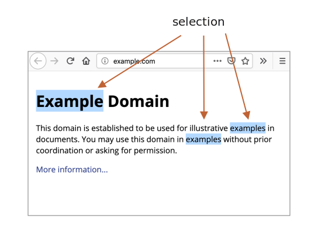

libs:
  - d3
  - domtree

---

# Selection і Range

У цьому розділі ми розглянемо виділення у документі та в полях форми, наприклад, в `<input>`.

JavaScript може отримати доступ до наявного виділення тексту, вибирати/скасовувати виділення вузлів DOM повністю або частково, видаляти вибраний вміст із документа, або обгорнути його в тег тощо.

В кінці розділу ми підготували кілька готових рішень для типових задач (розділ "Підсумки"). Цілком можливо, цього буде достатньо щоб задовольнити всі ваші поточні потреби, проте ви отримаєте набагато більше, якщо прочитаєте статтю повністю.

З об’єктами `Range` та `Selection` можна розібратись досить легко, і тоді вам не знадобляться готові рішення для розв'язання задач.

## Range

Основою виділення є [Range](https://dom.spec.whatwg.org/#ranges), який по своїй суті є парою "граничних точок": початком і кінцем діапазону.

Об'єкт `Range`(діапазон) створюється без параметрів:

```js
let range = new Range();
```

Далі ми можемо встановити межі виділення за допомогою `range.setStart(node, offset)` і `range.setEnd(node, offset)`.

Як ви могли здогадатися, ми будемо використовувати об’єкти `Range` для виділення, але спочатку давайте створимо декілька таких об’єктів.

### Часткове виділення тексту

Цікаво те, що перший аргумент `node` в обох методах може бути або текстовим вузлом, або вузлом елементом, і від цього залежить значення другого аргументу.

**Якщо `node` -- це текстовий вузол, то `offset` має бути позицією в його тексті.**

Наприклад, в елементі `<p>Hello</p>`, ми можемо створити діапазон, що містить літери "ll" таким чином:

```html run
<p id="p">Hello</p>
<script>
  let range = new Range();
  range.setStart(p.firstChild, 2);
  range.setEnd(p.firstChild, 4);
  
  // toString діапазону повертає його вміст як текст
  console.log(range); // ll
</script>
```

Тут ми беремо перший дочірній елемент всередині `<p>` (це текстовий вузол) і вказуємо позиції тексту для виділення:


### Виділення вузлів елементів

**Проте, якщо `node` є вузлом елементом, тоді `offset` має бути номером дочірнього елементу.** 

Це зручно для створення діапазонів, які містять вузли в цілому, а не зупиняються десь усередині їхнього тексту.

Наприклад, маємо більш складний фрагмент документу:

```html autorun
<p id="p">Example: <i>italic</i> and <b>bold</b></p>
```

Ось його структура DOM з елементами та текстовими вузлами:

<div class="select-p-domtree"></div>

<script>
let selectPDomtree = {
  "name": "P",
  "nodeType": 1,
  "children": [{
    "name": "#text",
    "nodeType": 3,
    "content": "Example: "
  }, {
    "name": "I",
    "nodeType": 1,
    "children": [{
      "name": "#text",
      "nodeType": 3,
      "content": "italic"
    }]
  }, {
    "name": "#text",
    "nodeType": 3,
    "content": " and "
  }, {
    "name": "B",
    "nodeType": 1,
    "children": [{
      "name": "#text",
      "nodeType": 3,
      "content": "bold"
    }]
  }]
}

drawHtmlTree(selectPDomtree, 'div.select-p-domtree', 690, 320);
</script>

Зробимо діапазон для `"Example: <i>italic</i>"`.

Як ми бачимо, ця фраза складається рівно з двох нащадків `<p>` з індексами `0` і `1`:


- Початкова точка має `<p>` як батьківський `node` і `0` як `offset`.

    Тому ми можемо встановити його як `range.setStart(p, 0)`.
- Кінцева точка також має `<p>` як батьківський `node`, але `2` як `offset` (вона вказує діапазон до, але не включаючи `offset`).

    Тому ми можемо встановити його як `range.setEnd(p, 2)`.

Ось демо. Якщо ви запустите його, ви побачите, що текст буде виділено:

```html run
<p id="p">Example: <i>italic</i> and <b>bold</b></p>

<script>
*!*
  let range = new Range();

  range.setStart(p, 0);
  range.setEnd(p, 2);
*/!*

  // toString діапазону повертає його вміст у вигляді тексту без тегів
  console.log(range); // Example: italic

  // застосуємо цей діапазон для виділення в document (пояснюється нижче)
  document.getSelection().addRange(range);
</script>
```

Ось гнучкіший тестовий приклад, де ви можете встановити початкові/кінцеві номери діапазону та дослідити інші варіанти:

```html run autorun
<p id="p">Example: <i>italic</i> and <b>bold</b></p>

From <input id="start" type="number" value=1> – To <input id="end" type="number" value=4>
<button id="button">Click to select</button>
<script>
  button.onclick = () => {
  *!*
    let range = new Range();

    range.setStart(p, start.value);
    range.setEnd(p, end.value);
  */!*

    // застосувати виділення, поясненюється нижче
    document.getSelection().removeAllRanges();
    document.getSelection().addRange(range);
  };
</script>
```

Наприклад, виділення у тому самому `<p>` від `offset` `1` до `4` дає нам діапазон `<i>курсив</i> і <b>жирний</b>`:


```smart header="Початковий і кінцевий вузли можуть бути різними"
Нам не потрібно використовувати однаковий вузол у `setStart` і `setEnd`. Діапазон може охоплювати багато непов’язаних вузлів. Важливо лише, щоб кінець був після початку в документі.
```

### Виділення більшого фрагмента

Давайте збільшемо розмір виділеного фрагмента:


Ми вже знаємо, як це зробити. Нам просто потрібно встановити початок і кінець як відносне зміщення в текстових вузлах.

Нам потрібно створити діапазон, який:
- починається з позиції 2 у першому дочірньому вузлі елемента `<p>` (беручи всі, крім двох перших літер "Ex<b>ample:</b> ")
- закінчується на позиції 3 у `<b>` в першому дочірньому вузлі (бере перші три літери "<b>bol</b>d", але не більше):

```html run
<p id="p">Example: <i>italic</i> and <b>bold</b></p>

<script>
  let range = new Range();

  range.setStart(p.firstChild, 2);
  range.setEnd(p.querySelector('b').firstChild, 3);

  console.log(range); // ample: italic and bol

  // застосуємо цей діапазон для виділення в document (пояснюється нижче)
  window.getSelection().addRange(range);
</script>
```

Як бачите, досить легко створити діапазон для будь-чого.

Ба більше, якщо ми хочемо взяти вузли як ціле, треба передати елементи замість текстових вузлів в `setStart/setEnd`. Інакше це буде працювати на рівні тексту.

## Властивості Range 

Об’єкт діапазону, який ми використовували у прикладі вище, має такі властивості:


- `startContainer`, `startOffset` -- node і offset початку,
  - у наведеному вище прикладі: перший текстовий вузол всередині `<p>` і `2`.
- `endContainer`, `endOffset` -- node і offset кінця,
  - у прикладі вище: перший текстовий вузол всередині `<b>` і `3`.
- `collapsed` -- значення логічного типу, `true` якщо діапазон починається і закінчується в одній точці (тому всередині діапазону немає вмісту),
  - у прикладі вище: `false`
- `commonAncestorContainer` -- найближчий спільний предок усіх вузлів у діапазоні,
  - у прикладі вище: `<p>`


## Методи виділення в Range

Існує багато зручних методів по роботі з діапазонами.

Ми вже бачили `setStart` і `setEnd`, ось інші подібні методи.

Встановити початок діапазону:

- `setStart(node, offset)` встановити початок у: позиції `offset` в `node`
- `setStartBefore(node)` встановити початок о: безпосередньо перед `node`
- `setStartAfter(node)` встановити початок о: відразу після `node`

Встановити кінець діапазону (подібні методи):

- `setEnd(node, offset)` встановити кінець у: позиції `offset` в `node`
- `setEndBefore(node)` встановити кінець о: безпосередньо перед `node`
- `setEndAfter(node)` встановити кінець о: одразу після `node`

Технічно `setStart/setEnd` можуть робити що завгодно, але більше методів забезпечують більшу зручність.

У всіх цих методах `node` може бути як текстовим, так і вузлом елементом: для текстових вузлів `offset` пропускає таку кількість символів, тоді як для вузлів елементів стільки ж дочірніх вузлів.

Ще більше методів створення діапазонів:
- `selectNode(node)` встановити діапазон для виділення всього `node`
- `selectNodeContents(node)` встановити діапазон для виділення всього вмісту `node`
- `collapse(toStart)` якщо `toStart=true` встановити кінець=початок, інакше встановити початок=кінець, таким чином згорнувши діапазон
- `cloneRange()` створює новий діапазон із тим самим початком/кінцем

## Методи редагування Range

Після створення діапазону ми можемо маніпулювати його вмістом за допомогою таких методів:

- `deleteContents()` -- видалити вміст діапазону з документа
- `extractContents()` -- видалити вміст діапазону з документа та повернутися як [DocumentFragment](info:modifying-document#document-fragment)
- `cloneContents()` -- клонувати вміст діапазону та повернутися як [DocumentFragment](info:modifying-document#document-fragment)
- `insertNode(node)` -- вставити `node` в документ на початку діапазону
- `surroundContents(node)` -- обернути `node` навколо вмісту діапазону. Щоб це працювало, діапазон має містити відкриваючі та закриваючі теги для всіх елементів у ньому: жодних часткових діапазонів, як-от `<i>abc`.

За допомогою цих методів ми можемо робити що завгодно з виділенними вузлами.

Ось тестовий приклад, щоб побачити їх у дії:

```html run refresh autorun height=260
Натисніть кнопки, щоб запустити методи для виділення, "resetExample", щоб скинути його.

<p id="p">Example: <i>italic</i> and <b>bold</b></p>

<p id="result"></p>
<script>
  let range = new Range();

  // Кожен продемонстрований метод представлений тут:
  let methods = {
    deleteContents() {
      range.deleteContents()
    },
    extractContents() {
      let content = range.extractContents();
      result.innerHTML = "";
      result.append("extracted: ", content);
    },
    cloneContents() {
      let content = range.cloneContents();
      result.innerHTML = "";
      result.append("cloned: ", content);
    },
    insertNode() {
      let newNode = document.createElement('u');
      newNode.innerHTML = "NEW NODE";
      range.insertNode(newNode);
    },
    surroundContents() {
      let newNode = document.createElement('u');
      try {
        range.surroundContents(newNode);
      } catch(e) { console.log(e) }
    },
    resetExample() {
      p.innerHTML = `Example: <i>italic</i> and <b>bold</b>`;
      result.innerHTML = "";

      range.setStart(p.firstChild, 2);
      range.setEnd(p.querySelector('b').firstChild, 3);

      window.getSelection().removeAllRanges();  
      window.getSelection().addRange(range);  
    }
  };

  for(let method in methods) {
    document.write(`<div><button onclick="methods.${method}()">${method}</button></div>`);
  }

  methods.resetExample();
</script>
```

Існують також методи порівняння діапазонів, але вони використовуються рідко. Коли вони вам знадобляться, ви можете з ними познайомитись ось тут [spec](https://dom.spec.whatwg.org/#interface-range), або тут [MDN manual](mdn:/api/Range).


## Selection

`Range` -- це загальний об'єкт для керування діапазонами виділення. Хоча створення `Range` не означає, що ми бачимо виділення на екрані.

Ми можемо створювати об’єкти `Range`, передавати їх -- вони самі по собі нічого візуально не виділяють.

Вибраний документ представлений об’єктом `Selection`, який можна отримати як `window.getSelection()` або `document.getSelection()`. Виділення може містити нуль або більше діапазонів. Принаймні, [Selection API specification](https://www.w3.org/TR/selection-api/) каже саме так. Однак на практиці лише Firefox дозволяє вибирати кілька діапазонів у документі за допомогою `key:Ctrl+click` (`key:Cmd+click` для Mac).

Ось скріншот вибору з 3 діапазонами, зроблений у Firefox:



Інші браузери підтримують максимум 1 діапазон. Як ми побачимо, деякі з методів `Selection` означають, що може бути багато діапазонів, але знову ж таки, у всіх браузерах, крім Firefox, їх не більше 1.

Ось невеликий приклад, який показує поточний вибір (виберіть щось і натисніть) у вигляді тексту:

<button onclick="alert(document.getSelection())">alert(document.getSelection())</button>

## Властивості Selection

Як було сказано, об'єкт `Selection` теоретично може містити кілька діапазонів. Ми можемо отримати ці діапазони за допомогою методу:

- `getRangeAt(i)` -- отримати i-й діапазон, починаючи з `0`. У всіх браузерах, крім Firefox, використовується лише `0`.

Крім того, існують зручніші властивості.

Подібно до діапазону, об’єкт виділення має початок, який називається "anchor", і кінець, який називається "focus".

Основними властивостями `Selection` є:

- `anchorNode` -- вузол, де починається виділення,
- `anchorOffset` -- зміщення в `anchorNode`, де починається виділення,
- `focusNode` -- вузол, де закінчується виділення,
- `focusOffset` -- зсув у `focusNode`, де закінчується виділення,

- `isCollapsed` -- `true` якщо нічого не виділено (порожній діапазон) або не існує.
- `rangeCount` -- кількість діапазонів у виділенні, максимум `1` у всіх браузерах, крім Firefox.

```smart header="Selection end/start vs Range"

There's an important differences of a selection anchor/focus compared with a `Range` start/end.

As we know, `Range` objects always have their start before the end. 

For selections, that's not always the case.

Selecting something with a mouse can be done in both directions: either "left-to-right" or "right-to-left".

In other words, when the mouse button is pressed, and then it moves forward in the document, then its end (focus) will be after its start (anchor).

E.g. if the user starts selecting with mouse and goes from "Example" to "italic":


...But the same selection could be done backwards: starting from  "italic" to "Example" (backward direction), then its end (focus) will be before the start (anchor):


```

## Selection events

There are events on to keep track of selection:

- `elem.onselectstart` -- when a selection *starts* specifically on element `elem` (or inside it). For instance, when the user presses the mouse button on it and starts to move the pointer.
    - Preventing the default action cancels the selection start. So starting a selection from this element becomes impossible, but the element is still selectable. The visitor just needs to start the selection from elsewhere.
- `document.onselectionchange` -- whenever a selection changes or starts.
    - Please note: this handler can be set only on `document`, it tracks all selections in it.

### Selection tracking demo

Here's a small demo. It tracks the current selection on the `document` and shows its boundaries:

```html run height=80
<p id="p">Select me: <i>italic</i> and <b>bold</b></p>

From <input id="from" disabled> – To <input id="to" disabled>
<script>
  document.onselectionchange = function() {
    let selection = document.getSelection();

    let {anchorNode, anchorOffset, focusNode, focusOffset} = selection;

    // anchorNode and focusNode are text nodes usually
    from.value = `${anchorNode?.data}, offset ${anchorOffset}`;
    to.value = `${focusNode?.data}, offset ${focusOffset}`;
  };
</script>
```

### Selection copying demo

There are two approaches to copying the selected content:

1. We can use `document.getSelection().toString()` to get it as text.
2. Otherwise, to copy the full DOM, e.g. if we need to keep formatting, we can get the underlying ranges with `getRangeAt(...)`. A `Range` object, in turn, has `cloneContents()` method that clones its content and returns as `DocumentFragment` object, that we can insert elsewhere.

Here's the demo of copying the selected content both as text and as DOM nodes:

```html run height=100
<p id="p">Select me: <i>italic</i> and <b>bold</b></p>

Cloned: <span id="cloned"></span>
<br>
As text: <span id="astext"></span>

<script>
  document.onselectionchange = function() {
    let selection = document.getSelection();

    cloned.innerHTML = astext.innerHTML = "";

    // Clone DOM nodes from ranges (we support multiselect here)
    for (let i = 0; i < selection.rangeCount; i++) {
      cloned.append(selection.getRangeAt(i).cloneContents());
    }

    // Get as text
    astext.innerHTML += selection;
  };
</script>
```

## Selection methods

We can work with the selection by adding/removing ranges:

- `getRangeAt(i)` -- get i-th range, starting from `0`. In all browsers except Firefox, only `0` is used.
- `addRange(range)` -- add `range` to selection. All browsers except Firefox ignore the call, if the selection already has an associated range.
- `removeRange(range)` -- remove `range` from the selection.
- `removeAllRanges()` -- remove all ranges.
- `empty()` -- alias to `removeAllRanges`.

There are also convenience methods to manipulate the selection range directly, without intermediate `Range` calls:

- `collapse(node, offset)` -- replace selected range with a new one that starts and ends at the given `node`, at position `offset`.
- `setPosition(node, offset)` -- alias to `collapse`.
- `collapseToStart()` - collapse (replace with an empty range) to selection start,
- `collapseToEnd()` - collapse to selection end,
- `extend(node, offset)` - move focus of the selection to the given `node`, position `offset`,
- `setBaseAndExtent(anchorNode, anchorOffset, focusNode, focusOffset)` - replace selection range with the given start `anchorNode/anchorOffset` and end `focusNode/focusOffset`. All content in-between them is selected.
- `selectAllChildren(node)` -- select all children of the `node`.
- `deleteFromDocument()` -- remove selected content from the document.
- `containsNode(node, allowPartialContainment = false)` -- checks whether the selection contains `node` (partially if the second argument is `true`)

For most tasks these methods are just fine, there's no need to access the underlying `Range` object.

For example, selecting the whole contents of the paragraph `<p>`:

```html run
<p id="p">Select me: <i>italic</i> and <b>bold</b></p>

<script>
  // select from 0th child of <p> to the last child
  document.getSelection().setBaseAndExtent(p, 0, p, p.childNodes.length);
</script>
```

The same thing using ranges:

```html run
<p id="p">Select me: <i>italic</i> and <b>bold</b></p>

<script>
  let range = new Range();
  range.selectNodeContents(p); // or selectNode(p) to select the <p> tag too

  document.getSelection().removeAllRanges(); // clear existing selection if any
  document.getSelection().addRange(range);
</script>
```

```smart header="To select something, remove the existing selection first"
If a document selection already exists, empty it first with `removeAllRanges()`. And then add ranges. Otherwise, all browsers except Firefox ignore new ranges.

The exception is some selection methods, that replace the existing selection, such as `setBaseAndExtent`.
```

## Selection in form controls

Form elements, such as `input` and `textarea` provide [special API for selection](https://html.spec.whatwg.org/#textFieldSelection), without `Selection` or `Range` objects. As an input value is a pure text, not HTML, there's no need for such objects, everything's much simpler.

Properties:
- `input.selectionStart` -- position of selection start (writeable),
- `input.selectionEnd` -- position of selection end (writeable),
- `input.selectionDirection` -- selection direction, one of: "forward", "backward" or "none" (if e.g. selected with a double mouse click),

Events:
- `input.onselect` -- triggers when something is selected.

Methods:

- `input.select()` -- selects everything in the text control (can be `textarea` instead of `input`),
- `input.setSelectionRange(start, end, [direction])` -- change the selection to span from position `start` till `end`, in the given direction (optional).
- `input.setRangeText(replacement, [start], [end], [selectionMode])` -- replace a range of text with the new text.

    Optional arguments `start` and `end`, if provided, set the range start and end, otherwise user selection is used.

    The last argument, `selectionMode`, determines how the selection will be set after the text has been replaced. The possible values are:

    - `"select"` -- the newly inserted text will be selected.
    - `"start"` -- the selection range collapses just before the inserted text (the cursor will be immediately before it).
    - `"end"` -- the selection range collapses just after the inserted text (the cursor will be right after it).
    - `"preserve"` -- attempts to preserve the selection. This is the default.

Now let's see these methods in action.

### Example: tracking selection

For example, this code uses `onselect` event to track selection:

```html run autorun
<textarea id="area" style="width:80%;height:60px">
Selecting in this text updates values below.
</textarea>
<br>
From <input id="from" disabled> – To <input id="to" disabled>

<script>
  area.onselect = function() {
    from.value = area.selectionStart;
    to.value = area.selectionEnd;
  };
</script>
```

Please note:
- `onselect` triggers when something is selected, but not when the selection is removed.
- `document.onselectionchange` event should not trigger for selections inside a form control, according to the [spec](https://w3c.github.io/selection-api/#dfn-selectionchange), as it's not related to `document` selection and ranges. Some browsers generate it, but we shouldn't rely on it.


### Example: moving cursor

We can change `selectionStart` and `selectionEnd`, that sets the selection.

An important edge case is when `selectionStart` and `selectionEnd` equal each other. Then it's exactly the cursor position. Or, to rephrase, when nothing is selected, the selection is collapsed at the cursor position.

So, by setting `selectionStart` and `selectionEnd` to the same value, we move the cursor.

For example:

```html run autorun
<textarea id="area" style="width:80%;height:60px">
Focus on me, the cursor will be at position 10.
</textarea>

<script>
  area.onfocus = () => {
    // zero delay setTimeout to run after browser "focus" action finishes
    setTimeout(() => {
      // we can set any selection
      // if start=end, the cursor is exactly at that place
      area.selectionStart = area.selectionEnd = 10;
    });
  };
</script>
```

### Example: modifying selection

To modify the content of the selection, we can use `input.setRangeText()` method. Of course, we can read `selectionStart/End` and, with the knowledge of the selection, change the corresponding substring of `value`, but `setRangeText` is more powerful and often more convenient.

That's a somewhat complex method. In its simplest one-argument form it replaces the user selected range and removes the selection.

For example, here the user selection will be wrapped by `*...*`:

```html run autorun
<input id="input" style="width:200px" value="Select here and click the button">
<button id="button">Wrap selection in stars *...*</button>

<script>
button.onclick = () => {
  if (input.selectionStart == input.selectionEnd) {
    return; // nothing is selected
  }

  let selected = input.value.slice(input.selectionStart, input.selectionEnd);
  input.setRangeText(`*${selected}*`);
};
</script>
```

With more arguments, we can set range `start` and `end`.

In this example we find `"THIS"` in the input text, replace it and keep the replacement selected:

```html run autorun
<input id="input" style="width:200px" value="Replace THIS in text">
<button id="button">Replace THIS</button>

<script>
button.onclick = () => {
  let pos = input.value.indexOf("THIS");
  if (pos >= 0) {
    input.setRangeText("*THIS*", pos, pos + 4, "select");
    input.focus(); // focus to make selection visible
  }
};
</script>
```

### Example: insert at cursor

If nothing is selected, or we use equal `start` and `end` in `setRangeText`, then the new text is just inserted, nothing is removed.

We can also insert something "at the cursor" using `setRangeText`.

Here's a button that inserts `"HELLO"` at the cursor position and puts the cursor immediately after it. If the selection is not empty, then it gets replaced (we can detect it by comparing `selectionStart!=selectionEnd` and do something else instead):

```html run autorun
<input id="input" style="width:200px" value="Text Text Text Text Text">
<button id="button">Insert "HELLO" at cursor</button>

<script>
  button.onclick = () => {
    input.setRangeText("HELLO", input.selectionStart, input.selectionEnd, "end");
    input.focus();
  };    
</script>
```


## Making unselectable

To make something unselectable, there are three ways:

1. Use CSS property `user-select: none`.

    ```html run
    <style>
    #elem {
      user-select: none;
    }
    </style>
    <div>Selectable <div id="elem">Unselectable</div> Selectable</div>
    ```

    This doesn't allow the selection to start at `elem`. But the user may start the selection elsewhere and include `elem` into it.

    Then `elem` will become a part of `document.getSelection()`, so the selection actually happens, but its content is usually ignored in copy-paste.


2. Prevent default action in `onselectstart` or `mousedown` events.

    ```html run
    <div>Selectable <div id="elem">Unselectable</div> Selectable</div>

    <script>
      elem.onselectstart = () => false;
    </script>
    ```

    This prevents starting the selection on `elem`, but the visitor may start it at another element, then extend to `elem`.

    That's convenient when there's another event handler on the same action that triggers the select (e.g. `mousedown`). So we disable the selection to avoid conflict, still allowing `elem` contents to be copied.

3. We can also clear the selection post-factum after it happens with `document.getSelection().empty()`. That's rarely used, as this causes unwanted blinking as the selection appears-disappears.

## References

- [DOM spec: Range](https://dom.spec.whatwg.org/#ranges)
- [Selection API](https://www.w3.org/TR/selection-api/#dom-globaleventhandlers-onselectstart)
- [HTML spec: APIs for the text control selections](https://html.spec.whatwg.org/multipage/form-control-infrastructure.html#textFieldSelection)


## Summary

We covered two different APIs for selections:

1. For document: `Selection` and `Range` objects.
2. For `input`, `textarea`: additional methods and properties.

The second API is very simple, as it works with text.

The most used recipes are probably:

1. Getting the selection:
    ```js
    let selection = document.getSelection();

    let cloned = /* element to clone the selected nodes to */;

    // then apply Range methods to selection.getRangeAt(0)
    // or, like here, to all ranges to support multi-select
    for (let i = 0; i < selection.rangeCount; i++) {
      cloned.append(selection.getRangeAt(i).cloneContents());
    }
    ```
2. Setting the selection:
    ```js
    let selection = document.getSelection();

    // directly:
    selection.setBaseAndExtent(...from...to...);

    // or we can create a range and:
    selection.removeAllRanges();
    selection.addRange(range);
    ```

And finally, about the cursor. The cursor position in editable elements, like `<textarea>` is always at the start or the end of the selection. We can use it  to get cursor position or to move the cursor by setting `elem.selectionStart` and `elem.selectionEnd`.
