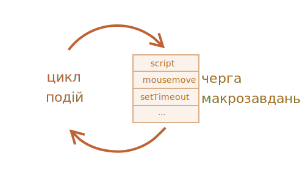
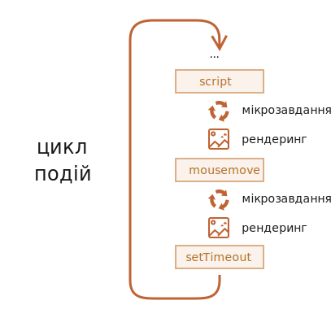

# Цикл подій (event loop): мікрозавдання (microtasks) та макрозавдання (macrotasks)

Потік виконання JavaScript в браузері, так само як і в Node.js, базується на *циклі подій (event loop)*.

Розуміння принципу роботи циклу подій важливе для оптимізації, та іноді для правильної архітектури.

В цьому розділі ми спочатку розглянемо теоретичну базу, а потім практичне застосування цих знань.

## Цикл подій (event loop)

Концепція *циклу подій* дуже проста. Існує нескінченний цикл, в якому рушій JavaScript очікує завдання, виконує їх, а потім переходить в режим очікування нових завдань.

Загальний алгоритм рушія:

1. Поки є завдання:
    - виконати їх, починаючи з найстарішого.
2. Очікувати поки завдання не з’явиться, потім перейти до пункту 1.

<<<<<<< HEAD
Це формалізація того, що ми бачимо, гортаючи вебсторінку. Рушій JavaScript більшість часу не робить нічого, він працює лише коли спрацьовує скрипт, обробник подій чи подія.
=======
That's a formalization of what we see when browsing a page. The JavaScript engine does nothing most of the time, it only runs if a script/handler/event activates.
>>>>>>> 5e893cffce8e2346d4e50926d5148c70af172533

Приклади завдань:

- Коли завантажується зовнішній скрипт `<script src="...">`, тоді завдання полягає в виконанні цього скрипта.
- Коли користувач рухає мишкою, тоді завдання згенерувати подію `mousemove` і виконати її обробники.
- Коли пройде час, запрограмований в `setTimeout`, тоді завдання запустити його колбек.
- ...і так далі.

З’являються задачі для виконання -- рушій виконує їх -- потім очікує нових завдань (майже не навантажуючи процесор в режимі очікування).

Може трапитись так, що завдання приходить тоді, коли рушій вже зайнятий, тоді це завдання стає в чергу.

<<<<<<< HEAD
Чергу з таких завдань називають "чергою макрозавдань" ("macrotask queue", термін v8):



Наприклад, поки рушій виконує `script`, користувач може порухати мишкою, що спричинить появу події `mousemove`, та може вийти час, запрограмований в `setTimeout` і так далі. Ці завдання сформують чергу, як показано на схемі вище.

Задачі з черги виконуються за правилом "перший прийшов – перший пішов". Коли рушій браузера закінчить виконання `script`, він обробить подію `mousemove`, потім виконає обробник `setTimeout` тощо.
=======
The tasks form a queue, the so-called "macrotask queue" ([v8](https://v8.dev/) term):


For instance, while the engine is busy executing a `script`, a user may move their mouse causing `mousemove`, and `setTimeout` may be due and so on, these tasks form a queue, as illustrated in the picture above.

Tasks from the queue are processed on a "first come – first served" basis. When the engine browser is done with the `script`, it handles `mousemove` event, then `setTimeout` handler, and so on.
>>>>>>> 5e893cffce8e2346d4e50926d5148c70af172533

Доволі просто наразі, чи не так?

<<<<<<< HEAD
Ще декілька деталей:
1. Рендеринг ніколи не відбувається поки рушій виконує завдання. Не має значення наскільки довго виконується завдання. Зміни в DOM будуть відмальовані лише після завершення завдання.
2. Якщо виконання завдання займає надто багато часу, браузер не зможе виконувати інші завдання, наприклад, обробляти користувацькі події. Тож після недовгого часу "зависання" з’явиться оповіщення "Сторінка не відповідає" і пропозиція вбити процес виконання завдання разом з цілою сторінкою. Таке трапляється коли код містить багато складних обрахунків або виникає програмна помилка, що створює нескінченний цикл.
=======
Two more details:
1. Rendering never happens while the engine executes a task. It doesn't matter if the task takes a long time. Changes to the DOM are painted only after the task is complete.
2. If a task takes too long, the browser can't do other tasks, such as processing user events. So after some time, it raises an alert like "Page Unresponsive", suggesting killing the task with the whole page. That happens when there are a lot of complex calculations or a programming error leading to an infinite loop.
>>>>>>> 5e893cffce8e2346d4e50926d5148c70af172533

Що ж, це була теорія. Тепер побачимо як можна використати ці знання на практиці.

## Приклад 1: розбиття ресурсозатратних завдань

Припустимо у нас є завдання, що потребує значних ресурсів процесора.

Наприклад, підсвічування синтаксису (використовується для виділення кольором коду на цій сторінці) доволі важке завдання для процесора. Щоб розмалювати код, процесор його аналізує, створює багато кольорових елементів, додає їх в документ -- для великих об’ємів тексту це займає багато часу.

Поки рушій зайнятий підсвічуванням синтаксису він не може виконувати інші речі, пов’язані з DOM, обробляти користувацькі події тощо. Це може спричинити "зависання" браузера, що є неприйнятним.

<<<<<<< HEAD
Ми можемо уникнути проблем шляхом розбивання великого завдання на шматочки. Підсвітити перші 100 рядків, потім поставити `setTimeout` (з нульовою затримкою) для наступних 100 рядків і так далі.
=======
We can avoid problems by splitting the big task into pieces. Highlight the first 100 lines, then schedule `setTimeout` (with zero-delay) for the next 100 lines, and so on.
>>>>>>> 5e893cffce8e2346d4e50926d5148c70af172533

Щоб продемонструвати такий підхід, замість підсвічування для спрощення візьмемо функцію, яка рахує від `1` до `1000000000`.

Якщо ви запустите код нижче, рушій "зависне" на деякий час. Для серверного JS це буде явно видно, а якщо ви запускаєте це в браузері, то спробуйте понатискати інші кнопки на сторінці -- ви побачите, що жодна з подій не спрацює поки цей код не завершиться.

```js run
let i = 0;

let start = Date.now();

function count() {

  // робимо важку роботу
  for (let j = 0; j < 1e9; j++) {
    i++;
  }

  alert("Виконано за " + (Date.now() - start) + 'мс');
}

count();
```

Браузер навіть може показати повідомлення "скрипт виконується надто довго".

Давайте розіб’ємо роботу на частини, використавши вкладені виклики `setTimeout`:

```js run
let i = 0;

let start = Date.now();

function count() {

  // робимо частину важкої роботи (*)
  do {
    i++;
  } while (i % 1e6 != 0);

  if (i == 1e9) {
    alert("Done in " + (Date.now() - start) + 'ms');
  } else {
    setTimeout(count); // плануємо новий виклик (**)
  }

}

count();
```

Тепер інтерфейс браузера повністю робочий під час виконання процесу "обчислення".

Простий виклик `count` робить частину роботи `(*)`, і потім планує свій же виклик `(**)`, якщо це необхідно:

1. Перше виконання обчислює: `i=1...1000000`.
2. Друге виконання обчислює: `i=1000001..2000000`.
3. ...і так далі.

Тепер, якщо з’являється нове стороннє завдання (таке як подія `onclick`) поки рушій виконує частину 1, воно стає в чергу і виконується після закінчення частини 1, перед наступною частиною. Періодичні повернення в цикл подій між виконанням `count` дають рушію достатньо "простору", щоб зробити щось іще, відреагувати на дії користувача.

Примітна річ, що обидва варіанти -- з розбиттям і без розбиття роботи з `setTimeout` -- майже не відрізняються за швидкістю. Немає великої різниці в загальному часі підрахунку.

Щоб зменшити цю різницю ще сильніше, давайте внесемо покращення.

Ми перенесемо планування виклику в початок `count()`:

```js run
let i = 0;

let start = Date.now();

function count() {

  // переносимо планування виклику в початок
  if (i < 1e9 - 1e6) {
    setTimeout(count); // плануємо новий виклик
  }

  do {
    i++;
  } while (i % 1e6 != 0);

  if (i == 1e9) {
    alert("Виконано за " + (Date.now() - start) + 'мс');
  }

}

count();
```

Тепер коли ми викликаємо `count()` і бачимо, що нам потрібно викликати `count()` ще, ми плануємо це негайно, ще перед тим як виконувати роботу.

Якщо ви запустите це, то легко зауважите, що виконання займає значно менше часу.

Чому?  

Все просто: як ви знаєте, в браузера є мінімальна затримка в 4мс при багатьох вкладених викликах `setTimeout`. Навіть якщо ми встановимо `0`, насправді це буде `4ms` (або трохи більше). Тож чим раніше ми заплануємо виклик -- тим швидше виконається код.

Отож, ми розбили ресурсозатратне завдання на частини -- тепер воно не буде блокувати користувацький інтерфейс. І загальний час виконання практично не збільшиться.

## Приклад 2: індикація прогресу

Іншою перевагою розбиття великих завдань на частини є можливість показувати індикатор прогресу.

Як зазначено раніше, зміни в DOM відмальовуються лише після завершення поточного завдання, не важливо як довго воно виконується.

З одного боку, це чудово, тому що наша функція може створити багато елементів, додати їх один за одним в документ і змінити їх стилі -- користувач не побачить жодного "недоробленого", незакінченого стану. Це важливо, чи не так?

Розглянемо приклад, в якому зміни `i` не буде видно поки функція не завершиться, тож ми побачимо лише останнє значення:


```html run
<div id="progress"></div>

<script>

  function count() {
    for (let i = 0; i < 1e6; i++) {
      i++;
      progress.innerHTML = i;
    }
  }

  count();
</script>
```

...Але можливо ми хочемо показати щось під час виконання завдання, наприклад індикатор прогресу.

Якщо ми розділимо велике завдання на частини використовуючи `setTimeout`, тоді зміни будуть відмальовані в проміжках між частинами.

Це вже виглядає краще:

```html run
<div id="progress"></div>

<script>
  let i = 0;

  function count() {

    // зробити шматочок важкої роботи (*)
    do {
      i++;
      progress.innerHTML = i;
    } while (i % 1e3 != 0);

    if (i < 1e7) {
      setTimeout(count);
    }

  }

  count();
</script>
```

Тепер `<div>` показує `i`, яке поступово збільшується, щось схоже на індикатор прогресу.


## Приклад 3: виконання чогось після події

В обробнику подій ми можемо вирішити відкласти певні дії поки подія не вспливе і не буде оброблена на всіх рівнях. Ми можемо зробити це огорнувши код в `setTimeout` з нульовою затримкою.

В розділі <info:dispatch-events> ми бачили приклад: кастомна подія `menu-open` генерується через `setTimeout` для того, щоб виконатись після того як подія "click" буде повністю оброблена.

```js
menu.onclick = function() {
  // ...

  // створюємо кастомну подію з даними клікнутого пункту меню
  let customEvent = new CustomEvent("menu-open", {
    bubbles: true
  });

  // асинхронно згенерувати кастомну подію
  setTimeout(() => menu.dispatchEvent(customEvent));
};
```

## Макрозавдання (Macrotasks) та Мікрозавдання (Microtasks)

Разом з *макрозавданнями (macrotasks)*, описаними в цьому розділі, існують *мікрозавдання (microtasks)*, описані в розділі <info:microtask-queue>.

Мікрозавдання приходять лише з нашого коду. Їх зазвичай створюють проміси: виконання обробника `.then/catch/finally` стає мікрозавданням. Мікрозавдання також використовуються "під капотом" `await`, так як це форма обробки проміса.

Також існує спеціальна функція `queueMicrotask(func)`, яка ставить `func` в чергу мікрозавдань.

**Одразу після кожного *макрозавдання*, рушій виконує всі завдання з черги *мікрозавдань* перед тим як виконати якесь макрозавдання чи рендеринг чи виконати щось іще.**

Наприклад, подивіться:

```js run
setTimeout(() => alert("timeout"));

Promise.resolve()
  .then(() => alert("promise"));

alert("code");
```

Який тут буде порядок виконання?

1. `code` буде показано першим, тому що це звичайний синхронний виклик.
2. `promise` буде показано другим, тому що `.then` проходить через чергу мікрозадач, і виконується після поточного синхронного коду.
3. `timeout` буде показано останнім, тому що це макрозавдання.

Більш детальна ілюстрація циклу подій виглядає так (порядок з верху до низу: спочатку script, потім мікрозавдання, рендеринг і так далі):



Всі мікрозавдання завершуються до обробки будь-яких подій чи рендерингу чи виконання інших макрозавдань.

Це важливо, тому що це гарантує, що середовище застосунку залишається незмінним між мікрозадачами (не змінились координати мишки, не з’явились нові дані через мережу тощо).

Якщо ми хочемо виконати функцію асинхронно (після поточного коду), але до відображення змін чи обробки нових подій, ми можемо запланувати її за допомогою `queueMicrotask`.

Наступний приклад показує індикатор прогресу, схожий на попередній, але `queueMicrotask` використовується замість `setTimeout`. Зауважте, що відмалювання відбувається лише в самому кінці. Так як і з синхронним кодом:

```html run
<div id="progress"></div>

<script>
  let i = 0;

  function count() {

    // зробити частину великого завдання (*)
    do {
      i++;
      progress.innerHTML = i;
    } while (i % 1e3 != 0);

    if (i < 1e6) {
  *!*
      queueMicrotask(count);
  */!*
    }

  }

  count();
</script>
```

## Підсумки

Більш детальний алгоритм циклу подій (хоч і спрощений порівняно зі [специфікацією](https://html.spec.whatwg.org/multipage/webappapis.html#event-loop-processing-model)):

1. Обрати і виконати найстаріше завдання з черги *макрозавдань* (наприклад, "script").
2. Виконати всі *мікрозавдання*:
    - Поки черга мікрозавдань не пуста:
        - Обрати з черги і виконати найстаріше мікрозавдання.
3. Відмалювати зміни, якщо вони є.
4. Якщо черга макрозавдань пуста, зачекати поки макрозавдання з’явиться.
5. Перейти до кроку 1.

Щоб додати в чергу нове *макрозавдання*:
- Використайте `setTimeout(f)` з нульовою затримкою.

Цей спосіб можна використати для розбиття великого ресурсозатратного завдання на частини, щоб браузер мав змогу реагувати на користувацькі події і показувати індикатор прогресу між ними.

Також це використовується в обробниках подій, щоб відкласти дію до моменту повної обробки події (вспливання завершене).

Щоб запланувати нове *мікрозавдання*
- Використайте `queueMicrotask(f)`.
- Також обробники промісів виконуються в черзі мікрозавдань.

Жодні UI або мережеві події не обробляються між мікрозавданнями: мікрозавдання виконуються негайно одне за одним.

Тому `queueMicrotask` можна використати для асинхронного виконання фунції, але в одному й тому ж стані середовища.

```smart header="Web Workers"
Для довгих важких обчислень, які не повинні блокувати цикл подій, ми можемо використати [Web Workers](https://html.spec.whatwg.org/multipage/workers.html).

Це спосіб запустити код в іншому, паралельному потоці.

Web Workers можуть обмінюватись повідомленнями з основним процесом, але вони мають власні змінні і власний цикл подій.

Web Workers не мають доступу до DOM, тож вони корисні переважно для обчислень. Вони можуть використовувати декілька ядер процесора одночасно.
```
