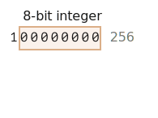

# ArrayBuffer, бінарні масиви

У веб-розробці ми маємо справу з бінарними даними переважно при роботі з файлами (створення, вивантаження та завантаження). Іншим частим випадком є обробка зображень.

Все це є можливим в JavaScript, ба більше, бінарні операції ще й високопродуктивні.

Хоча й велика кількість різних класів може спантеличити. Деякі з них:
- `ArrayBuffer`, `Uint8Array`, `DataView`, `Blob`, `File` тощо.

Бінарні дані в JavaScript реалізовано не так, як це переважно роблять в інших мовах програмування. Але якщо трошки розібратися, все виявиться досить простим.

**Базовим об’єктом для роботи з бінарними даними є `ArrayBuffer` -- посилання на неперервну область пам’яті фіксованої довжини.**

Масив створюється наступним чином:
```js run
let buffer = new ArrayBuffer(16); // створити буфер з довжиною 16
alert(buffer.byteLength); // 16
```

Це виділяє неперервну область пам’яті з довжиною 16 байт та заповнює нулями.

```warn header="`ArrayBuffer` не є масивом"
Позбудьмося можливого джерела непорозумінь. `ArrayBuffer` не має нічого спільного з `Array`:
- Він має фіксовану довжину, що не може бути збільшена чи зменшена.
- Він займає саме стільки місця, скільки виділено при створенні.
- Для доступу до окремих байтів нам знадобиться окремий об’єкт представлення, `buffer[index]` не спрацює.
```

`ArrayBuffer` - область пам’яті. Що там зберігається? Інформації про це немає. Просто послідовність байтів.

**Для роботи з `ArrayBuffer` нам потрібен спеціальний об’єкт "представлення".**

Власне об’єкт представлення не зберігає ніяких даних. Це "вікно", що надає певну інтерпретацію "сирих" байтів всередині `ArrayBuffer`.

Наприклад:

- **`Uint8Array`** -- представляє кожен байт в `ArrayBuffer` окремим число зі областю значень від 0 до 255 (байт складається з 8 біт, тому тільки такі значення можливі). Такі значення називаються "8-бітові беззнакові цілі числа".
- **`Uint16Array`** -- представляє кожні 2 байти цілим числом з областю значень від 0 до 65535. Має назву "16-бітові беззнакові цілі числа".
- **`Uint32Array`** -- представляє кожні 4 байти цілим числом з областю значень від 0 до 4294967295. Має назву "32-бітові беззнакові цілі числа".
- **`Float64Array`** -- представляє кожні 8 байт числом з плаваючою комою з областю значень від <code>5.0x10<sup>-324</sup></code> до <code>1.8x10<sup>308</sup></code>.

Отже, бінарні дані в 16 байтному `ArrayBuffer` можна представити як 16 "коротких чисел" або 8 більших чисел (2 байти кожне), або 4 ще більших (4 байти кожне), або 2 числа з плаваючою комою високої точності (8 байти кожне).


`ArrayBuffer` - головний об’єкт представлення даних, проста послідовність байтів.

Якщо нам знадобиться щось туди записати, перебрати їх або для будь-якої іншої операції - нам знадобиться об’єкт представлення:

```js run
let buffer = new ArrayBuffer(16); // створення буферу з довжиною 16

*!*
let view = new Uint32Array(buffer); // представлення буферу послідовністю 32-бітових цілих чисел

alert(Uint32Array.BYTES_PER_ELEMENT); // 4 байти на кожне число
*/!*

alert(view.length); // 4, стільки чисел вміщає буфер
alert(view.byteLength); // 16, розмір в байтах

// запишімо туди значення
view[0] = 123456;

// перебрати всі значення
for(let num of view) {
  alert(num); // 123456, потім 0, 0, 0 (всього 4 значення)
}

```

## TypedArray

Спільним терміном для опису об’єктів представлень (`Uint8Array`, `Uint32Array` тощо) є [TypedArray](https://tc39.github.io/ecma262/#sec-typedarray-objects). Вони мають однаковий набір методів та властивостей.

Зверніть увагу, не існує конструктору з іменем `TypedArray`, це просто термін, що використовується для опису представлень `ArrayBuffer`: `Int8Array`, `Uint8Array` і так далі.

Коли ви бачите щось на кшталт `new TypedArray` - це означає будь-що з `new Int8Array`, `new Uint8Array` тощо.

Типізовані масиви поводять себе як звичайні масиви: мають індекси та можуть перебиратися.

Конструктори типізованих масивів (`Int8Array` чи `Float64Array`, це неважливо) поводять себе по-різному в залежності від типу аргументів.

Існує 5 варіантів сигнатур конструктору:

```js
new TypedArray(buffer, [byteOffset], [length]);
new TypedArray(object);
new TypedArray(typedArray);
new TypedArray(length);
new TypedArray();
```

1. Якщо передається аргумент типу`ArrayBuffer`, то об’єкт представлення створюється для нього. Ми вже використовувати такий синтаксис.

    Необов’язкові аргументи: `byteOffset` вибору зміщення від початку (типове значення 0) та `length` (типове значення відповідає кінцю) - дозволяють працювати з частиною даних з `buffer`.

2. Якщо передати `Array` чи будь-який об’єкт схожий на масив - це створить типізований масив такої ж довжини і з копією вмісту.

    Ми можемо використовувати це для заповнення масиву даними:
    ```js run
    *!*
    let arr = new Uint8Array([0, 1, 2, 3]);
    */!*
    alert( arr.length ); // 4, створюється бінарний масив такої ж довжини
    alert( arr[1] ); // 1, складається з 4 байтів (8-бітові беззнакові цілі числа) із заданими значеннями
    ```
3. Якщо передано інший `TypedArray` - це спрацює таким же чином: буде створено новий типізований масив такої ж довжини та копією значень. Значення конвертуються в новий тип в процесі, якщо необхідно.
    ```js run
    let arr16 = new Uint16Array([1, 1000]);
    *!*
    let arr8 = new Uint8Array(arr16);
    */!*
    alert( arr8[0] ); // 1
    alert( arr8[1] ); // 232, спроба скопіювати 1000, але 8 біт не можуть вмістити число 1000 (пояснення нижче)
    ```

4. Для числових аргументів `length` -- створить типізований масив з відповідним числом елементів. Його довжиною в байтах буде `length` помноженим на кількість байтів в одному елементі `TypedArray.BYTES_PER_ELEMENT`:
    ```js run
    let arr = new Uint16Array(4); // створить типізований масив для 4 цілих чисел
    alert( Uint16Array.BYTES_PER_ELEMENT ); // 2 байт на число
    alert( arr.byteLength ); // 8 (розмір в байтах)
    ```

5. Без аргументів буде створено типізований масив нульової довжини.

`TypedArray` можна створити безпосередньо, без використання `ArrayBuffer`. Але об’єкт представлення не може існувати без базового `ArrayBuffer`, тому його буде створено автоматично в усіх випадках окрім першого (коли `ArrayBuffer` передано безпосередньо).

Для доступу до внутрішнього `ArrayBuffer` `TypedArray` має властивості:
- `buffer` -- посилання на `ArrayBuffer`.
- `byteLength` -- довжина `ArrayBuffer`.

Отже, ми можемо завжди змінити об’єкт представлення на інший:
```js
let arr8 = new Uint8Array([0, 1, 2, 3]);

// інше представлення однакових даних
let arr16 = new Uint16Array(arr8.buffer);
```


Список типізованих масивів:

- `Uint8Array`, `Uint16Array`, `Uint32Array` -- для цілих беззнакових чисел з довжиною 8, 16 або 32 біт.
  - `Uint8ClampedArray` -- для 8-бітових беззнакових цілих чисел, що "обрізаються" при присвоєнні (пояснення нижче).
- `Int8Array`, `Int16Array`, `Int32Array` -- для цілих чисел зі знаком (можуть мати від'ємні значення).
- `Float32Array`, `Float64Array` -- для чисел з плаваючою комою зі знаком довжиною 32 або 64 біти.

```warn header="Не існує `int8` або подібних типів для значень"
Зверніть увагу, попри імена на кшталт `Int8Array`, в JavaScript не існує значень з типами `int` або `int8`.

Це логічно, оскільки, `Int8Array` не є масивом окремих значення, а всього-на-всього представленням `ArrayBuffer`.
```

### Вихід за область допустимих значень

Що буде у випадку спроби записати значення, що не вміщується в область допустимих значень? Це не призведе до помилки, але зайві біти значення буде відкинуто.

Наприклад, запишімо 256 в `Uint8Array`. В бінарному форматі 256 це `100000000` (9 біт), але `Uint8Array` дозволяє тільки 8 біт для одного значення, тобто значення від 0 до 255.

Для більших чисел тільки праві (найменш важливі) 8 біт буде збережено, а решту буде обрізано.



Тому ми отримає нуль.

257 в бінарному форматі буде `100000001` (9 біт), праві 8 біт буде збережено, тому значення в масиві буде 1:


Інакше кажучи, буде збережено тільки число за модулем 2<sup>8</sup>.

Приклад:

```js run
let uint8array = new Uint8Array(16);

let num = 256;
alert(num.toString(2)); // 100000000 (бінарна форма)

uint8array[0] = 256;
uint8array[1] = 257;

alert(uint8array[0]); // 0
alert(uint8array[1]); // 1
```

`Uint8ClampedArray` є особливим в цьому сенсі, його поведінка відрізняється. Буде збережено 255 для усіх чисел, що більше ніж 255 та 0 для від’ємних чисел. Така поведінка буде в нагоді при обробці зображень.

## Методи TypedArray

Методи `TypedArray` в цілому збігаються з методами звичайного `Array`, але є деякі відмінності.

Ми можемо його перебирати `map`, `slice`, `find`, `reduce` тощо.

Але є речі, що ми не можемо зробити:

- Немає методу `splice` -- ми не можемо "видалити" значення. В основі типізованих масивів лежить буфер, що є неперервною областю пам’яті фіксованої довжини, а типізовані масиви є всього-на-всього їх представленням. Ми можемо тільки присвоїти нульове значення.
- Немає методу `concat`.

Існує 2 додаткових методи:

- `arr.set(fromArr, [offset])` копіює всі елементи, що починаються з `offset` (типово з 0) з `fromArr` в `arr`.
- `arr.subarray([begin, end])` створює нове представлення такого ж типу починаючи з `begin` до `end` (не включно). Це схоже на метод `slice` (також підтримується), але значення не буде скопійовано -- тільки створюється нове представлення для роботи з тими самими даними.

Ці методи дають змогу копіювати типізовані масиви, змішувати їх, створювати нові ґрунтуючись на попередніх і так далі.


## DataView

[DataView](mdn:/JavaScript/Reference/Global_Objects/DataView) спеціальне надзвичайно гнучке "не типізоване" представлення `ArrayBuffer`. Це дозволяє отримати доступ до даних з будь-яким зміщенням та в будь-якому форматі.

- Для типізованого масиву конструктор визначає формат даних. Увесь масив повинен складатися зі значень одного типу. Доступ до i-го елементу виконується за допомогою `arr[i]`.
- З `DataView` доступ до даних відбувається за допомогою методів на кшталт `.getUint8(i)` чи `.getUint16(i)`. Тепер можна обирати формат даних під час виклику методу, а не конструктора.

Синтаксис:

```js
new DataView(buffer, [byteOffset], [byteLength])
```

- **`buffer`** -- базовий `ArrayBuffer`. На відміну від типізованих масивів `DataView` не створює новий буфер. Його потрібно створити завчасно.
- **`byteOffset`** -- початкова позиція представлення (типове значення 0).
- **`byteLength`** -- довжина представлення в байтах (типове значення дорівнює кінцю `buffer`).

На приклад, тут ми дістаємо числа в різному форматі з одного й того ж самого буферу:

```js run
// бінарний масив довжиною 4 байти, всі числа мають максимальне значення 255
let buffer = new Uint8Array([255, 255, 255, 255]).buffer;

let dataView = new DataView(buffer);

// отримати 8-бітове число за зміщенням 0
alert( dataView.getUint8(0) ); // 255

// тепер отримати 16-бітове число за зміщенням 0, воно складається з 2 байт, що разом представляється як 65535
alert( dataView.getUint16(0) ); // 65535 (найбільше 16-бітове беззнакове ціле число)

// отримати 32-бітове число за зміщенням 0
alert( dataView.getUint32(0) ); // 4294967295 (найбільше 32-бітове беззнакове ціле число)

dataView.setUint32(0, 0); // встановити 4-байтове число в нуль, тобто запити всі байти як 0
```

`DataView` зручне для використання, коли ми зберігаємо дані різного формату в одному буфері. На приклад, коли ми зберігаємо послідовність пар (16-бітове ціле число, 32-бітове число з плаваючою комою), `DataView` дозволяє легко отримати до них доступ.

## Summary

`ArrayBuffer` is the core object, a reference to the fixed-length contiguous memory area.

To do almost any operation on `ArrayBuffer`, we need a view.

- It can be a `TypedArray`:
    - `Uint8Array`, `Uint16Array`, `Uint32Array` -- for unsigned integers of 8, 16, and 32 bits.
    - `Uint8ClampedArray` -- for 8-bit integers, "clamps" them on assignment.
    - `Int8Array`, `Int16Array`, `Int32Array` -- for signed integer numbers (can be negative).
    - `Float32Array`, `Float64Array` -- for signed floating-point numbers of 32 and 64 bits.
- Or a `DataView` -- the view that uses methods to specify a format, e.g. `getUint8(offset)`.

In most cases we create and operate directly on typed arrays, leaving `ArrayBuffer` under cover, as a "common denominator". We can access it as `.buffer` and make another view if needed.

There are also two additional terms, that are used in descriptions of methods that operate on binary data:
- `ArrayBufferView` is an umbrella term for all these kinds of views.
- `BufferSource` is an umbrella term for `ArrayBuffer` or `ArrayBufferView`.

We'll see these terms in the next chapters. `BufferSource` is one of the most common terms, as it means "any kind of binary data" -- an `ArrayBuffer` or a view over it.

Here's a cheatsheet:


