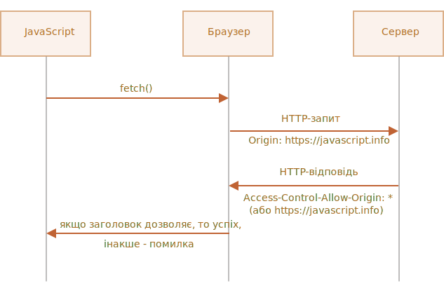
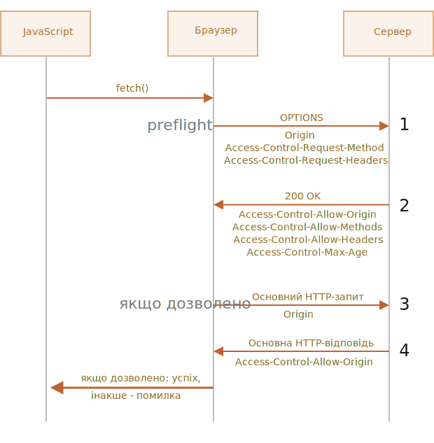

# Fetch: Запити між різними джерелами

Якщо ми надішлемо запит `fetch` на інший веб-сайт, він, ймовірно, завершиться невдало.

Наприклад, спробуймо запросити `http://example.com`:

```js run async
try {
  await fetch('http://example.com');
} catch(err) {
  alert(err); // Failed to fetch
}
```

Запит завершився невдало, як і очікувалося.

Основною концепцією тут є *джерело* (*origin*) -- триплет домен/порт/протокол.

Запити на інші сайти -- надіслані до іншого домену (навіть субдомену), протоколу чи порту -- потребують спеціальних заголовків від віддаленої сторони.

Ця політика називається "CORS": Cross-Origin Resource Sharing ("спільне використання ресурсів між різними джерелами").

## Навіщо потрібен CORS? Коротка історія

CORS існує для захисту інтернету від злих хакерів.

Серйозно. Зробімо дуже короткий історичний екскурс.

**Протягом багатьох років скрипт з одного сайту не міг отримати доступ до вмісту іншого сайту.**

Це просте, але потужне правило було основою інтернет-безпеки. Наприклад, шкідливий скрипт із веб-сайту `hacker.com` не міг отримати доступ до поштової скриньки користувача на веб-сайті `gmail.com`. Люди відчували себе в безпеці.

На той час JavaScript також не мав спеціальних методів для виконання мережевих запитів. Це була іграшкова мова для прикраси веб-сторінки.

Але веб-розробники вимагали більшої потужності. Щоб обійти обмеження та надсилати запити на інші веб-сайти, було винайдено різноманітні прийоми.

### Використання форм

Одним із способів зв’язку з іншим сервером було відправлення туди `<form>`. Люди відправили його в `<iframe>`, просто щоб залишитися на поточній сторінці, ось так:

```html
<!-- ціль форми -->
*!*
<iframe name="iframe"></iframe>
*/!*

<!-- форма могла бути динамічно згенерована та надіслана за допомогою JavaScript -->
*!*
<form target="iframe" method="POST" action="http://another.com/…">
*/!*
  ...
</form>
```

Таким чином, можна було зробити запит GET/POST на інший сайт, навіть без мережевих методів, оскільки форми можуть надсилати дані будь-куди. Але оскільки доступ до вмісту `<iframe>` з іншого сайту заборонено, прочитати відповідь було неможливо.

Якщо бути точним, для цього насправді були хитрощі, вони вимагали спеціальних скриптів і в iframe, і на сторінці. Тож зв’язок із iframe був технічно можливим. Зараз немає сенсу вдаватися в подробиці, нехай ці динозаври спочивають з миром.

### Використання скриптів

Іншим трюком було використання тегу `script`. Скрипт міг мати будь-який `src` з будь-яким доменом, наприклад `<script src="http://another.com/…">`. Такий скрипт можна виконати з будь-якого веб-сайту.

Якщо веб-сайт, наприклад `another.com`, мав на меті надавати дані для такого типу доступу, тоді використовувався так званий протокол "JSONP (JSON with padding)".

Ось як це працювало.

Скажімо, нам на нашому сайті потрібно отримати дані з `http://another.com`, наприклад погоду:

1. По-перше, ми заздалегідь оголошуємо глобальну функцію для прийому даних, наприклад `gotWeather`.

    ```js
    // 1. Оголошення функції для обробки даних про погоду
    function gotWeather({ temperature, humidity }) {
      alert(`temperature: ${temperature}, humidity: ${humidity}`);
    }
    ```
2. Потім ми створюємо тег `<script>` із `src="http://another.com/weather.json?callback=gotWeather"`, використовуючи назву нашої функції як URL-параметр `callback`.

    ```js
    let script = document.createElement('script');
    script.src = `http://another.com/weather.json?callback=gotWeather`;
    document.body.append(script);
    ```
3. Віддалений сервер `another.com` динамічно генерує скрипт, який викликає `gotWeather(...)` з даними, які він хоче, щоб ми отримали.
    ```js
    // Очікувана відповідь від сервера виглядає так:
    gotWeather({
      temperature: 25,
      humidity: 78
    });
    ```
4. Коли віддалений скрипт завантажується та виконується, запускається `gotWeather`, і, оскільки це наша функція, ми отримуємо дані.

Це працює та не порушує безпеку, оскільки обидві сторони погодилися передавати дані таким чином. І, коли обидві сторони погоджуються, це точно не хак. Ще існують сервіси, які надають такий доступ, оскільки він працює навіть для дуже старих браузерів.

Через деякий час мережеві методи з’явилися в браузерному JavaScript.

Спочатку запити на інші джерела були заборонені. Але в результаті довгих обговорень було дозволено їх робити, але для будь-яких нових можливостей вимагався явний дозвіл від сервера, що виражений в спеціальних заголовках.

## Безпечні запити

Існує два типи запитів на інші джерела:

1. Безпечні запити.
2. Всі інші.

Безпечні запити зробити простіше, тому почнемо з них.

Запит є безпечним, якщо він задовольняє дві умови:

1. [Safe method](https://fetch.spec.whatwg.org/#cors-safelisted-method): GET, POST або HEAD
2. [Safe headers](https://fetch.spec.whatwg.org/#cors-safelisted-request-header) -- єдині дозволені спеціальні заголовки:
    - `Accept`,
    - `Accept-Language`,
    - `Content-Language`,
    - `Content-Type` зі значенням `application/x-www-form-urlencoded`, `multipart/form-data` або `text/plain`.

Будь-який інший запит вважається "небезпечним". Наприклад, запит із методом `PUT` або з HTTP-заголовком `API-Key` не відповідає обмеженням.

**Суттєвою відмінністю є те, що безпечний запит можна зробити за допомогою `<form>` або `<script>` без будь-яких спеціальних методів.**

Таким чином, навіть дуже старий сервер повинен бути готовий прийняти безпечний запит.

Навпаки, запити з нестандартними заголовками або наприклад метод `DELETE` не можна створити таким чином. Довгий час JavaScript не міг виконувати такі запити. Тож старий сервер може вважати, що такі запити надходять із привілейованого джерела, "оскільки веб-сторінка не може їх надіслати".

Коли ми намагаємося зробити небезпечний запит, веб-переглядач надсилає спеціальний попередній запит "preflight", який запитує сервер -- чи погоджується він приймати такі запити між різними джерелами чи ні?

І, якщо сервер явно не підтвердить це за допомогою заголовків, небезпечний запит не надсилається.

Тепер розберемося в деталях.

## CORS для безпечних запитів

Якщо запит відбувається між різними джерелами, браузер завжди додає до нього заголовок `Origin`.

Наприклад, якщо ми запитуємо `https://anywhere.com/request` з `https://javascript.info/page`, заголовки виглядатимуть так:

```http
GET /request
Host: anywhere.com
*!*
Origin: https://javascript.info
*/!*
...
```

Як бачите, заголовок `Origin` містить саме джерело (домен/протокол/порт) без шляху.

Сервер може перевірити `Origin` і, якщо він погоджується прийняти такий запит, додати до відповіді спеціальний заголовок `Access-Control-Allow-Origin`. Цей заголовок має містити дозволене джерело (у нашому випадку `https://javascript.info`) або зірочку `*`. Тоді відповідь буде успішною, інакше -- помилка.

Браузер тут відіграє роль надійного посередника:
1. Він забезпечує надсилання правильного `Origin` разом із запитом між джерелами.
2. Він перевіряє дозвіл `Access-Control-Allow-Origin` у відповіді, і якщо він існує, то JavaScript має доступ до відповіді, інакше він завершується з помилкою.



Ось приклад відповіді сервера, що дозволена:
```http
200 OK
Content-Type:text/html; charset=UTF-8
*!*
Access-Control-Allow-Origin: https://javascript.info
*/!*
```

## Заголовки відповіді

Для запиту між різними джерелами JavaScript типово може мати доступ лише до так званих "безпечних" заголовків відповідей:

- `Cache-Control`
- `Content-Language`
- `Content-Length`
- `Content-Type`
- `Expires`
- `Last-Modified`
- `Pragma`

Доступ до будь-якого іншого заголовка відповіді викликає помилку.

Щоб надати JavaScript доступ до будь-якого іншого заголовка відповіді, сервер повинен надіслати заголовок `Access-Control-Expose-Headers`. Він містить розділений комами список небезпечних імен заголовків, які мають бути доступними.

Наприклад:

```http
200 OK
Content-Type:text/html; charset=UTF-8
Content-Length: 12345
Content-Encoding: gzip
API-Key: 2c9de507f2c54aa1
Access-Control-Allow-Origin: https://javascript.info
*!*
Access-Control-Expose-Headers: Content-Encoding,API-Key
*/!*
```

З таким заголовком, як `Access-Control-Expose-Headers`, скрипту дозволено читати заголовки `Content-Encoding` і `API-Key` відповідей.

## "Небезпечні" запити

Ми можемо використовувати будь-який HTTP-метод: не тільки `GET/POST`, а й `PATCH`, `DELETE` та інші.

Деякий час тому ніхто навіть уявити не міг, що веб-сторінка зможе робити такі запити. Тому все ще можуть існувати веб-сервіси, які сприймають нестандартний метод як сигнал: "Це не браузер". Вони можуть це враховувати при перевірці прав доступу.

Тому, щоб уникнути непорозумінь, будь-які "небезпечні" запити, які не можна було зробити в старі часи, браузер не робить відразу. По-перше, він надсилає попередній, так званий "передпольотний(preflight)" запит, щоб отримати дозвіл.

Запит перед друком використовує метод `OPTIONS`, без тіла запиту, але з трьома заголовками:

- Заголовок `Access-Control-Request-Method` містить метод небезпечного запиту.
- Заголовок `Access-Control-Request-Headers` надає список небезпечних HTTP-заголовків, що розділені комами.
- Заголовок `Origin` повідомляє, звідки надійшов запит (наприклад, `https://javascript.info`).

Якщо сервер погоджується обслуговувати запити, він повинен відповісти порожнім тілом, статусом 200 і заголовками:

- `Access-Control-Allow-Origin` має бути або `*`, або джерелом запиту, наприклад `https://javascript.info`, щоб дозволити це.
- `Access-Control-Allow-Methods` повинен мати дозволений метод.
- `Access-Control-Allow-Headers` повинен мати список дозволених заголовків.
- Крім того, заголовок `Access-Control-Max-Age` може вказати кількість секунд для кешування дозволів. Тому веб-переглядачу не потрібно буде надсилати попередній запит для наступних подібних запитів в межах вже наданих дозволів.



Подивімося, як це працює крок за кроком на прикладі запиту між різними джерелами `PATCH` (цей метод часто використовується для оновлення даних):

```js
let response = await fetch('https://site.com/service.json', {
  method: 'PATCH',
  headers: {
    'Content-Type': 'application/json',
    'API-Key': 'secret'
  }
});
```

Є три причини, чому запит є небезпечним (достатньо однієї):
- Метод `PATCH`
- `Content-Type` не є одним із: `application/x-www-form-urlencoded`, `multipart/form-data`, `text/plain`.
- "Небезпечний" заголовок `API-Key`.

### Крок 1 (попередній(preflight) запит)

Перед надсиланням такого запиту браузер самостійно надсилає попередній запит, що виглядає так:

```http
OPTIONS /service.json
Host: site.com
Origin: https://javascript.info
Access-Control-Request-Method: PATCH
Access-Control-Request-Headers: Content-Type,API-Key
```

- Метод: `OPTIONS`.
- Шлях -- такий самий, як і основний запит: `/service.json`.
- Спеціальні заголовки різних джерел:
    - `Origin` -- джерело походження.
    - `Access-Control-Request-Method` -- метод, що запитується.
    - `Access-Control-Request-Headers` -- розділений комами список "небезпечних" заголовків.

### Крок 2 (попередня відповідь)

Сервер має відповісти зі статусом 200 і заголовками:
- `Access-Control-Allow-Origin: https://javascript.info`
- `Access-Control-Allow-Methods: PATCH`
- `Access-Control-Allow-Headers: Content-Type,API-Key`.

Це дозволяє майбутній зв’язок, інакше виникає помилка.

Якщо сервер очікує інших методів і заголовків у майбутньому, є сенс дозволити їх заздалегідь, додавши до списку.

Наприклад, ця відповідь також дозволяє `PUT`, `DELETE` та додаткові заголовки:

```http
200 OK
Access-Control-Allow-Origin: https://javascript.info
Access-Control-Allow-Methods: PUT,PATCH,DELETE
Access-Control-Allow-Headers: API-Key,Content-Type,If-Modified-Since,Cache-Control
Access-Control-Max-Age: 86400
```

Тепер браузер бачить, що `PATCH` знаходиться в `Access-Control-Allow-Methods`, а `Content-Type,API-Key` знаходиться в списку `Access-Control-Allow-Headers`, тому він надсилає основний запит.

Якщо є заголовок `Access-Control-Max-Age` із кількістю секунд, то дозволи попередньої перевірки кешуються протягом заданого часу. Відповідь вище буде кешована протягом 86400 секунд (один день). Упродовж цього терміну наступні запити не призведуть до попередньої перевірки. Якщо припустити, що вони відповідають кешованим дозволам, їх буде надіслано напряму.

### Крок 3 (фактичний запит)

Після успішної перевірки браузер робить основний запит. Процес тут такий же, як і для безпечних запитів.

Головний запит має заголовок `Origin` (оскільки він перехресний):

```http
PATCH /service.json
Host: site.com
Content-Type: application/json
API-Key: secret
Origin: https://javascript.info
```

### Крок 4 (фактична відповідь)

Сервер не повинен забути додати `Access-Control-Allow-Origin` до основної відповіді. Успішна передпольотна перевірка не звільняє від такого:

```http
Access-Control-Allow-Origin: https://javascript.info
```

Тоді JavaScript зможе прочитати відповідь основного сервера.

```smart
Попередній запит відбувається "за лаштунками", він невидимий для JavaScript.

JavaScript отримує лише відповідь на основний запит або помилку, якщо немає дозволу сервера.
```

## Облікові дані

Запит між різними джерелами, що ініційований кодом JavaScript за замовчуванням, не приносить жодних облікових даних (файлів cookie або автентифікації HTTP).

Це незвично для HTTP-запитів. Зазвичай запит до `http://site.com` супроводжується всіма файлами cookie з цього домену. З іншого боку, запити між різними джерелами, зроблені методами JavaScript, є винятком.

Наприклад, `fetch('http://another.com')` не надсилає файли cookie, навіть ті (!), які належать до домену `another.com`.

Чому?

Тому, що запит з обліковими даними набагато потужніший, ніж без них. Якщо дозволено, це надає JavaScript повні повноваження діяти від імені користувача та отримувати доступ до конфіденційної інформації за допомогою його облікових даних.

Чи дійсно сервер так сильно довіряє скрипту? Тоді він повинен явно дозволити запити з обліковими даними з додатковим заголовком.

Щоб надіслати облікові дані у `fetch`, нам потрібно додати параметр `credentials: "include"`, наприклад:

```js
fetch('http://another.com', {
  credentials: "include"
});
```

Тепер `fetch` надсилає файли cookie з `another.com` із запитом на цей сайт.

Якщо сервер погоджується прийняти запит *з обліковими даними*, він має додати до відповіді заголовок `Access-Control-Allow-Credentials: true` на додаток до `Access-Control-Allow-Origin`.

Наприклад:

```http
200 OK
Access-Control-Allow-Origin: https://javascript.info
Access-Control-Allow-Credentials: true
```

Зверніть увагу: в `Access-Control-Allow-Origin` заборонено використовувати зірочку `*` для запитів з обліковими даними. Як показано вище, він повинен надати точне походження. Це додатковий захід безпеки, який гарантує, що сервер дійсно знає, кому він довіряє робити такі запити.

## Підсумки

З точки зору браузера, існує два типи запитів між різними джерелами: "безпечні" та всі інші.

"Безпечні" запити повинні задовольняти наступні умови:
- Метод: GET, POST або HEAD.
- Заголовки -- ми можемо встановити лише:
    - `Accept`
    - `Accept-Language`
    - `Content-Language`
    - `Content-Type` зі значенням `application/x-www-form-urlencoded`, `multipart/form-data` or `text/plain`.

Суттєва відмінність полягає в тому, що безпечні запити можна було виконати з давніх часів за допомогою тегів `<form>` або `<script>`, тоді як небезпечні запити були неможливими для браузерів протягом тривалого часу.

Отже, практична різниця полягає в тому, що безпечні запити надсилаються одразу із заголовком `Origin`, тоді як для інших браузер робить попередній запит "preflight", запитуючи дозвіл.

**Для безпечних запитів:**

- → Браузер надсилає заголовок `Origin` з джерелом.
- ← Для запитів без облікових даних (типово не надсилаються), сервер повинен встановити:
    - `Access-Control-Allow-Origin` на `*` або те саме значення, що й `Origin`
- ← Для запитів з обліковими даними сервер повинен встановити:
    - `Access-Control-Allow-Origin` на те саме значення, що й `Origin`
    - `Access-Control-Allow-Credentials` на `true`

Крім того, щоб надати JavaScript доступ до будь-яких заголовків відповіді, окрім `Cache-Control`, `Content-Language`, `Content-Type`, `Expires`, `Last-Modified` або `Pragma`, сервер повинен перерахувати дозволені у заголовку `Access-Control-Expose-Headers`.

**Для небезпечних запитів попередній запит "preflight" виконується перед фактичним запитом:**

- → Браузер надсилає запит `OPTIONS` на ту саму URL-адресу із заголовками:
    - `Access-Control-Request-Method` містить метод, що запитується.
    - `Access-Control-Request-Headers` містить список небезпечних заголовків, що запитуються.
- ← Сервер має відповісти статусом 200 і заголовками:
    - `Access-Control-Allow-Methods` зі списком дозволених методів,
    - `Access-Control-Allow-Headers` зі списком дозволених заголовків,
    - `Access-Control-Max-Age` з кількістю секунд для кешування дозволів.
- Потім відправляється фактичний запит, і застосовується попередня "безпечна" схема.
