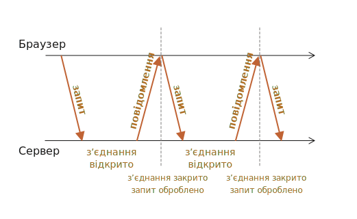

# Тривале опитування

Тривале опитування (Long polling) -- це найпростіший спосіб реалізувати постійне з’єднання із сервером, без використання спеціального протоколу, такого як WebSocket або Server Side Events.

Будучи дуже простим у реалізації, він також достатньо хороший у багатьох випадках.

## Періодичне опитування

Найпростіший спосіб отримати нову інформацію з сервера -- періодичне опитування. Тобто регулярні запити до сервера: "Привіт, я тут, у вас є якась інформація для мене?". Наприклад, раз на 10 секунд.

У відповідь сервер спочатку помічає собі, що клієнт онлайн, а по-друге -- надсилає пакет повідомлень, які він отримав до цього моменту.

Це працює, але є і мінуси:
1. Повідомлення передаються із затримкою до 10 секунд (між запитами).
2. Навіть якщо повідомлень немає, сервер отримує запити кожні 10 секунд, навіть якщо користувач перейшов кудись в інше місце або спить. З точки зору продуктивності, це досить важке навантаження.

Отже, якщо ми говоримо про невеликий сервіс, підхід може бути життєздатним, але загалом він потребує вдосконалення.

## Тривале опитування

Так зване "тривале опитування" (Long polling) -- це набагато кращий спосіб опитування сервера.

Також він дуже простий у реалізації та дозволяє отримувати повідомлення без затримок.

Як це працює:

1. На сервер надсилається запит.
2. Сервер не закриває з’єднання, поки не з’явиться повідомлення для відправки.
3. Коли з’являється повідомлення - сервер відповідає ним на запит.
4. Браузер негайно робить новий запит.

Ситуація, коли браузер відправив запит і має відкрите з’єднання з сервером, є стандартною для цього методу. Лише після доставки повідомлення з’єднання із сервером закривається та відкривається нове.



Якщо з’єднання втрачено, скажімо, через помилку мережі, браузер негайно надсилає новий запит.

Ось ескіз функції `subscribe` на стороні клієнта, яка виконує тривале опитування:

```js
async function subscribe() {
  let response = await fetch("/subscribe");

  if (response.status == 502) {
    // Статус 502 -- це помилка тайм-ауту підключення,
    // вона може статися, коли з’єднання було відкрито занадто довго,
    // і віддалений сервер або проксі-сервер закрили його.
    // У цьому випадку повторюємо підключення
    await subscribe();
  } else if (response.status != 200) {
    // У разі помилки - покажемо її
    showMessage(response.statusText);
    // Повторне підключення через одну секунду
    await new Promise(resolve => setTimeout(resolve, 1000));
    await subscribe();
  } else {
    // Отримуємо та показуємо повідомлення
    let message = await response.text();
    showMessage(message);
    // Знову викликаємо subscribe(), щоб отримати наступне повідомлення
    await subscribe();
  }
}

subscribe();
```

Як бачите, функція `subscribe` виконує запит, потім чекає на відповідь, обробляє її та знову викликає сама себе.

```warn header="Сервер має підтримувати багато відкритих з’єднань"
Архітектура сервера повинна вміти працювати з великою калькістью незавершених з’єднаннь.

Деякі архітектури серверів запускають один процес на одне з’єднання, в результаті чого процесів стає стільки, скільки є з’єднань, при цьому кожен процес споживає досить багато пам’яті. Таким чином, занадто багато з’єднань просто використають усю память.

Це часто трапляється з бекендами, написаними на мовах PHP і Ruby.

Сервери, написані за допомогою Node.js, зазвичай не мають таких проблем.

Тим не менш, це не проблема мови програмування. Більшість сучасних мов, включаючи PHP і Ruby, дозволяють реалізувати належний бекенд. Просто переконайтеся, що архітектура вашого сервера добре працює з багатьма одночасними з’єднаннями.
```

## Демо: чат

Ось демонстраційний чат, який ви також можете завантажити та запустити локально (якщо ви знайомі з Node.js і можете встановлювати модулі):

[codetabs src="longpoll" height=500]

Браузерний код знаходиться в `browser.js`.

## Область використання

Тривале опитування чудово працює в ситуаціях, коли повідомлення надходять рідко.

Якщо повідомлення надходять дуже часто, то діаграма запиту-отримання повідомлень, намальована вище, стає схожою на пилку.

Кожне повідомлення є окремим запитом із заголовками, накладними витратами на аутентифікацію тощо.

У цьому випадку перевага віддається іншим методам, наприклад [Websocket](info:websocket) або [Server Sent Events](info:server-sent-events).
