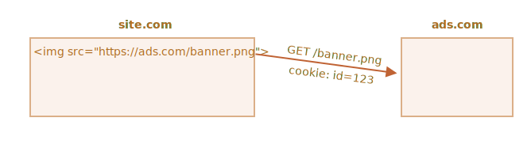

# Файли cookies, document.cookie

Файли cookies («куки») -- це невеликі рядки з даними, які зберігаються безпосередньо в браузері. Вони є частиною HTTP протоколу, визначеного специфікацією [RFC 6265](https://tools.ietf.org/html/rfc6265).

<<<<<<< HEAD
Файли cookies зазвичай встановлюються вебсервером за допомогою заголовка HTTP `Set-Cookie`. Потім браузер автоматично додаватиме їх при (майже) кожному запиті до відповідного домену використовуючи заголовок HTTP `Cookie`.
=======
Cookies are usually set by a web server using the response `Set-Cookie` HTTP header. Then, the browser automatically adds them to (almost) every request to the same domain using the `Cookie` HTTP header.
>>>>>>> d78b01e9833009fab534462e05c03cffc51bf0e3

Одним з найбільш поширених випадків використання є аутентифікація:

<<<<<<< HEAD
1. При вході в систему, сервер використовує відповідь отриману з заголовка HTTP `Set-Cookie`, щоб додати в файл cookie унікальний "ідентифікатор сесії" .
2. Наступного разу, коли на той самий домен буде відправлено запит, браузер надішле файл cookie використовуючи заголовок HTTP `Cookie`.
3. Таким чином, сервер знає, хто зробив запит.
=======
1. Upon sign-in, the server uses the `Set-Cookie` HTTP header in the response to set a cookie with a unique "session identifier".
2. Next time the request is sent to the same domain, the browser sends the cookie over the net using the `Cookie` HTTP header.
3. So the server knows who made the request.
>>>>>>> d78b01e9833009fab534462e05c03cffc51bf0e3

Також ми маємо доступ до файлів cookies з браузера, використовуючи властивість `document.cookie`.

<<<<<<< HEAD
У файлах cookies та їхніх атрибутах є багато тонкощів. В цьому розділі ми детально їх розглянемо.
=======
There are many tricky things about cookies and their attributes. In this chapter, we'll cover them in detail.
>>>>>>> d78b01e9833009fab534462e05c03cffc51bf0e3

## Зчитування з document.cookie

```online
Чи зберігає браузер файли cookie з цього сайту? Перевіримо:
```

```offline
Уявімо, що ви зайшли на вебсайт, наступний код дає можливість побачити його файли cookies:
```

```js run
// На javascript.info, ми використовуємо Google Analytics для збору статистики,
// тому тут мають бути деякі файли cookies
alert( document.cookie ); // cookie1=value1; cookie2=value2;...
```


<<<<<<< HEAD
Значення `document.cookie` складається з пар `name=value` розділених `; `. Кожна пара -- це окремий файл cookie.

Щоб знайти певний файл cookie потрібно розділити значення `document.cookie` за допомогою `; `, а потім знайти потрібний ключ за його назвою. Для цього можна використовувати як регулярні вирази, так і функції для роботи з масивами.

Залишимо це завдання для самостійної роботи читача. Окрім того, в кінці розділу ви знайдете допоміжні функції для роботи з файлами cookies.
=======
The value of `document.cookie` consists of `name=value` pairs, delimited by `; `. Each one is a separate cookie.

To find a particular cookie, we can split `document.cookie` by `; `, and then find the right name. We can use either a regular expression or array functions to do that.

We leave it as an exercise for the reader. Also, at the end of the chapter, you'll find helper functions to manipulate cookies.
>>>>>>> d78b01e9833009fab534462e05c03cffc51bf0e3

## Запис в document.cookie

Ми можемо записувати в `document.cookie`. Але це не просто властивості даних, це [аксесори (гетери/сетери)](info:property-accessors). Присвоєння цих властивостей обробляється особливим чином.

<<<<<<< HEAD
**Запис в `document.cookie` оновлює лише вказаний файл cookie, та не чіпатиме решту.**
=======
**A write operation to `document.cookie` updates only the cookie mentioned in it and doesn't touch other cookies.**
>>>>>>> d78b01e9833009fab534462e05c03cffc51bf0e3

Наприклад, цей виклик встановить файл cookie з іменем `user` та значенням `John`:

```js run
document.cookie = "user=John"; // оновити лише файл cookie під назвою 'user'
alert(document.cookie); // показати всі файли cookies
```

<<<<<<< HEAD
Якщо ви запустите цей код, то, швидше за все, побачите декілька файлів cookies. Це тому, що операція `document.cookie=` оновлює не всі файли cookies, а лише вказаний файли з іменем `user`.
=======
If you run it, you will likely see multiple cookies. That's because the `document.cookie=` operation does not overwrite all cookies. It only sets the mentioned cookie `user`.
>>>>>>> d78b01e9833009fab534462e05c03cffc51bf0e3

Технічно, ім’я та значення можуть містити будь-які символи. Щоб зберегти правильне форматування, вони повинні бути кодовані за допомогою вбудованої функції `encodeURIComponent`.

```js run
<<<<<<< HEAD
// спеціальні символи (пробіли, кирилиця), потребують кодування
=======
// special characters (spaces) need encoding
>>>>>>> d78b01e9833009fab534462e05c03cffc51bf0e3
let name = "my name";
let value = "John Smith";

// кодування cookie як my%20name=John%20Smith
document.cookie = encodeURIComponent(name) + '=' + encodeURIComponent(value);

alert(document.cookie); // ...; my%20name=John%20Smith
```


<<<<<<< HEAD
```warn header="Обмеження"
Є декілька обмежень:
- За допомогою `document.cookie`, ви можете встановити/оновити лише один файл cookie.
- Пара `name=value`, після кодування `encodeURIComponent`, не повинна перевищувати 4кБ. Тому ми не можемо зберігати великий обʼєм даних у файлах cookie.
- Дозволена сумарна кількість файлів cookie на один домен приблизно 20+, точний ліміт залежить від браузера.
```

Файли cookies мають ряд атрибутів, деякі з них важливі і повинні бути задані.

Атрибути перераховуються після пари `key=value` та розділяються `; `, як показано нижче:
=======
```warn header="Limitations"
There are a few limitations:
- You can only set/update a single cookie at a time using `document.cookie`.
- The `name=value` pair, after `encodeURIComponent`, should not exceed 4KB. So we can't store anything huge in a cookie.
- The total number of cookies per domain is limited to around 20+, the exact limit depends on the browser.
```

Cookies have several attributes, many of which are important and should be set.

The attributes are listed after `key=value`, delimited by `;`, like this:
>>>>>>> d78b01e9833009fab534462e05c03cffc51bf0e3

```js run
document.cookie = "user=John; path=/; expires=Tue, 19 Jan 2038 03:14:07 GMT"
```

## domain

- **`domain=site.com`**

Домен визначає звідки будуть доступні файли cookie. Проте, на практиці, існують деякі обмеження -- ми не можемо вказати будь-який домен.

**Не існує способу зробити файли cookie доступними з іншого домену 2-го рівня, тому `other.com` ніколи не отримає файл cookie заданий на `site.com`.**

Це обмеження задля безпеки, воно дозволяє нам зберігати конфіденційні дані в файлах cookie, які будуть доступними лише на одному сайті.

Типово, файли cookie доступні лише на тому домені на якому були встановлені.

<<<<<<< HEAD
Зверніть увагу, що типово файли cookie також не доступні і на піддомені, такому як `forum.site.com`.
=======
Please note, by default, a cookie is not shared with a subdomain, such as `forum.site.com`.
>>>>>>> d78b01e9833009fab534462e05c03cffc51bf0e3

```js
// якщо задати файл cookie на вебсайті site.com ...
document.cookie = "user=John"

// ...ми не побачимо їх на forum.site.com
alert(document.cookie); // користувача немає
```

...Проте цю поведінку можна змінити. Якщо ми хочемо дозволити піддоменам на кшталт `forum.site.com` отримувати файли cookie задані на `site.com` -- це також можливо.

<<<<<<< HEAD
Для цього, встановлюючи файл cookie за адресою `site.com`, ми повинні явно задати в атрибуті `domain` кореневий домен: `domain=site.com`. Тоді всі піддомени побачать такий файл cookie.
=======
For that to happen, when setting a cookie at `site.com`, we should explicitly set the `domain` attribute to the root domain: `domain=site.com`. Then all subdomains will see such a cookie.
>>>>>>> d78b01e9833009fab534462e05c03cffc51bf0e3

Наприклад:

```js
// на site.com
// зробити файл cookie доступним на будь-якому піддомені *.site.com:
document.cookie = "user=John; *!*domain=site.com*/!*"

// пізніше

// на forum.site.com
alert(document.cookie); // файл cookie user=John існує
```

<<<<<<< HEAD
```warn header="Застарілий синтаксис"
Історично склалося так що, `domain=.site.com`(з крапкою перед `site.com`) спрацює так само, надаючи доступ до файлів cookie з піддоменів. Тепер крапки на початку доменних імен ігноруються, але деякі браузери можуть відмовитися встановлювати файл cookie, що містить такі крапки.
```

Отже, атрибут `domain` робить файли cookie доступними на піддоменах.
=======
```warn header="Legacy syntax"
Historically, `domain=.site.com` (with a dot before `site.com`) used to work the same way, allowing access to the cookie from subdomains. Leading dots in domain names are now ignored, but some browsers may decline to set the cookie containing such dots.
```

To summarize, the `domain` attribute allows to make a cookie accessible at subdomains.
>>>>>>> d78b01e9833009fab534462e05c03cffc51bf0e3

## path

- **`path=/mypath`**

<<<<<<< HEAD
URL-префікс адреси повинен бути абсолютним. Для того щоб файли cookie були доступними зі сторінок за цією адресою. Типово, це поточна сторінка.

Якщо в файлі cookie задано `path=/admin`, то він видимий на сторінках `/admin` та `/admin/something`, але не на `/home` або `/adminpage`.

Зазвичай, щоб зробити файл cookie доступним з усіх сторінок сайту, нам необхідно вказати корінь: `path=/`. Якщо цей атрибут не встановлено, типове значення обчислюється за допомогою [цього методу](https://developer.mozilla.org/en-US/docs/Web/HTTP/Cookies#path_default_value).

## expires, max-age

Типово, якщо файл cookie не має одного з цих атрибутів, то файл зникає при закриванні браузера/вкладки. Такі файли cookies називаються сесійними ("session cookies").

Щоб файли cookies могли "пережити" закривання браузера/вкладки, можна встановити значення одного з атрибутів `expires` або `max-age`. `max-age` має перевагу, якщо встановлено обидва значення.

- **`expires=Tue, 19 Jan 2038 03:14:07 GMT`**

Термін придатності файлу cookie визначає час, коли браузер автоматично видалить його (відповідно до часового поясу браузера).
=======
The URL path prefix must be absolute. It makes the cookie accessible for pages under that path. By default, it's the current path.

If a cookie is set with `path=/admin`, it's visible on pages `/admin` and `/admin/something`, but not at `/home`, `/home/admin` or `/`.

Usually, we should set `path` to the root: `path=/` to make the cookie accessible from all website pages. If this attribute is not set the default is calculated using [this method](https://developer.mozilla.org/en-US/docs/Web/HTTP/Cookies#path_default_value).

## expires, max-age

By default, if a cookie doesn't have one of these attributes, it disappears when the browser/tab is closed. Such cookies are called "session cookies"

To let cookies survive a browser close, we can set either the `expires` or `max-age` attribute. `max-Age` has precedence if both are set.

- **`expires=Tue, 19 Jan 2038 03:14:07 GMT`**

The cookie expiration date defines the time when the browser will automatically delete it (according to the browser's time zone).
>>>>>>> d78b01e9833009fab534462e05c03cffc51bf0e3

Дата має бути вказана саме в такому форматі, в часовому поясі GMT. Щоб отримати правильну дату, можна скористатися `date.toUTCString`. Наприклад, можемо встановити, що термін придатності файлу cookie закінчується через 1 день:

```js
// +1 день від сьогодні
let date = new Date(Date.now() + 86400e3);
date = date.toUTCString();
document.cookie = "user=John; expires=" + date;
```

Якщо встановити значенням параметру `expires` дату з минулого, то файл cookie видалиться.

-  **`max-age=3600`**

Це альтернатива `expires`, який вказує термін придатності cookie в секундах з поточного моменту.

Як встановлено 0 або від’ємне значення, то файл cookie буде видалено:

```js
// файл cookie буде видалено через 1 годину
document.cookie = "user=John; max-age=3600";

// видалити файл cookie (термін придатності закінчується прямо зараз)
document.cookie = "user=John; max-age=0";
```

## secure

- **`secure`**

Файл cookie повинен передаватися виключно по HTTPS-протоколу.

**За замовчуванням, якщо ми створимо файл cookie на `http://site.com`, тоді він автоматично з’явиться на `https://site.com` та навпаки.**

Тобто файли cookie базуються на домені, вони не залежать від протоколів.

<<<<<<< HEAD
В разі якщо цей атрибут задано, то файл cookie створений на `https://site.com` не буде доступний на тому ж вебсайті з HTTP-протоколом `http://site.com`. Тому якщо файли cookie містять конфіденційні дані, які в жодному разі не мають бути відправлені по незашифрованому HTTP-протоколу, тоді параметр `secure` це правильний вибір.
=======
With this attribute, if a cookie is set by `https://site.com`, then it doesn't appear when the same site is accessed by HTTP, as `http://site.com`. So if a cookie has sensitive content that should never be sent over unencrypted HTTP, the `secure` flag is the right thing.
>>>>>>> d78b01e9833009fab534462e05c03cffc51bf0e3

```js
// припустимо, що зараз ми на https://
// створимо захищений файл cookie (доступний лише по HTTPS)
document.cookie = "user=John; secure";
```

## samesite

<<<<<<< HEAD
Це ще один атрибут безпеки. Він створений щоб захищати від так званих XSRF-атак (міжсайтова підміна запиту).
=======
This is another security attribute `samesite`. It's designed to protect from so-called XSRF (cross-site request forgery) attacks.
>>>>>>> d78b01e9833009fab534462e05c03cffc51bf0e3

Щоб зрозуміти як він працює та в яких випадках може бути корисним, давайте детальніше розглянемо поняття XSRF-атак.

### XSRF-атаки

<<<<<<< HEAD
Уявіть, що ви увійшли в свій обліковий запис на сайті `bank.com`. Тобто: у вас є файли cookie з даними аутентифікації від цього сайту. Ваш браузер відправляє їх сайту `bank.com` при кожному запиті, для того щоб той розпізнав вас та виконав всі конфіденційні фінансові операції.
=======
Imagine, you are logged into the site `bank.com`. That is: you have an authentication cookie from that site. Your browser sends it to `bank.com` with every request so that it recognizes you and performs all sensitive financial operations.
>>>>>>> d78b01e9833009fab534462e05c03cffc51bf0e3

Тепер, переглядаючи вебсторінки в іншому вікні, ви випадково потрапили на сайт `evil.com`. Цей сайт містить код JavaScript, який відправляє форму `<form action="https://bank.com/pay">` на `bank.com` з заповненими полями, які ініціюють транзакцію на рахунок хакера.

<<<<<<< HEAD
Браузер відправляє файли cookies щоразу як ви відвідуєте сайт `bank.com`, навіть якщо форма була відправлена з `evil.com`. Тому банк "впізнає" вас та дійсно виконає платіж.


Така атака називається міжсайтова підміна запиту (Cross-Site Request Forgery, XSRF).

Звісно, справжні банкові системи захищені від цього. У всіх згенерованих сайтом `bank.com` формах є спеціальне поле, так званий "токен захисту від XSRF", який не може бути ані згенерований зловмисним сайтом, ані вилучений з віддаленої сторінки. Зловмисник може спробувати відправити форму туди, але не може отримати дані назад. Сайт `bank.com` перевіряє кожну отриману форму на наявність даного токену.
=======
The browser sends cookies every time you visit the site `bank.com`, even if the form was submitted from `evil.com`. So the bank recognizes you and performs the payment.


This is a so-called "Cross-Site Request Forgery" (in short, XSRF) attack.

Real banks are protected from it of course. All forms generated by `bank.com` have a special field, a so-called "XSRF protection token", that an evil page can't generate or extract from a remote page. It can submit a form there, but can't get the data back. The site `bank.com` checks for such a token in every form it receives.
>>>>>>> d78b01e9833009fab534462e05c03cffc51bf0e3

Проте такий захист вимагає більше часу на реалізацію. Нам потрібно переконатися, що кожна форма несе в собі обов’язкове поле з токеном, окрім того потрібно перевіряти всі запити.

<<<<<<< HEAD
### Використання атрибуту samesite в файлі cookie

Атрибут `samesite` пропонує ще один спосіб захисту від атак, який (в теорії) не вимагає "токен захисту від xsrf".
=======
### Use cookie samesite attribute

The cookie `samesite` attribute provides another way to protect from such attacks, that (in theory) should not require "xsrf protection tokens".
>>>>>>> d78b01e9833009fab534462e05c03cffc51bf0e3

В нього є два можливі значення:

<<<<<<< HEAD
- **`samesite=strict` (те саме, що `samesite` без заданого значення)**
=======
- **`samesite=strict`**
>>>>>>> d78b01e9833009fab534462e05c03cffc51bf0e3

Файли cookie з параметром `samesite=strict` ніколи не відправляються якщо користувач прийшов ззовні (з іншого сайту).

<<<<<<< HEAD
Іншими словами, якщо користувач перейшов за посиланням зі свого електронного листа або відправив форму з `evil.com`, або виконав яку завгодно операцію, що походить з іншого домену, файли cookie не відправляться.

Якщо файл cookie аутентифікації має атрибут `samesite=strict`, тоді у XSRF-атаки немає шансу на успіх, тому що запит з сайту `evil.com` надходить без файлу cookie. Таким чином, `bank.com` не ідентифікує користувача та не здійснить платіж.

Захист доволі надійний. Файли cookie з атрибутом `samesite=strict` відправлятимуться тільки якщо операції надходять з `bank.com`, наприклад відправлення форми з іншої сторінки домену `bank.com`.
=======
In other words, whether a user follows a link from their email, submits a form from `evil.com`, or does any operation that originates from another domain, the cookie is not sent.

If authentication cookies have the `samesite=strict` attribute, then an XSRF attack has no chance of succeeding, because a submission from `evil.com` comes without cookies. So `bank.com` will not recognize the user and will not proceed with the payment.

The protection is quite reliable. Only operations that come from `bank.com` will send the `samesite=strict` cookie, e.g. a form submission from another page at `bank.com`.
>>>>>>> d78b01e9833009fab534462e05c03cffc51bf0e3

Хоча, у цього рішення є дрібний недолік.

<<<<<<< HEAD
Коли користувач переходить за легітимним посилання до `bank.com`, як то зі своїх нотаток, то він буде неприємно здивований коли `bank.com` не "впізнає" його. Дійсно, в такому випадку файл cookie з атрибутом `samesite=strict` не відправляється.

Цю проблему можна вирішити використанням двох файлів cookie: один для загальної ідентифікації, лише для того щоб сказати: "Привіт, Іван", а інший з параметром `samesite=strict` для операцій з даними. Тоді особа, яка перейшла за посиланням поза межами сайту побачить привітання, проте для того щоб другий файл cookie відправився, платіжні операції повинні бути ініційовані з сайту банку.

- **`samesite=lax` (те саме, що `samesite` без заданого значення)**
=======
When a user follows a legitimate link to `bank.com`, like from their notes, they'll be surprised that `bank.com` does not recognize them. Indeed, `samesite=strict` cookies are not sent in that case.

We could work around that by using two cookies: one for "general recognition", only to say: "Hello, John", and the other one for data-changing operations with `samesite=strict`. Then, a person coming from outside of the site will see a welcome, but payments must be initiated from the bank's website, for the second cookie to be sent.

- **`samesite=lax` (same as `samesite` without value)**
>>>>>>> d78b01e9833009fab534462e05c03cffc51bf0e3

Спрощене рішення яке так само захищає від XSRF-атак, але не руйнує очікування користувача.

Режим `lax`, так само як `strict`, забороняє браузеру відправляти файл cookies коли запит приходить не з сайту, але є одне виключення.

Файл cookie з параметром `samesite=lax` відправляється лише тоді, коли виконуються обидві умови:
1. Обраний HTTP-метод безпечний (наприклад GET, але не POST)

<<<<<<< HEAD
    Повний список безпечних HTTP-методів зібрано в [специфікації RFC7231](https://tools.ietf.org/html/rfc7231#section-4.2.1). По суті, безпечними вважаються методи які використовуються для читання, а не для запису даних. Вони не повинні виконувати жодних операцій редагування даних. Перехід за посиланням це завжди метод GET, тобто безпечний.
=======
    The full list of safe HTTP methods is in the [RFC7231 specification](https://tools.ietf.org/html/rfc7231#section-4.2.1). These are the methods that should be used for reading, but not writing the data. They must not perform any data-changing operations. Following a link is always GET, the safe method.
>>>>>>> d78b01e9833009fab534462e05c03cffc51bf0e3

2. Операція виконує навігацію вищого рівня (змінює URL в адресному полі браузера)

<<<<<<< HEAD
    Як правило, ця умова виконується, проте якщо навігація відбувається в `<iframe>` то це не вищий рівень. Також, методи JavaScript для мережевих запитів не виконують навігації, тому вони не підходять.

Тому насправді, все що робить атрибут `samesite=lax` -- це дозволяє найбільш поширеним операціям (таким як перехід по URL) передавати файли cookie. Наприклад, відкривання вебсайту за посиланням зі своїх нотаток, що повністю задовольняє умовам.
=======
    This is usually true, but if the navigation is performed in an `<iframe>`, then it is not top-level. Additionally, JavaScript methods for network requests do not perform any navigation.

So, what `samesite=lax` does, is to allow the most common "go to URL" operation to have cookies. E.g. opening a website link from notes that satisfy these conditions.
>>>>>>> d78b01e9833009fab534462e05c03cffc51bf0e3

Але будь-яка більш складна операція, як то мережевий запит з іншого сайту чи відправлення форми, втрачає файли cookies.

Якщо вас це влаштовує, тоді використання `samesite=lax` скоріше за все не зіпсує враження користувача від взаємодії з вашим сайтом та захистить дані.

<<<<<<< HEAD
В цілому, `samesite` -- це чудовий параметр.
=======
Overall, `samesite` is a great attribute.
>>>>>>> d78b01e9833009fab534462e05c03cffc51bf0e3

Є лише один недолік:

<<<<<<< HEAD
- `samesite` ігнорується (не підтримується) старими версіями браузерів, до 2017 року і раніше.
=======
- `samesite` is ignored (not supported) by very old browsers, the year 2017 or so.
>>>>>>> d78b01e9833009fab534462e05c03cffc51bf0e3

**Тому, якщо для забезпечення захисту, покладатися виключно на атрибут `samesite`, то старі браузери залишаться вразливими.**

<<<<<<< HEAD
Звісно, ми можемо використовувати `samesite` разом з іншими засобами безпеки, такими як "токен захисту від xsrf", щоб додати ше один рівень захисту, а потім в майбутньому, коли старі браузери вимруть, ми зможемо відмовитися від токенів.

## httpOnly

Цей атрибут не має нічого спільного з JavaScript, але ми повинні згадати його заради повноти картини.

Вебсервер використовує заголовок `Set-Cookie` щоб задати файли cookie. Також він може встановити атрибут `httpOnly`.

Даний атрибут забороняє будь-який доступ до файлів cookie з JavaScript. Ми не можемо бачити чи маніпулювати файлами cookie користуючись `document.cookie`.

Його використовують як запобіжний метод, щоб захистити від деяких атак, коли хакер вживляє на сторінку свій власний код JavaScript та чекає поки користувач зайде на таку сторінку. За ідеальних умов це взагалі неможливо, хакери не повинні мати можливості проникнути своїм кодом на наш сайт, але в коді можуть бути помилки, які все ж дозволяють їм це зробити.


Зазвичай, якщо таке трапляється, і користувач все ж зайшов на вебсторінку с хакерським кодом JavaScript, тоді код виконується та отримує доступ до команди `document.cookie`, яка містить аутентифікаційну інформацію. Це погано.
=======
But we can use `samesite` together with other protection measures, like xsrf tokens, to add a layer of defence and then, in the future, when old browsers die out, we'll probably be able to drop xsrf tokens.

## httpOnly

This attribute has nothing to do with JavaScript, but we have to mention it for completeness.

The web server uses the `Set-Cookie` header to set a cookie. Also, it may set the `httpOnly` attribute.

This attribute forbids any JavaScript access to the cookie. We can't see such a cookie or manipulate it using `document.cookie`.

This is used as a precautionary measure, to protect from certain attacks when a hacker injects his own JavaScript code into a page and waits for a user to visit that page. That shouldn't be possible at all, hackers should not be able to inject their code into our site, but there may be bugs that let them do it.


Normally, if such a thing happens, and a user visits a web-page with a hacker's JavaScript code, then that code executes and gains access to `document.cookie` with user cookies containing authentication information. That's bad.
>>>>>>> d78b01e9833009fab534462e05c03cffc51bf0e3

Проте якщо файл cookie має параметр `httpOnly`, то в такому разі `document.cookie` не бачить його, тому файл в безпеці.

## Додаток: Функції файлів cookie

Тут наведено невелику підбірку функцій для роботи з файлами cookie, більш зручних аніж ручна модифікація `document.cookie`.

Існує безліч бібліотек для роботи з файлами cookie, тому ці функції тут скоріше в демонстраційних цілях. Але повністю робочі.

### getCookie(name)

Найкоротший шлях щоб отримати доступ до файлів cookie це використання [регулярних виразів](info:regular-expressions).

Функція `getCookie(name)` повертає файл cookie з заданим іменем `name`:

```js
// повертає файл cookie з заданим іменем
// або undefined якщо нічого не знайдено
function getCookie(name) {
  let matches = document.cookie.match(new RegExp(
    "(?:^|; )" + name.replace(/([\.$?*|{}\(\)\[\]\\\/\+^])/g, '\\$1') + "=([^;]*)"
  ));
  return matches ? decodeURIComponent(matches[1]) : undefined;
}
```

Тут динамічно генерується `new RegExp` який задовольняє `; name=<value>`.

Зверніть увагу, що значення файлу cookie закодоване, тому `getCookie` використовує вмонтовану функцію `decodeURIComponent` щоб розшифрувати його.

### setCookie(name, value, attributes)

Встановлює файл cookie з заданим ім’ям `name`, значенням `value`, та типовим параметром `path=/` (можна редагувати, щоб додати інші типові значення):

```js run
function setCookie(name, value, attributes = {}) {

  attributes = {
    path: '/',
<<<<<<< HEAD
    // за потреби додайте інші типові значення
=======
    // add other defaults here if necessary
>>>>>>> d78b01e9833009fab534462e05c03cffc51bf0e3
    ...attributes
  };

  if (attributes.expires instanceof Date) {
    attributes.expires = attributes.expires.toUTCString();
  }

  let updatedCookie = encodeURIComponent(name) + "=" + encodeURIComponent(value);

  for (let attributeKey in attributes) {
    updatedCookie += "; " + attributeKey;
    let attributeValue = attributes[attributeKey];
    if (attributeValue !== true) {
      updatedCookie += "=" + attributeValue;
    }
  }

  document.cookie = updatedCookie;
}

// Приклад використання:
setCookie('user', 'John', {secure: true, 'max-age': 3600});
```

### deleteCookie(name)

Щоб видалили файли cookie, ми можемо викликати функцію вказавши від’ємне значення в параметрі `max-age`:

```js
function deleteCookie(name) {
  setCookie(name, "", {
    'max-age': -1
  })
}
```

<<<<<<< HEAD
```warn header="Операції оновлення або видалення повинні використовувати ті самі адресу та домен"
Зауважте: коли ми оновлюємо чи видаляємо файли cookie, ми повинні використовувати ті самі адресу та доменне ім’я, що і при встановленні.
=======
```warn header="Updating or deleting must use same path and domain"
Please note: when we update or delete a cookie, we should use exactly the same path and domain attributes as when we set it.
>>>>>>> d78b01e9833009fab534462e05c03cffc51bf0e3
```

Все разом: [cookie.js](cookie.js).


## Додаток: Сторонні файли cookies

Файли cookie називаються "сторонніми", якщо вони розміщені з домену який відрізняється від того, до якого належить поточна сторінка.

Наприклад:
1. Сторінка розміщена на `site.com` завантажує банер з іншого сайту: ``.
2. Разом з банером, віддалений сервер на `ads.com` може встановити заголовок `Set-Cookie` зі значенням `id=1234` взятим з файлу cookie. Створені файли cookie походять з домену `ads.com` та будуть видимі лише з `ads.com`:

    

3. Наступного разу коли `ads.com` відправить запит на доступ, віддалений сервер отримає `id` з файлу cookie та розпізнає користувача:

    

4. Іще важливіше те, що коли користувач переходить з `site.com` до іншого сайту `other.com`, на якому також є банер, тоді `ads.com` отримує файли cookie, так наче вони насправді належать `ads.com` і таким чином розпізнає відвідувача та відстежить його, коли той переміщається між сайтами:

    


Сторонні файли cookie традиційно використовуються для відстеження статистики відвідувань та показу реклами. Вони прив’язані до початкового домену, тому `ads.com` може відстежувати одного й того ж користувача при переході між сайтами, якщо всі вони мають до нього доступ.

<<<<<<< HEAD
Природно, що деякі люди не хочуть щоб за ними стежили, тому браузери дозволяють їм відключити такі файли cookie.
=======
Naturally, some people don't like being tracked, so browsers allow them to disable such cookies.
>>>>>>> d78b01e9833009fab534462e05c03cffc51bf0e3

Крім того, деякі сучасні браузери запроваджують спеціальну політику для таких файлів cookie:
- Safari взагалі не дозволяє сторонні файли cookie.
- У Firefox є "чорний список" сторонніх доменів, з яких він блокує надходження сторонніх файлів cookie.


```smart
Якщо ми завантажимо скрипт з стороннього домену, такого як `<script src="https://google-analytics.com/analytics.js">`, і цей скрипт використовує `document.cookie` щоб встановити файли cookie, то вони не вважатимуться сторонніми.

Якщо скрипт встановлює файл cookie, тоді неважливо звідки завантажений цей скрипт -- файл cookie належить домену поточного web-сайту.
```

## Додаток: GDPR

<<<<<<< HEAD
Ця тема взагалі не пов’язана з JavaScript, це просто потрібно пам’ятати, налаштовуючи файли cookie.

У Європі існує законодавство під назвою GDPR, яке встановлює набір правил для вебсайтів щодо поваги до конфіденційності користувачів. Одне з цих правил — вимагати від користувача явного дозволу на відстеження файлів cookie.
=======
This topic is not related to JavaScript at all, it is just something to keep in mind when setting cookies.

There's a legislation in Europe called GDPR, that enforces a set of rules for websites to respect the users' privacy. One of these rules is to require explicit permission for tracking cookies from the user.
>>>>>>> d78b01e9833009fab534462e05c03cffc51bf0e3

Зауважте, що йдеться лише про відстеження/ідентифікацію/авторизацію файлів cookies.

Отже, якщо ми встановлюємо файл cookie, який лише зберігає деяку інформацію, але не відстежує та не ідентифікує користувача, ми можемо це зробити.

<<<<<<< HEAD
Але якщо ми збираємося встановити файл cookie з даними аутентифікації або ідентифікатором відстеження, користувач повинен дозволити це.

Зазвичай, виконання GDPR web-сайтами реалізується в двох варіантах. Ви, напевно, вже бачили їх обидва в мережі інтернет: 
=======
But if we are going to set a cookie with an authentication session or a tracking ID, then a user must allow that.

Websites generally have two variants of complying with GDPR. You are likely to have seen them both on the web:
>>>>>>> d78b01e9833009fab534462e05c03cffc51bf0e3

1. Якщо вебсайт хоче встановити відстежувальні файли cookie лише для аутентифікованих користувачів.

     Для цього в реєстраційній формі має бути прапорець на кшталт "прийняти політику конфіденційності" (яка описує, як використовуються файли cookie), користувач повинен відмітити його, лише тоді вебсайт може встановлювати файли cookie для авторизації.

2. Якщо вебсайт хоче встановити відстежувальні файли cookies для всіх.

<<<<<<< HEAD
     Щоб зробити це законно, вебсайт показує спливаюче модальне вікно для нових користувачів і вимагає від них погодитися на файли cookie. Тоді вебсайт може встановлювати їх і дозволити людям бачити контент. Але це може турбувати нових відвідувачів. Ніхто не любить бачити такі спливаючі модальні вікна, які вимагають взаємодії, замість перегляду контенту. Але GDPR вимагає чіткої угоди.


GDPR стосується не лише файлів cookie, а й інших питань, пов’язаних із конфіденційністю, але це виходить за рамки даного розділу.
=======
    To do so legally, a website shows a modal "splash screen" for newcomers and requires them to agree to the cookies. Then the website can set them and let people see the content. That can be disturbing for new visitors though. No one likes to see such "must-click" modal splash screens instead of the content. But GDPR requires an explicit agreement.


GDPR is not only about cookies, it is about other privacy-related issues too, but that is beyond our scope.
>>>>>>> d78b01e9833009fab534462e05c03cffc51bf0e3


## Підсумки

<<<<<<< HEAD
`document.cookie` забезпечує доступ до файлів cookies
- Операції запису змінюють лише вказаний файл cookie.
- Ім’я та значення файлу cookie повинні бути закодовані.
- Один файл cookie не повинен перевищувати 4кБ, 20+ файлів на один сайт (залежно від браузера).

Атрибути:
- `path=/`, встановлює поточну адресу як типове значення, робить файл cookie видимим лише за вказаною адресою.
- `domain=site.com`, типово файли cookie видимі лише на поточному домені. Якщо домен вказано явно, файли cookie стають видимі на сторінках піддомену.
- `expires` або `max-age` задають кінцевий термін придатності файлів cookie. Без них файли cookie помирають відразу після закриття вікна браузера.
- `secure` робить файли cookie доступними лише по HTTPS (HTTPS-only).
- `samesite` забороняє браузеру відправляти файли cookie у відповідь на запити які надходять з зовнішнього сайту. Це допомагає запобігти XSRF-атакам.


Додатково:
- Браузери можуть забороняти сторонні файли cookie, наприклад Safari робить це типово. Також ведеться робота, щоб запровадити таке ж і в Chrome.
- Встановлюючи відстежувальний файл cookie для громадян ЄС, GDPR вимагає запитувати дозвіл.
=======
`document.cookie` provides access to cookies.
- Write operations modify only the cookie mentioned in it.
- Name/value must be encoded.
- One cookie may not exceed 4KB in size. The number of cookies allowed on a domain is around 20+ (varies by browser).

Cookie attributes:
- `path=/`, by default current path, makes the cookie visible only under that path.
- `domain=site.com`, by default a cookie is visible on the current domain only. If the domain is set explicitly, the cookie becomes visible on subdomains.
- `expires` or `max-age` sets the cookie expiration time. Without them, the cookie dies when the browser is closed.
- `secure` makes the cookie HTTPS-only.
- `samesite` forbids the browser to send the cookie with requests coming from outside the site. This helps to prevent XSRF attacks.

Additionally:
- The browser may forbid third-party cookies, e.g. Safari does that by default. There is also work in progress to implement this in Chrome.
- When setting a tracking cookie for EU citizens, GDPR requires to ask for permission.
>>>>>>> d78b01e9833009fab534462e05c03cffc51bf0e3
